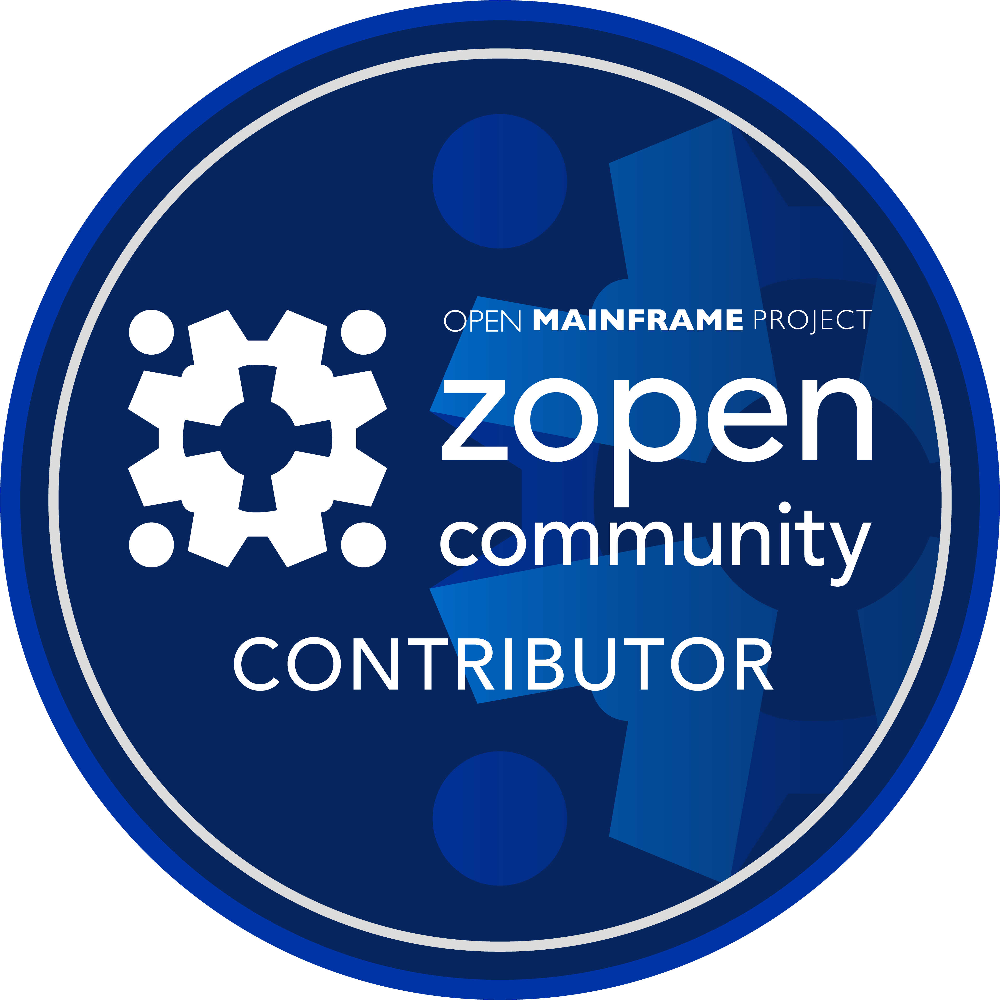
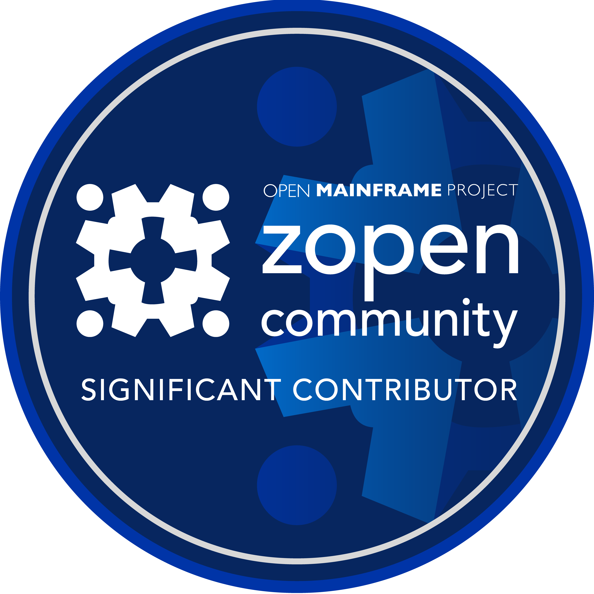

# zopen community Badges

## Introduction

Welcome to the zopen community badge program! These badges are designed to recognize and celebrate the valuable contributions of our members. Whether you are submitting code, improving documentation, or porting essential tools, your efforts help our community grow and thrive. This program, powered by Credly, formally acknowledges that work and showcases the impactful achievements of individuals within our ecosystem.

## How to Submit a Nomination

Badges are awarded based on evidence of contribution. We encourage both self-nominations and nominations for other deserving community members whose work you admire.

To submit a nomination, please complete our online nomination form:

<a href="https://docs.google.com/forms/d/e/1FAIpQLSdsq902oSpRJPfxZrvE_b3EVKUzY0VMbYPd6CBvrUGSBNgOtQ/viewform?usp=sf_link" 
   target="_blank" 
   style="
     display: inline-block;
     padding: 10px 20px;
     font-size: 16px;
     font-weight: bold;
     color: #ffffff;
     background-color: #007bff;
     text-align: center;
     text-decoration: none;
     border-radius: 5px;
     transition: background-color 0.2s;
   "
   onmouseover="this.style.backgroundColor='#0056b3'"
   onmouseout="this.style.backgroundColor='#007bff'">
   📝 Submit a Nomination
</a>

You will be asked to provide the following information:

* The nominee's full name and email address.
* The specific badge you are nominating them for.
* A clear description of the contributions
* Links to evidence (e.g., pull requests, commits, project repositories, or other public resources).

Nominations are reviewed on by the **[zopen Technical Steering Committee (TSC)](team.md)**. Badges can be awarded retroactively for past contributions.

### Review Timeline
Once a nomination form is submitted, please allow **up to 1 month** for the review. Nominees will receive a response or be awarded their badge within **1-2 months** after the submission date.

# 🛡️ List of Badges

<table style="width: 100%; display: table;">
  <tr>
    <td width="280" align="center">
      
    </td>
    <td>
      <strong>zopen community contributor: Awarded for making a substantive, accepted contribution to the zopen community.</strong>
        
      This includes successfully porting a new project, or submitting a substantial pull request that implements a significant feature or resolves a critical bug.
    </td>
  </tr>
</table>

### Examples of Contributions
* Successfully porting a project to z/OS and contributing it to the zopen community.
* Submitting a substantial pull request that improves z/OS functionality for an existing tool. For example, a pull request that implements a significant new feature or resolves a critical performance bug (e.g., [Enable ccache support for clang builds to speed up recompilation #1061
](https://github.com/zopencommunity/meta/pull/1061))

<a href="https://docs.google.com/forms/d/e/1FAIpQLSdsq902oSpRJPfxZrvE_b3EVKUzY0VMbYPd6CBvrUGSBNgOtQ/viewform?usp=sf_link" 
   target="_blank" 
   style="
     display: inline-block;
     padding: 10px 20px;
     font-size: 16px;
     font-weight: bold;
     color: #ffffff;
     background-color: #007bff;
     text-align: center;
     text-decoration: none;
     border-radius: 5px;
     transition: background-color 0.2s;
   "
   onmouseover="this.style.backgroundColor='#0056b3'"
   onmouseout="this.style.backgroundColor='#007bff'">
   📝 Submit a Nomination
</a>

---

<table style="width: 100%; display: table;">
  <tr>
    <td width="280" align="center">
      
    </td>
    <td>
      <strong>zopen community significant contributor: Awarded to individuals who demonstrate sustained and impactful contributions over time.</strong>
        
This includes maintaining critical packages, making a high volume of quality contributions, or introducing foundational improvements to the community.
    </td>
  </tr>
</table>

### Examples of Contributions
* Submitted **10 or more accepted pull requests** across any zopen community repositories.
* Ported or maintained a **complex or foundational tool**.
* Introduced **improvements** such as automation, tooling, or design patterns used across multiple packages.
* Maintained packages that serve as **critical dependencies** in the ecosystem over time.

<a href="https://docs.google.com/forms/d/e/1FAIpQLSdsq902oSpRJPfxZrvE_b3EVKUzY0VMbYPd6CBvrUGSBNgOtQ/viewform?usp=sf_link" 
   target="_blank" 
   style="
     display: inline-block;
     padding: 10px 20px;
     font-size: 16px;
     font-weight: bold;
     color: #ffffff;
     background-color: #007bff;
     text-align: center;
     text-decoration: none;
     border-radius: 5px;
     transition: background-color 0.2s;
   "
   onmouseover="this.style.backgroundColor='#0056b3'"
   onmouseout="this.style.backgroundColor='#007bff'">
   📝 Submit a Nomination
</a>
