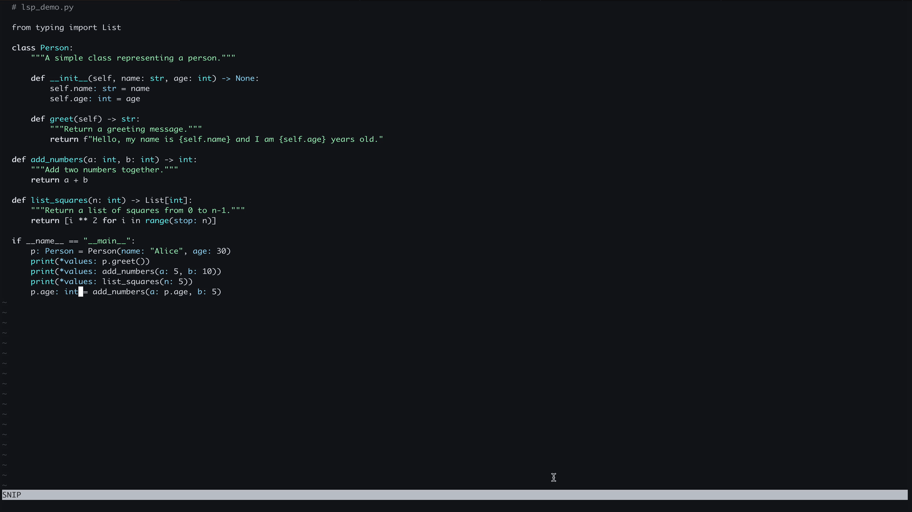

### Neovim on z/Os

Neovim is a modernized fork of Vim that aims to improve usability, performance, and extensibility.

### Why Neovim is Popular and Better than Vim

Here’s why Neovim is considered better than Vim:

1. **Built-in LSP Support**: Unlike Vim, Neovim has native support for the Language Server Protocol (LSP), enabling better autocomplete, go-to-definition, and other IDE-like features.
2. **Better Plugin Ecosystem**: Neovim offers an improved plugin system with support for Lua, making it easier to create high-performance extensions.
3. **Asynchronous Processing**: Neovim supports async jobs and external processes, improving performance and responsiveness compared to Vim.
4. **Improved UI and Extensibility**: Neovim supports external UIs and better integration with modern tools, making it more flexible.
5. **Configuration with Lua**: While Vim relies on Vimscript, Neovim allows configuration in Lua, which is more efficient and user-friendly.

### Installing Neovim on z/OS

For users on IBM z/OS, Neovim can be installed using the **zOpen Community** package manager. Run the following command to install Neovim:

```bash
zopen install neovim
```

This will automatically handle dependencies and provide a ready-to-use Neovim installation on your z/OS environment.

### Setting Up Language Server Protocol (LSP) for Python in Neovim

One of the key benefits of Neovim is its support for the **Language Server Protocol (LSP)**, which allows advanced code completion, linting, and navigation features for various programming languages. To illustrate this, let's configure LSP for Python development in Neovim.

To enable LSP support for Python, you can use the **CoC (Conqueror of Completion)** plugin along with the **Pyright** language server. CoC is a powerful LSP client for Neovim that provides IDE-like features, and Pyright is a fast, lightweight Python language server developed by Microsoft.

### Configuring CoC with Pyright for Neovim in init.vim

### Step 1: Installing Vim-Plug

To install Vim-Plug (a popular plugin manager for Neovim):

1. Run the following command:

   ```bash
   curl -fLo ~/.local/share/nvim/site/autoload/plug.vim --create-dirs \
       https://raw.githubusercontent.com/junegunn/vim-plug/master/plug.vim
   ```

2. Add the following lines to your `init.vim` to load Vim-Plug:

   ```vim
   call plug#begin('~/.vim/plugged')
   Plug 'neoclide/coc.nvim', {'branch': 'release'}
   call plug#end()
   ```

3. Restart Neovim and run `:PlugInstall` inside Neovim to install the plugin.

For more details on Vim-Plug, visit the [official Vim-Plug repository](https://github.com/junegunn/vim-plug).

### Step 2: Installing CoC, Pyright, and CoC-Pyright

#### CoC Dependency on Node.js

CoC requires **Node.js** to function properly. Ensure you have Node.js installed on your system before proceeding.

To check if Node.js is installed, run:

```bash
node -v
```

If Node.js is not installed, download and install it from [IBM SDK for Node.js](https://www.ibm.com/products/sdk-nodejs-compiler-zos).

#### Installing Pyright and CoC-Pyright

1. **Install Pyright** via `pip`:

   ```bash
   pip install pyright
   ```

2. **Install CoC-Pyright** in Neovim:
   Open Neovim and run the following command:

   ```
   :CocInstall coc-pyright
   ```

### Step 3: Recommended CoC.nvim Configuration

The following settings enhance CoC’s usability:

```vim
" https://raw.githubusercontent.com/neoclide/coc.nvim/master/doc/coc-example-config.vim

" May need for Vim (not Neovim) since coc.nvim calculates byte offset by count
" utf-8 byte sequence
set encoding=utf-8
" Some servers have issues with backup files, see #649
set nobackup
set nowritebackup

" Having longer updatetime (default is 4000 ms = 4s) leads to noticeable
" delays and poor user experience
set updatetime=300

" Always show the signcolumn, otherwise it would shift the text each time
" diagnostics appear/become resolved
set signcolumn=yes

" Use tab for trigger completion with characters ahead and navigate
" NOTE: There's always complete item selected by default, you may want to enable
" no select by `"suggest.noselect": true` in your configuration file
" NOTE: Use command ':verbose imap <tab>' to make sure tab is not mapped by
" other plugin before putting this into your config
inoremap <silent><expr> <TAB>
      \ coc#pum#visible() ? coc#pum#next(1) :
      \ CheckBackspace() ? "\<Tab>" :
      \ coc#refresh()
inoremap <expr><S-TAB> coc#pum#visible() ? coc#pum#prev(1) : "\<C-h>"

" Make <CR> to accept selected completion item or notify coc.nvim to format
" <C-g>u breaks current undo, please make your own choice
inoremap <silent><expr> <CR> coc#pum#visible() ? coc#pum#confirm()
                              \: "\<C-g>u\<CR>\<c-r>=coc#on_enter()\<CR>"

function! CheckBackspace() abort
  let col = col('.') - 1
  return !col || getline('.')[col - 1]  =~# '\s'
endfunction

" Use <c-space> to trigger completion
if has('nvim')
  inoremap <silent><expr> <c-space> coc#refresh()
else
  inoremap <silent><expr> <c-@> coc#refresh()
endif

" Use `[g` and `]g` to navigate diagnostics
" Use `:CocDiagnostics` to get all diagnostics of current buffer in location list
nmap <silent><nowait> [g <Plug>(coc-diagnostic-prev)
nmap <silent><nowait> ]g <Plug>(coc-diagnostic-next)

" GoTo code navigation
nmap <silent><nowait> gd <Plug>(coc-definition)
nmap <silent><nowait> gy <Plug>(coc-type-definition)
nmap <silent><nowait> gi <Plug>(coc-implementation)
nmap <silent><nowait> gr <Plug>(coc-references)

" Use K to show documentation in preview window
nnoremap <silent> K :call ShowDocumentation()<CR>

function! ShowDocumentation()
  if CocAction('hasProvider', 'hover')
    call CocActionAsync('doHover')
  else
    call feedkeys('K', 'in')
  endif
endfunction

" Highlight the symbol and its references when holding the cursor
autocmd CursorHold * silent call CocActionAsync('highlight')

" Symbol renaming
nmap <leader>rn <Plug>(coc-rename)

" Formatting selected code
xmap <leader>f  <Plug>(coc-format-selected)
nmap <leader>f  <Plug>(coc-format-selected)

augroup mygroup
  autocmd!
  " Setup formatexpr specified filetype(s)
  autocmd FileType typescript,json setl formatexpr=CocAction('formatSelected')
augroup end

" Applying code actions to the selected code block
" Example: `<leader>aap` for current paragraph
xmap <leader>a  <Plug>(coc-codeaction-selected)
nmap <leader>a  <Plug>(coc-codeaction-selected)

" Remap keys for applying code actions at the cursor position
nmap <leader>ac  <Plug>(coc-codeaction-cursor)
" Remap keys for apply code actions affect whole buffer
nmap <leader>as  <Plug>(coc-codeaction-source)
" Apply the most preferred quickfix action to fix diagnostic on the current line
nmap <leader>qf  <Plug>(coc-fix-current)

" Remap keys for applying refactor code actions
nmap <silent> <leader>re <Plug>(coc-codeaction-refactor)
xmap <silent> <leader>r  <Plug>(coc-codeaction-refactor-selected)
nmap <silent> <leader>r  <Plug>(coc-codeaction-refactor-selected)

" Run the Code Lens action on the current line
nmap <leader>cl  <Plug>(coc-codelens-action)

" Map function and class text objects
" NOTE: Requires 'textDocument.documentSymbol' support from the language server
xmap if <Plug>(coc-funcobj-i)
omap if <Plug>(coc-funcobj-i)
xmap af <Plug>(coc-funcobj-a)
omap af <Plug>(coc-funcobj-a)
xmap ic <Plug>(coc-classobj-i)
omap ic <Plug>(coc-classobj-i)
xmap ac <Plug>(coc-classobj-a)
omap ac <Plug>(coc-classobj-a)

" Remap <C-f> and <C-b> to scroll float windows/popups
if has('nvim-0.4.0') || has('patch-8.2.0750')
  nnoremap <silent><nowait><expr> <C-f> coc#float#has_scroll() ? coc#float#scroll(1) : "\<C-f>"
  nnoremap <silent><nowait><expr> <C-b> coc#float#has_scroll() ? coc#float#scroll(0) : "\<C-b>"
  inoremap <silent><nowait><expr> <C-f> coc#float#has_scroll() ? "\<c-r>=coc#float#scroll(1)\<cr>" : "\<Right>"
  inoremap <silent><nowait><expr> <C-b> coc#float#has_scroll() ? "\<c-r>=coc#float#scroll(0)\<cr>" : "\<Left>"
  vnoremap <silent><nowait><expr> <C-f> coc#float#has_scroll() ? coc#float#scroll(1) : "\<C-f>"
  vnoremap <silent><nowait><expr> <C-b> coc#float#has_scroll() ? coc#float#scroll(0) : "\<C-b>"
endif

" Use CTRL-S for selections ranges
" Requires 'textDocument/selectionRange' support of language server
nmap <silent> <C-s> <Plug>(coc-range-select)
xmap <silent> <C-s> <Plug>(coc-range-select)

" Add `:Format` command to format current buffer
command! -nargs=0 Format :call CocActionAsync('format')

" Add `:Fold` command to fold current buffer
command! -nargs=? Fold :call     CocAction('fold', <f-args>)

" Add `:OR` command for organize imports of the current buffer
command! -nargs=0 OR   :call     CocActionAsync('runCommand', 'editor.action.organizeImport')

" Add (Neo)Vim's native statusline support
" NOTE: Please see `:h coc-status` for integrations with external plugins that
" provide custom statusline: lightline.vim, vim-airline
set statusline^=%{coc#status()}%{get(b:,'coc_current_function','')}

" Mappings for CoCList
" Show all diagnostics
nnoremap <silent><nowait> <space>a  :<C-u>CocList diagnostics<cr>
" Manage extensions
nnoremap <silent><nowait> <space>e  :<C-u>CocList extensions<cr>
" Show commands
nnoremap <silent><nowait> <space>c  :<C-u>CocList commands<cr>
" Find symbol of current document
nnoremap <silent><nowait> <space>o  :<C-u>CocList outline<cr>
" Search workspace symbols
nnoremap <silent><nowait> <space>s  :<C-u>CocList -I symbols<cr>
" Do default action for next item
nnoremap <silent><nowait> <space>j  :<C-u>CocNext<CR>
" Do default action for previous item
nnoremap <silent><nowait> <space>k  :<C-u>CocPrev<CR>
" Resume latest coc list
nnoremap <silent><nowait> <space>p  :<C-u>CocListResume<CR>
```

### Example Python Code with CoC and Pyright

Create a sample Python file (`lsp_demo.py`) and open it in Neovim:

```python

  # lsp_demo.py

  from typing import List

  class Person:
      """A simple class representing a person."""

      def __init__(self, name: str, age: int) -> None:
          self.name: str = name
          self.age: int = age

      def greet(self) -> str:
          """Return a greeting message."""
          return f"Hello, my name is {self.name} and I am {self.age} years old."

  def add_numbers(a: int, b: int) -> int:
      """Add two numbers together."""
      return a + b

  def list_squares(n: int) -> List[int]:
      """Return a list of squares from 0 to n-1."""
      return [i ** 2 for i in range(stop: n)]

  if __name__ == "__main__":
      p: Person = Person(name: "Alice", age: 30)
      print(*values: p.greet())  # Hover here for documentation
      print(*values: add_numbers(a: 5, b: 10))
      print(*values: list_squares(n: 5))
```

### Neovim LSP Features

Neovim provides advanced editing capabilities through the **Language Server Protocol (LSP)**. Below are key LSP features with corresponding GIF demos.

---

#### Autocompletion   


---

#### Type Error Checking  
LSP provides **real-time type checking** and **error diagnostics**.  

Type incorrect code (Pyright detects errors automatically).  


---

#### Go to Definition  
Jump to the function or variable definition instantly.  

 Usage:

Press <kbd>g</kbd> + <kbd>d</kbd> to move to the definition within the same file or an external file.
Press <kbd>Ctrl</kbd> + <kbd>o</kbd> to go back to the previous file.   


---

#### Find References  
Find where a function or variable is used across the codebase.  

Press <kbd>g</kbd> + <kbd>r</kbd>.  


---

### Conclusion

With CoC and Pyright configured in Neovim, you now have a robust development environment for Python with powerful IDE-like features. Explore Pyright's advanced options for deeper type-checking and enhanced code insights to improve your workflow.

**References:**
- [Vim-Plug](https://github.com/junegunn/vim-plug)
- [CoC.nvim](https://github.com/neoclide/coc.nvim)
- [Pyright](https://github.com/microsoft/pyright)
- [Language Server Protocol Implementors](https://microsoft.github.io/language-server-protocol/implementors/servers/)

