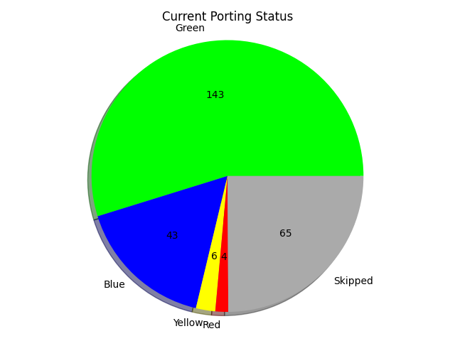
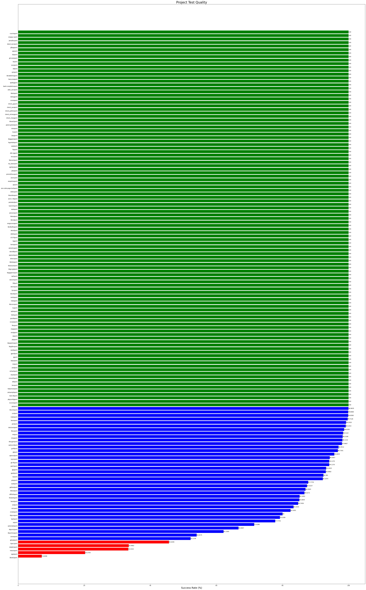

## Overall Status
* Green</a>: All tests passing
* Blue</a>: Most tests passing
* Yellow</a>: Some tests passing
* Red</a>: No tests passing
* Grey</a>: Skipped or Tests are not enabled

## Breakdown of Status

## Projects with skipped or no tests (grey)
  
* [bisonport](https://github.com/ZOSOpenTools/bisonport)
* [expectport](https://github.com/ZOSOpenTools/expectport)
* [gperfport](https://github.com/ZOSOpenTools/gperfport)
* [nanoport](https://github.com/ZOSOpenTools/nanoport)
* [ncduport](https://github.com/ZOSOpenTools/ncduport)
* [screenport](https://github.com/ZOSOpenTools/screenport)
* [sqliteport](https://github.com/ZOSOpenTools/sqliteport)
* [tclport](https://github.com/ZOSOpenTools/tclport)
* [zigiport](https://github.com/ZOSOpenTools/zigiport)
## Projects that do not have builds

* [emacsport](https://github.com/ZOSOpenTools/emacsport)
* [fzfport](https://github.com/ZOSOpenTools/fzfport)
* [htopport](https://github.com/ZOSOpenTools/htopport)
* [phpport](https://github.com/ZOSOpenTools/phpport)
* [pkg-configport](https://github.com/ZOSOpenTools/pkg-configport)
* [re2cport](https://github.com/ZOSOpenTools/re2cport)
* [shufport](https://github.com/ZOSOpenTools/shufport)
* [sshpassport](https://github.com/ZOSOpenTools/sshpassport)
* [sudoport](https://github.com/ZOSOpenTools/sudoport)
* [topport](https://github.com/ZOSOpenTools/topport)

## Projects with the most dependencies

| Package | # of Dependent Projects | Test Success Rate | Dependent projects
|---|---|---|--|
| [makeport](https://github.com/ZOSOpenTools/makeport) | 72 | 100% |autoconf, automake, bash, bison, bzip2, cmake, coreutils, cscope, ctags, curl, diffutils, expat, expect, findutils, flex, fzf, gawk, gdbm, getopt, gettext, git, gnulib, gperf, grep, groff, gzip, hello, help2man, htop, jq, less, libpcre, libpipeline, libtool, libxml2, libxslt, lua, lynx, lz4, m4, make, man-db, nano, ncdu, ncurses, ninja, openssl, patch, perl, php, re2c, rsync, screen, sed, sqlite, sudo, tar, tcl, texinfo, top, unzip, vim, wget, which, xmlto, xxhash, xz, zip, zlib, zoslib, zotsample, zstd
| [zoslibport](https://github.com/ZOSOpenTools/zoslibport) | 57 | 100% |bash, bison, bzip2, coreutils, cscope, ctags, curl, diffutils, expat, expect, findutils, flex, gawk, gdbm, getopt, gettext, git, grep, groff, gzip, hello, htop, jq, less, libpcre, libpipeline, libtool, libxml2, libxslt, lua, lynx, make, man-db, nano, ncdu, ninja, openssl, patch, perl, php, re2c, rsync, screen, sed, sqlite, sudo, tar, tcl, texinfo, unzip, vim, wget, xmlto, xz, zip, zlib, zstd
| [curlport](https://github.com/ZOSOpenTools/curlport) | 47 | 100% |autoconf, automake, bash, bison, bzip2, coreutils, cscope, curl, diffutils, expat, findutils, gawk, gettext, git, gnulib, gperf, grep, groff, gzip, hello, help2man, jq, less, libpipeline, libtool, lz4, m4, make, man-db, ncdu, ncurses, openssl, patch, php, rsync, screen, sed, tar, tcl, texinfo, top, wget, which, xxhash, xz, zotsample, zstd
| [gitport](https://github.com/ZOSOpenTools/gitport) | 43 | 96% |autoconf, automake, bash, bison, cmake, ctags, curl, expat, gdbm, gettext, git, gnulib, gzip, hello, help2man, htop, libpipeline, libtool, m4, make, man-db, meta, ncdu, ncurses, ninja, openssl, patch, perl, php, re2c, rsync, sqlite, tar, texinfo, unzip, vim, wget, xz, zigi, zip, zlib, zoslib, zotsample
| [gzipport](https://github.com/ZOSOpenTools/gzipport) | 43 | 76% |autoconf, automake, bash, bison, bzip2, coreutils, cscope, ctags, curl, findutils, flex, gawk, gettext, git, gperf, hello, htop, jq, less, libtool, lz4, m4, make, man-db, ncdu, ncurses, openssl, patch, php, rsync, screen, sed, sqlite, tar, tcl, texinfo, top, wget, which, xxhash, xz, zotsample, zstd
| [m4port](https://github.com/ZOSOpenTools/m4port) | 31 | 98% |autoconf, automake, bison, coreutils, ctags, curl, expat, flex, gettext, git, gnulib, groff, gzip, hello, help2man, htop, libtool, m4, make, man-db, openssl, php, re2c, rsync, screen, sed, tar, texinfo, top, wget, which
| [coreutilsport](https://github.com/ZOSOpenTools/coreutilsport) | 30 | 84% |automake, bash, expat, flex, gdbm, getopt, gettext, git, gnulib, grep, groff, gzip, hello, jq, libpcre, libtool, libxml2, lua, lz4, man-db, ncurses, patch, php, re2c, sed, sudo, texinfo, which, xxhash, zstd
| [autoconfport](https://github.com/ZOSOpenTools/autoconfport) | 28 | 97% |autoconf, automake, bison, coreutils, ctags, curl, expat, gettext, git, gnulib, gzip, hello, help2man, htop, libtool, m4, make, man-db, nano, openssl, php, re2c, rsync, screen, sed, tar, texinfo, wget
| [automakeport](https://github.com/ZOSOpenTools/automakeport) | 28 | 71% |autoconf, automake, bison, coreutils, ctags, curl, expat, gettext, git, gnulib, gzip, hello, help2man, htop, libtool, m4, make, man-db, nano, openssl, php, re2c, rsync, screen, sed, tar, texinfo, wget
| [perlport](https://github.com/ZOSOpenTools/perlport) | 27 | 99% |autoconf, automake, bison, coreutils, curl, expat, gettext, git, gnulib, groff, gzip, hello, help2man, htop, libtool, m4, make, man-db, openssl, php, re2c, rsync, screen, sed, tar, texinfo, wget
| [tarport](https://github.com/ZOSOpenTools/tarport) | 25 | 92% |automake, bash, bzip2, coreutils, cscope, ctags, curl, findutils, flex, gettext, git, grep, hello, htop, jq, less, m4, make, ncdu, ncurses, openssl, re2c, screen, sqlite, zotsample
| [diffutilsport](https://github.com/ZOSOpenTools/diffutilsport) | 17 | 92% |bash, coreutils, flex, gawk, getopt, git, gnulib, grep, groff, libpcre, libxml2, libxslt, man-db, php, re2c, texinfo, xmlto
| [xzport](https://github.com/ZOSOpenTools/xzport) | 17 | 77% |autoconf, automake, bison, curl, diffutils, expat, findutils, gettext, git, gzip, help2man, libtool, m4, make, man-db, openssl, texinfo
| [texinfoport](https://github.com/ZOSOpenTools/texinfoport) | 16 | 35% |autoconf, automake, bison, curl, expat, gettext, git, groff, gzip, hello, libtool, m4, make, openssl, sed, tar
| [help2manport](https://github.com/ZOSOpenTools/help2manport) | 13 | 100% |autoconf, automake, bison, curl, expat, gettext, git, hello, libtool, m4, make, openssl, texinfo
| [sedport](https://github.com/ZOSOpenTools/sedport) | 13 | 84% |bash, coreutils, git, groff, libxml2, libxslt, m4, man-db, ncurses, perl, php, re2c, which
| [ncursesport](https://github.com/ZOSOpenTools/ncursesport) | 12 | 100% |bash, cscope, gettext, git, htop, less, lynx, man-db, nano, ncdu, screen, vim
| [gettextport](https://github.com/ZOSOpenTools/gettextport) | 11 | 82% |coreutils, ctags, expat, getopt, git, hello, libiconv, m4, man-db, nano, which
| [libtoolport](https://github.com/ZOSOpenTools/libtoolport) | 8 | 80% |expat, gdbm, hello, m4, man-db, php, re2c, texinfo
| [bashport](https://github.com/ZOSOpenTools/bashport) | 7 | 80% |expat, flex, git, libxml2, re2c, texinfo, xmlto
| [grepport](https://github.com/ZOSOpenTools/grepport) | 7 | 94% |gnulib, libpcre, libxslt, m4, man-db, which, xmlto
| [gawkport](https://github.com/ZOSOpenTools/gawkport) | 6 | 93% |automake, curl, expat, gzip, ncurses, rsync
| [opensslport](https://github.com/ZOSOpenTools/opensslport) | 6 | 90% |curl, expat, git, lynx, rsync, wget
| [zlibport](https://github.com/ZOSOpenTools/zlibport) | 6 | 100% |autoconf, curl, expat, git, lynx, wget
| [findutilsport](https://github.com/ZOSOpenTools/findutilsport) | 5 | 50% |gnulib, grep, libxml2, re2c, texinfo
| [cmakeport](https://github.com/ZOSOpenTools/cmakeport) | 4 | 74% |ninja, unzip, zip, zoslib
| [libiconvport](https://github.com/ZOSOpenTools/libiconvport) | 3 | 100% |libxml2, man-db, php
| [wgetport](https://github.com/ZOSOpenTools/wgetport) | 3 | 18% |hello, man-db, sed
| [getoptport](https://github.com/ZOSOpenTools/getoptport) | 2 | 52% |flex, xmlto
| [gperfport](https://github.com/ZOSOpenTools/gperfport) | 2 | Skipped |hello, m4
| [lessport](https://github.com/ZOSOpenTools/lessport) | 2 | 100% |git, man-db
| [libxml2port](https://github.com/ZOSOpenTools/libxml2port) | 2 | 99% |libxslt, php
| [rsyncport](https://github.com/ZOSOpenTools/rsyncport) | 2 | 88% |m4, sed
| [bisonport](https://github.com/ZOSOpenTools/bisonport) | 1 | Skipped |php
| [expatport](https://github.com/ZOSOpenTools/expatport) | 1 | 100% |git
| [flexport](https://github.com/ZOSOpenTools/flexport) | 1 | 100% |cscope
| [gdbmport](https://github.com/ZOSOpenTools/gdbmport) | 1 | 100% |man-db
| [gnulibport](https://github.com/ZOSOpenTools/gnulibport) | 1 | 100% |htop
| [groffport](https://github.com/ZOSOpenTools/groffport) | 1 | 100% |man-db
| [libpcreport](https://github.com/ZOSOpenTools/libpcreport) | 1 | 66% |git
| [libpipelineport](https://github.com/ZOSOpenTools/libpipelineport) | 1 | 100% |man-db
| [lz4port](https://github.com/ZOSOpenTools/lz4port) | 1 | 100% |rsync
| [patchport](https://github.com/ZOSOpenTools/patchport) | 1 | 91% |m4
| [re2cport](https://github.com/ZOSOpenTools/re2cport) | 1 | No builds |php
| [sqliteport](https://github.com/ZOSOpenTools/sqliteport) | 1 | Skipped |php
| [tclport](https://github.com/ZOSOpenTools/tclport) | 1 | Skipped |expect
| [xxhashport](https://github.com/ZOSOpenTools/xxhashport) | 1 | 100% |rsync
| [zipport](https://github.com/ZOSOpenTools/zipport) | 1 | 100% |unzip
| [zstdport](https://github.com/ZOSOpenTools/zstdport) | 1 | 100% |rsync
| [bzip2port](https://github.com/ZOSOpenTools/bzip2port) | 0 | 100% |
| [cscopeport](https://github.com/ZOSOpenTools/cscopeport) | 0 | 100% |
| [ctagsport](https://github.com/ZOSOpenTools/ctagsport) | 0 | 100% |
| [emacsport](https://github.com/ZOSOpenTools/emacsport) | 0 | No builds |
| [expectport](https://github.com/ZOSOpenTools/expectport) | 0 | Skipped |
| [fzfport](https://github.com/ZOSOpenTools/fzfport) | 0 | No builds |
| [helloport](https://github.com/ZOSOpenTools/helloport) | 0 | 100% |
| [htopport](https://github.com/ZOSOpenTools/htopport) | 0 | No builds |
| [jqport](https://github.com/ZOSOpenTools/jqport) | 0 | 57% |
| [libxsltport](https://github.com/ZOSOpenTools/libxsltport) | 0 | 100% |
| [luaport](https://github.com/ZOSOpenTools/luaport) | 0 | 100% |
| [lynxport](https://github.com/ZOSOpenTools/lynxport) | 0 | 100% |
| [man-dbport](https://github.com/ZOSOpenTools/man-dbport) | 0 | 96% |
| [metaport](https://github.com/ZOSOpenTools/metaport) | 0 | 100% |
| [nanoport](https://github.com/ZOSOpenTools/nanoport) | 0 | Skipped |
| [ncduport](https://github.com/ZOSOpenTools/ncduport) | 0 | Skipped |
| [ninjaport](https://github.com/ZOSOpenTools/ninjaport) | 0 | 98% |
| [phpport](https://github.com/ZOSOpenTools/phpport) | 0 | No builds |
| [pkg-configport](https://github.com/ZOSOpenTools/pkg-configport) | 0 | No builds |
| [screenport](https://github.com/ZOSOpenTools/screenport) | 0 | Skipped |
| [shufport](https://github.com/ZOSOpenTools/shufport) | 0 | No builds |
| [sshpassport](https://github.com/ZOSOpenTools/sshpassport) | 0 | No builds |
| [sudoport](https://github.com/ZOSOpenTools/sudoport) | 0 | No builds |
| [topport](https://github.com/ZOSOpenTools/topport) | 0 | No builds |
| [unzipport](https://github.com/ZOSOpenTools/unzipport) | 0 | 100% |
| [vimport](https://github.com/ZOSOpenTools/vimport) | 0 | 100% |
| [whichport](https://github.com/ZOSOpenTools/whichport) | 0 | 100% |
| [xmltoport](https://github.com/ZOSOpenTools/xmltoport) | 0 | 100% |
| [zigiport](https://github.com/ZOSOpenTools/zigiport) | 0 | Skipped |
| [zotsampleport](https://github.com/ZOSOpenTools/zotsampleport) | 0 | 100% |

## Projects with the most patches

| Package | # of Patched Lines | # of Patches
|---|---|--|
|  [bashport](https://github.com/ZOSOpenTools/bashport) | 2821 | 25
|  [cmakeport](https://github.com/ZOSOpenTools/cmakeport) | 2328 | 1
|  [htopport](https://github.com/ZOSOpenTools/htopport) | 1258 | 16
|  [gitport](https://github.com/ZOSOpenTools/gitport) | 938 | 28
|  [perlport](https://github.com/ZOSOpenTools/perlport) | 619 | 1
|  [coreutilsport](https://github.com/ZOSOpenTools/coreutilsport) | 520 | 6
|  [rsyncport](https://github.com/ZOSOpenTools/rsyncport) | 381 | 7
|  [phpport](https://github.com/ZOSOpenTools/phpport) | 369 | 11
|  [flexport](https://github.com/ZOSOpenTools/flexport) | 340 | 2
|  [sudoport](https://github.com/ZOSOpenTools/sudoport) | 329 | 1
|  [ninjaport](https://github.com/ZOSOpenTools/ninjaport) | 274 | 1
|  [man-dbport](https://github.com/ZOSOpenTools/man-dbport) | 243 | 9
|  [screenport](https://github.com/ZOSOpenTools/screenport) | 227 | 1
|  [zstdport](https://github.com/ZOSOpenTools/zstdport) | 221 | 3
|  [autoconfport](https://github.com/ZOSOpenTools/autoconfport) | 175 | 7
|  [findutilsport](https://github.com/ZOSOpenTools/findutilsport) | 161 | 6
|  [gettextport](https://github.com/ZOSOpenTools/gettextport) | 146 | 6
|  [diffutilsport](https://github.com/ZOSOpenTools/diffutilsport) | 140 | 8
|  [tclport](https://github.com/ZOSOpenTools/tclport) | 130 | 5
|  [vimport](https://github.com/ZOSOpenTools/vimport) | 122 | 6
|  [grepport](https://github.com/ZOSOpenTools/grepport) | 88 | 2
|  [patchport](https://github.com/ZOSOpenTools/patchport) | 86 | 3
|  [gawkport](https://github.com/ZOSOpenTools/gawkport) | 81 | 4
|  [libiconvport](https://github.com/ZOSOpenTools/libiconvport) | 77 | 2
|  [xmltoport](https://github.com/ZOSOpenTools/xmltoport) | 74 | 1
|  [libtoolport](https://github.com/ZOSOpenTools/libtoolport) | 56 | 2
|  [tarport](https://github.com/ZOSOpenTools/tarport) | 55 | 1
|  [unzipport](https://github.com/ZOSOpenTools/unzipport) | 54 | 1
|  [gdbmport](https://github.com/ZOSOpenTools/gdbmport) | 52 | 1
|  [nanoport](https://github.com/ZOSOpenTools/nanoport) | 52 | 1
|  [emacsport](https://github.com/ZOSOpenTools/emacsport) | 47 | 2
|  [lessport](https://github.com/ZOSOpenTools/lessport) | 46 | 3
|  [ncursesport](https://github.com/ZOSOpenTools/ncursesport) | 46 | 1
|  [luaport](https://github.com/ZOSOpenTools/luaport) | 45 | 1
|  [bisonport](https://github.com/ZOSOpenTools/bisonport) | 41 | 2
|  [xxhashport](https://github.com/ZOSOpenTools/xxhashport) | 38 | 2
|  [expatport](https://github.com/ZOSOpenTools/expatport) | 37 | 1
|  [texinfoport](https://github.com/ZOSOpenTools/texinfoport) | 33 | 2
|  [expectport](https://github.com/ZOSOpenTools/expectport) | 31 | 2
|  [lynxport](https://github.com/ZOSOpenTools/lynxport) | 30 | 1
|  [lz4port](https://github.com/ZOSOpenTools/lz4port) | 30 | 3
|  [jqport](https://github.com/ZOSOpenTools/jqport) | 29 | 1
|  [getoptport](https://github.com/ZOSOpenTools/getoptport) | 25 | 1
|  [groffport](https://github.com/ZOSOpenTools/groffport) | 25 | 2
|  [wgetport](https://github.com/ZOSOpenTools/wgetport) | 22 | 1
|  [whichport](https://github.com/ZOSOpenTools/whichport) | 22 | 1
|  [sqliteport](https://github.com/ZOSOpenTools/sqliteport) | 21 | 1
|  [fzfport](https://github.com/ZOSOpenTools/fzfport) | 20 | 1
|  [bzip2port](https://github.com/ZOSOpenTools/bzip2port) | 17 | 1
|  [zlibport](https://github.com/ZOSOpenTools/zlibport) | 14 | 1
|  [automakeport](https://github.com/ZOSOpenTools/automakeport) | 12 | 1
| &#10003; [cscopeport](https://github.com/ZOSOpenTools/cscopeport) | 0 | 0
| &#10003; [ctagsport](https://github.com/ZOSOpenTools/ctagsport) | 0 | 0
| &#10003; [curlport](https://github.com/ZOSOpenTools/curlport) | 0 | 0
| &#10003; [gnulibport](https://github.com/ZOSOpenTools/gnulibport) | 0 | 0
| &#10003; [gperfport](https://github.com/ZOSOpenTools/gperfport) | 0 | 0
| &#10003; [gzipport](https://github.com/ZOSOpenTools/gzipport) | 0 | 0
| &#10003; [helloport](https://github.com/ZOSOpenTools/helloport) | 0 | 0
| &#10003; [help2manport](https://github.com/ZOSOpenTools/help2manport) | 0 | 0
| &#10003; [libpcreport](https://github.com/ZOSOpenTools/libpcreport) | 0 | 0
| &#10003; [libpipelineport](https://github.com/ZOSOpenTools/libpipelineport) | 0 | 0
| &#10003; [libxml2port](https://github.com/ZOSOpenTools/libxml2port) | 0 | 0
| &#10003; [libxsltport](https://github.com/ZOSOpenTools/libxsltport) | 0 | 0
| &#10003; [m4port](https://github.com/ZOSOpenTools/m4port) | 0 | 0
| &#10003; [makeport](https://github.com/ZOSOpenTools/makeport) | 0 | 0
| &#10003; [metaport](https://github.com/ZOSOpenTools/metaport) | 0 | 0
| &#10003; [ncduport](https://github.com/ZOSOpenTools/ncduport) | 0 | 0
| &#10003; [opensslport](https://github.com/ZOSOpenTools/opensslport) | 0 | 0
| &#10003; [pkg-configport](https://github.com/ZOSOpenTools/pkg-configport) | 0 | 0
| &#10003; [re2cport](https://github.com/ZOSOpenTools/re2cport) | 0 | 0
| &#10003; [sedport](https://github.com/ZOSOpenTools/sedport) | 0 | 0
| &#10003; [shufport](https://github.com/ZOSOpenTools/shufport) | 0 | 0
| &#10003; [sshpassport](https://github.com/ZOSOpenTools/sshpassport) | 0 | 0
| &#10003; [topport](https://github.com/ZOSOpenTools/topport) | 0 | 0
| &#10003; [xzport](https://github.com/ZOSOpenTools/xzport) | 0 | 0
| &#10003; [zigiport](https://github.com/ZOSOpenTools/zigiport) | 0 | 0
| &#10003; [zipport](https://github.com/ZOSOpenTools/zipport) | 0 | 0
| &#10003; [zoslibport](https://github.com/ZOSOpenTools/zoslibport) | 0 | 0
| &#10003; [zotsampleport](https://github.com/ZOSOpenTools/zotsampleport) | 0 | 0

Last updated:  2023-03-29 00:57:02
