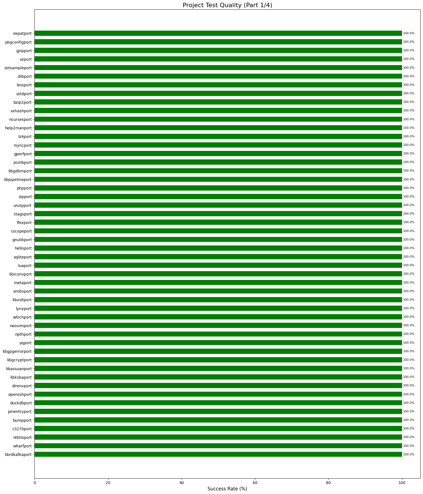
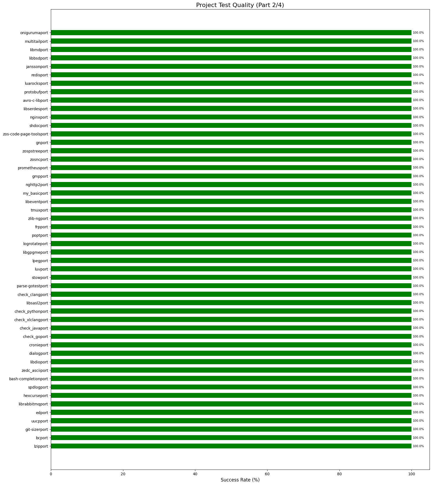
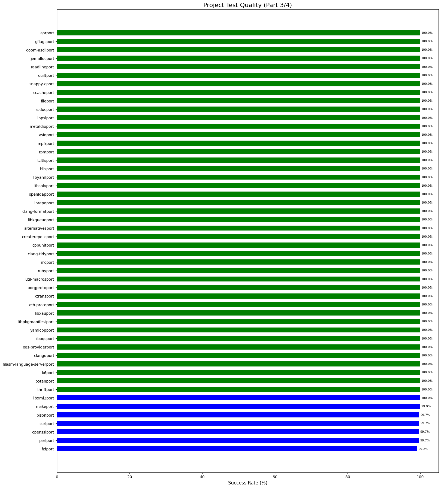
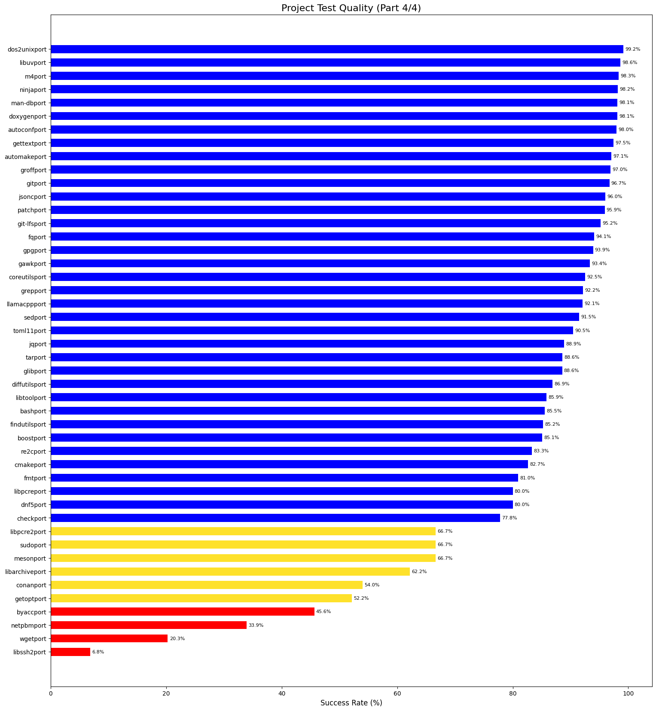

## Overall Status
* Green: All tests passing
* Blue: Most tests passing (>=75%)
* Yellow: Some tests passing (>=50%)
* Red: Few or no tests passing (<50%)
* Skipped: Skipped or Tests are not enabled

## Overall Status Breakdown

## Projects with skipped or no tests (or no releases resulting in skipped status)
* [antport](https://github.com/zopencommunity/antport) - Tests skipped or not enabled
* [buildkiteport](https://github.com/zopencommunity/buildkiteport) - Tests skipped or not enabled
* [caddyport](https://github.com/zopencommunity/caddyport) - Tests skipped or not enabled
* [check_podmanport](https://github.com/zopencommunity/check_podmanport) - Tests skipped or not enabled
* [chezmoiport](https://github.com/zopencommunity/chezmoiport) - Tests skipped or not enabled
* [cjsonport](https://github.com/zopencommunity/cjsonport) - Tests skipped or not enabled
* [cpioport](https://github.com/zopencommunity/cpioport) - Tests skipped or not enabled
* [cppcheckport](https://github.com/zopencommunity/cppcheckport) - Tests skipped or not enabled
* [crushport](https://github.com/zopencommunity/crushport) - Tests skipped or not enabled
* [depot_toolsport](https://github.com/zopencommunity/depot_toolsport) - Tests skipped or not enabled
* [emacsport](https://github.com/zopencommunity/emacsport) - Tests skipped or not enabled
* [expectport](https://github.com/zopencommunity/expectport) - Tests skipped or not enabled
* [fishport](https://github.com/zopencommunity/fishport) - Tests skipped or not enabled
* [fqport](https://github.com/zopencommunity/fqport) - Tests skipped or not enabled
* [fxport](https://github.com/zopencommunity/fxport) - Tests skipped or not enabled
* [ginport](https://github.com/zopencommunity/ginport) - Tests skipped or not enabled
* [git-extrasport](https://github.com/zopencommunity/git-extrasport) - Tests skipped or not enabled
* [githubcliport](https://github.com/zopencommunity/githubcliport) - Tests skipped or not enabled
* [gitlab-runnerport](https://github.com/zopencommunity/gitlab-runnerport) - Tests skipped or not enabled
* [gitlabcliport](https://github.com/zopencommunity/gitlabcliport) - Tests skipped or not enabled
* [glowport](https://github.com/zopencommunity/glowport) - Tests skipped or not enabled
* [godsectport](https://github.com/zopencommunity/godsectport) - Tests skipped or not enabled
* [gradleport](https://github.com/zopencommunity/gradleport) - Tests skipped or not enabled
* [grafanaport](https://github.com/zopencommunity/grafanaport) - Tests skipped or not enabled
* [groovyport](https://github.com/zopencommunity/groovyport) - Tests skipped or not enabled
* [grpcport](https://github.com/zopencommunity/grpcport) - Tests skipped or not enabled
* [gumport](https://github.com/zopencommunity/gumport) - Tests skipped or not enabled
* [hazelcastport](https://github.com/zopencommunity/hazelcastport) - Tests skipped or not enabled
* [hugoport](https://github.com/zopencommunity/hugoport) - Tests skipped or not enabled
* [jdport](https://github.com/zopencommunity/jdport) - Tests skipped or not enabled
* [jenkinsport](https://github.com/zopencommunity/jenkinsport) - Tests skipped or not enabled
* [lazygitport](https://github.com/zopencommunity/lazygitport) - Tests skipped or not enabled
* [mavenport](https://github.com/zopencommunity/mavenport) - Tests skipped or not enabled
* [mkcertport](https://github.com/zopencommunity/mkcertport) - Tests skipped or not enabled
* [moreutilsport](https://github.com/zopencommunity/moreutilsport) - Tests skipped or not enabled
* [murexport](https://github.com/zopencommunity/murexport) - Tests skipped or not enabled
* [nanoport](https://github.com/zopencommunity/nanoport) - Tests skipped or not enabled
* [natsport](https://github.com/zopencommunity/natsport) - Tests skipped or not enabled
* [ncduport](https://github.com/zopencommunity/ncduport) - Tests skipped or not enabled
* [osv-scannerport](https://github.com/zopencommunity/osv-scannerport) - Tests skipped or not enabled
* [powerlinegoport](https://github.com/zopencommunity/powerlinegoport) - Tests skipped or not enabled
* [procpsport](https://github.com/zopencommunity/procpsport) - Tests skipped or not enabled
* [promptersport](https://github.com/zopencommunity/promptersport) - Tests skipped or not enabled
* [pvport](https://github.com/zopencommunity/pvport) - Tests skipped or not enabled
* [s5cmdport](https://github.com/zopencommunity/s5cmdport) - Tests skipped or not enabled
* [sccport](https://github.com/zopencommunity/sccport) - Tests skipped or not enabled
* [screenport](https://github.com/zopencommunity/screenport) - Tests skipped or not enabled
* [sshpassport](https://github.com/zopencommunity/sshpassport) - Tests skipped or not enabled
* [tclport](https://github.com/zopencommunity/tclport) - Tests skipped or not enabled
* [terraformport](https://github.com/zopencommunity/terraformport) - Tests skipped or not enabled
* [texinfoport](https://github.com/zopencommunity/texinfoport) - Tests skipped or not enabled
* [thesilversearcherport](https://github.com/zopencommunity/thesilversearcherport) - Tests skipped or not enabled
* [treeport](https://github.com/zopencommunity/treeport) - Tests skipped or not enabled
* [ttypeport](https://github.com/zopencommunity/ttypeport) - Tests skipped or not enabled
* [util-linuxport](https://github.com/zopencommunity/util-linuxport) - Tests skipped or not enabled
* [victoriametricsport](https://github.com/zopencommunity/victoriametricsport) - Tests skipped or not enabled
* [vimport](https://github.com/zopencommunity/vimport) - Tests skipped or not enabled
* [yqport](https://github.com/zopencommunity/yqport) - Tests skipped or not enabled
* [zigiport](https://github.com/zopencommunity/zigiport) - Tests skipped or not enabled
* [zusageport](https://github.com/zopencommunity/zusageport) - Tests skipped or not enabled

## Projects with the most dependencies

  

    
Package

    
# of Dependent Projects

    
Test Success Rate

    
Dependent projects

    

  

  

    
<strong><a href="https://github.com/zopencommunity/makeport" target="_blank" rel="noopener noreferrer">makeport</a></strong>

    
199

    
99.9%

    
alternatives, apr, asio, autoconf, automake, avro-c-lib, bash, bash-completion, bc, bison, blis, boost, byacc, bzip2, c3270, ccache, check, cjson, clang-format, cmake, coreutils, cpio, cppcheck, cppunit, createrepo_c, cronie, crush, cscope, ctags, curl, dialog, diffutils, direnv, dnf5, doom-ascii, dos2unix, doxygen, duckdb, ed, expat, expect, file, findutils, fish, flex, fmt, frp, fzf, gawk, getopt, gettext, gflags, git, git-extras, git-lfs, git-sizer, githubcli, gitlabcli, glib, glow, gmp, gn, gnulib, gperf, gpg, grafana, grep, groff, grpc, gzip, hello, help2man, hexcurse, jansson, jd, jemalloc, jenkins, jq, jsonc, less, libarchive, libassuan, libbsd, libdio, libevent, libgcrypt, libgdbm, libgpgerror, libgpgme, libiconv, libkqueue, libksba, libmd, libpcre, libpcre2, libpipeline, libpsl, librabbitmq, librdkafka, librepo, libsasl2, libserdes, libsolv, libssh2, libtool, libuv, libxml2, libxslt, libyaml, llamacpp, logrotate, lpeg, lua, luarocks, luv, lynx, lz4, lzip, m4, make, man-db, mc, meta, metaldio, mkcert, moreutils, mpfr, multitail, nano, ncdu, ncurses, neovim, netpbm, nghttp2, ninja, npth, ntbtls, oniguruma, openldap, openssh, openssl, patch, perl, php, pinentry, pkgconfig, popt, procps, prometheus, protobuf, pv, quilt, re2c, readline, redis, rpm, rsync, s5cmd, scc, scdoc, screen, sed, shdoc, snappy-c, spdlog, sqlite, sshpass, stow, sudo, tar, tcl, tcltls, texinfo, thesilversearcher, tig, tmux, toml11, tree, unzip, util-linux, uucp, victoriametrics, vim, wget, which, xmlto, xxhash, xz, zedc_ascii, zip, zlib, zlib-ng, zos-code-page-tools, zoslib, zosnc, zospstree, zotsample, zstd, zusage

    

  

  

    
<strong><a href="https://github.com/zopencommunity/zoslibport" target="_blank" rel="noopener noreferrer">zoslibport</a></strong>

    
150

    
100.0%

    
alternatives, apr, avro-c-lib, bash, bash-completion, bc, bison, boost, byacc, bzip2, c3270, check, cmake, coreutils, cpio, cppcheck, cppunit, cronie, cscope, ctags, curl, dialog, diffutils, dnf5, doom-ascii, doxygen, duckdb, ed, expat, expect, findutils, fish, flex, fmt, gawk, getopt, gettext, gflags, git, glib, gn, gnulib, gperf, gpg, grep, groff, grpc, gzip, hello, hexcurse, jansson, jemalloc, jenkins, jq, jsonc, less, libarchive, libassuan, libbsd, libevent, libgcrypt, libgdbm, libgpgerror, libgpgme, libkqueue, libksba, libmd, libpcre, libpcre2, libpipeline, librabbitmq, librdkafka, librepo, libsasl2, libserdes, libsolv, libssh2, libtool, libuv, libxml2, libxslt, libyaml, llamacpp, logrotate, lpeg, lua, luv, lynx, lzip, m4, make, man-db, meta, moreutils, mpfr, multitail, my_basic, nano, ncdu, ncurses, neovim, netpbm, ninja, npth, ntbtls, oniguruma, openldap, openssh, openssl, patch, perl, php, pinentry, pkgconfig, popt, procps, protobuf, quilt, re2c, readline, rsync, scdoc, screen, sed, shdoc, snappy-c, spdlog, sqlite, sshpass, sudo, tar, tcl, tcltls, texinfo, thesilversearcher, tig, tmux, toml11, unzip, util-linux, uucp, vim, wget, xmlto, xxhash, xz, zip, zlib, zstd, zusage

    

  

  

    
<strong><a href="https://github.com/zopencommunity/coreutilsport" target="_blank" rel="noopener noreferrer">coreutilsport</a></strong>

    
115

    
92.5%

    
alternatives, apr, automake, avro-c-lib, bash, bash-completion, bc, bison, blis, boost, byacc, c3270, ccache, check, cppcheck, cppunit, cronie, crush, curl, diffutils, direnv, doom-ascii, dos2unix, doxygen, ed, expat, findutils, flex, fq, getopt, gettext, git, git-extras, git-lfs, githubcli, gitlabcli, glib, glow, gnulib, grep, groff, gzip, hello, jansson, jd, jemalloc, jq, less, libbsd, libdio, libevent, libgdbm, libiconv, libkqueue, libmd, libpcre, libpcre2, libpsl, librdkafka, libsasl2, libserdes, libtool, libxml2, logrotate, lua, luarocks, lz4, lzip, man-db, meta, metaldio, moreutils, multitail, ncurses, neovim, netpbm, ntbtls, oniguruma, openldap, openssh, patch, perl, php, pkgconfig, procps, protobuf, quilt, re2c, readline, redis, rpm, rsync, scc, scdoc, sed, shdoc, spdlog, sudo, texinfo, thesilversearcher, tig, tmux, tree, util-linux, vim, which, xxhash, zedc_ascii, zlib-ng, zos-code-page-tools, zoslib, zosnc, zospstree, zstd, zusage

    

  

  

    
<strong><a href="https://github.com/zopencommunity/curlport" target="_blank" rel="noopener noreferrer">curlport</a></strong>

    
85

    
99.9%

    
autoconf, automake, avro-c-lib, bash, bison, buildkite, bzip2, c3270, cmake, coreutils, createrepo_c, cronie, cscope, curl, diffutils, dnf5, dos2unix, doxygen, expat, findutils, frp, gawk, gettext, gin, git, gitlab-runner, gn, gnulib, gperf, gpg, grep, groff, gzip, hello, help2man, jq, less, libarchive, libassuan, libgcrypt, libgpgerror, libgpgme, libksba, libpipeline, librdkafka, libserdes, libtool, libyaml, llamacpp, luarocks, lz4, m4, make, man-db, maven, meta, moreutils, ncdu, ncurses, neovim, ninja, npth, ntbtls, oniguruma, openssl, patch, perl, php, pinentry, procps, readline, rsync, screen, sed, snappy-c, tar, tcl, terraform, texinfo, uucp, wget, which, xxhash, xz, zstd

    

  

  

    
<strong><a href="https://github.com/zopencommunity/gitport" target="_blank" rel="noopener noreferrer">gitport</a></strong>

    
76

    
92.2%

    
autoconf, automake, bison, boost, buildkite, caddy, cmake, cronie, ctags, doom-ascii, dos2unix, doxygen, expat, frp, gettext, gflags, gin, git, git-extras, githubcli, gitlab-runner, gitlabcli, gn, gnulib, grafana, grpc, gzip, hello, help2man, jansson, libarchive, libbsd, libgdbm, libgpgme, libkqueue, libmd, libpipeline, librdkafka, libtool, libyaml, m4, make, man-db, meta, murex, ncdu, ncurses, ninja, openssl, patch, perl, php, prometheus, protobuf, re2c, rpm, rsync, shdoc, sqlite, sshpass, tar, terraform, texinfo, thesilversearcher, tig, unzip, victoriametrics, vim, wget, which, xz, zedc_ascii, zigi, zip, zoslib, zusage

    

  

  

    
<strong><a href="https://github.com/zopencommunity/m4port" target="_blank" rel="noopener noreferrer">m4port</a></strong>

    
73

    
98.3%

    
apr, asio, autoconf, automake, bash, bash-completion, bison, check, coreutils, cronie, cscope, ctags, curl, doxygen, expat, file, flex, gettext, git, gn, gnulib, gpg, groff, gzip, hello, help2man, hexcurse, jansson, jemalloc, jq, less, libassuan, libbsd, libgcrypt, libgpgerror, libgpgme, libiconv, libksba, libmd, libpsl, libsasl2, libtool, libyaml, logrotate, m4, make, man-db, mc, mpfr, netpbm, npth, ntbtls, oniguruma, openssl, php, pinentry, procps, re2c, readline, rpm, rsync, screen, sed, sshpass, tar, texinfo, thesilversearcher, tmux, util-linux, uucp, wget, which, zlib-ng

    

  

  

    
<strong><a href="https://github.com/zopencommunity/autoconfport" target="_blank" rel="noopener noreferrer">autoconfport</a></strong>

    
72

    
98.0%

    
apr, asio, autoconf, automake, bash, bash-completion, bison, check, coreutils, cpio, cronie, ctags, curl, doxygen, expat, file, gettext, git, gnulib, gpg, groff, grpc, gzip, hello, help2man, hexcurse, jansson, jemalloc, jq, less, libarchive, libassuan, libbsd, libgcrypt, libgpgerror, libgpgme, libiconv, libksba, libmd, libpsl, libsasl2, libtool, libyaml, logrotate, m4, make, man-db, mc, mpfr, nano, npth, ntbtls, oniguruma, php, pinentry, procps, re2c, rpm, rsync, screen, sed, shdoc, sshpass, tar, texinfo, thesilversearcher, tmux, util-linux, uucp, wget, which, zlib-ng

    

  

  

    
<strong><a href="https://github.com/zopencommunity/perlport" target="_blank" rel="noopener noreferrer">perlport</a></strong>

    
71

    
99.3%

    
asio, autoconf, automake, bash, bash-completion, bc, bison, blis, check, coreutils, cronie, ctags, curl, diffutils, doxygen, expat, file, gettext, git, gnulib, gpg, groff, gzip, hello, help2man, hexcurse, jansson, jemalloc, jq, less, libassuan, libgcrypt, libgpgerror, libgpgme, libiconv, libksba, libmd, libpsl, libsasl2, libtool, libyaml, logrotate, m4, make, man-db, mc, meta, mpfr, netpbm, npth, ntbtls, openssl, php, pinentry, procps, quilt, re2c, rpm, rsync, screen, sed, stow, tar, texinfo, thesilversearcher, tmux, util-linux, uucp, wget, which, zlib-ng

    

  

  

    
<strong><a href="https://github.com/zopencommunity/automakeport" target="_blank" rel="noopener noreferrer">automakeport</a></strong>

    
69

    
71.4%

    
apr, asio, autoconf, automake, bash-completion, bison, check, coreutils, cpio, cronie, ctags, doxygen, expat, file, gettext, git, gnulib, gpg, groff, gzip, hello, help2man, hexcurse, jansson, jemalloc, jq, less, libarchive, libassuan, libbsd, libgcrypt, libgpgerror, libgpgme, libiconv, libksba, libmd, libpsl, libsasl2, libtool, libyaml, logrotate, m4, make, man-db, mc, mpfr, nano, npth, ntbtls, oniguruma, php, pinentry, procps, re2c, rpm, rsync, screen, sed, shdoc, sshpass, tar, texinfo, thesilversearcher, tmux, util-linux, uucp, wget, which, zlib-ng

    

  

  

    
<strong><a href="https://github.com/zopencommunity/gzipport" target="_blank" rel="noopener noreferrer">gzipport</a></strong>

    
65

    
100.0%

    
autoconf, automake, bash, bison, bzip2, ccache, coreutils, cscope, curl, direnv, dos2unix, file, findutils, flex, gawk, gettext, git, git-lfs, gn, gperf, hello, jq, less, libpsl, libtool, logrotate, lpeg, lz4, m4, make, man-db, mc, meta, moreutils, multitail, ncdu, ncurses, neovim, ninja, oniguruma, openssh, openssl, patch, perl, php, procps, prometheus, readline, rpm, rsync, screen, sed, sqlite, sshpass, tar, tcl, texinfo, thesilversearcher, util-linux, uucp, wget, which, xxhash, xz, zstd

    

  

  

    
<strong><a href="https://github.com/zopencommunity/tarport" target="_blank" rel="noopener noreferrer">tarport</a></strong>

    
62

    
95.2%

    
apr, automake, bash, bzip2, ccache, check, coreutils, cscope, curl, direnv, ed, file, findutils, flex, gawk, gettext, git, git-lfs, gpg, grep, hello, jansson, jq, less, libarchive, libassuan, libbsd, libgcrypt, libgpgerror, libgpgme, libksba, libmd, libsasl2, libyaml, lpeg, m4, make, man-db, mc, meta, multitail, ncdu, ncurses, neovim, ninja, npth, ntbtls, oniguruma, openssh, openssl, pinentry, procps, prometheus, re2c, readline, rpm, screen, sqlite, sshpass, thesilversearcher, util-linux, uucp

    

  

  

    
<strong><a href="https://github.com/zopencommunity/bashport" target="_blank" rel="noopener noreferrer">bashport</a></strong>

    
56

    
88.2%

    
apr, autoconf, avro-c-lib, bash-completion, bison, blis, check, cpio, cronie, diffutils, direnv, dnf5, ed, expat, flex, fmt, gflags, git, git-extras, gn, gradle, groovy, hazelcast, jansson, jenkins, jq, libarchive, libbsd, libiconv, libkqueue, libmd, libpsl, librdkafka, librepo, libsasl2, libxml2, libyaml, maven, mc, meta, netpbm, oniguruma, procps, prometheus, prompters, re2c, redis, rpm, shdoc, texinfo, tree, vim, which, xmlto, zos-code-page-tools, zospstree

    

  

  

    
<strong><a href="https://github.com/zopencommunity/sedport" target="_blank" rel="noopener noreferrer">sedport</a></strong>

    
54

    
84.7%

    
apr, bash, bash-completion, boost, byacc, check, coreutils, cpio, cppunit, doom-ascii, doxygen, git, gpg, groff, gzip, jansson, libassuan, libbsd, libgcrypt, libgpgerror, libgpgme, libiconv, libkqueue, libksba, libmd, librdkafka, libsasl2, libssh2, libxml2, libxslt, libyaml, m4, man-db, ncurses, neovim, npth, ntbtls, openssh, perl, php, pinentry, pkgconfig, procps, prompters, quilt, re2c, readline, rpm, rsync, shdoc, util-linux, uucp, vim, which

    

  

  

    
<strong><a href="https://github.com/zopencommunity/grepport" target="_blank" rel="noopener noreferrer">grepport</a></strong>

    
50

    
92.2%

    
apr, bash, bash-completion, bc, blis, byacc, check, cpio, cppunit, ctags, dnf5, doxygen, fmt, glib, gnulib, gzip, jenkins, jsonc, less, libkqueue, libpcre, libpcre2, librdkafka, librepo, libserdes, libsolv, libxslt, libyaml, m4, man-db, meta, ntbtls, openldap, perl, procps, prometheus, quilt, readline, redis, rpm, scdoc, shdoc, snappy-c, stow, toml11, util-linux, wharf, which, xmlto, zlib-ng

    

  

  

    
<strong><a href="https://github.com/zopencommunity/diffutilsport" target="_blank" rel="noopener noreferrer">diffutilsport</a></strong>

    
47

    
87.6%

    
apr, bash, bison, boost, byacc, check, coreutils, cronie, ctags, flex, gawk, getopt, git, gnulib, gpg, grep, groff, gzip, jq, jsonc, libassuan, libdio, libgcrypt, libgpgerror, libgpgme, libiconv, libkqueue, libksba, libpcre, libpcre2, libxml2, libxslt, libyaml, man-db, netpbm, npth, ntbtls, php, pinentry, quilt, re2c, rpm, rsync, texinfo, vim, which, xmlto

    

  

  

    
<strong><a href="https://github.com/zopencommunity/gettextport" target="_blank" rel="noopener noreferrer">gettextport</a></strong>

    
44

    
94.4%

    
alternatives, bash, check, coreutils, cronie, ctags, curl, dnf5, expat, getopt, git, glib, gpg, hello, less, libassuan, libgcrypt, libgpgerror, libgpgme, libiconv, libksba, libpsl, librepo, libsasl2, libsolv, libyaml, m4, make, man-db, mc, nano, neovim, netpbm, npth, ntbtls, perl, pinentry, procps, pv, rpm, util-linux, uucp, vim, which

    

  

  

    
<strong><a href="https://github.com/zopencommunity/opensslport" target="_blank" rel="noopener noreferrer">opensslport</a></strong>

    
42

    
99.7%

    
apr, c3270, cmake, createrepo_c, cronie, curl, expat, file, git, gpg, grpc, jq, libarchive, libassuan, libbsd, libevent, libgcrypt, libgpgerror, libksba, librabbitmq, librdkafka, librepo, libsasl2, libserdes, libssh2, llamacpp, lynx, nghttp2, ninja, npth, ntbtls, openldap, openssh, pinentry, pv, redis, rpm, rsync, sudo, tcl, tcltls, wget

    

  

  

    
<strong><a href="https://github.com/zopencommunity/cmakeport" target="_blank" rel="noopener noreferrer">cmakeport</a></strong>

    
39

    
82.4%

    
asio, avro-c-lib, boost, ccache, check, cjson, clang-format, cmake, cppcheck, createrepo_c, dnf5, doxygen, duckdb, fish, fmt, gflags, grpc, jansson, jsonc, libevent, libkqueue, librabbitmq, librepo, libsolv, libuv, llamacpp, luv, neovim, ninja, popt, protobuf, rpm, spdlog, toml11, unzip, zedc_ascii, zip, zoslib, zusage

    

  

  

    
<strong><a href="https://github.com/zopencommunity/zlibport" target="_blank" rel="noopener noreferrer">zlibport</a></strong>

    
39

    
100.0%

    
autoconf, avro-c-lib, boost, clang-format, cmake, createrepo_c, cronie, curl, dnf5, expat, file, fish, git, glib, gpg, grpc, jq, libevent, libgpgerror, libgpgme, libiconv, librdkafka, librepo, libsasl2, libserdes, libsolv, libssh2, llamacpp, lynx, netpbm, nghttp2, openssh, perl, rpm, rsync, sudo, thesilversearcher, tig, wget

    

  

  

    
<strong><a href="https://github.com/zopencommunity/check_goport" target="_blank" rel="noopener noreferrer">check_goport</a></strong>

    
32

    
100.0%

    
buildkite, bump, caddy, chezmoi, direnv, frp, fx, gin, git-lfs, git-sizer, githubcli, gitlab-runner, gitlabcli, godsect, grafana, gum, hugo, lazygit, mkcert, murex, nats, osv-scanner, parse-gotest, powerlinego, s5cmd, terraform, ttype, victoriametrics, wharf, yq, zosnc, zospstree

    

  

  

    
<strong><a href="https://github.com/zopencommunity/libtoolport" target="_blank" rel="noopener noreferrer">libtoolport</a></strong>

    
31

    
87.0%

    
apr, check, expat, file, groff, grpc, hello, jansson, jq, less, libarchive, libbsd, libgdbm, libgpgme, libmd, libpcre, libpsl, libsasl2, libyaml, logrotate, m4, man-db, mc, oniguruma, php, procps, re2c, rpm, texinfo, util-linux, zlib-ng

    

  

  

    
<strong><a href="https://github.com/zopencommunity/ncursesport" target="_blank" rel="noopener noreferrer">ncursesport</a></strong>

    
29

    
100.0%

    
bash, c3270, clang-format, cscope, dialog, doom-ascii, emacs, fish, gettext, git, gpg, hexcurse, less, libgpgme, llamacpp, lynx, man-db, mc, multitail, nano, ncdu, procps, pv, screen, thesilversearcher, tig, tmux, util-linux, vim

    

  

  

    
<strong><a href="https://github.com/zopencommunity/gawkport" target="_blank" rel="noopener noreferrer">gawkport</a></strong>

    
26

    
93.3%

    
automake, bash-completion, check, coreutils, cppunit, curl, dnf5, expat, fmt, git, glib, gzip, jsonc, librepo, libsolv, lzip, ncurses, openssh, procps, quilt, rpm, rsync, shdoc, sudo, vim, which

    

  

  

    
<strong><a href="https://github.com/zopencommunity/pkgconfigport" target="_blank" rel="noopener noreferrer">pkgconfigport</a></strong>

    
26

    
100.0%

    
asio, avro-c-lib, check, createrepo_c, ctags, dnf5, glib, groff, grpc, librabbitmq, librdkafka, librepo, libserdes, man-db, mc, ncurses, netpbm, nghttp2, procps, redis, rpm, tcl, tcltls, thesilversearcher, tmux, util-linux

    

  

  

    
<strong><a href="https://github.com/zopencommunity/check_pythonport" target="_blank" rel="noopener noreferrer">check_pythonport</a></strong>

    
25

    
100.0%

    
apr, blis, c3270, clang-format, ctags, curl, depot_tools, dnf5, doxygen, file, git, glib, gn, libdio, libpsl, librepo, libxml2, lz4, pinentry, re2c, redis, rsync, spdlog, vim, zstd

    

  

  

    
<strong><a href="https://github.com/zopencommunity/xzport" target="_blank" rel="noopener noreferrer">xzport</a></strong>

    
24

    
100.0%

    
autoconf, automake, bison, createrepo_c, cronie, diffutils, dnf5, expat, findutils, gettext, git, gzip, hello, help2man, libbsd, libtool, m4, make, man-db, procps, rpm, texinfo, thesilversearcher, util-linux

    

  

  

    
<strong><a href="https://github.com/zopencommunity/findutilsport" target="_blank" rel="noopener noreferrer">findutilsport</a></strong>

    
21

    
85.2%

    
apr, bash-completion, boost, coreutils, gnulib, grep, libiconv, libkqueue, libxml2, netpbm, perl, pkgconfig, procps, prometheus, quilt, re2c, redis, rpm, tcl, texinfo, vim

    

  

  

    
<strong><a href="https://github.com/zopencommunity/texinfoport" target="_blank" rel="noopener noreferrer">texinfoport</a></strong>

    
20

    
Skipped

    
autoconf, automake, bc, bison, cronie, expat, gettext, git, gpg, groff, gzip, hello, libgpgme, libtool, m4, make, ntbtls, sed, tar, which

    

  

  

    
<strong><a href="https://github.com/zopencommunity/getoptport" target="_blank" rel="noopener noreferrer">getoptport</a></strong>

    
19

    
52.2%

    
avro-c-lib, coreutils, diffutils, fish, flex, libgpgme, librdkafka, moreutils, neovim, ninja, procps, pv, sed, shdoc, sudo, thesilversearcher, util-linux, which, xmlto

    

  

  

    
<strong><a href="https://github.com/zopencommunity/wharfport" target="_blank" rel="noopener noreferrer">wharfport</a></strong>

    
18

    
100.0%

    
caddy, chezmoi, crush, fq, fx, git-lfs, githubcli, gitlabcli, glow, gum, hugo, lazygit, murex, osv-scanner, prometheus, s5cmd, ttype, victoriametrics

    

  

  

    
<strong><a href="https://github.com/zopencommunity/bzip2port" target="_blank" rel="noopener noreferrer">bzip2port</a></strong>

    
15

    
100.0%

    
boost, createrepo_c, dnf5, gpg, libassuan, libgcrypt, libgpgerror, libgpgme, libksba, libsolv, npth, ntbtls, pinentry, prometheus, rpm

    

  

  

    
<strong><a href="https://github.com/zopencommunity/help2manport" target="_blank" rel="noopener noreferrer">help2manport</a></strong>

    
14

    
100.0%

    
autoconf, automake, bison, cronie, expat, gettext, git, hello, libtool, m4, make, meta, texinfo, which

    

  

  

    
<strong><a href="https://github.com/zopencommunity/libgpgerrorport" target="_blank" rel="noopener noreferrer">libgpgerrorport</a></strong>

    
13

    
100.0%

    
createrepo_c, dnf5, gpg, libassuan, libgcrypt, libgpgme, libksba, librepo, libsolv, npth, ntbtls, pinentry, rpm

    

  

  

    
<strong><a href="https://github.com/zopencommunity/flexport" target="_blank" rel="noopener noreferrer">flexport</a></strong>

    
11

    
100.0%

    
autoconf, bison, cscope, doxygen, groff, jq, man-db, netpbm, tmux, util-linux, xmlto

    

  

  

    
<strong><a href="https://github.com/zopencommunity/check_clangport" target="_blank" rel="noopener noreferrer">check_clangport</a></strong>

    
10

    
100.0%

    
boost, duckdb, gn, grafana, hazelcast, m4, murex, parse-gotest, zos-code-page-tools, zotsample

    

  

  

    
<strong><a href="https://github.com/zopencommunity/libiconvport" target="_blank" rel="noopener noreferrer">libiconvport</a></strong>

    
10

    
100.0%

    
bison, glib, librepo, libsolv, libxml2, libxslt, man-db, php, rpm, tig

    

  

  

    
<strong><a href="https://github.com/zopencommunity/libxml2port" target="_blank" rel="noopener noreferrer">libxml2port</a></strong>

    
10

    
100.0%

    
apr, clang-format, createrepo_c, dnf5, doxygen, glib, librepo, libsolv, libxslt, php

    

  

  

    
<strong><a href="https://github.com/zopencommunity/zusageport" target="_blank" rel="noopener noreferrer">zusageport</a></strong>

    
10

    
Skipped

    
bash, cmake, curl, git, jq, less, make, neovim, ninja, vim

    

  

  

    
<strong><a href="https://github.com/zopencommunity/zstdport" target="_blank" rel="noopener noreferrer">zstdport</a></strong>

    
9

    
100.0%

    
ccache, createrepo_c, dnf5, libarchive, librdkafka, libserdes, libsolv, rpm, rsync

    

  

  

    
<strong><a href="https://github.com/zopencommunity/luaport" target="_blank" rel="noopener noreferrer">luaport</a></strong>

    
8

    
100.0%

    
createrepo_c, dnf5, libsolv, lpeg, luarocks, luv, rpm, vim

    

  

  

    
<strong><a href="https://github.com/zopencommunity/poptport" target="_blank" rel="noopener noreferrer">poptport</a></strong>

    
8

    
100.0%

    
alternatives, createrepo_c, dnf5, librabbitmq, libsolv, logrotate, rpm, rsync

    

  

  

    
<strong><a href="https://github.com/zopencommunity/bisonport" target="_blank" rel="noopener noreferrer">bisonport</a></strong>

    
7

    
99.7%

    
bash, doxygen, groff, netpbm, php, tmux, util-linux

    

  

  

    
<strong><a href="https://github.com/zopencommunity/libgcryptport" target="_blank" rel="noopener noreferrer">libgcryptport</a></strong>

    
7

    
100.0%

    
createrepo_c, dnf5, gpg, libgpgme, libsolv, ntbtls, rpm

    

  

  

    
<strong><a href="https://github.com/zopencommunity/whichport" target="_blank" rel="noopener noreferrer">whichport</a></strong>

    
7

    
100.0%

    
boost, jq, libgpgme, libpsl, libserdes, prometheus, redis

    

  

  

    
<strong><a href="https://github.com/zopencommunity/zipport" target="_blank" rel="noopener noreferrer">zipport</a></strong>

    
7

    
100.0%

    
fzf, gpg, gradle, libgpgme, luarocks, neovim, unzip

    

  

  

    
<strong><a href="https://github.com/zopencommunity/check_javaport" target="_blank" rel="noopener noreferrer">check_javaport</a></strong>

    
6

    
100.0%

    
ant, gradle, groovy, hazelcast, jenkins, maven

    

  

  

    
<strong><a href="https://github.com/zopencommunity/groffport" target="_blank" rel="noopener noreferrer">groffport</a></strong>

    
6

    
97.0%

    
less, libiconv, man-db, meta, openldap, openssh

    

  

  

    
<strong><a href="https://github.com/zopencommunity/libassuanport" target="_blank" rel="noopener noreferrer">libassuanport</a></strong>

    
6

    
100.0%

    
createrepo_c, dnf5, gpg, libgpgme, librepo, pinentry

    

  

  

    
<strong><a href="https://github.com/zopencommunity/libpcre2port" target="_blank" rel="noopener noreferrer">libpcre2port</a></strong>

    
6

    
66.7%

    
cppcheck, fish, git, glib, grep, librepo

    

  

  

    
<strong><a href="https://github.com/zopencommunity/libpslport" target="_blank" rel="noopener noreferrer">libpslport</a></strong>

    
5

    
100.0%

    
curl, dnf5, git, libarchive, llamacpp

    

  

  

    
<strong><a href="https://github.com/zopencommunity/lz4port" target="_blank" rel="noopener noreferrer">lz4port</a></strong>

    
5

    
100.0%

    
libarchive, librdkafka, libserdes, rpm, rsync

    

  

  

    
<strong><a href="https://github.com/zopencommunity/patchport" target="_blank" rel="noopener noreferrer">patchport</a></strong>

    
5

    
95.9%

    
glib, m4, neovim, quilt, rpm

    

  

  

    
<strong><a href="https://github.com/zopencommunity/sqliteport" target="_blank" rel="noopener noreferrer">sqliteport</a></strong>

    
5

    
100.0%

    
createrepo_c, dnf5, libsolv, php, rpm

    

  

  

    
<strong><a href="https://github.com/zopencommunity/unzipport" target="_blank" rel="noopener noreferrer">unzipport</a></strong>

    
5

    
100.0%

    
fzf, gradle, luarocks, neovim, rpm

    

  

  

    
<strong><a href="https://github.com/zopencommunity/glibport" target="_blank" rel="noopener noreferrer">glibport</a></strong>

    
4

    
88.6%

    
createrepo_c, dnf5, librepo, mc

    

  

  

    
<strong><a href="https://github.com/zopencommunity/lessport" target="_blank" rel="noopener noreferrer">lessport</a></strong>

    
4

    
100.0%

    
c3270, git, jq, man-db

    

  

  

    
<strong><a href="https://github.com/zopencommunity/libssh2port" target="_blank" rel="noopener noreferrer">libssh2port</a></strong>

    
4

    
6.8%

    
curl, git, llamacpp, mc

    

  

  

    
<strong><a href="https://github.com/zopencommunity/ninjaport" target="_blank" rel="noopener noreferrer">ninjaport</a></strong>

    
4

    
98.2%

    
clang-format, duckdb, glib, gn

    

  

  

    
<strong><a href="https://github.com/zopencommunity/tclport" target="_blank" rel="noopener noreferrer">tclport</a></strong>

    
4

    
Skipped

    
expect, redis, sqlite, tcltls

    

  

  

    
<strong><a href="https://github.com/zopencommunity/util-linuxport" target="_blank" rel="noopener noreferrer">util-linuxport</a></strong>

    
4

    
Skipped

    
bash, dnf5, jq, openldap

    

  

  

    
<strong><a href="https://github.com/zopencommunity/wgetport" target="_blank" rel="noopener noreferrer">wgetport</a></strong>

    
4

    
20.3%

    
hello, man-db, procps, sed

    

  

  

    
<strong><a href="https://github.com/zopencommunity/cjsonport" target="_blank" rel="noopener noreferrer">cjsonport</a></strong>

    
3

    
Skipped

    
libdio, nano, vim

    

  

  

    
<strong><a href="https://github.com/zopencommunity/doxygenport" target="_blank" rel="noopener noreferrer">doxygenport</a></strong>

    
3

    
98.1%

    
cppunit, librepo, rpm

    

  

  

    
<strong><a href="https://github.com/zopencommunity/expatport" target="_blank" rel="noopener noreferrer">expatport</a></strong>

    
3

    
100.0%

    
apr, cronie, git

    

  

  

    
<strong><a href="https://github.com/zopencommunity/gnulibport" target="_blank" rel="noopener noreferrer">gnulibport</a></strong>

    
3

    
100.0%

    
doxygen, libbsd, libgpgme

    

  

  

    
<strong><a href="https://github.com/zopencommunity/gperfport" target="_blank" rel="noopener noreferrer">gperfport</a></strong>

    
3

    
100.0%

    
hello, libiconv, m4

    

  

  

    
<strong><a href="https://github.com/zopencommunity/gpgport" target="_blank" rel="noopener noreferrer">gpgport</a></strong>

    
3

    
94.7%

    
libgpgme, librepo, rpm

    

  

  

    
<strong><a href="https://github.com/zopencommunity/libksbaport" target="_blank" rel="noopener noreferrer">libksbaport</a></strong>

    
3

    
100.0%

    
gpg, libgpgme, ntbtls

    

  

  

    
<strong><a href="https://github.com/zopencommunity/metaldioport" target="_blank" rel="noopener noreferrer">metaldioport</a></strong>

    
3

    
100.0%

    
libdio, nano, vim

    

  

  

    
<strong><a href="https://github.com/zopencommunity/moreutilsport" target="_blank" rel="noopener noreferrer">moreutilsport</a></strong>

    
3

    
Skipped

    
zos-code-page-tools, zosnc, zospstree

    

  

  

    
<strong><a href="https://github.com/zopencommunity/rpmport" target="_blank" rel="noopener noreferrer">rpmport</a></strong>

    
3

    
100.0%

    
createrepo_c, dnf5, libsolv

    

  

  

    
<strong><a href="https://github.com/zopencommunity/zedc_asciiport" target="_blank" rel="noopener noreferrer">zedc_asciiport</a></strong>

    
3

    
100.0%

    
gzip, unzip, zip

    

  

  

    
<strong><a href="https://github.com/zopencommunity/bash-completionport" target="_blank" rel="noopener noreferrer">bash-completionport</a></strong>

    
2

    
100.0%

    
createrepo_c, dnf5

    

  

  

    
<strong><a href="https://github.com/zopencommunity/checkport" target="_blank" rel="noopener noreferrer">checkport</a></strong>

    
2

    
77.8%

    
createrepo_c, librepo

    

  

  

    
<strong><a href="https://github.com/zopencommunity/cpioport" target="_blank" rel="noopener noreferrer">cpioport</a></strong>

    
2

    
Skipped

    
libarchive, rpm

    

  

  

    
<strong><a href="https://github.com/zopencommunity/janssonport" target="_blank" rel="noopener noreferrer">janssonport</a></strong>

    
2

    
100.0%

    
avro-c-lib, libserdes

    

  

  

    
<strong><a href="https://github.com/zopencommunity/libbsdport" target="_blank" rel="noopener noreferrer">libbsdport</a></strong>

    
2

    
100.0%

    
librdkafka, libserdes

    

  

  

    
<strong><a href="https://github.com/zopencommunity/libdioport" target="_blank" rel="noopener noreferrer">libdioport</a></strong>

    
2

    
100.0%

    
nano, vim

    

  

  

    
<strong><a href="https://github.com/zopencommunity/libgpgmeport" target="_blank" rel="noopener noreferrer">libgpgmeport</a></strong>

    
2

    
100.0%

    
dnf5, librepo

    

  

  

    
<strong><a href="https://github.com/zopencommunity/libuvport" target="_blank" rel="noopener noreferrer">libuvport</a></strong>

    
2

    
98.6%

    
luv, neovim

    

  

  

    
<strong><a href="https://github.com/zopencommunity/lzipport" target="_blank" rel="noopener noreferrer">lzipport</a></strong>

    
2

    
100.0%

    
ed, rpm

    

  

  

    
<strong><a href="https://github.com/zopencommunity/man-dbport" target="_blank" rel="noopener noreferrer">man-dbport</a></strong>

    
2

    
97.7%

    
openssh, prompters

    

  

  

    
<strong><a href="https://github.com/zopencommunity/npthport" target="_blank" rel="noopener noreferrer">npthport</a></strong>

    
2

    
100.0%

    
gpg, libgpgme

    

  

  

    
<strong><a href="https://github.com/zopencommunity/ntbtlsport" target="_blank" rel="noopener noreferrer">ntbtlsport</a></strong>

    
2

    
100.0%

    
gpg, libgpgme

    

  

  

    
<strong><a href="https://github.com/zopencommunity/opensshport" target="_blank" rel="noopener noreferrer">opensshport</a></strong>

    
2

    
100.0%

    
gpg, rsync

    

  

  

    
<strong><a href="https://github.com/zopencommunity/parse-gotestport" target="_blank" rel="noopener noreferrer">parse-gotestport</a></strong>

    
2

    
100.0%

    
caddy, hugo

    

  

  

    
<strong><a href="https://github.com/zopencommunity/pinentryport" target="_blank" rel="noopener noreferrer">pinentryport</a></strong>

    
2

    
100.0%

    
gpg, libgpgme

    

  

  

    
<strong><a href="https://github.com/zopencommunity/readlineport" target="_blank" rel="noopener noreferrer">readlineport</a></strong>

    
2

    
100.0%

    
bash, rpm

    

  

  

    
<strong><a href="https://github.com/zopencommunity/rsyncport" target="_blank" rel="noopener noreferrer">rsyncport</a></strong>

    
2

    
94.3%

    
m4, sed

    

  

  

    
<strong><a href="https://github.com/zopencommunity/tcltlsport" target="_blank" rel="noopener noreferrer">tcltlsport</a></strong>

    
2

    
100.0%

    
redis, tcl

    

  

  

    
<strong><a href="https://github.com/zopencommunity/avro-c-libport" target="_blank" rel="noopener noreferrer">avro-c-libport</a></strong>

    
1

    
100.0%

    
libserdes

    

  

  

    
<strong><a href="https://github.com/zopencommunity/blisport" target="_blank" rel="noopener noreferrer">blisport</a></strong>

    
1

    
100.0%

    
llamacpp

    

  

  

    
<strong><a href="https://github.com/zopencommunity/ccacheport" target="_blank" rel="noopener noreferrer">ccacheport</a></strong>

    
1

    
100.0%

    
clang-format

    

  

  

    
<strong><a href="https://github.com/zopencommunity/comp_clangport" target="_blank" rel="noopener noreferrer">comp_clangport</a></strong>

    
1

    
Unknown

    
prometheus

    

  

  

    
<strong><a href="https://github.com/zopencommunity/comp_goport" target="_blank" rel="noopener noreferrer">comp_goport</a></strong>

    
1

    
Unknown

    
prometheus

    

  

  

    
<strong><a href="https://github.com/zopencommunity/cppunitport" target="_blank" rel="noopener noreferrer">cppunitport</a></strong>

    
1

    
100.0%

    
dnf5

    

  

  

    
<strong><a href="https://github.com/zopencommunity/createrepo_cport" target="_blank" rel="noopener noreferrer">createrepo_cport</a></strong>

    
1

    
100.0%

    
dnf5

    

  

  

    
<strong><a href="https://github.com/zopencommunity/ctagsport" target="_blank" rel="noopener noreferrer">ctagsport</a></strong>

    
1

    
100.0%

    
libmd

    

  

  

    
<strong><a href="https://github.com/zopencommunity/fileport" target="_blank" rel="noopener noreferrer">fileport</a></strong>

    
1

    
100.0%

    
rpm

    

  

  

    
<strong><a href="https://github.com/zopencommunity/fmtport" target="_blank" rel="noopener noreferrer">fmtport</a></strong>

    
1

    
81.0%

    
dnf5

    

  

  

    
<strong><a href="https://github.com/zopencommunity/gizpport" target="_blank" rel="noopener noreferrer">gizpport</a></strong>

    
1

    
Unknown

    
prometheus

    

  

  

    
<strong><a href="https://github.com/zopencommunity/gmpport" target="_blank" rel="noopener noreferrer">gmpport</a></strong>

    
1

    
100.0%

    
mpfr

    

  

  

    
<strong><a href="https://github.com/zopencommunity/gumport" target="_blank" rel="noopener noreferrer">gumport</a></strong>

    
1

    
Skipped

    
prompters

    

  

  

    
<strong><a href="https://github.com/zopencommunity/jqport" target="_blank" rel="noopener noreferrer">jqport</a></strong>

    
1

    
88.9%

    
boost

    

  

  

    
<strong><a href="https://github.com/zopencommunity/jsoncport" target="_blank" rel="noopener noreferrer">jsoncport</a></strong>

    
1

    
96.0%

    
dnf5

    

  

  

    
<strong><a href="https://github.com/zopencommunity/libarchiveport" target="_blank" rel="noopener noreferrer">libarchiveport</a></strong>

    
1

    
62.2%

    
rpm

    

  

  

    
<strong><a href="https://github.com/zopencommunity/libeventport" target="_blank" rel="noopener noreferrer">libeventport</a></strong>

    
1

    
100.0%

    
tmux

    

  

  

    
<strong><a href="https://github.com/zopencommunity/libgdbmport" target="_blank" rel="noopener noreferrer">libgdbmport</a></strong>

    
1

    
100.0%

    
man-db

    

  

  

    
<strong><a href="https://github.com/zopencommunity/libmdport" target="_blank" rel="noopener noreferrer">libmdport</a></strong>

    
1

    
100.0%

    
libbsd

    

  

  

    
<strong><a href="https://github.com/zopencommunity/libpcreport" target="_blank" rel="noopener noreferrer">libpcreport</a></strong>

    
1

    
80.0%

    
thesilversearcher

    

  

  

    
<strong><a href="https://github.com/zopencommunity/libpipelineport" target="_blank" rel="noopener noreferrer">libpipelineport</a></strong>

    
1

    
100.0%

    
man-db

    

  

  

    
<strong><a href="https://github.com/zopencommunity/librdkafkaport" target="_blank" rel="noopener noreferrer">librdkafkaport</a></strong>

    
1

    
100.0%

    
libserdes

    

  

  

    
<strong><a href="https://github.com/zopencommunity/librepoport" target="_blank" rel="noopener noreferrer">librepoport</a></strong>

    
1

    
100.0%

    
dnf5

    

  

  

    
<strong><a href="https://github.com/zopencommunity/libsolvport" target="_blank" rel="noopener noreferrer">libsolvport</a></strong>

    
1

    
100.0%

    
dnf5

    

  

  

    
<strong><a href="https://github.com/zopencommunity/libxsltport" target="_blank" rel="noopener noreferrer">libxsltport</a></strong>

    
1

    
100.0%

    
moreutils

    

  

  

    
<strong><a href="https://github.com/zopencommunity/lpegport" target="_blank" rel="noopener noreferrer">lpegport</a></strong>

    
1

    
100.0%

    
neovim

    

  

  

    
<strong><a href="https://github.com/zopencommunity/luarocksport" target="_blank" rel="noopener noreferrer">luarocksport</a></strong>

    
1

    
100.0%

    
luv

    

  

  

    
<strong><a href="https://github.com/zopencommunity/mesonport" target="_blank" rel="noopener noreferrer">mesonport</a></strong>

    
1

    
66.7%

    
glib

    

  

  

    
<strong><a href="https://github.com/zopencommunity/netpbmport" target="_blank" rel="noopener noreferrer">netpbmport</a></strong>

    
1

    
33.9%

    
groff

    

  

  

    
<strong><a href="https://github.com/zopencommunity/onigurumaport" target="_blank" rel="noopener noreferrer">onigurumaport</a></strong>

    
1

    
100.0%

    
jq

    

  

  

    
<strong><a href="https://github.com/zopencommunity/pythonport" target="_blank" rel="noopener noreferrer">pythonport</a></strong>

    
1

    
Unknown

    
prometheus

    

  

  

    
<strong><a href="https://github.com/zopencommunity/quiltport" target="_blank" rel="noopener noreferrer">quiltport</a></strong>

    
1

    
100.0%

    
rpm

    

  

  

    
<strong><a href="https://github.com/zopencommunity/re2cport" target="_blank" rel="noopener noreferrer">re2cport</a></strong>

    
1

    
83.3%

    
php

    

  

  

    
<strong><a href="https://github.com/zopencommunity/scdocport" target="_blank" rel="noopener noreferrer">scdocport</a></strong>

    
1

    
100.0%

    
rpm

    

  

  

    
<strong><a href="https://github.com/zopencommunity/spdlogport" target="_blank" rel="noopener noreferrer">spdlogport</a></strong>

    
1

    
100.0%

    
doxygen

    

  

  

    
<strong><a href="https://github.com/zopencommunity/toml11port" target="_blank" rel="noopener noreferrer">toml11port</a></strong>

    
1

    
90.5%

    
dnf5

    

  

  

    
<strong><a href="https://github.com/zopencommunity/xxhashport" target="_blank" rel="noopener noreferrer">xxhashport</a></strong>

    
1

    
100.0%

    
rsync

    

  

  

    
<strong><a href="https://github.com/zopencommunity/alternativesport" target="_blank" rel="noopener noreferrer">alternativesport</a></strong>

    
0

    
100.0%

    
None

    

  

  

    
<strong><a href="https://github.com/zopencommunity/antport" target="_blank" rel="noopener noreferrer">antport</a></strong>

    
0

    
Skipped

    
None

    

  

  

    
<strong><a href="https://github.com/zopencommunity/aprport" target="_blank" rel="noopener noreferrer">aprport</a></strong>

    
0

    
100.0%

    
None

    

  

  

    
<strong><a href="https://github.com/zopencommunity/asioport" target="_blank" rel="noopener noreferrer">asioport</a></strong>

    
0

    
100.0%

    
None

    

  

  

    
<strong><a href="https://github.com/zopencommunity/bcport" target="_blank" rel="noopener noreferrer">bcport</a></strong>

    
0

    
100.0%

    
None

    

  

  

    
<strong><a href="https://github.com/zopencommunity/boostport" target="_blank" rel="noopener noreferrer">boostport</a></strong>

    
0

    
85.1%

    
None

    

  

  

    
<strong><a href="https://github.com/zopencommunity/buildkiteport" target="_blank" rel="noopener noreferrer">buildkiteport</a></strong>

    
0

    
Skipped

    
None

    

  

  

    
<strong><a href="https://github.com/zopencommunity/bumpport" target="_blank" rel="noopener noreferrer">bumpport</a></strong>

    
0

    
100.0%

    
None

    

  

  

    
<strong><a href="https://github.com/zopencommunity/byaccport" target="_blank" rel="noopener noreferrer">byaccport</a></strong>

    
0

    
45.6%

    
None

    

  

  

    
<strong><a href="https://github.com/zopencommunity/c3270port" target="_blank" rel="noopener noreferrer">c3270port</a></strong>

    
0

    
100.0%

    
None

    

  

  

    
<strong><a href="https://github.com/zopencommunity/caddyport" target="_blank" rel="noopener noreferrer">caddyport</a></strong>

    
0

    
Skipped

    
None

    

  

  

    
<strong><a href="https://github.com/zopencommunity/check_podmanport" target="_blank" rel="noopener noreferrer">check_podmanport</a></strong>

    
0

    
Skipped

    
None

    

  

  

    
<strong><a href="https://github.com/zopencommunity/check_xlclangport" target="_blank" rel="noopener noreferrer">check_xlclangport</a></strong>

    
0

    
100.0%

    
None

    

  

  

    
<strong><a href="https://github.com/zopencommunity/chezmoiport" target="_blank" rel="noopener noreferrer">chezmoiport</a></strong>

    
0

    
Skipped

    
None

    

  

  

    
<strong><a href="https://github.com/zopencommunity/clang-formatport" target="_blank" rel="noopener noreferrer">clang-formatport</a></strong>

    
0

    
100.0%

    
None

    

  

  

    
<strong><a href="https://github.com/zopencommunity/conanport" target="_blank" rel="noopener noreferrer">conanport</a></strong>

    
0

    
54.0%

    
None

    

  

  

    
<strong><a href="https://github.com/zopencommunity/cppcheckport" target="_blank" rel="noopener noreferrer">cppcheckport</a></strong>

    
0

    
Skipped

    
None

    

  

  

    
<strong><a href="https://github.com/zopencommunity/cronieport" target="_blank" rel="noopener noreferrer">cronieport</a></strong>

    
0

    
100.0%

    
None

    

  

  

    
<strong><a href="https://github.com/zopencommunity/crushport" target="_blank" rel="noopener noreferrer">crushport</a></strong>

    
0

    
Skipped

    
None

    

  

  

    
<strong><a href="https://github.com/zopencommunity/cscopeport" target="_blank" rel="noopener noreferrer">cscopeport</a></strong>

    
0

    
100.0%

    
None

    

  

  

    
<strong><a href="https://github.com/zopencommunity/depot_toolsport" target="_blank" rel="noopener noreferrer">depot_toolsport</a></strong>

    
0

    
Skipped

    
None

    

  

  

    
<strong><a href="https://github.com/zopencommunity/dialogport" target="_blank" rel="noopener noreferrer">dialogport</a></strong>

    
0

    
100.0%

    
None

    

  

  

    
<strong><a href="https://github.com/zopencommunity/direnvport" target="_blank" rel="noopener noreferrer">direnvport</a></strong>

    
0

    
100.0%

    
None

    

  

  

    
<strong><a href="https://github.com/zopencommunity/dnf5port" target="_blank" rel="noopener noreferrer">dnf5port</a></strong>

    
0

    
80.0%

    
None

    

  

  

    
<strong><a href="https://github.com/zopencommunity/doom-asciiport" target="_blank" rel="noopener noreferrer">doom-asciiport</a></strong>

    
0

    
100.0%

    
None

    

  

  

    
<strong><a href="https://github.com/zopencommunity/dos2unixport" target="_blank" rel="noopener noreferrer">dos2unixport</a></strong>

    
0

    
99.2%

    
None

    

  

  

    
<strong><a href="https://github.com/zopencommunity/duckdbport" target="_blank" rel="noopener noreferrer">duckdbport</a></strong>

    
0

    
100.0%

    
None

    

  

  

    
<strong><a href="https://github.com/zopencommunity/edport" target="_blank" rel="noopener noreferrer">edport</a></strong>

    
0

    
100.0%

    
None

    

  

  

    
<strong><a href="https://github.com/zopencommunity/emacsport" target="_blank" rel="noopener noreferrer">emacsport</a></strong>

    
0

    
Skipped

    
None

    

  

  

    
<strong><a href="https://github.com/zopencommunity/expectport" target="_blank" rel="noopener noreferrer">expectport</a></strong>

    
0

    
Skipped

    
None

    

  

  

    
<strong><a href="https://github.com/zopencommunity/fishport" target="_blank" rel="noopener noreferrer">fishport</a></strong>

    
0

    
Skipped

    
None

    

  

  

    
<strong><a href="https://github.com/zopencommunity/fqport" target="_blank" rel="noopener noreferrer">fqport</a></strong>

    
0

    
Skipped

    
None

    

  

  

    
<strong><a href="https://github.com/zopencommunity/frpport" target="_blank" rel="noopener noreferrer">frpport</a></strong>

    
0

    
100.0%

    
None

    

  

  

    
<strong><a href="https://github.com/zopencommunity/fxport" target="_blank" rel="noopener noreferrer">fxport</a></strong>

    
0

    
Skipped

    
None

    

  

  

    
<strong><a href="https://github.com/zopencommunity/fzfport" target="_blank" rel="noopener noreferrer">fzfport</a></strong>

    
0

    
100.0%

    
None

    

  

  

    
<strong><a href="https://github.com/zopencommunity/gflagsport" target="_blank" rel="noopener noreferrer">gflagsport</a></strong>

    
0

    
100.0%

    
None

    

  

  

    
<strong><a href="https://github.com/zopencommunity/ginport" target="_blank" rel="noopener noreferrer">ginport</a></strong>

    
0

    
Skipped

    
None

    

  

  

    
<strong><a href="https://github.com/zopencommunity/git-extrasport" target="_blank" rel="noopener noreferrer">git-extrasport</a></strong>

    
0

    
Skipped

    
None

    

  

  

    
<strong><a href="https://github.com/zopencommunity/git-lfsport" target="_blank" rel="noopener noreferrer">git-lfsport</a></strong>

    
0

    
94.1%

    
None

    

  

  

    
<strong><a href="https://github.com/zopencommunity/git-sizerport" target="_blank" rel="noopener noreferrer">git-sizerport</a></strong>

    
0

    
100.0%

    
None

    

  

  

    
<strong><a href="https://github.com/zopencommunity/githubcliport" target="_blank" rel="noopener noreferrer">githubcliport</a></strong>

    
0

    
Skipped

    
None

    

  

  

    
<strong><a href="https://github.com/zopencommunity/gitlab-runnerport" target="_blank" rel="noopener noreferrer">gitlab-runnerport</a></strong>

    
0

    
Skipped

    
None

    

  

  

    
<strong><a href="https://github.com/zopencommunity/gitlabcliport" target="_blank" rel="noopener noreferrer">gitlabcliport</a></strong>

    
0

    
Skipped

    
None

    

  

  

    
<strong><a href="https://github.com/zopencommunity/glowport" target="_blank" rel="noopener noreferrer">glowport</a></strong>

    
0

    
Skipped

    
None

    

  

  

    
<strong><a href="https://github.com/zopencommunity/gnport" target="_blank" rel="noopener noreferrer">gnport</a></strong>

    
0

    
100.0%

    
None

    

  

  

    
<strong><a href="https://github.com/zopencommunity/godsectport" target="_blank" rel="noopener noreferrer">godsectport</a></strong>

    
0

    
Skipped

    
None

    

  

  

    
<strong><a href="https://github.com/zopencommunity/gradleport" target="_blank" rel="noopener noreferrer">gradleport</a></strong>

    
0

    
Skipped

    
None

    

  

  

    
<strong><a href="https://github.com/zopencommunity/grafanaport" target="_blank" rel="noopener noreferrer">grafanaport</a></strong>

    
0

    
Skipped

    
None

    

  

  

    
<strong><a href="https://github.com/zopencommunity/groovyport" target="_blank" rel="noopener noreferrer">groovyport</a></strong>

    
0

    
Skipped

    
None

    

  

  

    
<strong><a href="https://github.com/zopencommunity/grpcport" target="_blank" rel="noopener noreferrer">grpcport</a></strong>

    
0

    
Skipped

    
None

    

  

  

    
<strong><a href="https://github.com/zopencommunity/hazelcastport" target="_blank" rel="noopener noreferrer">hazelcastport</a></strong>

    
0

    
Skipped

    
None

    

  

  

    
<strong><a href="https://github.com/zopencommunity/helloport" target="_blank" rel="noopener noreferrer">helloport</a></strong>

    
0

    
100.0%

    
None

    

  

  

    
<strong><a href="https://github.com/zopencommunity/hexcurseport" target="_blank" rel="noopener noreferrer">hexcurseport</a></strong>

    
0

    
100.0%

    
None

    

  

  

    
<strong><a href="https://github.com/zopencommunity/hugoport" target="_blank" rel="noopener noreferrer">hugoport</a></strong>

    
0

    
Skipped

    
None

    

  

  

    
<strong><a href="https://github.com/zopencommunity/jdport" target="_blank" rel="noopener noreferrer">jdport</a></strong>

    
0

    
Skipped

    
None

    

  

  

    
<strong><a href="https://github.com/zopencommunity/jemallocport" target="_blank" rel="noopener noreferrer">jemallocport</a></strong>

    
0

    
100.0%

    
None

    

  

  

    
<strong><a href="https://github.com/zopencommunity/jenkinsport" target="_blank" rel="noopener noreferrer">jenkinsport</a></strong>

    
0

    
Skipped

    
None

    

  

  

    
<strong><a href="https://github.com/zopencommunity/lazygitport" target="_blank" rel="noopener noreferrer">lazygitport</a></strong>

    
0

    
Skipped

    
None

    

  

  

    
<strong><a href="https://github.com/zopencommunity/libkqueueport" target="_blank" rel="noopener noreferrer">libkqueueport</a></strong>

    
0

    
100.0%

    
None

    

  

  

    
<strong><a href="https://github.com/zopencommunity/librabbitmqport" target="_blank" rel="noopener noreferrer">librabbitmqport</a></strong>

    
0

    
100.0%

    
None

    

  

  

    
<strong><a href="https://github.com/zopencommunity/libsasl2port" target="_blank" rel="noopener noreferrer">libsasl2port</a></strong>

    
0

    
100.0%

    
None

    

  

  

    
<strong><a href="https://github.com/zopencommunity/libserdesport" target="_blank" rel="noopener noreferrer">libserdesport</a></strong>

    
0

    
100.0%

    
None

    

  

  

    
<strong><a href="https://github.com/zopencommunity/libyamlport" target="_blank" rel="noopener noreferrer">libyamlport</a></strong>

    
0

    
100.0%

    
None

    

  

  

    
<strong><a href="https://github.com/zopencommunity/llamacppport" target="_blank" rel="noopener noreferrer">llamacppport</a></strong>

    
0

    
92.1%

    
None

    

  

  

    
<strong><a href="https://github.com/zopencommunity/logrotateport" target="_blank" rel="noopener noreferrer">logrotateport</a></strong>

    
0

    
100.0%

    
None

    

  

  

    
<strong><a href="https://github.com/zopencommunity/luvport" target="_blank" rel="noopener noreferrer">luvport</a></strong>

    
0

    
100.0%

    
None

    

  

  

    
<strong><a href="https://github.com/zopencommunity/lynxport" target="_blank" rel="noopener noreferrer">lynxport</a></strong>

    
0

    
100.0%

    
None

    

  

  

    
<strong><a href="https://github.com/zopencommunity/mavenport" target="_blank" rel="noopener noreferrer">mavenport</a></strong>

    
0

    
Skipped

    
None

    

  

  

    
<strong><a href="https://github.com/zopencommunity/mcport" target="_blank" rel="noopener noreferrer">mcport</a></strong>

    
0

    
100.0%

    
None

    

  

  

    
<strong><a href="https://github.com/zopencommunity/metaport" target="_blank" rel="noopener noreferrer">metaport</a></strong>

    
0

    
100.0%

    
None

    

  

  

    
<strong><a href="https://github.com/zopencommunity/mkcertport" target="_blank" rel="noopener noreferrer">mkcertport</a></strong>

    
0

    
Skipped

    
None

    

  

  

    
<strong><a href="https://github.com/zopencommunity/mpfrport" target="_blank" rel="noopener noreferrer">mpfrport</a></strong>

    
0

    
100.0%

    
None

    

  

  

    
<strong><a href="https://github.com/zopencommunity/multitailport" target="_blank" rel="noopener noreferrer">multitailport</a></strong>

    
0

    
100.0%

    
None

    

  

  

    
<strong><a href="https://github.com/zopencommunity/murexport" target="_blank" rel="noopener noreferrer">murexport</a></strong>

    
0

    
Skipped

    
None

    

  

  

    
<strong><a href="https://github.com/zopencommunity/my_basicport" target="_blank" rel="noopener noreferrer">my_basicport</a></strong>

    
0

    
100.0%

    
None

    

  

  

    
<strong><a href="https://github.com/zopencommunity/nanoport" target="_blank" rel="noopener noreferrer">nanoport</a></strong>

    
0

    
Skipped

    
None

    

  

  

    
<strong><a href="https://github.com/zopencommunity/natsport" target="_blank" rel="noopener noreferrer">natsport</a></strong>

    
0

    
Skipped

    
None

    

  

  

    
<strong><a href="https://github.com/zopencommunity/ncduport" target="_blank" rel="noopener noreferrer">ncduport</a></strong>

    
0

    
Skipped

    
None

    

  

  

    
<strong><a href="https://github.com/zopencommunity/neovimport" target="_blank" rel="noopener noreferrer">neovimport</a></strong>

    
0

    
100.0%

    
None

    

  

  

    
<strong><a href="https://github.com/zopencommunity/nghttp2port" target="_blank" rel="noopener noreferrer">nghttp2port</a></strong>

    
0

    
100.0%

    
None

    

  

  

    
<strong><a href="https://github.com/zopencommunity/openldapport" target="_blank" rel="noopener noreferrer">openldapport</a></strong>

    
0

    
100.0%

    
None

    

  

  

    
<strong><a href="https://github.com/zopencommunity/osv-scannerport" target="_blank" rel="noopener noreferrer">osv-scannerport</a></strong>

    
0

    
Skipped

    
None

    

  

  

    
<strong><a href="https://github.com/zopencommunity/phpport" target="_blank" rel="noopener noreferrer">phpport</a></strong>

    
0

    
100.0%

    
None

    

  

  

    
<strong><a href="https://github.com/zopencommunity/powerlinegoport" target="_blank" rel="noopener noreferrer">powerlinegoport</a></strong>

    
0

    
Skipped

    
None

    

  

  

    
<strong><a href="https://github.com/zopencommunity/procpsport" target="_blank" rel="noopener noreferrer">procpsport</a></strong>

    
0

    
Skipped

    
None

    

  

  

    
<strong><a href="https://github.com/zopencommunity/prometheusport" target="_blank" rel="noopener noreferrer">prometheusport</a></strong>

    
0

    
100.0%

    
None

    

  

  

    
<strong><a href="https://github.com/zopencommunity/promptersport" target="_blank" rel="noopener noreferrer">promptersport</a></strong>

    
0

    
Skipped

    
None

    

  

  

    
<strong><a href="https://github.com/zopencommunity/protobufport" target="_blank" rel="noopener noreferrer">protobufport</a></strong>

    
0

    
100.0%

    
None

    

  

  

    
<strong><a href="https://github.com/zopencommunity/pvport" target="_blank" rel="noopener noreferrer">pvport</a></strong>

    
0

    
Skipped

    
None

    

  

  

    
<strong><a href="https://github.com/zopencommunity/redisport" target="_blank" rel="noopener noreferrer">redisport</a></strong>

    
0

    
97.9%

    
None

    

  

  

    
<strong><a href="https://github.com/zopencommunity/s5cmdport" target="_blank" rel="noopener noreferrer">s5cmdport</a></strong>

    
0

    
Skipped

    
None

    

  

  

    
<strong><a href="https://github.com/zopencommunity/sccport" target="_blank" rel="noopener noreferrer">sccport</a></strong>

    
0

    
Skipped

    
None

    

  

  

    
<strong><a href="https://github.com/zopencommunity/screenport" target="_blank" rel="noopener noreferrer">screenport</a></strong>

    
0

    
Skipped

    
None

    

  

  

    
<strong><a href="https://github.com/zopencommunity/shdocport" target="_blank" rel="noopener noreferrer">shdocport</a></strong>

    
0

    
100.0%

    
None

    

  

  

    
<strong><a href="https://github.com/zopencommunity/snappy-cport" target="_blank" rel="noopener noreferrer">snappy-cport</a></strong>

    
0

    
100.0%

    
None

    

  

  

    
<strong><a href="https://github.com/zopencommunity/sshpassport" target="_blank" rel="noopener noreferrer">sshpassport</a></strong>

    
0

    
Skipped

    
None

    

  

  

    
<strong><a href="https://github.com/zopencommunity/stowport" target="_blank" rel="noopener noreferrer">stowport</a></strong>

    
0

    
100.0%

    
None

    

  

  

    
<strong><a href="https://github.com/zopencommunity/sudoport" target="_blank" rel="noopener noreferrer">sudoport</a></strong>

    
0

    
66.7%

    
None

    

  

  

    
<strong><a href="https://github.com/zopencommunity/terraformport" target="_blank" rel="noopener noreferrer">terraformport</a></strong>

    
0

    
Skipped

    
None

    

  

  

    
<strong><a href="https://github.com/zopencommunity/thesilversearcherport" target="_blank" rel="noopener noreferrer">thesilversearcherport</a></strong>

    
0

    
Skipped

    
None

    

  

  

    
<strong><a href="https://github.com/zopencommunity/tigport" target="_blank" rel="noopener noreferrer">tigport</a></strong>

    
0

    
100.0%

    
None

    

  

  

    
<strong><a href="https://github.com/zopencommunity/tmuxport" target="_blank" rel="noopener noreferrer">tmuxport</a></strong>

    
0

    
100.0%

    
None

    

  

  

    
<strong><a href="https://github.com/zopencommunity/treeport" target="_blank" rel="noopener noreferrer">treeport</a></strong>

    
0

    
Skipped

    
None

    

  

  

    
<strong><a href="https://github.com/zopencommunity/ttypeport" target="_blank" rel="noopener noreferrer">ttypeport</a></strong>

    
0

    
Skipped

    
None

    

  

  

    
<strong><a href="https://github.com/zopencommunity/uucpport" target="_blank" rel="noopener noreferrer">uucpport</a></strong>

    
0

    
100.0%

    
None

    

  

  

    
<strong><a href="https://github.com/zopencommunity/victoriametricsport" target="_blank" rel="noopener noreferrer">victoriametricsport</a></strong>

    
0

    
Skipped

    
None

    

  

  

    
<strong><a href="https://github.com/zopencommunity/vimport" target="_blank" rel="noopener noreferrer">vimport</a></strong>

    
0

    
Skipped

    
None

    

  

  

    
<strong><a href="https://github.com/zopencommunity/xmltoport" target="_blank" rel="noopener noreferrer">xmltoport</a></strong>

    
0

    
100.0%

    
None

    

  

  

    
<strong><a href="https://github.com/zopencommunity/yqport" target="_blank" rel="noopener noreferrer">yqport</a></strong>

    
0

    
Skipped

    
None

    

  

  

    
<strong><a href="https://github.com/zopencommunity/zigiport" target="_blank" rel="noopener noreferrer">zigiport</a></strong>

    
0

    
Skipped

    
None

    

  

  

    
<strong><a href="https://github.com/zopencommunity/zlib-ngport" target="_blank" rel="noopener noreferrer">zlib-ngport</a></strong>

    
0

    
100.0%

    
None

    

  

  

    
<strong><a href="https://github.com/zopencommunity/zos-code-page-toolsport" target="_blank" rel="noopener noreferrer">zos-code-page-toolsport</a></strong>

    
0

    
100.0%

    
None

    

  

  

    
<strong><a href="https://github.com/zopencommunity/zosncport" target="_blank" rel="noopener noreferrer">zosncport</a></strong>

    
0

    
100.0%

    
None

    

  

  

    
<strong><a href="https://github.com/zopencommunity/zospstreeport" target="_blank" rel="noopener noreferrer">zospstreeport</a></strong>

    
0

    
100.0%

    
None

    

  

  

    
<strong><a href="https://github.com/zopencommunity/zotsampleport" target="_blank" rel="noopener noreferrer">zotsampleport</a></strong>

    
0

    
100.0%

    
None

    

  

Last updated:  2025-10-15 06:16:42 UTC
