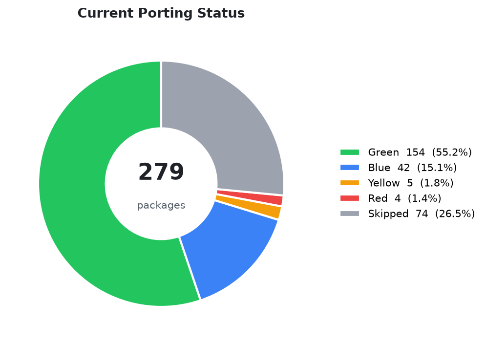
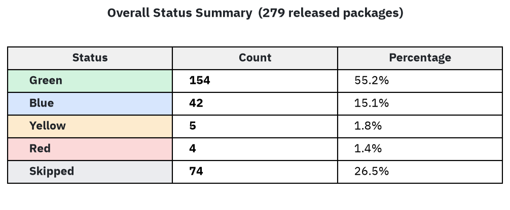
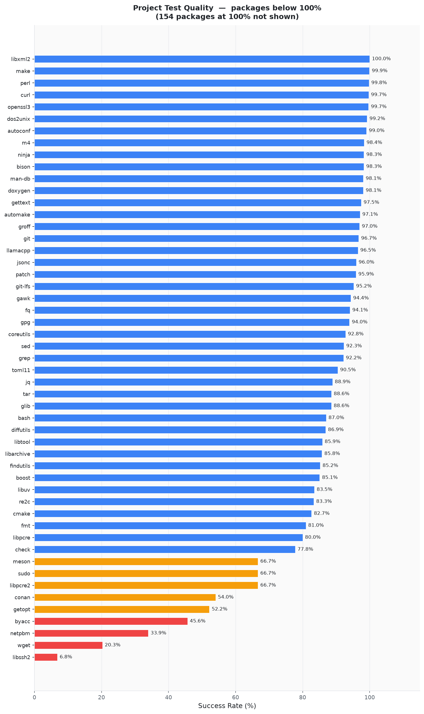

*Last updated: 2026-08-06 11:01:39 UTC*

## Overall Status
* Green: All tests passing
* Blue: Most tests passing (>=75%)
* Yellow: Some tests passing (>=50%)
* Red: Few or no tests passing (<50%)
* Skipped: Skipped or Tests are not enabled

## Overall Status Breakdown

## All Ports — Complete Status List

  

    
Package

    
Status

    
Test Success Rate

    

  

  

    
<strong><a href="https://github.com/zopencommunity/alternativesport" target="_blank" rel="noopener noreferrer">alternativesport</a></strong>

    
&#9632; Green

    
100.0%

    

  

  

    
<strong><a href="https://github.com/zopencommunity/antport" target="_blank" rel="noopener noreferrer">antport</a></strong>

    
&#9632; Skipped

    
Skipped

    

  

  

    
<strong><a href="https://github.com/zopencommunity/aprport" target="_blank" rel="noopener noreferrer">aprport</a></strong>

    
&#9632; Green

    
100.0%

    

  

  

    
<strong><a href="https://github.com/zopencommunity/asioport" target="_blank" rel="noopener noreferrer">asioport</a></strong>

    
&#9632; Green

    
100.0%

    

  

  

    
<strong><a href="https://github.com/zopencommunity/autoconfport" target="_blank" rel="noopener noreferrer">autoconfport</a></strong>

    
&#9632; Blue

    
99.0%

    

  

  

    
<strong><a href="https://github.com/zopencommunity/automakeport" target="_blank" rel="noopener noreferrer">automakeport</a></strong>

    
&#9632; Blue

    
97.1%

    

  

  

    
<strong><a href="https://github.com/zopencommunity/avro-c-libport" target="_blank" rel="noopener noreferrer">avro-c-libport</a></strong>

    
&#9632; Green

    
100.0%

    

  

  

    
<strong><a href="https://github.com/zopencommunity/bash-completionport" target="_blank" rel="noopener noreferrer">bash-completionport</a></strong>

    
&#9632; Green

    
100.0%

    

  

  

    
<strong><a href="https://github.com/zopencommunity/bashport" target="_blank" rel="noopener noreferrer">bashport</a></strong>

    
&#9632; Blue

    
87.0%

    

  

  

    
<strong><a href="https://github.com/zopencommunity/batport" target="_blank" rel="noopener noreferrer">batport</a></strong>

    
&#9632; Skipped

    
Skipped

    

  

  

    
<strong><a href="https://github.com/zopencommunity/bcport" target="_blank" rel="noopener noreferrer">bcport</a></strong>

    
&#9632; Green

    
100.0%

    

  

  

    
<strong><a href="https://github.com/zopencommunity/bisonport" target="_blank" rel="noopener noreferrer">bisonport</a></strong>

    
&#9632; Blue

    
98.3%

    

  

  

    
<strong><a href="https://github.com/zopencommunity/blisport" target="_blank" rel="noopener noreferrer">blisport</a></strong>

    
&#9632; Green

    
100.0%

    

  

  

    
<strong><a href="https://github.com/zopencommunity/boostport" target="_blank" rel="noopener noreferrer">boostport</a></strong>

    
&#9632; Blue

    
85.1%

    

  

  

    
<strong><a href="https://github.com/zopencommunity/botanport" target="_blank" rel="noopener noreferrer">botanport</a></strong>

    
&#9632; Green

    
100.0%

    

  

  

    
<strong><a href="https://github.com/zopencommunity/buildkiteport" target="_blank" rel="noopener noreferrer">buildkiteport</a></strong>

    
&#9632; Skipped

    
Skipped

    

  

  

    
<strong><a href="https://github.com/zopencommunity/bumpport" target="_blank" rel="noopener noreferrer">bumpport</a></strong>

    
&#9632; Green

    
100.0%

    

  

  

    
<strong><a href="https://github.com/zopencommunity/byaccport" target="_blank" rel="noopener noreferrer">byaccport</a></strong>

    
&#9632; Red

    
45.6%

    

  

  

    
<strong><a href="https://github.com/zopencommunity/bzip2port" target="_blank" rel="noopener noreferrer">bzip2port</a></strong>

    
&#9632; Green

    
100.0%

    

  

  

    
<strong><a href="https://github.com/zopencommunity/c3270port" target="_blank" rel="noopener noreferrer">c3270port</a></strong>

    
&#9632; Green

    
100.0%

    

  

  

    
<strong><a href="https://github.com/zopencommunity/caddyport" target="_blank" rel="noopener noreferrer">caddyport</a></strong>

    
&#9632; Skipped

    
Skipped

    

  

  

    
<strong><a href="https://github.com/zopencommunity/cbxpport" target="_blank" rel="noopener noreferrer">cbxpport</a></strong>

    
&#9632; Green

    
100.0%

    

  

  

    
<strong><a href="https://github.com/zopencommunity/ccacheport" target="_blank" rel="noopener noreferrer">ccacheport</a></strong>

    
&#9632; Green

    
100.0%

    

  

  

    
<strong><a href="https://github.com/zopencommunity/check_clangport" target="_blank" rel="noopener noreferrer">check_clangport</a></strong>

    
&#9632; Green

    
100.0%

    

  

  

    
<strong><a href="https://github.com/zopencommunity/check_goport" target="_blank" rel="noopener noreferrer">check_goport</a></strong>

    
&#9632; Green

    
100.0%

    

  

  

    
<strong><a href="https://github.com/zopencommunity/check_javaport" target="_blank" rel="noopener noreferrer">check_javaport</a></strong>

    
&#9632; Green

    
100.0%

    

  

  

    
<strong><a href="https://github.com/zopencommunity/check_podmanport" target="_blank" rel="noopener noreferrer">check_podmanport</a></strong>

    
&#9632; Skipped

    
Skipped

    

  

  

    
<strong><a href="https://github.com/zopencommunity/check_pythonport" target="_blank" rel="noopener noreferrer">check_pythonport</a></strong>

    
&#9632; Green

    
100.0%

    

  

  

    
<strong><a href="https://github.com/zopencommunity/check_xlclangport" target="_blank" rel="noopener noreferrer">check_xlclangport</a></strong>

    
&#9632; Green

    
100.0%

    

  

  

    
<strong><a href="https://github.com/zopencommunity/checkport" target="_blank" rel="noopener noreferrer">checkport</a></strong>

    
&#9632; Blue

    
77.8%

    

  

  

    
<strong><a href="https://github.com/zopencommunity/chezmoiport" target="_blank" rel="noopener noreferrer">chezmoiport</a></strong>

    
&#9632; Skipped

    
Skipped

    

  

  

    
<strong><a href="https://github.com/zopencommunity/cjsonport" target="_blank" rel="noopener noreferrer">cjsonport</a></strong>

    
&#9632; Skipped

    
Skipped

    

  

  

    
<strong><a href="https://github.com/zopencommunity/clang-formatport" target="_blank" rel="noopener noreferrer">clang-formatport</a></strong>

    
&#9632; Green

    
100.0%

    

  

  

    
<strong><a href="https://github.com/zopencommunity/clang-tidyport" target="_blank" rel="noopener noreferrer">clang-tidyport</a></strong>

    
&#9632; Green

    
100.0%

    

  

  

    
<strong><a href="https://github.com/zopencommunity/clang_zos_wrapperport" target="_blank" rel="noopener noreferrer">clang_zos_wrapperport</a></strong>

    
&#9632; Skipped

    
Skipped

    

  

  

    
<strong><a href="https://github.com/zopencommunity/clangdport" target="_blank" rel="noopener noreferrer">clangdport</a></strong>

    
&#9632; Green

    
100.0%

    

  

  

    
<strong><a href="https://github.com/zopencommunity/cmakeport" target="_blank" rel="noopener noreferrer">cmakeport</a></strong>

    
&#9632; Blue

    
82.7%

    

  

  

    
<strong><a href="https://github.com/zopencommunity/conanport" target="_blank" rel="noopener noreferrer">conanport</a></strong>

    
&#9632; Yellow

    
54.0%

    

  

  

    
<strong><a href="https://github.com/zopencommunity/confluent-kafkaport" target="_blank" rel="noopener noreferrer">confluent-kafkaport</a></strong>

    
&#9632; Skipped

    
Skipped

    

  

  

    
<strong><a href="https://github.com/zopencommunity/cookiecutterport" target="_blank" rel="noopener noreferrer">cookiecutterport</a></strong>

    
&#9632; Green

    
100.0%

    

  

  

    
<strong><a href="https://github.com/zopencommunity/coreutilsport" target="_blank" rel="noopener noreferrer">coreutilsport</a></strong>

    
&#9632; Blue

    
92.8%

    

  

  

    
<strong><a href="https://github.com/zopencommunity/cpioport" target="_blank" rel="noopener noreferrer">cpioport</a></strong>

    
&#9632; Skipped

    
Skipped

    

  

  

    
<strong><a href="https://github.com/zopencommunity/cppcheckport" target="_blank" rel="noopener noreferrer">cppcheckport</a></strong>

    
&#9632; Skipped

    
Skipped

    

  

  

    
<strong><a href="https://github.com/zopencommunity/cppunitport" target="_blank" rel="noopener noreferrer">cppunitport</a></strong>

    
&#9632; Green

    
100.0%

    

  

  

    
<strong><a href="https://github.com/zopencommunity/createrepo_cport" target="_blank" rel="noopener noreferrer">createrepo_cport</a></strong>

    
&#9632; Green

    
100.0%

    

  

  

    
<strong><a href="https://github.com/zopencommunity/cronieport" target="_blank" rel="noopener noreferrer">cronieport</a></strong>

    
&#9632; Green

    
100.0%

    

  

  

    
<strong><a href="https://github.com/zopencommunity/crushport" target="_blank" rel="noopener noreferrer">crushport</a></strong>

    
&#9632; Skipped

    
Skipped

    

  

  

    
<strong><a href="https://github.com/zopencommunity/cscopeport" target="_blank" rel="noopener noreferrer">cscopeport</a></strong>

    
&#9632; Green

    
100.0%

    

  

  

    
<strong><a href="https://github.com/zopencommunity/csmithport" target="_blank" rel="noopener noreferrer">csmithport</a></strong>

    
&#9632; Green

    
100.0%

    

  

  

    
<strong><a href="https://github.com/zopencommunity/ctagsport" target="_blank" rel="noopener noreferrer">ctagsport</a></strong>

    
&#9632; Green

    
100.0%

    

  

  

    
<strong><a href="https://github.com/zopencommunity/curlport" target="_blank" rel="noopener noreferrer">curlport</a></strong>

    
&#9632; Blue

    
99.7%

    

  

  

    
<strong><a href="https://github.com/zopencommunity/depot_toolsport" target="_blank" rel="noopener noreferrer">depot_toolsport</a></strong>

    
&#9632; Skipped

    
Skipped

    

  

  

    
<strong><a href="https://github.com/zopencommunity/dialogport" target="_blank" rel="noopener noreferrer">dialogport</a></strong>

    
&#9632; Green

    
100.0%

    

  

  

    
<strong><a href="https://github.com/zopencommunity/diffutilsport" target="_blank" rel="noopener noreferrer">diffutilsport</a></strong>

    
&#9632; Blue

    
86.9%

    

  

  

    
<strong><a href="https://github.com/zopencommunity/direnvport" target="_blank" rel="noopener noreferrer">direnvport</a></strong>

    
&#9632; Green

    
100.0%

    

  

  

    
<strong><a href="https://github.com/zopencommunity/djangoport" target="_blank" rel="noopener noreferrer">djangoport</a></strong>

    
&#9632; Green

    
100.0%

    

  

  

    
<strong><a href="https://github.com/zopencommunity/dnf5port" target="_blank" rel="noopener noreferrer">dnf5port</a></strong>

    
&#9632; Green

    
100.0%

    

  

  

    
<strong><a href="https://github.com/zopencommunity/doom-asciiport" target="_blank" rel="noopener noreferrer">doom-asciiport</a></strong>

    
&#9632; Green

    
100.0%

    

  

  

    
<strong><a href="https://github.com/zopencommunity/dos2unixport" target="_blank" rel="noopener noreferrer">dos2unixport</a></strong>

    
&#9632; Blue

    
99.2%

    

  

  

    
<strong><a href="https://github.com/zopencommunity/doxygenport" target="_blank" rel="noopener noreferrer">doxygenport</a></strong>

    
&#9632; Blue

    
98.1%

    

  

  

    
<strong><a href="https://github.com/zopencommunity/duckdbport" target="_blank" rel="noopener noreferrer">duckdbport</a></strong>

    
&#9632; Green

    
100.0%

    

  

  

    
<strong><a href="https://github.com/zopencommunity/edport" target="_blank" rel="noopener noreferrer">edport</a></strong>

    
&#9632; Green

    
100.0%

    

  

  

    
<strong><a href="https://github.com/zopencommunity/emacsport" target="_blank" rel="noopener noreferrer">emacsport</a></strong>

    
&#9632; Skipped

    
Skipped

    

  

  

    
<strong><a href="https://github.com/zopencommunity/expatport" target="_blank" rel="noopener noreferrer">expatport</a></strong>

    
&#9632; Green

    
100.0%

    

  

  

    
<strong><a href="https://github.com/zopencommunity/expectport" target="_blank" rel="noopener noreferrer">expectport</a></strong>

    
&#9632; Skipped

    
Skipped

    

  

  

    
<strong><a href="https://github.com/zopencommunity/fdport" target="_blank" rel="noopener noreferrer">fdport</a></strong>

    
&#9632; Skipped

    
Skipped

    

  

  

    
<strong><a href="https://github.com/zopencommunity/fileport" target="_blank" rel="noopener noreferrer">fileport</a></strong>

    
&#9632; Green

    
100.0%

    

  

  

    
<strong><a href="https://github.com/zopencommunity/findutilsport" target="_blank" rel="noopener noreferrer">findutilsport</a></strong>

    
&#9632; Blue

    
85.2%

    

  

  

    
<strong><a href="https://github.com/zopencommunity/fishport" target="_blank" rel="noopener noreferrer">fishport</a></strong>

    
&#9632; Skipped

    
Skipped

    

  

  

    
<strong><a href="https://github.com/zopencommunity/flexport" target="_blank" rel="noopener noreferrer">flexport</a></strong>

    
&#9632; Green

    
100.0%

    

  

  

    
<strong><a href="https://github.com/zopencommunity/fmtport" target="_blank" rel="noopener noreferrer">fmtport</a></strong>

    
&#9632; Blue

    
81.0%

    

  

  

    
<strong><a href="https://github.com/zopencommunity/fqport" target="_blank" rel="noopener noreferrer">fqport</a></strong>

    
&#9632; Blue

    
94.1%

    

  

  

    
<strong><a href="https://github.com/zopencommunity/frpport" target="_blank" rel="noopener noreferrer">frpport</a></strong>

    
&#9632; Green

    
100.0%

    

  

  

    
<strong><a href="https://github.com/zopencommunity/fxport" target="_blank" rel="noopener noreferrer">fxport</a></strong>

    
&#9632; Skipped

    
Skipped

    

  

  

    
<strong><a href="https://github.com/zopencommunity/fzfport" target="_blank" rel="noopener noreferrer">fzfport</a></strong>

    
&#9632; Green

    
100.0%

    

  

  

    
<strong><a href="https://github.com/zopencommunity/gawkport" target="_blank" rel="noopener noreferrer">gawkport</a></strong>

    
&#9632; Blue

    
94.4%

    

  

  

    
<strong><a href="https://github.com/zopencommunity/gduport" target="_blank" rel="noopener noreferrer">gduport</a></strong>

    
&#9632; Skipped

    
Skipped

    

  

  

    
<strong><a href="https://github.com/zopencommunity/getoptport" target="_blank" rel="noopener noreferrer">getoptport</a></strong>

    
&#9632; Yellow

    
52.2%

    

  

  

    
<strong><a href="https://github.com/zopencommunity/gettextport" target="_blank" rel="noopener noreferrer">gettextport</a></strong>

    
&#9632; Blue

    
97.5%

    

  

  

    
<strong><a href="https://github.com/zopencommunity/gflagsport" target="_blank" rel="noopener noreferrer">gflagsport</a></strong>

    
&#9632; Green

    
100.0%

    

  

  

    
<strong><a href="https://github.com/zopencommunity/ginport" target="_blank" rel="noopener noreferrer">ginport</a></strong>

    
&#9632; Skipped

    
Skipped

    

  

  

    
<strong><a href="https://github.com/zopencommunity/git-extrasport" target="_blank" rel="noopener noreferrer">git-extrasport</a></strong>

    
&#9632; Skipped

    
Skipped

    

  

  

    
<strong><a href="https://github.com/zopencommunity/git-lfsport" target="_blank" rel="noopener noreferrer">git-lfsport</a></strong>

    
&#9632; Blue

    
95.2%

    

  

  

    
<strong><a href="https://github.com/zopencommunity/git-sizerport" target="_blank" rel="noopener noreferrer">git-sizerport</a></strong>

    
&#9632; Green

    
100.0%

    

  

  

    
<strong><a href="https://github.com/zopencommunity/githubcliport" target="_blank" rel="noopener noreferrer">githubcliport</a></strong>

    
&#9632; Skipped

    
Skipped

    

  

  

    
<strong><a href="https://github.com/zopencommunity/gitlab-runnerport" target="_blank" rel="noopener noreferrer">gitlab-runnerport</a></strong>

    
&#9632; Skipped

    
Skipped

    

  

  

    
<strong><a href="https://github.com/zopencommunity/gitlabcliport" target="_blank" rel="noopener noreferrer">gitlabcliport</a></strong>

    
&#9632; Skipped

    
Skipped

    

  

  

    
<strong><a href="https://github.com/zopencommunity/gitport" target="_blank" rel="noopener noreferrer">gitport</a></strong>

    
&#9632; Blue

    
96.7%

    

  

  

    
<strong><a href="https://github.com/zopencommunity/glibport" target="_blank" rel="noopener noreferrer">glibport</a></strong>

    
&#9632; Blue

    
88.6%

    

  

  

    
<strong><a href="https://github.com/zopencommunity/glowport" target="_blank" rel="noopener noreferrer">glowport</a></strong>

    
&#9632; Skipped

    
Skipped

    

  

  

    
<strong><a href="https://github.com/zopencommunity/gmpport" target="_blank" rel="noopener noreferrer">gmpport</a></strong>

    
&#9632; Green

    
100.0%

    

  

  

    
<strong><a href="https://github.com/zopencommunity/gnport" target="_blank" rel="noopener noreferrer">gnport</a></strong>

    
&#9632; Green

    
100.0%

    

  

  

    
<strong><a href="https://github.com/zopencommunity/gnulibport" target="_blank" rel="noopener noreferrer">gnulibport</a></strong>

    
&#9632; Green

    
100.0%

    

  

  

    
<strong><a href="https://github.com/zopencommunity/godsectport" target="_blank" rel="noopener noreferrer">godsectport</a></strong>

    
&#9632; Skipped

    
Skipped

    

  

  

    
<strong><a href="https://github.com/zopencommunity/gperfport" target="_blank" rel="noopener noreferrer">gperfport</a></strong>

    
&#9632; Green

    
100.0%

    

  

  

    
<strong><a href="https://github.com/zopencommunity/gpgport" target="_blank" rel="noopener noreferrer">gpgport</a></strong>

    
&#9632; Blue

    
94.0%

    

  

  

    
<strong><a href="https://github.com/zopencommunity/gradleport" target="_blank" rel="noopener noreferrer">gradleport</a></strong>

    
&#9632; Skipped

    
Skipped

    

  

  

    
<strong><a href="https://github.com/zopencommunity/grafanaport" target="_blank" rel="noopener noreferrer">grafanaport</a></strong>

    
&#9632; Skipped

    
Skipped

    

  

  

    
<strong><a href="https://github.com/zopencommunity/grepport" target="_blank" rel="noopener noreferrer">grepport</a></strong>

    
&#9632; Blue

    
92.2%

    

  

  

    
<strong><a href="https://github.com/zopencommunity/groffport" target="_blank" rel="noopener noreferrer">groffport</a></strong>

    
&#9632; Blue

    
97.0%

    

  

  

    
<strong><a href="https://github.com/zopencommunity/groovyport" target="_blank" rel="noopener noreferrer">groovyport</a></strong>

    
&#9632; Skipped

    
Skipped

    

  

  

    
<strong><a href="https://github.com/zopencommunity/grpcport" target="_blank" rel="noopener noreferrer">grpcport</a></strong>

    
&#9632; Skipped

    
Skipped

    

  

  

    
<strong><a href="https://github.com/zopencommunity/grypeport" target="_blank" rel="noopener noreferrer">grypeport</a></strong>

    
&#9632; Skipped

    
Skipped

    

  

  

    
<strong><a href="https://github.com/zopencommunity/gumport" target="_blank" rel="noopener noreferrer">gumport</a></strong>

    
&#9632; Skipped

    
Skipped

    

  

  

    
<strong><a href="https://github.com/zopencommunity/gzipport" target="_blank" rel="noopener noreferrer">gzipport</a></strong>

    
&#9632; Green

    
100.0%

    

  

  

    
<strong><a href="https://github.com/zopencommunity/hazelcastport" target="_blank" rel="noopener noreferrer">hazelcastport</a></strong>

    
&#9632; Skipped

    
Skipped

    

  

  

    
<strong><a href="https://github.com/zopencommunity/helloport" target="_blank" rel="noopener noreferrer">helloport</a></strong>

    
&#9632; Green

    
100.0%

    

  

  

    
<strong><a href="https://github.com/zopencommunity/help2manport" target="_blank" rel="noopener noreferrer">help2manport</a></strong>

    
&#9632; Green

    
100.0%

    

  

  

    
<strong><a href="https://github.com/zopencommunity/hexcurseport" target="_blank" rel="noopener noreferrer">hexcurseport</a></strong>

    
&#9632; Green

    
100.0%

    

  

  

    
<strong><a href="https://github.com/zopencommunity/hlasm-language-serverport" target="_blank" rel="noopener noreferrer">hlasm-language-serverport</a></strong>

    
&#9632; Green

    
100.0%

    

  

  

    
<strong><a href="https://github.com/zopencommunity/htopport" target="_blank" rel="noopener noreferrer">htopport</a></strong>

    
&#9632; Skipped

    
Skipped

    

  

  

    
<strong><a href="https://github.com/zopencommunity/hugoport" target="_blank" rel="noopener noreferrer">hugoport</a></strong>

    
&#9632; Skipped

    
Skipped

    

  

  

    
<strong><a href="https://github.com/zopencommunity/janssonport" target="_blank" rel="noopener noreferrer">janssonport</a></strong>

    
&#9632; Green

    
100.0%

    

  

  

    
<strong><a href="https://github.com/zopencommunity/jdport" target="_blank" rel="noopener noreferrer">jdport</a></strong>

    
&#9632; Skipped

    
Skipped

    

  

  

    
<strong><a href="https://github.com/zopencommunity/jemallocport" target="_blank" rel="noopener noreferrer">jemallocport</a></strong>

    
&#9632; Green

    
100.0%

    

  

  

    
<strong><a href="https://github.com/zopencommunity/jenkinsport" target="_blank" rel="noopener noreferrer">jenkinsport</a></strong>

    
&#9632; Skipped

    
Skipped

    

  

  

    
<strong><a href="https://github.com/zopencommunity/jqport" target="_blank" rel="noopener noreferrer">jqport</a></strong>

    
&#9632; Blue

    
88.9%

    

  

  

    
<strong><a href="https://github.com/zopencommunity/jsoncport" target="_blank" rel="noopener noreferrer">jsoncport</a></strong>

    
&#9632; Blue

    
96.0%

    

  

  

    
<strong><a href="https://github.com/zopencommunity/k6port" target="_blank" rel="noopener noreferrer">k6port</a></strong>

    
&#9632; Green

    
100.0%

    

  

  

    
<strong><a href="https://github.com/zopencommunity/lazygitport" target="_blank" rel="noopener noreferrer">lazygitport</a></strong>

    
&#9632; Skipped

    
Skipped

    

  

  

    
<strong><a href="https://github.com/zopencommunity/lessport" target="_blank" rel="noopener noreferrer">lessport</a></strong>

    
&#9632; Green

    
100.0%

    

  

  

    
<strong><a href="https://github.com/zopencommunity/libarchiveport" target="_blank" rel="noopener noreferrer">libarchiveport</a></strong>

    
&#9632; Blue

    
85.8%

    

  

  

    
<strong><a href="https://github.com/zopencommunity/libassuanport" target="_blank" rel="noopener noreferrer">libassuanport</a></strong>

    
&#9632; Green

    
100.0%

    

  

  

    
<strong><a href="https://github.com/zopencommunity/libbsdport" target="_blank" rel="noopener noreferrer">libbsdport</a></strong>

    
&#9632; Green

    
100.0%

    

  

  

    
<strong><a href="https://github.com/zopencommunity/libdioport" target="_blank" rel="noopener noreferrer">libdioport</a></strong>

    
&#9632; Green

    
100.0%

    

  

  

    
<strong><a href="https://github.com/zopencommunity/libeventport" target="_blank" rel="noopener noreferrer">libeventport</a></strong>

    
&#9632; Green

    
100.0%

    

  

  

    
<strong><a href="https://github.com/zopencommunity/libgcryptport" target="_blank" rel="noopener noreferrer">libgcryptport</a></strong>

    
&#9632; Green

    
100.0%

    

  

  

    
<strong><a href="https://github.com/zopencommunity/libgdbmport" target="_blank" rel="noopener noreferrer">libgdbmport</a></strong>

    
&#9632; Green

    
100.0%

    

  

  

    
<strong><a href="https://github.com/zopencommunity/libgpgerrorport" target="_blank" rel="noopener noreferrer">libgpgerrorport</a></strong>

    
&#9632; Green

    
100.0%

    

  

  

    
<strong><a href="https://github.com/zopencommunity/libgpgmeport" target="_blank" rel="noopener noreferrer">libgpgmeport</a></strong>

    
&#9632; Green

    
100.0%

    

  

  

    
<strong><a href="https://github.com/zopencommunity/libiconvport" target="_blank" rel="noopener noreferrer">libiconvport</a></strong>

    
&#9632; Green

    
100.0%

    

  

  

    
<strong><a href="https://github.com/zopencommunity/libkqueueport" target="_blank" rel="noopener noreferrer">libkqueueport</a></strong>

    
&#9632; Green

    
100.0%

    

  

  

    
<strong><a href="https://github.com/zopencommunity/libksbaport" target="_blank" rel="noopener noreferrer">libksbaport</a></strong>

    
&#9632; Green

    
100.0%

    

  

  

    
<strong><a href="https://github.com/zopencommunity/libmdport" target="_blank" rel="noopener noreferrer">libmdport</a></strong>

    
&#9632; Green

    
100.0%

    

  

  

    
<strong><a href="https://github.com/zopencommunity/liboqsport" target="_blank" rel="noopener noreferrer">liboqsport</a></strong>

    
&#9632; Green

    
100.0%

    

  

  

    
<strong><a href="https://github.com/zopencommunity/libpcre2port" target="_blank" rel="noopener noreferrer">libpcre2port</a></strong>

    
&#9632; Yellow

    
66.7%

    

  

  

    
<strong><a href="https://github.com/zopencommunity/libpcreport" target="_blank" rel="noopener noreferrer">libpcreport</a></strong>

    
&#9632; Blue

    
80.0%

    

  

  

    
<strong><a href="https://github.com/zopencommunity/libpipelineport" target="_blank" rel="noopener noreferrer">libpipelineport</a></strong>

    
&#9632; Green

    
100.0%

    

  

  

    
<strong><a href="https://github.com/zopencommunity/libpkgmanifestport" target="_blank" rel="noopener noreferrer">libpkgmanifestport</a></strong>

    
&#9632; Green

    
100.0%

    

  

  

    
<strong><a href="https://github.com/zopencommunity/libpslport" target="_blank" rel="noopener noreferrer">libpslport</a></strong>

    
&#9632; Green

    
100.0%

    

  

  

    
<strong><a href="https://github.com/zopencommunity/librabbitmqport" target="_blank" rel="noopener noreferrer">librabbitmqport</a></strong>

    
&#9632; Green

    
100.0%

    

  

  

    
<strong><a href="https://github.com/zopencommunity/librdkafkaport" target="_blank" rel="noopener noreferrer">librdkafkaport</a></strong>

    
&#9632; Green

    
100.0%

    

  

  

    
<strong><a href="https://github.com/zopencommunity/librepoport" target="_blank" rel="noopener noreferrer">librepoport</a></strong>

    
&#9632; Green

    
100.0%

    

  

  

    
<strong><a href="https://github.com/zopencommunity/libsasl2port" target="_blank" rel="noopener noreferrer">libsasl2port</a></strong>

    
&#9632; Green

    
100.0%

    

  

  

    
<strong><a href="https://github.com/zopencommunity/libserdesport" target="_blank" rel="noopener noreferrer">libserdesport</a></strong>

    
&#9632; Green

    
100.0%

    

  

  

    
<strong><a href="https://github.com/zopencommunity/libsolvport" target="_blank" rel="noopener noreferrer">libsolvport</a></strong>

    
&#9632; Green

    
100.0%

    

  

  

    
<strong><a href="https://github.com/zopencommunity/libssh2port" target="_blank" rel="noopener noreferrer">libssh2port</a></strong>

    
&#9632; Red

    
6.8%

    

  

  

    
<strong><a href="https://github.com/zopencommunity/libtoolport" target="_blank" rel="noopener noreferrer">libtoolport</a></strong>

    
&#9632; Blue

    
85.9%

    

  

  

    
<strong><a href="https://github.com/zopencommunity/libuvport" target="_blank" rel="noopener noreferrer">libuvport</a></strong>

    
&#9632; Blue

    
83.5%

    

  

  

    
<strong><a href="https://github.com/zopencommunity/libxauport" target="_blank" rel="noopener noreferrer">libxauport</a></strong>

    
&#9632; Green

    
100.0%

    

  

  

    
<strong><a href="https://github.com/zopencommunity/libxml2port" target="_blank" rel="noopener noreferrer">libxml2port</a></strong>

    
&#9632; Blue

    
100.0%

    

  

  

    
<strong><a href="https://github.com/zopencommunity/libxsltport" target="_blank" rel="noopener noreferrer">libxsltport</a></strong>

    
&#9632; Green

    
100.0%

    

  

  

    
<strong><a href="https://github.com/zopencommunity/libyamlport" target="_blank" rel="noopener noreferrer">libyamlport</a></strong>

    
&#9632; Green

    
100.0%

    

  

  

    
<strong><a href="https://github.com/zopencommunity/llamacppport" target="_blank" rel="noopener noreferrer">llamacppport</a></strong>

    
&#9632; Blue

    
96.5%

    

  

  

    
<strong><a href="https://github.com/zopencommunity/logrotateport" target="_blank" rel="noopener noreferrer">logrotateport</a></strong>

    
&#9632; Green

    
100.0%

    

  

  

    
<strong><a href="https://github.com/zopencommunity/lpegport" target="_blank" rel="noopener noreferrer">lpegport</a></strong>

    
&#9632; Green

    
100.0%

    

  

  

    
<strong><a href="https://github.com/zopencommunity/luaport" target="_blank" rel="noopener noreferrer">luaport</a></strong>

    
&#9632; Green

    
100.0%

    

  

  

    
<strong><a href="https://github.com/zopencommunity/luarocksport" target="_blank" rel="noopener noreferrer">luarocksport</a></strong>

    
&#9632; Green

    
100.0%

    

  

  

    
<strong><a href="https://github.com/zopencommunity/luvport" target="_blank" rel="noopener noreferrer">luvport</a></strong>

    
&#9632; Green

    
100.0%

    

  

  

    
<strong><a href="https://github.com/zopencommunity/lynxport" target="_blank" rel="noopener noreferrer">lynxport</a></strong>

    
&#9632; Green

    
100.0%

    

  

  

    
<strong><a href="https://github.com/zopencommunity/lz4port" target="_blank" rel="noopener noreferrer">lz4port</a></strong>

    
&#9632; Green

    
100.0%

    

  

  

    
<strong><a href="https://github.com/zopencommunity/lzipport" target="_blank" rel="noopener noreferrer">lzipport</a></strong>

    
&#9632; Green

    
100.0%

    

  

  

    
<strong><a href="https://github.com/zopencommunity/m4port" target="_blank" rel="noopener noreferrer">m4port</a></strong>

    
&#9632; Blue

    
98.4%

    

  

  

    
<strong><a href="https://github.com/zopencommunity/makeport" target="_blank" rel="noopener noreferrer">makeport</a></strong>

    
&#9632; Blue

    
99.9%

    

  

  

    
<strong><a href="https://github.com/zopencommunity/man-dbport" target="_blank" rel="noopener noreferrer">man-dbport</a></strong>

    
&#9632; Blue

    
98.1%

    

  

  

    
<strong><a href="https://github.com/zopencommunity/mavenport" target="_blank" rel="noopener noreferrer">mavenport</a></strong>

    
&#9632; Skipped

    
Skipped

    

  

  

    
<strong><a href="https://github.com/zopencommunity/mcport" target="_blank" rel="noopener noreferrer">mcport</a></strong>

    
&#9632; Green

    
100.0%

    

  

  

    
<strong><a href="https://github.com/zopencommunity/mesonport" target="_blank" rel="noopener noreferrer">mesonport</a></strong>

    
&#9632; Yellow

    
66.7%

    

  

  

    
<strong><a href="https://github.com/zopencommunity/metaldioport" target="_blank" rel="noopener noreferrer">metaldioport</a></strong>

    
&#9632; Green

    
100.0%

    

  

  

    
<strong><a href="https://github.com/zopencommunity/metaport" target="_blank" rel="noopener noreferrer">metaport</a></strong>

    
&#9632; Green

    
100.0%

    

  

  

    
<strong><a href="https://github.com/zopencommunity/microport" target="_blank" rel="noopener noreferrer">microport</a></strong>

    
&#9632; Skipped

    
Skipped

    

  

  

    
<strong><a href="https://github.com/zopencommunity/mkcertport" target="_blank" rel="noopener noreferrer">mkcertport</a></strong>

    
&#9632; Skipped

    
Skipped

    

  

  

    
<strong><a href="https://github.com/zopencommunity/mmh3port" target="_blank" rel="noopener noreferrer">mmh3port</a></strong>

    
&#9632; Green

    
100.0%

    

  

  

    
<strong><a href="https://github.com/zopencommunity/moreutilsport" target="_blank" rel="noopener noreferrer">moreutilsport</a></strong>

    
&#9632; Skipped

    
Skipped

    

  

  

    
<strong><a href="https://github.com/zopencommunity/mpfrport" target="_blank" rel="noopener noreferrer">mpfrport</a></strong>

    
&#9632; Green

    
100.0%

    

  

  

    
<strong><a href="https://github.com/zopencommunity/multitailport" target="_blank" rel="noopener noreferrer">multitailport</a></strong>

    
&#9632; Green

    
100.0%

    

  

  

    
<strong><a href="https://github.com/zopencommunity/murexport" target="_blank" rel="noopener noreferrer">murexport</a></strong>

    
&#9632; Skipped

    
Skipped

    

  

  

    
<strong><a href="https://github.com/zopencommunity/my_basicport" target="_blank" rel="noopener noreferrer">my_basicport</a></strong>

    
&#9632; Green

    
100.0%

    

  

  

    
<strong><a href="https://github.com/zopencommunity/nanoport" target="_blank" rel="noopener noreferrer">nanoport</a></strong>

    
&#9632; Skipped

    
Skipped

    

  

  

    
<strong><a href="https://github.com/zopencommunity/natsport" target="_blank" rel="noopener noreferrer">natsport</a></strong>

    
&#9632; Skipped

    
Skipped

    

  

  

    
<strong><a href="https://github.com/zopencommunity/ncduport" target="_blank" rel="noopener noreferrer">ncduport</a></strong>

    
&#9632; Skipped

    
Skipped

    

  

  

    
<strong><a href="https://github.com/zopencommunity/ncursesport" target="_blank" rel="noopener noreferrer">ncursesport</a></strong>

    
&#9632; Green

    
100.0%

    

  

  

    
<strong><a href="https://github.com/zopencommunity/neovimport" target="_blank" rel="noopener noreferrer">neovimport</a></strong>

    
&#9632; Green

    
100.0%

    

  

  

    
<strong><a href="https://github.com/zopencommunity/netpbmport" target="_blank" rel="noopener noreferrer">netpbmport</a></strong>

    
&#9632; Red

    
33.9%

    

  

  

    
<strong><a href="https://github.com/zopencommunity/nghttp2port" target="_blank" rel="noopener noreferrer">nghttp2port</a></strong>

    
&#9632; Green

    
100.0%

    

  

  

    
<strong><a href="https://github.com/zopencommunity/nginxport" target="_blank" rel="noopener noreferrer">nginxport</a></strong>

    
&#9632; Green

    
100.0%

    

  

  

    
<strong><a href="https://github.com/zopencommunity/ninjaport" target="_blank" rel="noopener noreferrer">ninjaport</a></strong>

    
&#9632; Blue

    
98.3%

    

  

  

    
<strong><a href="https://github.com/zopencommunity/nnnport" target="_blank" rel="noopener noreferrer">nnnport</a></strong>

    
&#9632; Skipped

    
Skipped

    

  

  

    
<strong><a href="https://github.com/zopencommunity/npthport" target="_blank" rel="noopener noreferrer">npthport</a></strong>

    
&#9632; Green

    
100.0%

    

  

  

    
<strong><a href="https://github.com/zopencommunity/ntbtlsport" target="_blank" rel="noopener noreferrer">ntbtlsport</a></strong>

    
&#9632; Green

    
100.0%

    

  

  

    
<strong><a href="https://github.com/zopencommunity/onigurumaport" target="_blank" rel="noopener noreferrer">onigurumaport</a></strong>

    
&#9632; Green

    
100.0%

    

  

  

    
<strong><a href="https://github.com/zopencommunity/openldapport" target="_blank" rel="noopener noreferrer">openldapport</a></strong>

    
&#9632; Green

    
100.0%

    

  

  

    
<strong><a href="https://github.com/zopencommunity/opensshport" target="_blank" rel="noopener noreferrer">opensshport</a></strong>

    
&#9632; Green

    
100.0%

    

  

  

    
<strong><a href="https://github.com/zopencommunity/openssl3port" target="_blank" rel="noopener noreferrer">openssl3port</a></strong>

    
&#9632; Blue

    
99.7%

    

  

  

    
<strong><a href="https://github.com/zopencommunity/opensslport" target="_blank" rel="noopener noreferrer">opensslport</a></strong>

    
&#9632; Green

    
100.0%

    

  

  

    
<strong><a href="https://github.com/zopencommunity/oqs-providerport" target="_blank" rel="noopener noreferrer">oqs-providerport</a></strong>

    
&#9632; Green

    
100.0%

    

  

  

    
<strong><a href="https://github.com/zopencommunity/osv-scannerport" target="_blank" rel="noopener noreferrer">osv-scannerport</a></strong>

    
&#9632; Skipped

    
Skipped

    

  

  

    
<strong><a href="https://github.com/zopencommunity/p7zipport" target="_blank" rel="noopener noreferrer">p7zipport</a></strong>

    
&#9632; Skipped

    
Skipped

    

  

  

    
<strong><a href="https://github.com/zopencommunity/parse-gotestport" target="_blank" rel="noopener noreferrer">parse-gotestport</a></strong>

    
&#9632; Green

    
100.0%

    

  

  

    
<strong><a href="https://github.com/zopencommunity/patchport" target="_blank" rel="noopener noreferrer">patchport</a></strong>

    
&#9632; Blue

    
95.9%

    

  

  

    
<strong><a href="https://github.com/zopencommunity/perlport" target="_blank" rel="noopener noreferrer">perlport</a></strong>

    
&#9632; Blue

    
99.8%

    

  

  

    
<strong><a href="https://github.com/zopencommunity/phpport" target="_blank" rel="noopener noreferrer">phpport</a></strong>

    
&#9632; Green

    
100.0%

    

  

  

    
<strong><a href="https://github.com/zopencommunity/pinentryport" target="_blank" rel="noopener noreferrer">pinentryport</a></strong>

    
&#9632; Green

    
100.0%

    

  

  

    
<strong><a href="https://github.com/zopencommunity/pkgconfigport" target="_blank" rel="noopener noreferrer">pkgconfigport</a></strong>

    
&#9632; Green

    
100.0%

    

  

  

    
<strong><a href="https://github.com/zopencommunity/poptport" target="_blank" rel="noopener noreferrer">poptport</a></strong>

    
&#9632; Green

    
100.0%

    

  

  

    
<strong><a href="https://github.com/zopencommunity/powerlinegoport" target="_blank" rel="noopener noreferrer">powerlinegoport</a></strong>

    
&#9632; Skipped

    
Skipped

    

  

  

    
<strong><a href="https://github.com/zopencommunity/procpsport" target="_blank" rel="noopener noreferrer">procpsport</a></strong>

    
&#9632; Skipped

    
Skipped

    

  

  

    
<strong><a href="https://github.com/zopencommunity/prometheusport" target="_blank" rel="noopener noreferrer">prometheusport</a></strong>

    
&#9632; Green

    
100.0%

    

  

  

    
<strong><a href="https://github.com/zopencommunity/promptersport" target="_blank" rel="noopener noreferrer">promptersport</a></strong>

    
&#9632; Skipped

    
Skipped

    

  

  

    
<strong><a href="https://github.com/zopencommunity/protobufport" target="_blank" rel="noopener noreferrer">protobufport</a></strong>

    
&#9632; Green

    
100.0%

    

  

  

    
<strong><a href="https://github.com/zopencommunity/pvport" target="_blank" rel="noopener noreferrer">pvport</a></strong>

    
&#9632; Skipped

    
Skipped

    

  

  

    
<strong><a href="https://github.com/zopencommunity/python-xxhashport" target="_blank" rel="noopener noreferrer">python-xxhashport</a></strong>

    
&#9632; Green

    
100.0%

    

  

  

    
<strong><a href="https://github.com/zopencommunity/quiltport" target="_blank" rel="noopener noreferrer">quiltport</a></strong>

    
&#9632; Green

    
100.0%

    

  

  

    
<strong><a href="https://github.com/zopencommunity/rcloneport" target="_blank" rel="noopener noreferrer">rcloneport</a></strong>

    
&#9632; Skipped

    
Skipped

    

  

  

    
<strong><a href="https://github.com/zopencommunity/re2cport" target="_blank" rel="noopener noreferrer">re2cport</a></strong>

    
&#9632; Blue

    
83.3%

    

  

  

    
<strong><a href="https://github.com/zopencommunity/readlineport" target="_blank" rel="noopener noreferrer">readlineport</a></strong>

    
&#9632; Green

    
100.0%

    

  

  

    
<strong><a href="https://github.com/zopencommunity/redisport" target="_blank" rel="noopener noreferrer">redisport</a></strong>

    
&#9632; Green

    
100.0%

    

  

  

    
<strong><a href="https://github.com/zopencommunity/ripgrepport" target="_blank" rel="noopener noreferrer">ripgrepport</a></strong>

    
&#9632; Skipped

    
Skipped

    

  

  

    
<strong><a href="https://github.com/zopencommunity/rpmport" target="_blank" rel="noopener noreferrer">rpmport</a></strong>

    
&#9632; Green

    
100.0%

    

  

  

    
<strong><a href="https://github.com/zopencommunity/rsyncport" target="_blank" rel="noopener noreferrer">rsyncport</a></strong>

    
&#9632; Green

    
100.0%

    

  

  

    
<strong><a href="https://github.com/zopencommunity/rubyport" target="_blank" rel="noopener noreferrer">rubyport</a></strong>

    
&#9632; Green

    
100.0%

    

  

  

    
<strong><a href="https://github.com/zopencommunity/s5cmdport" target="_blank" rel="noopener noreferrer">s5cmdport</a></strong>

    
&#9632; Skipped

    
Skipped

    

  

  

    
<strong><a href="https://github.com/zopencommunity/sccport" target="_blank" rel="noopener noreferrer">sccport</a></strong>

    
&#9632; Skipped

    
Skipped

    

  

  

    
<strong><a href="https://github.com/zopencommunity/scdocport" target="_blank" rel="noopener noreferrer">scdocport</a></strong>

    
&#9632; Green

    
100.0%

    

  

  

    
<strong><a href="https://github.com/zopencommunity/screenport" target="_blank" rel="noopener noreferrer">screenport</a></strong>

    
&#9632; Skipped

    
Skipped

    

  

  

    
<strong><a href="https://github.com/zopencommunity/sedport" target="_blank" rel="noopener noreferrer">sedport</a></strong>

    
&#9632; Blue

    
92.3%

    

  

  

    
<strong><a href="https://github.com/zopencommunity/shdocport" target="_blank" rel="noopener noreferrer">shdocport</a></strong>

    
&#9632; Green

    
100.0%

    

  

  

    
<strong><a href="https://github.com/zopencommunity/snappy-cport" target="_blank" rel="noopener noreferrer">snappy-cport</a></strong>

    
&#9632; Green

    
100.0%

    

  

  

    
<strong><a href="https://github.com/zopencommunity/spdlogport" target="_blank" rel="noopener noreferrer">spdlogport</a></strong>

    
&#9632; Green

    
100.0%

    

  

  

    
<strong><a href="https://github.com/zopencommunity/sqlite-vecport" target="_blank" rel="noopener noreferrer">sqlite-vecport</a></strong>

    
&#9632; Green

    
100.0%

    

  

  

    
<strong><a href="https://github.com/zopencommunity/sqliteport" target="_blank" rel="noopener noreferrer">sqliteport</a></strong>

    
&#9632; Green

    
100.0%

    

  

  

    
<strong><a href="https://github.com/zopencommunity/sshpassport" target="_blank" rel="noopener noreferrer">sshpassport</a></strong>

    
&#9632; Skipped

    
Skipped

    

  

  

    
<strong><a href="https://github.com/zopencommunity/stowport" target="_blank" rel="noopener noreferrer">stowport</a></strong>

    
&#9632; Green

    
100.0%

    

  

  

    
<strong><a href="https://github.com/zopencommunity/sudoport" target="_blank" rel="noopener noreferrer">sudoport</a></strong>

    
&#9632; Yellow

    
66.7%

    

  

  

    
<strong><a href="https://github.com/zopencommunity/syftport" target="_blank" rel="noopener noreferrer">syftport</a></strong>

    
&#9632; Skipped

    
Skipped

    

  

  

    
<strong><a href="https://github.com/zopencommunity/tarport" target="_blank" rel="noopener noreferrer">tarport</a></strong>

    
&#9632; Blue

    
88.6%

    

  

  

    
<strong><a href="https://github.com/zopencommunity/tclport" target="_blank" rel="noopener noreferrer">tclport</a></strong>

    
&#9632; Skipped

    
Skipped

    

  

  

    
<strong><a href="https://github.com/zopencommunity/tcltlsport" target="_blank" rel="noopener noreferrer">tcltlsport</a></strong>

    
&#9632; Green

    
100.0%

    

  

  

    
<strong><a href="https://github.com/zopencommunity/terraformport" target="_blank" rel="noopener noreferrer">terraformport</a></strong>

    
&#9632; Skipped

    
Skipped

    

  

  

    
<strong><a href="https://github.com/zopencommunity/texinfoport" target="_blank" rel="noopener noreferrer">texinfoport</a></strong>

    
&#9632; Skipped

    
Skipped

    

  

  

    
<strong><a href="https://github.com/zopencommunity/thesilversearcherport" target="_blank" rel="noopener noreferrer">thesilversearcherport</a></strong>

    
&#9632; Skipped

    
Skipped

    

  

  

    
<strong><a href="https://github.com/zopencommunity/thriftport" target="_blank" rel="noopener noreferrer">thriftport</a></strong>

    
&#9632; Green

    
100.0%

    

  

  

    
<strong><a href="https://github.com/zopencommunity/tigport" target="_blank" rel="noopener noreferrer">tigport</a></strong>

    
&#9632; Skipped

    
Skipped

    

  

  

    
<strong><a href="https://github.com/zopencommunity/tmuxport" target="_blank" rel="noopener noreferrer">tmuxport</a></strong>

    
&#9632; Green

    
100.0%

    

  

  

    
<strong><a href="https://github.com/zopencommunity/toml11port" target="_blank" rel="noopener noreferrer">toml11port</a></strong>

    
&#9632; Blue

    
90.5%

    

  

  

    
<strong><a href="https://github.com/zopencommunity/treeport" target="_blank" rel="noopener noreferrer">treeport</a></strong>

    
&#9632; Skipped

    
Skipped

    

  

  

    
<strong><a href="https://github.com/zopencommunity/trivyport" target="_blank" rel="noopener noreferrer">trivyport</a></strong>

    
&#9632; Skipped

    
Skipped

    

  

  

    
<strong><a href="https://github.com/zopencommunity/ttypeport" target="_blank" rel="noopener noreferrer">ttypeport</a></strong>

    
&#9632; Skipped

    
Skipped

    

  

  

    
<strong><a href="https://github.com/zopencommunity/unzipport" target="_blank" rel="noopener noreferrer">unzipport</a></strong>

    
&#9632; Green

    
100.0%

    

  

  

    
<strong><a href="https://github.com/zopencommunity/util-linuxport" target="_blank" rel="noopener noreferrer">util-linuxport</a></strong>

    
&#9632; Skipped

    
Skipped

    

  

  

    
<strong><a href="https://github.com/zopencommunity/util-macrosport" target="_blank" rel="noopener noreferrer">util-macrosport</a></strong>

    
&#9632; Green

    
100.0%

    

  

  

    
<strong><a href="https://github.com/zopencommunity/uucpport" target="_blank" rel="noopener noreferrer">uucpport</a></strong>

    
&#9632; Green

    
100.0%

    

  

  

    
<strong><a href="https://github.com/zopencommunity/victoriametricsport" target="_blank" rel="noopener noreferrer">victoriametricsport</a></strong>

    
&#9632; Skipped

    
Skipped

    

  

  

    
<strong><a href="https://github.com/zopencommunity/vimport" target="_blank" rel="noopener noreferrer">vimport</a></strong>

    
&#9632; Skipped

    
Skipped

    

  

  

    
<strong><a href="https://github.com/zopencommunity/wgetport" target="_blank" rel="noopener noreferrer">wgetport</a></strong>

    
&#9632; Red

    
20.3%

    

  

  

    
<strong><a href="https://github.com/zopencommunity/wharfport" target="_blank" rel="noopener noreferrer">wharfport</a></strong>

    
&#9632; Green

    
100.0%

    

  

  

    
<strong><a href="https://github.com/zopencommunity/whichport" target="_blank" rel="noopener noreferrer">whichport</a></strong>

    
&#9632; Green

    
100.0%

    

  

  

    
<strong><a href="https://github.com/zopencommunity/xcb-protoport" target="_blank" rel="noopener noreferrer">xcb-protoport</a></strong>

    
&#9632; Green

    
100.0%

    

  

  

    
<strong><a href="https://github.com/zopencommunity/xmltoport" target="_blank" rel="noopener noreferrer">xmltoport</a></strong>

    
&#9632; Green

    
100.0%

    

  

  

    
<strong><a href="https://github.com/zopencommunity/xorgprotoport" target="_blank" rel="noopener noreferrer">xorgprotoport</a></strong>

    
&#9632; Green

    
100.0%

    

  

  

    
<strong><a href="https://github.com/zopencommunity/xtransport" target="_blank" rel="noopener noreferrer">xtransport</a></strong>

    
&#9632; Green

    
100.0%

    

  

  

    
<strong><a href="https://github.com/zopencommunity/xxhashport" target="_blank" rel="noopener noreferrer">xxhashport</a></strong>

    
&#9632; Green

    
100.0%

    

  

  

    
<strong><a href="https://github.com/zopencommunity/xzport" target="_blank" rel="noopener noreferrer">xzport</a></strong>

    
&#9632; Green

    
100.0%

    

  

  

    
<strong><a href="https://github.com/zopencommunity/yamlcppport" target="_blank" rel="noopener noreferrer">yamlcppport</a></strong>

    
&#9632; Green

    
100.0%

    

  

  

    
<strong><a href="https://github.com/zopencommunity/yqport" target="_blank" rel="noopener noreferrer">yqport</a></strong>

    
&#9632; Green

    
100.0%

    

  

  

    
<strong><a href="https://github.com/zopencommunity/z-vector-searchport" target="_blank" rel="noopener noreferrer">z-vector-searchport</a></strong>

    
&#9632; Green

    
100.0%

    

  

  

    
<strong><a href="https://github.com/zopencommunity/z3port" target="_blank" rel="noopener noreferrer">z3port</a></strong>

    
&#9632; Skipped

    
Skipped

    

  

  

    
<strong><a href="https://github.com/zopencommunity/zedc_asciiport" target="_blank" rel="noopener noreferrer">zedc_asciiport</a></strong>

    
&#9632; Green

    
100.0%

    

  

  

    
<strong><a href="https://github.com/zopencommunity/zigiport" target="_blank" rel="noopener noreferrer">zigiport</a></strong>

    
&#9632; Skipped

    
Skipped

    

  

  

    
<strong><a href="https://github.com/zopencommunity/zipport" target="_blank" rel="noopener noreferrer">zipport</a></strong>

    
&#9632; Green

    
100.0%

    

  

  

    
<strong><a href="https://github.com/zopencommunity/zlib-ngport" target="_blank" rel="noopener noreferrer">zlib-ngport</a></strong>

    
&#9632; Green

    
100.0%

    

  

  

    
<strong><a href="https://github.com/zopencommunity/zlibport" target="_blank" rel="noopener noreferrer">zlibport</a></strong>

    
&#9632; Green

    
100.0%

    

  

  

    
<strong><a href="https://github.com/zopencommunity/zos-code-page-toolsport" target="_blank" rel="noopener noreferrer">zos-code-page-toolsport</a></strong>

    
&#9632; Green

    
100.0%

    

  

  

    
<strong><a href="https://github.com/zopencommunity/zoslibport" target="_blank" rel="noopener noreferrer">zoslibport</a></strong>

    
&#9632; Green

    
100.0%

    

  

  

    
<strong><a href="https://github.com/zopencommunity/zosncport" target="_blank" rel="noopener noreferrer">zosncport</a></strong>

    
&#9632; Green

    
100.0%

    

  

  

    
<strong><a href="https://github.com/zopencommunity/zospstreeport" target="_blank" rel="noopener noreferrer">zospstreeport</a></strong>

    
&#9632; Green

    
100.0%

    

  

  

    
<strong><a href="https://github.com/zopencommunity/zotsampleport" target="_blank" rel="noopener noreferrer">zotsampleport</a></strong>

    
&#9632; Green

    
100.0%

    

  

  

    
<strong><a href="https://github.com/zopencommunity/zstdport" target="_blank" rel="noopener noreferrer">zstdport</a></strong>

    
&#9632; Green

    
100.0%

    

  

  

    
<strong><a href="https://github.com/zopencommunity/zusageport" target="_blank" rel="noopener noreferrer">zusageport</a></strong>

    
&#9632; Skipped

    
Skipped

    

  

## Projects with skipped or no tests (or no releases resulting in skipped status)
* [antport](https://github.com/zopencommunity/antport) - Tests skipped or not enabled
* [batport](https://github.com/zopencommunity/batport) - Tests skipped or not enabled
* [buildkiteport](https://github.com/zopencommunity/buildkiteport) - Tests skipped or not enabled
* [caddyport](https://github.com/zopencommunity/caddyport) - Tests skipped or not enabled
* [check_podmanport](https://github.com/zopencommunity/check_podmanport) - Tests skipped or not enabled
* [chezmoiport](https://github.com/zopencommunity/chezmoiport) - Tests skipped or not enabled
* [cjsonport](https://github.com/zopencommunity/cjsonport) - Tests skipped or not enabled
* [clang_zos_wrapperport](https://github.com/zopencommunity/clang_zos_wrapperport) - Tests skipped or not enabled
* [confluent-kafkaport](https://github.com/zopencommunity/confluent-kafkaport) - Tests skipped or not enabled
* [cpioport](https://github.com/zopencommunity/cpioport) - Tests skipped or not enabled
* [cppcheckport](https://github.com/zopencommunity/cppcheckport) - Tests skipped or not enabled
* [crushport](https://github.com/zopencommunity/crushport) - Tests skipped or not enabled
* [depot_toolsport](https://github.com/zopencommunity/depot_toolsport) - Tests skipped or not enabled
* [emacsport](https://github.com/zopencommunity/emacsport) - Tests skipped or not enabled
* [expectport](https://github.com/zopencommunity/expectport) - Tests skipped or not enabled
* [fdport](https://github.com/zopencommunity/fdport) - Tests skipped or not enabled
* [fishport](https://github.com/zopencommunity/fishport) - Tests skipped or not enabled
* [fxport](https://github.com/zopencommunity/fxport) - Tests skipped or not enabled
* [gduport](https://github.com/zopencommunity/gduport) - Tests skipped or not enabled
* [ginport](https://github.com/zopencommunity/ginport) - Tests skipped or not enabled
* [git-extrasport](https://github.com/zopencommunity/git-extrasport) - Tests skipped or not enabled
* [githubcliport](https://github.com/zopencommunity/githubcliport) - Tests skipped or not enabled
* [gitlab-runnerport](https://github.com/zopencommunity/gitlab-runnerport) - Tests skipped or not enabled
* [gitlabcliport](https://github.com/zopencommunity/gitlabcliport) - Tests skipped or not enabled
* [glowport](https://github.com/zopencommunity/glowport) - Tests skipped or not enabled
* [godsectport](https://github.com/zopencommunity/godsectport) - Tests skipped or not enabled
* [gradleport](https://github.com/zopencommunity/gradleport) - Tests skipped or not enabled
* [grafanaport](https://github.com/zopencommunity/grafanaport) - Tests skipped or not enabled
* [groovyport](https://github.com/zopencommunity/groovyport) - Tests skipped or not enabled
* [grpcport](https://github.com/zopencommunity/grpcport) - Tests skipped or not enabled
* [grypeport](https://github.com/zopencommunity/grypeport) - Tests skipped or not enabled
* [gumport](https://github.com/zopencommunity/gumport) - Tests skipped or not enabled
* [hazelcastport](https://github.com/zopencommunity/hazelcastport) - Tests skipped or not enabled
* [htopport](https://github.com/zopencommunity/htopport) - Tests skipped or not enabled
* [hugoport](https://github.com/zopencommunity/hugoport) - Tests skipped or not enabled
* [jdport](https://github.com/zopencommunity/jdport) - Tests skipped or not enabled
* [jenkinsport](https://github.com/zopencommunity/jenkinsport) - Tests skipped or not enabled
* [lazygitport](https://github.com/zopencommunity/lazygitport) - Tests skipped or not enabled
* [mavenport](https://github.com/zopencommunity/mavenport) - Tests skipped or not enabled
* [microport](https://github.com/zopencommunity/microport) - Tests skipped or not enabled
* [mkcertport](https://github.com/zopencommunity/mkcertport) - Tests skipped or not enabled
* [moreutilsport](https://github.com/zopencommunity/moreutilsport) - Tests skipped or not enabled
* [murexport](https://github.com/zopencommunity/murexport) - Tests skipped or not enabled
* [nanoport](https://github.com/zopencommunity/nanoport) - Tests skipped or not enabled
* [natsport](https://github.com/zopencommunity/natsport) - Tests skipped or not enabled
* [ncduport](https://github.com/zopencommunity/ncduport) - Tests skipped or not enabled
* [nnnport](https://github.com/zopencommunity/nnnport) - Tests skipped or not enabled
* [osv-scannerport](https://github.com/zopencommunity/osv-scannerport) - Tests skipped or not enabled
* [p7zipport](https://github.com/zopencommunity/p7zipport) - Tests skipped or not enabled
* [powerlinegoport](https://github.com/zopencommunity/powerlinegoport) - Tests skipped or not enabled
* [procpsport](https://github.com/zopencommunity/procpsport) - Tests skipped or not enabled
* [promptersport](https://github.com/zopencommunity/promptersport) - Tests skipped or not enabled
* [pvport](https://github.com/zopencommunity/pvport) - Tests skipped or not enabled
* [rcloneport](https://github.com/zopencommunity/rcloneport) - Tests skipped or not enabled
* [ripgrepport](https://github.com/zopencommunity/ripgrepport) - Tests skipped or not enabled
* [s5cmdport](https://github.com/zopencommunity/s5cmdport) - Tests skipped or not enabled
* [sccport](https://github.com/zopencommunity/sccport) - Tests skipped or not enabled
* [screenport](https://github.com/zopencommunity/screenport) - Tests skipped or not enabled
* [sshpassport](https://github.com/zopencommunity/sshpassport) - Tests skipped or not enabled
* [syftport](https://github.com/zopencommunity/syftport) - Tests skipped or not enabled
* [tclport](https://github.com/zopencommunity/tclport) - Tests skipped or not enabled
* [terraformport](https://github.com/zopencommunity/terraformport) - Tests skipped or not enabled
* [texinfoport](https://github.com/zopencommunity/texinfoport) - Tests skipped or not enabled
* [thesilversearcherport](https://github.com/zopencommunity/thesilversearcherport) - Tests skipped or not enabled
* [tigport](https://github.com/zopencommunity/tigport) - Tests skipped or not enabled
* [treeport](https://github.com/zopencommunity/treeport) - Tests skipped or not enabled
* [trivyport](https://github.com/zopencommunity/trivyport) - Tests skipped or not enabled
* [ttypeport](https://github.com/zopencommunity/ttypeport) - Tests skipped or not enabled
* [util-linuxport](https://github.com/zopencommunity/util-linuxport) - Tests skipped or not enabled
* [victoriametricsport](https://github.com/zopencommunity/victoriametricsport) - Tests skipped or not enabled
* [vimport](https://github.com/zopencommunity/vimport) - Tests skipped or not enabled
* [z3port](https://github.com/zopencommunity/z3port) - Tests skipped or not enabled
* [zigiport](https://github.com/zopencommunity/zigiport) - Tests skipped or not enabled
* [zusageport](https://github.com/zopencommunity/zusageport) - Tests skipped or not enabled

Last updated:  2026-08-06 11:01:39 UTC
