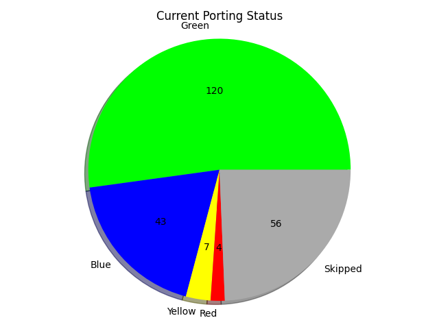

## Overall Status
* Green</a>: All tests passing
* Blue</a>: Most tests passing
* Yellow</a>: Some tests passing
* Red</a>: No tests passing
* Grey</a>: Skipped or Tests are not enabled

## Breakdown of Status

## Projects with skipped or no tests (grey)
  
* [expectport](https://github.com/ZOSOpenTools/expectport)
* [githubcliport](https://github.com/ZOSOpenTools/githubcliport)
* [gumport](https://github.com/ZOSOpenTools/gumport)
* [llamacppport](https://github.com/ZOSOpenTools/llamacppport)
* [moreutilsport](https://github.com/ZOSOpenTools/moreutilsport)
* [nanoport](https://github.com/ZOSOpenTools/nanoport)
* [ncduport](https://github.com/ZOSOpenTools/ncduport)
* [powerlinegoport](https://github.com/ZOSOpenTools/powerlinegoport)
* [screenport](https://github.com/ZOSOpenTools/screenport)
* [sshpassport](https://github.com/ZOSOpenTools/sshpassport)
* [tclport](https://github.com/ZOSOpenTools/tclport)
* [wharfport](https://github.com/ZOSOpenTools/wharfport)
* [yqport](https://github.com/ZOSOpenTools/yqport)
* [zigiport](https://github.com/ZOSOpenTools/zigiport)
## Projects that do not have builds

* [avro-c-libport](https://github.com/ZOSOpenTools/avro-c-libport)
* [depot_toolsport](https://github.com/ZOSOpenTools/depot_toolsport)
* [direnvport](https://github.com/ZOSOpenTools/direnvport)
* [dufport](https://github.com/ZOSOpenTools/dufport)
* [emacsport](https://github.com/ZOSOpenTools/emacsport)
* [esbuildport](https://github.com/ZOSOpenTools/esbuildport)
* [fzfport](https://github.com/ZOSOpenTools/fzfport)
* [gnport](https://github.com/ZOSOpenTools/gnport)
* [htopport](https://github.com/ZOSOpenTools/htopport)
* [janssonport](https://github.com/ZOSOpenTools/janssonport)
* [libbsdport](https://github.com/ZOSOpenTools/libbsdport)
* [libgit2port](https://github.com/ZOSOpenTools/libgit2port)
* [libserdesport](https://github.com/ZOSOpenTools/libserdesport)
* [multitailport](https://github.com/ZOSOpenTools/multitailport)
* [natsport](https://github.com/ZOSOpenTools/natsport)
* [neovimport](https://github.com/ZOSOpenTools/neovimport)
* [nginxport](https://github.com/ZOSOpenTools/nginxport)
* [redisport](https://github.com/ZOSOpenTools/redisport)
* [shdocport](https://github.com/ZOSOpenTools/shdocport)
* [shufport](https://github.com/ZOSOpenTools/shufport)
* [termenvport](https://github.com/ZOSOpenTools/termenvport)
* [terraformport](https://github.com/ZOSOpenTools/terraformport)
* [thesilversearcherport](https://github.com/ZOSOpenTools/thesilversearcherport)
* [treeport](https://github.com/ZOSOpenTools/treeport)
* [v8port](https://github.com/ZOSOpenTools/v8port)

## Projects with the most dependencies

| Package | # of Dependent Projects | Test Success Rate | Dependent projects
|---|---|---|--|
| [makeport](https://github.com/ZOSOpenTools/makeport) | 107 | 100% |autoconf, automake, avro-c-lib, bash, bison, byacc, bzip2, c3270, cmake, coreutils, cscope, ctags, curl, diffutils, direnv, duckdb, expat, expect, findutils, flex, fzf, gawk, getopt, gettext, githubcli, git, gn, gnulib, gperf, gpg, grep, groff, gzip, hello, help2man, htop, jansson, jq, less, libassuan, libgcrypt, libgdbm, libgpgerror, libiconv, libksba, libmd, libpcre2, libpcre, libpipeline, librdkafka, libssh2, libtool, libuv, libxml2, libxslt, llamacpp, lua, luarocks, lynx, lz4, m4, make, man-db, meta, moreutils, multitail, nano, ncdu, ncurses, neovim, ninja, npth, ntbtls, oniguruma, openssh, openssl, patch, perl, php, pinentry, pkgconfig, protobuf, re2c, rsync, screen, sed, sqlite, sshpass, sudo, tar, tcl, texinfo, thesilversearcher, tig, unzip, vim, wget, which, xmlto, xxhash, xz, zip, zlib, zos-code-page-tools, zoslib, zotsample, zstd
| [zoslibport](https://github.com/ZOSOpenTools/zoslibport) | 92 | 100% |avro-c-lib, bash, bison, byacc, bzip2, c3270, cmake, coreutils, cscope, ctags, curl, diffutils, duckdb, expat, expect, findutils, flex, gawk, getopt, gettext, git, gn, gnulib, gperf, gpg, grep, groff, gzip, hello, htop, jansson, jq, less, libassuan, libgcrypt, libgdbm, libgpgerror, libksba, libmd, libpcre2, libpcre, libpipeline, librdkafka, libssh2, libtool, libuv, libxml2, libxslt, llamacpp, lua, lynx, m4, make, man-db, meta, moreutils, multitail, nano, ncdu, ncurses, ninja, npth, ntbtls, oniguruma, openssh, openssl, patch, perl, php, pinentry, pkgconfig, protobuf, re2c, rsync, screen, sed, sqlite, sshpass, sudo, tar, tcl, texinfo, thesilversearcher, tig, unzip, vim, wget, xmlto, xz, zip, zlib, zstd
| [curlport](https://github.com/ZOSOpenTools/curlport) | 61 | 99% |autoconf, automake, avro-c-lib, bash, bison, bzip2, c3270, coreutils, cscope, curl, diffutils, expat, findutils, gawk, gettext, git, gn, gnulib, gperf, gpg, grep, groff, gzip, hello, help2man, jq, less, libassuan, libgcrypt, libgpgerror, libksba, libpipeline, librdkafka, libtool, luarocks, lz4, m4, make, man-db, meta, ncdu, ncurses, neovim, npth, ntbtls, oniguruma, openssl, patch, php, pinentry, rsync, screen, sed, tar, tcl, texinfo, wget, which, xxhash, xz, zstd
| [coreutilsport](https://github.com/ZOSOpenTools/coreutilsport) | 55 | 79% |automake, avro-c-lib, bash, bison, byacc, c3270, diffutils, direnv, expat, findutils, flex, getopt, gettext, githubcli, git, gnulib, grep, groff, gzip, hello, jansson, jq, libgdbm, libiconv, libmd, libpcre2, libpcre, librdkafka, libtool, libxml2, lua, luarocks, lz4, man-db, meta, moreutils, ncurses, ntbtls, oniguruma, openssh, patch, php, pkgconfig, protobuf, re2c, sed, sudo, texinfo, tig, vim, which, xxhash, zos-code-page-tools, zoslib, zstd
| [gitport](https://github.com/ZOSOpenTools/gitport) | 49 | 96% |autoconf, automake, bison, cmake, ctags, duf, expat, gettext, githubcli, git, gn, gnulib, gzip, hello, help2man, htop, jansson, libgdbm, libmd, libpipeline, librdkafka, libtool, m4, make, man-db, meta, ncdu, ncurses, ninja, openssl, patch, perl, php, re2c, rsync, sqlite, sshpass, tar, termenv, texinfo, thesilversearcher, tig, unzip, vim, wget, xz, zigi, zip, zoslib
| [gzipport](https://github.com/ZOSOpenTools/gzipport) | 47 | 77% |autoconf, automake, bash, bison, bzip2, coreutils, cscope, ctags, curl, findutils, flex, gawk, gettext, git, gn, gperf, hello, htop, jq, less, libtool, lz4, m4, make, man-db, meta, ncdu, ncurses, oniguruma, openssh, openssl, patch, php, rsync, screen, sed, sqlite, sshpass, tar, tcl, texinfo, thesilversearcher, wget, which, xxhash, xz, zstd
| [m4port](https://github.com/ZOSOpenTools/m4port) | 47 | 98% |autoconf, automake, bash, bison, coreutils, cscope, ctags, curl, expat, flex, gettext, git, gn, gnulib, gpg, groff, gzip, hello, help2man, htop, jansson, libassuan, libgcrypt, libgpgerror, libiconv, libksba, libmd, libtool, m4, make, man-db, npth, ntbtls, oniguruma, openssl, php, pinentry, re2c, rsync, screen, sed, sshpass, tar, texinfo, thesilversearcher, wget, which
| [autoconfport](https://github.com/ZOSOpenTools/autoconfport) | 42 | 98% |autoconf, automake, bash, bison, coreutils, ctags, curl, expat, gettext, git, gnulib, gpg, gzip, hello, help2man, htop, jansson, libassuan, libgcrypt, libgpgerror, libiconv, libksba, libmd, libtool, m4, make, man-db, nano, npth, ntbtls, oniguruma, php, pinentry, re2c, rsync, screen, sed, sshpass, tar, texinfo, thesilversearcher, wget
| [automakeport](https://github.com/ZOSOpenTools/automakeport) | 41 | 71% |autoconf, automake, bison, coreutils, ctags, curl, expat, gettext, git, gnulib, gpg, gzip, hello, help2man, htop, jansson, libassuan, libgcrypt, libgpgerror, libiconv, libksba, libmd, libtool, m4, make, man-db, nano, npth, ntbtls, oniguruma, php, pinentry, re2c, rsync, screen, sed, sshpass, tar, texinfo, thesilversearcher, wget
| [perlport](https://github.com/ZOSOpenTools/perlport) | 41 | 98% |autoconf, automake, bash, bison, coreutils, curl, expat, gettext, git, gnulib, gpg, groff, gzip, hello, help2man, htop, jansson, libassuan, libgcrypt, libgpgerror, libiconv, libksba, libmd, libtool, m4, make, man-db, meta, npth, ntbtls, openssl, php, pinentry, re2c, rsync, screen, sed, tar, texinfo, thesilversearcher, wget
| [tarport](https://github.com/ZOSOpenTools/tarport) | 40 | 92% |automake, bash, bzip2, coreutils, cscope, ctags, curl, findutils, flex, gettext, git, gpg, grep, hello, htop, jansson, jq, less, libassuan, libgcrypt, libgpgerror, libksba, libmd, m4, make, man-db, meta, ncdu, ncurses, npth, ntbtls, oniguruma, openssh, openssl, pinentry, re2c, screen, sqlite, sshpass, thesilversearcher
| [diffutilsport](https://github.com/ZOSOpenTools/diffutilsport) | 30 | 93% |bash, bison, byacc, coreutils, flex, gawk, getopt, git, gnulib, gpg, grep, groff, libassuan, libgcrypt, libgpgerror, libiconv, libksba, libpcre2, libpcre, libxml2, libxslt, man-db, npth, ntbtls, php, pinentry, re2c, texinfo, vim, xmlto
| [sedport](https://github.com/ZOSOpenTools/sedport) | 30 | 84% |bash, byacc, coreutils, git, gpg, groff, jansson, libassuan, libgcrypt, libgpgerror, libiconv, libksba, libmd, librdkafka, libssh2, libxml2, libxslt, m4, man-db, ncurses, npth, ntbtls, openssh, perl, php, pinentry, pkgconfig, re2c, vim, which
| [bashport](https://github.com/ZOSOpenTools/bashport) | 20 | 80% |autoconf, avro-c-lib, bison, diffutils, direnv, expat, flex, git, gn, jansson, libiconv, libmd, librdkafka, libxml2, meta, oniguruma, re2c, texinfo, xmlto, zos-code-page-tools
| [gettextport](https://github.com/ZOSOpenTools/gettextport) | 19 | 87% |coreutils, ctags, expat, getopt, git, gpg, hello, libassuan, libgcrypt, libgpgerror, libiconv, libksba, m4, man-db, nano, npth, ntbtls, pinentry, which
| [ncursesport](https://github.com/ZOSOpenTools/ncursesport) | 17 | 100% |bash, c3270, cscope, gettext, git, gpg, htop, less, lynx, man-db, multitail, nano, ncdu, screen, thesilversearcher, tig, vim
| [texinfoport](https://github.com/ZOSOpenTools/texinfoport) | 16 | 35% |autoconf, automake, bison, expat, gettext, git, gpg, groff, gzip, hello, libtool, m4, make, ntbtls, sed, tar
| [xzport](https://github.com/ZOSOpenTools/xzport) | 16 | 77% |autoconf, automake, bison, diffutils, expat, findutils, gettext, git, gzip, help2man, libtool, m4, make, man-db, texinfo, thesilversearcher
| [grepport](https://github.com/ZOSOpenTools/grepport) | 13 | 92% |bash, byacc, gnulib, libpcre2, libpcre, librdkafka, libxslt, m4, man-db, meta, ntbtls, which, xmlto
| [libtoolport](https://github.com/ZOSOpenTools/libtoolport) | 13 | 81% |curl, expat, hello, jansson, libgdbm, libmd, libpcre, m4, man-db, oniguruma, php, re2c, texinfo
| [zlibport](https://github.com/ZOSOpenTools/zlibport) | 13 | 100% |autoconf, avro-c-lib, curl, expat, git, gpg, librdkafka, libssh2, lynx, openssh, sudo, tig, wget
| [help2manport](https://github.com/ZOSOpenTools/help2manport) | 12 | 100% |autoconf, automake, bison, expat, gettext, git, hello, libtool, m4, make, meta, texinfo
| [cmakeport](https://github.com/ZOSOpenTools/cmakeport) | 11 | 83% |avro-c-lib, cmake, duckdb, libuv, llamacpp, neovim, ninja, protobuf, unzip, zip, zoslib
| [opensslport](https://github.com/ZOSOpenTools/opensslport) | 11 | 96% |c3270, curl, expat, git, librdkafka, libssh2, lynx, openssh, rsync, sudo, wget
| [comp_goport](https://github.com/ZOSOpenTools/comp_goport) | 9 | 100% |bump, direnv, duf, githubcli, gum, powerlinego, termenv, wharf, yq
| [bzip2port](https://github.com/ZOSOpenTools/bzip2port) | 8 | 100% |gpg, libassuan, libgcrypt, libgpgerror, libksba, npth, ntbtls, pinentry
| [findutilsport](https://github.com/ZOSOpenTools/findutilsport) | 8 | 91% |gnulib, grep, libiconv, libxml2, pkgconfig, re2c, texinfo, vim
| [gawkport](https://github.com/ZOSOpenTools/gawkport) | 8 | 93% |automake, curl, expat, gzip, ncurses, rsync, sudo, vim
| [libgpgerrorport](https://github.com/ZOSOpenTools/libgpgerrorport) | 7 | 100% |gpg, libassuan, libgcrypt, libksba, npth, ntbtls, pinentry
| [pythonport](https://github.com/ZOSOpenTools/pythonport) | 6 | 100% |curl, depot_tools, libxml2, lz4, rsync, zstd
| [flexport](https://github.com/ZOSOpenTools/flexport) | 5 | 100% |autoconf, bison, cscope, man-db, xmlto
| [libiconvport](https://github.com/ZOSOpenTools/libiconvport) | 5 | 100% |bison, libxml2, man-db, php, tig
| [comp_clangport](https://github.com/ZOSOpenTools/comp_clangport) | 4 | 100% |duckdb, m4, zos-code-page-tools, zotsample
| [getoptport](https://github.com/ZOSOpenTools/getoptport) | 4 | 52% |avro-c-lib, flex, moreutils, xmlto
| [pkgconfigport](https://github.com/ZOSOpenTools/pkgconfigport) | 4 | 100% |avro-c-lib, librdkafka, man-db, thesilversearcher
| [wharfport](https://github.com/ZOSOpenTools/wharfport) | 4 | Skipped |duf, githubcli, gum, termenv
| [gperfport](https://github.com/ZOSOpenTools/gperfport) | 3 | 100% |hello, libiconv, m4
| [groffport](https://github.com/ZOSOpenTools/groffport) | 3 | 100% |libiconv, man-db, meta
| [wgetport](https://github.com/ZOSOpenTools/wgetport) | 3 | 18% |hello, man-db, sed
| [zipport](https://github.com/ZOSOpenTools/zipport) | 3 | 100% |gpg, luarocks, unzip
| [bisonport](https://github.com/ZOSOpenTools/bisonport) | 2 | 99% |bash, php
| [gnulibport](https://github.com/ZOSOpenTools/gnulibport) | 2 | 100% |htop, thesilversearcher
| [lessport](https://github.com/ZOSOpenTools/lessport) | 2 | 100% |git, man-db
| [libassuanport](https://github.com/ZOSOpenTools/libassuanport) | 2 | 100% |gpg, pinentry
| [libgcryptport](https://github.com/ZOSOpenTools/libgcryptport) | 2 | 100% |gpg, ntbtls
| [libksbaport](https://github.com/ZOSOpenTools/libksbaport) | 2 | 100% |gpg, ntbtls
| [libxml2port](https://github.com/ZOSOpenTools/libxml2port) | 2 | 99% |libxslt, php
| [luaport](https://github.com/ZOSOpenTools/luaport) | 2 | 100% |luarocks, neovim
| [lz4port](https://github.com/ZOSOpenTools/lz4port) | 2 | 100% |librdkafka, rsync
| [rsyncport](https://github.com/ZOSOpenTools/rsyncport) | 2 | 97% |m4, sed
| [tclport](https://github.com/ZOSOpenTools/tclport) | 2 | Skipped |expect, sqlite
| [zstdport](https://github.com/ZOSOpenTools/zstdport) | 2 | 100% |librdkafka, rsync
| [c3270port](https://github.com/ZOSOpenTools/c3270port) | 1 | 100% |zigi
| [ctagsport](https://github.com/ZOSOpenTools/ctagsport) | 1 | 100% |libmd
| [expatport](https://github.com/ZOSOpenTools/expatport) | 1 | 100% |git
| [janssonport](https://github.com/ZOSOpenTools/janssonport) | 1 | No builds |avro-c-lib
| [libgdbmport](https://github.com/ZOSOpenTools/libgdbmport) | 1 | 100% |man-db
| [libpcre2port](https://github.com/ZOSOpenTools/libpcre2port) | 1 | 66% |git
| [libpcreport](https://github.com/ZOSOpenTools/libpcreport) | 1 | 80% |thesilversearcher
| [libpipelineport](https://github.com/ZOSOpenTools/libpipelineport) | 1 | 100% |man-db
| [moreutilsport](https://github.com/ZOSOpenTools/moreutilsport) | 1 | Skipped |zos-code-page-tools
| [ninjaport](https://github.com/ZOSOpenTools/ninjaport) | 1 | 98% |duckdb
| [npthport](https://github.com/ZOSOpenTools/npthport) | 1 | 100% |gpg
| [ntbtlsport](https://github.com/ZOSOpenTools/ntbtlsport) | 1 | 100% |gpg
| [onigurumaport](https://github.com/ZOSOpenTools/onigurumaport) | 1 | 100% |jq
| [patchport](https://github.com/ZOSOpenTools/patchport) | 1 | 94% |m4
| [pinentryport](https://github.com/ZOSOpenTools/pinentryport) | 1 | 100% |gpg
| [re2cport](https://github.com/ZOSOpenTools/re2cport) | 1 | 80% |php
| [sqliteport](https://github.com/ZOSOpenTools/sqliteport) | 1 | 100% |php
| [termenvport](https://github.com/ZOSOpenTools/termenvport) | 1 | No builds |duf
| [unzipport](https://github.com/ZOSOpenTools/unzipport) | 1 | 100% |luarocks
| [xxhashport](https://github.com/ZOSOpenTools/xxhashport) | 1 | 100% |rsync
| [avro-c-libport](https://github.com/ZOSOpenTools/avro-c-libport) | 0 | No builds |
| [bumpport](https://github.com/ZOSOpenTools/bumpport) | 0 | 100% |
| [byaccport](https://github.com/ZOSOpenTools/byaccport) | 0 | 45% |
| [comp_xlclangport](https://github.com/ZOSOpenTools/comp_xlclangport) | 0 | 100% |
| [cscopeport](https://github.com/ZOSOpenTools/cscopeport) | 0 | 100% |
| [depot_toolsport](https://github.com/ZOSOpenTools/depot_toolsport) | 0 | No builds |
| [direnvport](https://github.com/ZOSOpenTools/direnvport) | 0 | No builds |
| [duckdbport](https://github.com/ZOSOpenTools/duckdbport) | 0 | 100% |
| [dufport](https://github.com/ZOSOpenTools/dufport) | 0 | No builds |
| [emacsport](https://github.com/ZOSOpenTools/emacsport) | 0 | No builds |
| [esbuildport](https://github.com/ZOSOpenTools/esbuildport) | 0 | No builds |
| [expectport](https://github.com/ZOSOpenTools/expectport) | 0 | Skipped |
| [fzfport](https://github.com/ZOSOpenTools/fzfport) | 0 | No builds |
| [githubcliport](https://github.com/ZOSOpenTools/githubcliport) | 0 | Skipped |
| [gnport](https://github.com/ZOSOpenTools/gnport) | 0 | No builds |
| [gpgport](https://github.com/ZOSOpenTools/gpgport) | 0 | 84% |
| [gumport](https://github.com/ZOSOpenTools/gumport) | 0 | Skipped |
| [helloport](https://github.com/ZOSOpenTools/helloport) | 0 | 100% |
| [htopport](https://github.com/ZOSOpenTools/htopport) | 0 | No builds |
| [jqport](https://github.com/ZOSOpenTools/jqport) | 0 | 71% |
| [libbsdport](https://github.com/ZOSOpenTools/libbsdport) | 0 | No builds |
| [libgit2port](https://github.com/ZOSOpenTools/libgit2port) | 0 | No builds |
| [libmdport](https://github.com/ZOSOpenTools/libmdport) | 0 | 100% |
| [librdkafkaport](https://github.com/ZOSOpenTools/librdkafkaport) | 0 | 100% |
| [libserdesport](https://github.com/ZOSOpenTools/libserdesport) | 0 | No builds |
| [libssh2port](https://github.com/ZOSOpenTools/libssh2port) | 0 | 100% |
| [libuvport](https://github.com/ZOSOpenTools/libuvport) | 0 | 98% |
| [libxsltport](https://github.com/ZOSOpenTools/libxsltport) | 0 | 100% |
| [llamacppport](https://github.com/ZOSOpenTools/llamacppport) | 0 | Skipped |
| [luarocksport](https://github.com/ZOSOpenTools/luarocksport) | 0 | 100% |
| [lynxport](https://github.com/ZOSOpenTools/lynxport) | 0 | 100% |
| [man-dbport](https://github.com/ZOSOpenTools/man-dbport) | 0 | 93% |
| [metaport](https://github.com/ZOSOpenTools/metaport) | 0 | 100% |
| [multitailport](https://github.com/ZOSOpenTools/multitailport) | 0 | No builds |
| [nanoport](https://github.com/ZOSOpenTools/nanoport) | 0 | Skipped |
| [natsport](https://github.com/ZOSOpenTools/natsport) | 0 | No builds |
| [ncduport](https://github.com/ZOSOpenTools/ncduport) | 0 | Skipped |
| [neovimport](https://github.com/ZOSOpenTools/neovimport) | 0 | No builds |
| [nginxport](https://github.com/ZOSOpenTools/nginxport) | 0 | No builds |
| [opensshport](https://github.com/ZOSOpenTools/opensshport) | 0 | 100% |
| [phpport](https://github.com/ZOSOpenTools/phpport) | 0 | 97% |
| [powerlinegoport](https://github.com/ZOSOpenTools/powerlinegoport) | 0 | Skipped |
| [protobufport](https://github.com/ZOSOpenTools/protobufport) | 0 | 100% |
| [redisport](https://github.com/ZOSOpenTools/redisport) | 0 | No builds |
| [screenport](https://github.com/ZOSOpenTools/screenport) | 0 | Skipped |
| [shdocport](https://github.com/ZOSOpenTools/shdocport) | 0 | No builds |
| [shufport](https://github.com/ZOSOpenTools/shufport) | 0 | No builds |
| [sshpassport](https://github.com/ZOSOpenTools/sshpassport) | 0 | Skipped |
| [sudoport](https://github.com/ZOSOpenTools/sudoport) | 0 | 91% |
| [terraformport](https://github.com/ZOSOpenTools/terraformport) | 0 | No builds |
| [thesilversearcherport](https://github.com/ZOSOpenTools/thesilversearcherport) | 0 | No builds |
| [tigport](https://github.com/ZOSOpenTools/tigport) | 0 | 100% |
| [treeport](https://github.com/ZOSOpenTools/treeport) | 0 | No builds |
| [v8port](https://github.com/ZOSOpenTools/v8port) | 0 | No builds |
| [vimport](https://github.com/ZOSOpenTools/vimport) | 0 | 99% |
| [whichport](https://github.com/ZOSOpenTools/whichport) | 0 | 100% |
| [xmltoport](https://github.com/ZOSOpenTools/xmltoport) | 0 | 100% |
| [yqport](https://github.com/ZOSOpenTools/yqport) | 0 | Skipped |
| [zigiport](https://github.com/ZOSOpenTools/zigiport) | 0 | Skipped |
| [zos-code-page-toolsport](https://github.com/ZOSOpenTools/zos-code-page-toolsport) | 0 | 100% |
| [zotsampleport](https://github.com/ZOSOpenTools/zotsampleport) | 0 | 100% |

## Projects with the most patches

| Package | # of Patched Lines | # of Patches
|---|---|--|
|  [sudoport](https://github.com/ZOSOpenTools/sudoport) | 1548 | 40
|  [htopport](https://github.com/ZOSOpenTools/htopport) | 1258 | 16
|  [cmakeport](https://github.com/ZOSOpenTools/cmakeport) | 1009 | 39
|  [perlport](https://github.com/ZOSOpenTools/perlport) | 678 | 1
|  [librdkafkaport](https://github.com/ZOSOpenTools/librdkafkaport) | 545 | 27
|  [screenport](https://github.com/ZOSOpenTools/screenport) | 485 | 7
|  [gpgport](https://github.com/ZOSOpenTools/gpgport) | 448 | 8
|  [rsyncport](https://github.com/ZOSOpenTools/rsyncport) | 381 | 7
|  [flexport](https://github.com/ZOSOpenTools/flexport) | 351 | 2
|  [phpport](https://github.com/ZOSOpenTools/phpport) | 320 | 13
|  [vimport](https://github.com/ZOSOpenTools/vimport) | 278 | 9
|  [opensshport](https://github.com/ZOSOpenTools/opensshport) | 275 | 2
|  [ninjaport](https://github.com/ZOSOpenTools/ninjaport) | 274 | 1
|  [moreutilsport](https://github.com/ZOSOpenTools/moreutilsport) | 262 | 4
|  [zstdport](https://github.com/ZOSOpenTools/zstdport) | 237 | 4
|  [llamacppport](https://github.com/ZOSOpenTools/llamacppport) | 236 | 1
|  [findutilsport](https://github.com/ZOSOpenTools/findutilsport) | 209 | 8
|  [gettextport](https://github.com/ZOSOpenTools/gettextport) | 206 | 7
|  [autoconfport](https://github.com/ZOSOpenTools/autoconfport) | 188 | 8
|  [protobufport](https://github.com/ZOSOpenTools/protobufport) | 178 | 9
|  [diffutilsport](https://github.com/ZOSOpenTools/diffutilsport) | 140 | 8
|  [tclport](https://github.com/ZOSOpenTools/tclport) | 130 | 5
|  [pkgconfigport](https://github.com/ZOSOpenTools/pkgconfigport) | 98 | 1
|  [lessport](https://github.com/ZOSOpenTools/lessport) | 94 | 5
|  [patchport](https://github.com/ZOSOpenTools/patchport) | 86 | 3
|  [libgcryptport](https://github.com/ZOSOpenTools/libgcryptport) | 85 | 5
|  [gawkport](https://github.com/ZOSOpenTools/gawkport) | 81 | 4
|  [expectport](https://github.com/ZOSOpenTools/expectport) | 79 | 4
|  [libassuanport](https://github.com/ZOSOpenTools/libassuanport) | 79 | 3
|  [thesilversearcherport](https://github.com/ZOSOpenTools/thesilversearcherport) | 77 | 1
|  [xmltoport](https://github.com/ZOSOpenTools/xmltoport) | 74 | 1
|  [libtoolport](https://github.com/ZOSOpenTools/libtoolport) | 71 | 3
|  [libuvport](https://github.com/ZOSOpenTools/libuvport) | 70 | 2
|  [getoptport](https://github.com/ZOSOpenTools/getoptport) | 65 | 1
|  [texinfoport](https://github.com/ZOSOpenTools/texinfoport) | 56 | 3
|  [tarport](https://github.com/ZOSOpenTools/tarport) | 55 | 1
|  [c3270port](https://github.com/ZOSOpenTools/c3270port) | 54 | 1
|  [unzipport](https://github.com/ZOSOpenTools/unzipport) | 54 | 1
|  [expatport](https://github.com/ZOSOpenTools/expatport) | 52 | 2
|  [libgdbmport](https://github.com/ZOSOpenTools/libgdbmport) | 52 | 1
|  [nanoport](https://github.com/ZOSOpenTools/nanoport) | 52 | 1
|  [lz4port](https://github.com/ZOSOpenTools/lz4port) | 49 | 4
|  [emacsport](https://github.com/ZOSOpenTools/emacsport) | 47 | 2
|  [tigport](https://github.com/ZOSOpenTools/tigport) | 47 | 1
|  [ncursesport](https://github.com/ZOSOpenTools/ncursesport) | 46 | 1
|  [pinentryport](https://github.com/ZOSOpenTools/pinentryport) | 46 | 3
|  [luaport](https://github.com/ZOSOpenTools/luaport) | 45 | 1
|  [xxhashport](https://github.com/ZOSOpenTools/xxhashport) | 38 | 2
|  [grepport](https://github.com/ZOSOpenTools/grepport) | 33 | 1
|  [ntbtlsport](https://github.com/ZOSOpenTools/ntbtlsport) | 33 | 1
|  [sqliteport](https://github.com/ZOSOpenTools/sqliteport) | 32 | 1
|  [jqport](https://github.com/ZOSOpenTools/jqport) | 30 | 2
|  [lynxport](https://github.com/ZOSOpenTools/lynxport) | 30 | 1
|  [powerlinegoport](https://github.com/ZOSOpenTools/powerlinegoport) | 29 | 1
|  [avro-c-libport](https://github.com/ZOSOpenTools/avro-c-libport) | 28 | 2
|  [libksbaport](https://github.com/ZOSOpenTools/libksbaport) | 28 | 2
|  [npthport](https://github.com/ZOSOpenTools/npthport) | 28 | 2
|  [libgpgerrorport](https://github.com/ZOSOpenTools/libgpgerrorport) | 27 | 2
|  [groffport](https://github.com/ZOSOpenTools/groffport) | 25 | 2
|  [wgetport](https://github.com/ZOSOpenTools/wgetport) | 22 | 1
|  [fzfport](https://github.com/ZOSOpenTools/fzfport) | 20 | 1
|  [bzip2port](https://github.com/ZOSOpenTools/bzip2port) | 17 | 1
|  [makeport](https://github.com/ZOSOpenTools/makeport) | 16 | 1
|  [libmdport](https://github.com/ZOSOpenTools/libmdport) | 15 | 1
|  [libpcre2port](https://github.com/ZOSOpenTools/libpcre2port) | 15 | 1
|  [libpcreport](https://github.com/ZOSOpenTools/libpcreport) | 15 | 1
|  [libpipelineport](https://github.com/ZOSOpenTools/libpipelineport) | 15 | 1
|  [libssh2port](https://github.com/ZOSOpenTools/libssh2port) | 15 | 1
|  [libxsltport](https://github.com/ZOSOpenTools/libxsltport) | 15 | 1
|  [xzport](https://github.com/ZOSOpenTools/xzport) | 15 | 1
|  [bisonport](https://github.com/ZOSOpenTools/bisonport) | 13 | 1
|  [automakeport](https://github.com/ZOSOpenTools/automakeport) | 12 | 1
|  [libxml2port](https://github.com/ZOSOpenTools/libxml2port) | 12 | 1
| &#10003; [bashport](https://github.com/ZOSOpenTools/bashport) | 0 | 0
| &#10003; [bumpport](https://github.com/ZOSOpenTools/bumpport) | 0 | 0
| &#10003; [byaccport](https://github.com/ZOSOpenTools/byaccport) | 0 | 0
| &#10003; [comp_clangport](https://github.com/ZOSOpenTools/comp_clangport) | 0 | 0
| &#10003; [comp_goport](https://github.com/ZOSOpenTools/comp_goport) | 0 | 0
| &#10003; [comp_xlclangport](https://github.com/ZOSOpenTools/comp_xlclangport) | 0 | 0
| &#10003; [coreutilsport](https://github.com/ZOSOpenTools/coreutilsport) | 0 | 0
| &#10003; [cscopeport](https://github.com/ZOSOpenTools/cscopeport) | 0 | 0
| &#10003; [ctagsport](https://github.com/ZOSOpenTools/ctagsport) | 0 | 0
| &#10003; [curlport](https://github.com/ZOSOpenTools/curlport) | 0 | 0
| &#10003; [depot_toolsport](https://github.com/ZOSOpenTools/depot_toolsport) | 0 | 0
| &#10003; [direnvport](https://github.com/ZOSOpenTools/direnvport) | 0 | 0
| &#10003; [duckdbport](https://github.com/ZOSOpenTools/duckdbport) | 0 | 0
| &#10003; [dufport](https://github.com/ZOSOpenTools/dufport) | 0 | 0
| &#10003; [esbuildport](https://github.com/ZOSOpenTools/esbuildport) | 0 | 0
| &#10003; [githubcliport](https://github.com/ZOSOpenTools/githubcliport) | 0 | 0
| &#10003; [gitport](https://github.com/ZOSOpenTools/gitport) | 0 | 0
| &#10003; [gnport](https://github.com/ZOSOpenTools/gnport) | 0 | 0
| &#10003; [gnulibport](https://github.com/ZOSOpenTools/gnulibport) | 0 | 0
| &#10003; [gperfport](https://github.com/ZOSOpenTools/gperfport) | 0 | 0
| &#10003; [gumport](https://github.com/ZOSOpenTools/gumport) | 0 | 0
| &#10003; [gzipport](https://github.com/ZOSOpenTools/gzipport) | 0 | 0
| &#10003; [helloport](https://github.com/ZOSOpenTools/helloport) | 0 | 0
| &#10003; [help2manport](https://github.com/ZOSOpenTools/help2manport) | 0 | 0
| &#10003; [janssonport](https://github.com/ZOSOpenTools/janssonport) | 0 | 0
| &#10003; [libbsdport](https://github.com/ZOSOpenTools/libbsdport) | 0 | 0
| &#10003; [libgit2port](https://github.com/ZOSOpenTools/libgit2port) | 0 | 0
| &#10003; [libiconvport](https://github.com/ZOSOpenTools/libiconvport) | 0 | 0
| &#10003; [libserdesport](https://github.com/ZOSOpenTools/libserdesport) | 0 | 0
| &#10003; [luarocksport](https://github.com/ZOSOpenTools/luarocksport) | 0 | 0
| &#10003; [m4port](https://github.com/ZOSOpenTools/m4port) | 0 | 0
| &#10003; [man-dbport](https://github.com/ZOSOpenTools/man-dbport) | 0 | 0
| &#10003; [metaport](https://github.com/ZOSOpenTools/metaport) | 0 | 0
| &#10003; [multitailport](https://github.com/ZOSOpenTools/multitailport) | 0 | 0
| &#10003; [natsport](https://github.com/ZOSOpenTools/natsport) | 0 | 0
| &#10003; [ncduport](https://github.com/ZOSOpenTools/ncduport) | 0 | 0
| &#10003; [neovimport](https://github.com/ZOSOpenTools/neovimport) | 0 | 0
| &#10003; [nginxport](https://github.com/ZOSOpenTools/nginxport) | 0 | 0
| &#10003; [onigurumaport](https://github.com/ZOSOpenTools/onigurumaport) | 0 | 0
| &#10003; [opensslport](https://github.com/ZOSOpenTools/opensslport) | 0 | 0
| &#10003; [pythonport](https://github.com/ZOSOpenTools/pythonport) | 0 | 0
| &#10003; [re2cport](https://github.com/ZOSOpenTools/re2cport) | 0 | 0
| &#10003; [redisport](https://github.com/ZOSOpenTools/redisport) | 0 | 0
| &#10003; [sedport](https://github.com/ZOSOpenTools/sedport) | 0 | 0
| &#10003; [shdocport](https://github.com/ZOSOpenTools/shdocport) | 0 | 0
| &#10003; [shufport](https://github.com/ZOSOpenTools/shufport) | 0 | 0
| &#10003; [sshpassport](https://github.com/ZOSOpenTools/sshpassport) | 0 | 0
| &#10003; [termenvport](https://github.com/ZOSOpenTools/termenvport) | 0 | 0
| &#10003; [terraformport](https://github.com/ZOSOpenTools/terraformport) | 0 | 0
| &#10003; [treeport](https://github.com/ZOSOpenTools/treeport) | 0 | 0
| &#10003; [v8port](https://github.com/ZOSOpenTools/v8port) | 0 | 0
| &#10003; [wharfport](https://github.com/ZOSOpenTools/wharfport) | 0 | 0
| &#10003; [whichport](https://github.com/ZOSOpenTools/whichport) | 0 | 0
| &#10003; [yqport](https://github.com/ZOSOpenTools/yqport) | 0 | 0
| &#10003; [zigiport](https://github.com/ZOSOpenTools/zigiport) | 0 | 0
| &#10003; [zipport](https://github.com/ZOSOpenTools/zipport) | 0 | 0
| &#10003; [zlibport](https://github.com/ZOSOpenTools/zlibport) | 0 | 0
| &#10003; [zos-code-page-toolsport](https://github.com/ZOSOpenTools/zos-code-page-toolsport) | 0 | 0
| &#10003; [zoslibport](https://github.com/ZOSOpenTools/zoslibport) | 0 | 0
| &#10003; [zotsampleport](https://github.com/ZOSOpenTools/zotsampleport) | 0 | 0

## Projects with the most downloads

| Package | Download Count |
|---|---|
| [gitport](https://github.com/ZOSOpenTools/gitport) | 27858 |
| [zotsampleport](https://github.com/ZOSOpenTools/zotsampleport) | 27407 |
| [metaport](https://github.com/ZOSOpenTools/metaport) | 23293 |
| [zoslibport](https://github.com/ZOSOpenTools/zoslibport) | 20484 |
| [perlport](https://github.com/ZOSOpenTools/perlport) | 19266 |
| [coreutilsport](https://github.com/ZOSOpenTools/coreutilsport) | 18298 |
| [jqport](https://github.com/ZOSOpenTools/jqport) | 18282 |
| [curlport](https://github.com/ZOSOpenTools/curlport) | 17861 |
| [bashport](https://github.com/ZOSOpenTools/bashport) | 17070 |
| [xzport](https://github.com/ZOSOpenTools/xzport) | 16594 |
| [vimport](https://github.com/ZOSOpenTools/vimport) | 15881 |
| [automakeport](https://github.com/ZOSOpenTools/automakeport) | 13788 |
| [tarport](https://github.com/ZOSOpenTools/tarport) | 12863 |
| [bzip2port](https://github.com/ZOSOpenTools/bzip2port) | 12571 |
| [opensslport](https://github.com/ZOSOpenTools/opensslport) | 12370 |
| [gzipport](https://github.com/ZOSOpenTools/gzipport) | 12256 |
| [makeport](https://github.com/ZOSOpenTools/makeport) | 12047 |
| [lessport](https://github.com/ZOSOpenTools/lessport) | 12013 |
| [libiconvport](https://github.com/ZOSOpenTools/libiconvport) | 11809 |
| [ncursesport](https://github.com/ZOSOpenTools/ncursesport) | 11044 |
| [diffutilsport](https://github.com/ZOSOpenTools/diffutilsport) | 10139 |
| [findutilsport](https://github.com/ZOSOpenTools/findutilsport) | 10001 |
| [m4port](https://github.com/ZOSOpenTools/m4port) | 10001 |
| [groffport](https://github.com/ZOSOpenTools/groffport) | 9711 |
| [gettextport](https://github.com/ZOSOpenTools/gettextport) | 9308 |
| [libpipelineport](https://github.com/ZOSOpenTools/libpipelineport) | 9022 |
| [autoconfport](https://github.com/ZOSOpenTools/autoconfport) | 8811 |
| [gawkport](https://github.com/ZOSOpenTools/gawkport) | 8532 |
| [sedport](https://github.com/ZOSOpenTools/sedport) | 8075 |
| [libtoolport](https://github.com/ZOSOpenTools/libtoolport) | 7497 |
| [libgdbmport](https://github.com/ZOSOpenTools/libgdbmport) | 6989 |
| [unzipport](https://github.com/ZOSOpenTools/unzipport) | 6344 |
| [man-dbport](https://github.com/ZOSOpenTools/man-dbport) | 6317 |
| [help2manport](https://github.com/ZOSOpenTools/help2manport) | 6054 |
| [grepport](https://github.com/ZOSOpenTools/grepport) | 5686 |
| [zlibport](https://github.com/ZOSOpenTools/zlibport) | 5465 |
| [rsyncport](https://github.com/ZOSOpenTools/rsyncport) | 5418 |
| [lz4port](https://github.com/ZOSOpenTools/lz4port) | 3894 |
| [cmakeport](https://github.com/ZOSOpenTools/cmakeport) | 3831 |
| [xxhashport](https://github.com/ZOSOpenTools/xxhashport) | 3782 |
| [screenport](https://github.com/ZOSOpenTools/screenport) | 3750 |
| [zstdport](https://github.com/ZOSOpenTools/zstdport) | 3351 |
| [bisonport](https://github.com/ZOSOpenTools/bisonport) | 3323 |
| [comp_clangport](https://github.com/ZOSOpenTools/comp_clangport) | 3258 |
| [gpgport](https://github.com/ZOSOpenTools/gpgport) | 2879 |
| [comp_xlclangport](https://github.com/ZOSOpenTools/comp_xlclangport) | 2629 |
| [texinfoport](https://github.com/ZOSOpenTools/texinfoport) | 2574 |
| [wgetport](https://github.com/ZOSOpenTools/wgetport) | 2362 |
| [lynxport](https://github.com/ZOSOpenTools/lynxport) | 2251 |
| [c3270port](https://github.com/ZOSOpenTools/c3270port) | 2148 |
| [expatport](https://github.com/ZOSOpenTools/expatport) | 2074 |
| [opensshport](https://github.com/ZOSOpenTools/opensshport) | 2052 |
| [tclport](https://github.com/ZOSOpenTools/tclport) | 2024 |
| [sqliteport](https://github.com/ZOSOpenTools/sqliteport) | 1989 |
| [zipport](https://github.com/ZOSOpenTools/zipport) | 1978 |
| [gperfport](https://github.com/ZOSOpenTools/gperfport) | 1934 |
| [sshpassport](https://github.com/ZOSOpenTools/sshpassport) | 1931 |
| [patchport](https://github.com/ZOSOpenTools/patchport) | 1891 |
| [libksbaport](https://github.com/ZOSOpenTools/libksbaport) | 1887 |
| [zigiport](https://github.com/ZOSOpenTools/zigiport) | 1839 |
| [getoptport](https://github.com/ZOSOpenTools/getoptport) | 1780 |
| [flexport](https://github.com/ZOSOpenTools/flexport) | 1773 |
| [luaport](https://github.com/ZOSOpenTools/luaport) | 1754 |
| [nanoport](https://github.com/ZOSOpenTools/nanoport) | 1667 |
| [cscopeport](https://github.com/ZOSOpenTools/cscopeport) | 1641 |
| [ninjaport](https://github.com/ZOSOpenTools/ninjaport) | 1636 |
| [libxml2port](https://github.com/ZOSOpenTools/libxml2port) | 1617 |
| [libgcryptport](https://github.com/ZOSOpenTools/libgcryptport) | 1605 |
| [ncduport](https://github.com/ZOSOpenTools/ncduport) | 1586 |
| [npthport](https://github.com/ZOSOpenTools/npthport) | 1580 |
| [libgpgerrorport](https://github.com/ZOSOpenTools/libgpgerrorport) | 1548 |
| [ctagsport](https://github.com/ZOSOpenTools/ctagsport) | 1476 |
| [sudoport](https://github.com/ZOSOpenTools/sudoport) | 1470 |
| [libpcre2port](https://github.com/ZOSOpenTools/libpcre2port) | 1424 |
| [pythonport](https://github.com/ZOSOpenTools/pythonport) | 1367 |
| [libassuanport](https://github.com/ZOSOpenTools/libassuanport) | 1203 |
| [comp_goport](https://github.com/ZOSOpenTools/comp_goport) | 1194 |
| [expectport](https://github.com/ZOSOpenTools/expectport) | 1188 |
| [whichport](https://github.com/ZOSOpenTools/whichport) | 1133 |
| [helloport](https://github.com/ZOSOpenTools/helloport) | 1116 |
| [pkgconfigport](https://github.com/ZOSOpenTools/pkgconfigport) | 1057 |
| [re2cport](https://github.com/ZOSOpenTools/re2cport) | 1035 |
| [xmltoport](https://github.com/ZOSOpenTools/xmltoport) | 993 |
| [libxsltport](https://github.com/ZOSOpenTools/libxsltport) | 979 |
| [llamacppport](https://github.com/ZOSOpenTools/llamacppport) | 866 |
| [onigurumaport](https://github.com/ZOSOpenTools/onigurumaport) | 859 |
| [libssh2port](https://github.com/ZOSOpenTools/libssh2port) | 826 |
| [tigport](https://github.com/ZOSOpenTools/tigport) | 804 |
| [byaccport](https://github.com/ZOSOpenTools/byaccport) | 802 |
| [pinentryport](https://github.com/ZOSOpenTools/pinentryport) | 758 |
| [gnulibport](https://github.com/ZOSOpenTools/gnulibport) | 740 |
| [ntbtlsport](https://github.com/ZOSOpenTools/ntbtlsport) | 711 |
| [duckdbport](https://github.com/ZOSOpenTools/duckdbport) | 686 |
| [powerlinegoport](https://github.com/ZOSOpenTools/powerlinegoport) | 606 |
| [yqport](https://github.com/ZOSOpenTools/yqport) | 596 |
| [gumport](https://github.com/ZOSOpenTools/gumport) | 585 |
| [wharfport](https://github.com/ZOSOpenTools/wharfport) | 584 |
| [libpcreport](https://github.com/ZOSOpenTools/libpcreport) | 567 |
| [librdkafkaport](https://github.com/ZOSOpenTools/librdkafkaport) | 542 |
| [luarocksport](https://github.com/ZOSOpenTools/luarocksport) | 532 |
| [protobufport](https://github.com/ZOSOpenTools/protobufport) | 512 |
| [libuvport](https://github.com/ZOSOpenTools/libuvport) | 456 |
| [libmdport](https://github.com/ZOSOpenTools/libmdport) | 342 |
| [githubcliport](https://github.com/ZOSOpenTools/githubcliport) | 223 |
| [bumpport](https://github.com/ZOSOpenTools/bumpport) | 143 |
| [moreutilsport](https://github.com/ZOSOpenTools/moreutilsport) | 89 |
| [zos-code-page-toolsport](https://github.com/ZOSOpenTools/zos-code-page-toolsport) | 73 |
| [phpport](https://github.com/ZOSOpenTools/phpport) | 59 |
| [avro-c-libport](https://github.com/ZOSOpenTools/avro-c-libport) | 0 |
| [depot_toolsport](https://github.com/ZOSOpenTools/depot_toolsport) | 0 |
| [direnvport](https://github.com/ZOSOpenTools/direnvport) | 0 |
| [dufport](https://github.com/ZOSOpenTools/dufport) | 0 |
| [emacsport](https://github.com/ZOSOpenTools/emacsport) | 0 |
| [esbuildport](https://github.com/ZOSOpenTools/esbuildport) | 0 |
| [fzfport](https://github.com/ZOSOpenTools/fzfport) | 0 |
| [gnport](https://github.com/ZOSOpenTools/gnport) | 0 |
| [htopport](https://github.com/ZOSOpenTools/htopport) | 0 |
| [janssonport](https://github.com/ZOSOpenTools/janssonport) | 0 |
| [libbsdport](https://github.com/ZOSOpenTools/libbsdport) | 0 |
| [libgit2port](https://github.com/ZOSOpenTools/libgit2port) | 0 |
| [libserdesport](https://github.com/ZOSOpenTools/libserdesport) | 0 |
| [multitailport](https://github.com/ZOSOpenTools/multitailport) | 0 |
| [natsport](https://github.com/ZOSOpenTools/natsport) | 0 |
| [neovimport](https://github.com/ZOSOpenTools/neovimport) | 0 |
| [nginxport](https://github.com/ZOSOpenTools/nginxport) | 0 |
| [redisport](https://github.com/ZOSOpenTools/redisport) | 0 |
| [shdocport](https://github.com/ZOSOpenTools/shdocport) | 0 |
| [shufport](https://github.com/ZOSOpenTools/shufport) | 0 |
| [termenvport](https://github.com/ZOSOpenTools/termenvport) | 0 |
| [terraformport](https://github.com/ZOSOpenTools/terraformport) | 0 |
| [thesilversearcherport](https://github.com/ZOSOpenTools/thesilversearcherport) | 0 |
| [treeport](https://github.com/ZOSOpenTools/treeport) | 0 |
| [v8port](https://github.com/ZOSOpenTools/v8port) | 0 |

Last updated:  2023-11-13 10:28:31
