# Upstream Report

## Overall Summary

**Total Lines of Code (Current):** 27516  
**Average Patch LOC per Project:** 129.18 
**Total # of Patch files:** 650

### Overall Cumulative Patch LOC Trend (Net Change)

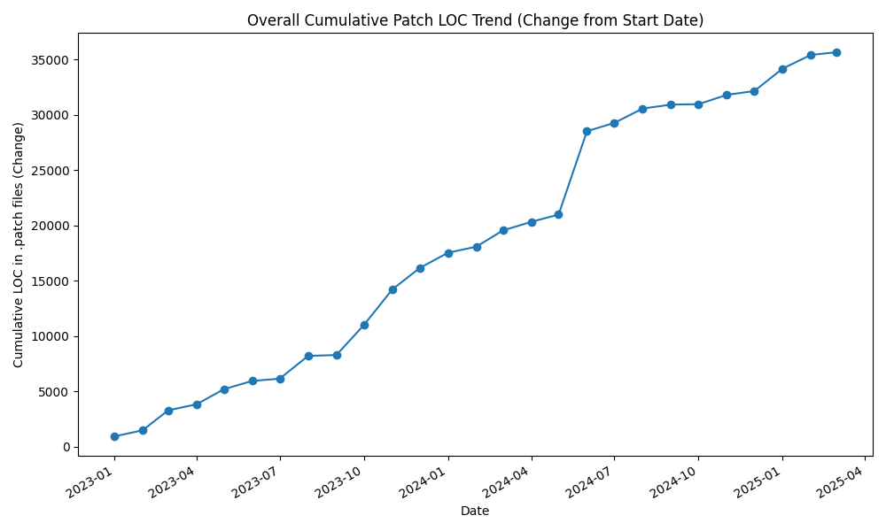

### Trend of Average Patch LOC per Project

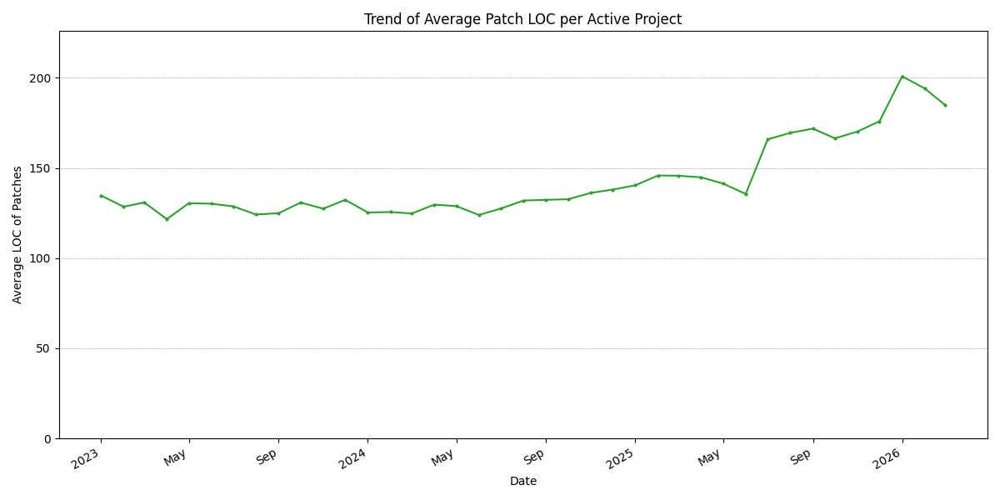

### Tool Patch LOC Distribution

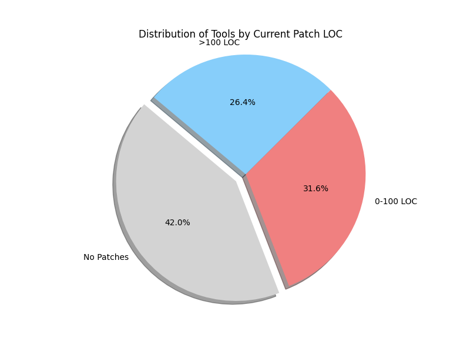

## Repository Breakdown (Sorted by Current Lines of Code)

| Repository | Lines of Code | # of Patch files |
| --- | --- | --- |
| [librdkafkaport](#repo-librdkafkaport) | 2638 | 54 |
| [bashport](#repo-bashport) | 1698 | 32 |
| [libuvport](#repo-libuvport) | 1487 | 25 |
| [sudoport](#repo-sudoport) | 1278 | 30 |
| [cmakeport](#repo-cmakeport) | 1092 | 1 |
| [gitport](#repo-gitport) | 975 | 29 |
| [valgrindport](#repo-valgrindport) | 896 | 3 |
| [gpgport](#repo-gpgport) | 687 | 13 |
| [perlport](#repo-perlport) | 683 | 13 |
| [gzipport](#repo-gzipport) | 669 | 7 |
| [procpsport](#repo-procpsport) | 655 | 1 |
| [coreutilsport](#repo-coreutilsport) | 647 | 17 |
| [util-linuxport](#repo-util-linuxport) | 612 | 7 |
| [unzipport](#repo-unzipport) | 549 | 12 |
| [cronieport](#repo-cronieport) | 510 | 13 |
| [screenport](#repo-screenport) | 485 | 7 |
| [tmuxport](#repo-tmuxport) | 440 | 13 |
| [treeport](#repo-treeport) | 425 | 3 |
| [emacsport](#repo-emacsport) | 413 | 2 |
| [opensshport](#repo-opensshport) | 376 | 19 |
| [flexport](#repo-flexport) | 351 | 2 |
| [prometheusport](#repo-prometheusport) | 348 | 1 |
| [neovimport](#repo-neovimport) | 347 | 13 |
| [pocoport](#repo-pocoport) | 343 | 9 |
| [rsyncport](#repo-rsyncport) | 341 | 6 |
| [vimport](#repo-vimport) | 335 | 12 |
| [phpport](#repo-phpport) | 320 | 13 |
| [conanport](#repo-conanport) | 299 | 8 |
| [zipport](#repo-zipport) | 297 | 8 |
| [ninjaport](#repo-ninjaport) | 274 | 9 |
| [moreutilsport](#repo-moreutilsport) | 262 | 5 |
| [gitlab-runnerport](#repo-gitlab-runnerport) | 241 | 10 |
| [llamacppport](#repo-llamacppport) | 236 | 1 |
| [mesonport](#repo-mesonport) | 229 | 9 |
| [zstdport](#repo-zstdport) | 227 | 4 |
| [gettextport](#repo-gettextport) | 206 | 7 |
| [findutilsport](#repo-findutilsport) | 199 | 10 |
| [libiconvport](#repo-libiconvport) | 196 | 5 |
| [diffutilsport](#repo-diffutilsport) | 184 | 8 |
| [protobufport](#repo-protobufport) | 174 | 8 |
| [groffport](#repo-groffport) | 165 | 13 |
| [autoconfport](#repo-autoconfport) | 151 | 6 |
| [redisport](#repo-redisport) | 148 | 1 |
| [jqport](#repo-jqport) | 146 | 8 |
| [libserdesport](#repo-libserdesport) | 142 | 4 |
| [tclport](#repo-tclport) | 130 | 5 |
| [libgcryptport](#repo-libgcryptport) | 129 | 7 |
| [libeventport](#repo-libeventport) | 127 | 4 |
| [pinentryport](#repo-pinentryport) | 124 | 5 |
| [libssh2port](#repo-libssh2port) | 122 | 5 |
| [m4port](#repo-m4port) | 120 | 5 |
| [thesilversearcherport](#repo-thesilversearcherport) | 118 | 4 |
| [grepport](#repo-grepport) | 115 | 3 |
| [ncursesport](#repo-ncursesport) | 111 | 2 |
| [hexcurseport](#repo-hexcurseport) | 108 | 4 |
| [libbsdport](#repo-libbsdport) | 107 | 4 |
| [victoriametricsport](#repo-victoriametricsport) | 107 | 3 |
| [zlib-ngport](#repo-zlib-ngport) | 100 | 3 |
| [pkgconfigport](#repo-pkgconfigport) | 98 | 1 |
| [doxygenport](#repo-doxygenport) | 97 | 5 |
| [depot_toolsport](#repo-depot-toolsport) | 91 | 1 |
| [patchport](#repo-patchport) | 86 | 3 |
| [gawkport](#repo-gawkport) | 81 | 4 |
| [getoptport](#repo-getoptport) | 79 | 1 |
| [expectport](#repo-expectport) | 79 | 4 |
| [librabbitmqport](#repo-librabbitmqport) | 78 | 2 |
| [libassuanport](#repo-libassuanport) | 77 | 4 |
| [xmltoport](#repo-xmltoport) | 74 | 1 |
| [cppcheckport](#repo-cppcheckport) | 72 | 4 |
| [libtoolport](#repo-libtoolport) | 71 | 3 |
| [nanoport](#repo-nanoport) | 68 | 1 |
| [logrotateport](#repo-logrotateport) | 65 | 1 |
| [lz4port](#repo-lz4port) | 58 | 4 |
| [gnport](#repo-gnport) | 57 | 1 |
| [texinfoport](#repo-texinfoport) | 56 | 3 |
| [libgpgerrorport](#repo-libgpgerrorport) | 53 | 3 |
| [expatport](#repo-expatport) | 52 | 2 |
| [terraformport](#repo-terraformport) | 51 | 2 |
| [libsasl2port](#repo-libsasl2port) | 50 | 3 |
| [automakeport](#repo-automakeport) | 47 | 3 |
| [lessport](#repo-lessport) | 47 | 3 |
| [xxhashport](#repo-xxhashport) | 47 | 2 |
| [tigport](#repo-tigport) | 47 | 1 |
| [lazygitport](#repo-lazygitport) | 46 | 1 |
| [fzfport](#repo-fzfport) | 45 | 2 |
| [poptport](#repo-poptport) | 35 | 1 |
| [whichport](#repo-whichport) | 34 | 1 |
| [sedport](#repo-sedport) | 33 | 1 |
| [ntbtlsport](#repo-ntbtlsport) | 33 | 1 |
| [sqliteport](#repo-sqliteport) | 32 | 1 |
| [luvport](#repo-luvport) | 31 | 1 |
| [libffiport](#repo-libffiport) | 31 | 2 |
| [lynxport](#repo-lynxport) | 30 | 1 |
| [netpbmport](#repo-netpbmport) | 29 | 2 |
| [gmpport](#repo-gmpport) | 29 | 2 |
| [libgpgmeport](#repo-libgpgmeport) | 29 | 2 |
| [npthport](#repo-npthport) | 28 | 2 |
| [libksbaport](#repo-libksbaport) | 28 | 2 |
| [avro-c-libport](#repo-avro-c-libport) | 28 | 2 |
| [ctagsport](#repo-ctagsport) | 26 | 2 |
| [git-extrasport](#repo-git-extrasport) | 26 | 1 |
| [my_basicport](#repo-my-basicport) | 22 | 1 |
| [shdocport](#repo-shdocport) | 20 | 2 |
| [sshpassport](#repo-sshpassport) | 18 | 1 |
| [git-lfsport](#repo-git-lfsport) | 18 | 1 |
| [bzip2port](#repo-bzip2port) | 17 | 1 |
| [cunitport](#repo-cunitport) | 17 | 2 |
| [makeport](#repo-makeport) | 16 | 1 |
| [curlport](#repo-curlport) | 15 | 1 |
| [xzport](#repo-xzport) | 15 | 1 |
| [opensslport](#repo-opensslport) | 15 | 1 |
| [libgdbmport](#repo-libgdbmport) | 15 | 1 |
| [libpipelineport](#repo-libpipelineport) | 15 | 1 |
| [libpcre2port](#repo-libpcre2port) | 15 | 1 |
| [libxsltport](#repo-libxsltport) | 15 | 1 |
| [libpcreport](#repo-libpcreport) | 15 | 1 |
| [libmdport](#repo-libmdport) | 15 | 1 |
| [tarport](#repo-tarport) | 14 | 1 |
| [nghttp2port](#repo-nghttp2port) | 14 | 1 |
| [bisonport](#repo-bisonport) | 13 | 1 |
| [ncduport](#repo-ncduport) | 13 | 1 |
| [luaport](#repo-luaport) | 13 | 1 |
| [lpegport](#repo-lpegport) | 13 | 1 |
| [stowport](#repo-stowport) | 13 | 1 |
| [libxml2port](#repo-libxml2port) | 12 | 1 |
| [zlibport](#repo-zlibport) | 0 | 0 |
| [help2manport](#repo-help2manport) | 0 | 0 |
| [zotsampleport](#repo-zotsampleport) | 0 | 0 |
| [man-dbport](#repo-man-dbport) | 0 | 0 |
| [shufport](#repo-shufport) | 0 | 0 |
| [wgetport](#repo-wgetport) | 0 | 0 |
| [gperfport](#repo-gperfport) | 0 | 0 |
| [zoslibport](#repo-zoslibport) | 0 | 0 |
| [re2cport](#repo-re2cport) | 0 | 0 |
| [cscopeport](#repo-cscopeport) | 0 | 0 |
| [gnulibport](#repo-gnulibport) | 0 | 0 |
| [helloport](#repo-helloport) | 0 | 0 |
| [htopport](#repo-htopport) | 0 | 0 |
| [metaport](#repo-metaport) | 0 | 0 |
| [zigiport](#repo-zigiport) | 0 | 0 |
| [yqport](#repo-yqport) | 0 | 0 |
| [pythonport](#repo-pythonport) | 0 | 0 |
| [comp_goport](#repo-comp-goport) | 0 | 0 |
| [comp_clangport](#repo-comp-clangport) | 0 | 0 |
| [comp_xlclangport](#repo-comp-xlclangport) | 0 | 0 |
| [direnvport](#repo-direnvport) | 0 | 0 |
| [libgit2port](#repo-libgit2port) | 0 | 0 |
| [duckdbport](#repo-duckdbport) | 0 | 0 |
| [powerlinegoport](#repo-powerlinegoport) | 0 | 0 |
| [byaccport](#repo-byaccport) | 0 | 0 |
| [bumpport](#repo-bumpport) | 0 | 0 |
| [c3270port](#repo-c3270port) | 0 | 0 |
| [gumport](#repo-gumport) | 0 | 0 |
| [wharfport](#repo-wharfport) | 0 | 0 |
| [dufport](#repo-dufport) | 0 | 0 |
| [onigurumaport](#repo-onigurumaport) | 0 | 0 |
| [multitailport](#repo-multitailport) | 0 | 0 |
| [janssonport](#repo-janssonport) | 0 | 0 |
| [luarocksport](#repo-luarocksport) | 0 | 0 |
| [termenvport](#repo-termenvport) | 0 | 0 |
| [esbuildport](#repo-esbuildport) | 0 | 0 |
| [nginxport](#repo-nginxport) | 0 | 0 |
| [natsport](#repo-natsport) | 0 | 0 |
| [githubcliport](#repo-githubcliport) | 0 | 0 |
| [zos-code-page-toolsport](#repo-zos-code-page-toolsport) | 0 | 0 |
| [v8port](#repo-v8port) | 0 | 0 |
| [dos2unixport](#repo-dos2unixport) | 0 | 0 |
| [zospstreeport](#repo-zospstreeport) | 0 | 0 |
| [zosncport](#repo-zosncport) | 0 | 0 |
| [boostport](#repo-boostport) | 0 | 0 |
| [buildkiteport](#repo-buildkiteport) | 0 | 0 |
| [javaport](#repo-javaport) | 0 | 0 |
| [antport](#repo-antport) | 0 | 0 |
| [jrubyport](#repo-jrubyport) | 0 | 0 |
| [toolsandtoysport](#repo-toolsandtoysport) | 0 | 0 |
| [groovyport](#repo-groovyport) | 0 | 0 |
| [kotlinport](#repo-kotlinport) | 0 | 0 |
| [caddyport](#repo-caddyport) | 0 | 0 |
| [gitlabcliport](#repo-gitlabcliport) | 0 | 0 |
| [fqport](#repo-fqport) | 0 | 0 |
| [promptersport](#repo-promptersport) | 0 | 0 |
| [osv-scannerport](#repo-osv-scannerport) | 0 | 0 |
| [ginport](#repo-ginport) | 0 | 0 |
| [frpport](#repo-frpport) | 0 | 0 |
| [mavenport](#repo-mavenport) | 0 | 0 |
| [ttypeport](#repo-ttypeport) | 0 | 0 |
| [cosignport](#repo-cosignport) | 0 | 0 |
| [jenkinsport](#repo-jenkinsport) | 0 | 0 |
| [godsectport](#repo-godsectport) | 0 | 0 |
| [murexport](#repo-murexport) | 0 | 0 |
| [grafanaport](#repo-grafanaport) | 0 | 0 |
| [iperfport](#repo-iperfport) | 0 | 0 |
| [fxport](#repo-fxport) | 0 | 0 |
| [s5cmdport](#repo-s5cmdport) | 0 | 0 |
| [parse-gotestport](#repo-parse-gotestport) | 0 | 0 |
| [check_clangport](#repo-check-clangport) | 0 | 0 |
| [check_xlclangport](#repo-check-xlclangport) | 0 | 0 |
| [check_pythonport](#repo-check-pythonport) | 0 | 0 |
| [check_javaport](#repo-check-javaport) | 0 | 0 |
| [check_goport](#repo-check-goport) | 0 | 0 |
| [nmapport](#repo-nmapport) | 0 | 0 |
| [hugoport](#repo-hugoport) | 0 | 0 |
| [dialogport](#repo-dialogport) | 0 | 0 |
| [joeport](#repo-joeport) | 0 | 0 |
| [cjsonport](#repo-cjsonport) | 0 | 0 |
| [libdioport](#repo-libdioport) | 0 | 0 |
| [git-chglogport](#repo-git-chglogport) | 0 | 0 |
| [zedc_asciiport](#repo-zedc-asciiport) | 0 | 0 |
| [bash-completionport](#repo-bash-completionport) | 0 | 0 |
| [zusageport](#repo-zusageport) | 0 | 0 |
| [spdlogport](#repo-spdlogport) | 0 | 0 |
| [creduceport](#repo-creduceport) | 0 | 0 |
| [gradleport](#repo-gradleport) | 0 | 0 |

---

# Detailed Repository Reports

## Repository: librdkafkaport

**Current Lines of Code:** 2638  
**Current # of Patch files:** 54

### Trend of Current Patch LOC

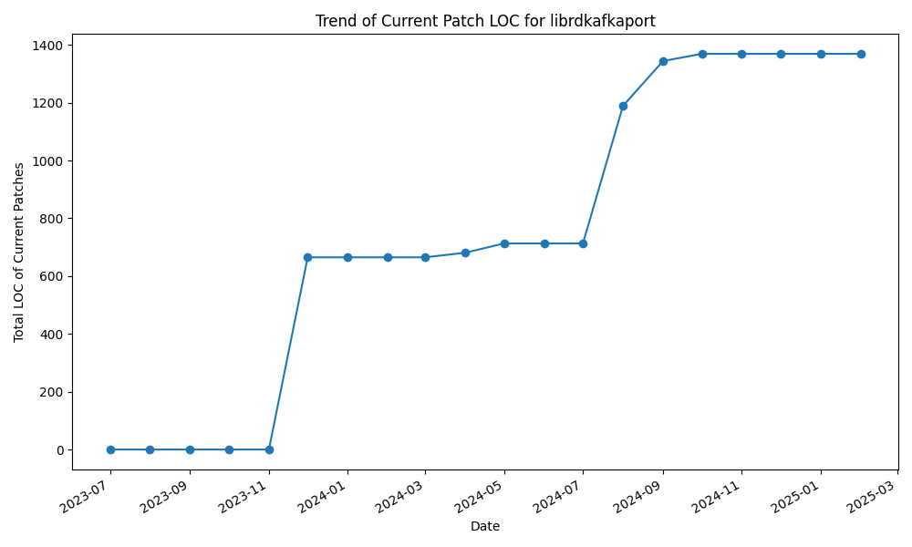

### Current Patch Details

| File | LOC |
| --- | --- |
| configure.self.patch | 20 |
| examples/alter_consumer_group_offsets.c.patch | 13 |
| examples/describe_consumer_groups.c.patch | 13 |
| examples/incremental_alter_configs.c.patch | 13 |
| examples/kafkatest_verifiable_client.cpp.patch | 13 |
| examples/list_consumer_group_offsets.c.patch | 13 |
| examples/list_consumer_groups.c.patch | 13 |
| examples/misc.c.patch | 13 |
| examples/openssl_engine_example.cpp.patch | 13 |
| examples/rdkafka_complex_consumer_example.c.patch | 14 |
| examples/rdkafka_complex_consumer_example.cpp.patch | 13 |
| examples/rdkafka_example.c.patch | 14 |
| examples/rdkafka_example.cpp.patch | 13 |
| examples/user_scram.c.patch | 13 |
| mklove/Makefile.base.patch | 41 |
| src-cpp/Makefile.patch | 13 |
| src/rd.h.patch | 40 |
| src/rdaddr.c.patch | 125 |
| src/rdcrc32.c.patch | 13 |
| src/rdcrc32.h.patch | 22 |
| src/rdendian.h.patch | 14 |
| src/rdhdrhistogram.c.patch | 25 |
| src/rdhttp.c.patch | 77 |
| src/rdkafka.c.patch | 367 |
| src/rdkafka.h.patch | 16 |
| src/rdkafka_broker.c.patch | 48 |
| src/rdkafka_conf.c.patch | 264 |
| src/rdkafka_conf.h.patch | 28 |
| src/rdkafka_feature.c.patch | 51 |
| src/rdkafka_int.h.patch | 62 |
| src/rdkafka_interceptor.c.patch | 34 |
| src/rdkafka_offset.c.patch | 58 |
| src/rdkafka_op.c.patch | 21 |
| src/rdkafka_partition.c.patch | 34 |
| src/rdkafka_queue.c.patch | 73 |
| src/rdkafka_queue.h.patch | 18 |
| src/rdkafka_request.c.patch | 25 |
| src/rdkafka_sasl_oauthbearer_oidc.c.patch | 371 |
| src/rdkafka_ssl.c.patch | 58 |
| src/rdkafka_transport.c.patch | 137 |
| src/rdkafka_transport_int.h.patch | 15 |
| src/rdlist.c.patch | 72 |
| src/rdports.c.patch | 52 |
| src/rdposix.h.patch | 49 |
| src/rdrand.c.patch | 38 |
| src/snappy_compat.h.patch | 13 |
| src/tinycthread.c.patch | 66 |
| src/tinycthread.h.patch | 16 |
| src/tinycthread_extra.c.patch | 13 |
| tests/0017-compression.c.patch | 16 |
| tests/0056-balanced_group_mt.c.patch | 16 |
| tests/0146-metadata_mock.c.patch | 13 |
| tests/sockem.c.patch | 17 |
| tests/sockem_ctrl.h.patch | 16 |

---

### Historical Patch Event Details

| Commit Date | File | Delta LOC |
| --- | --- | --- |
| 2024-10-07 | src/rdhdrhistogram.c.patch | 25 |
| 2024-09-18 | src/rdcrc32.c.patch | 13 |
| 2024-09-18 | src/rdcrc32.h.patch | 22 |
| 2024-09-18 | src/tinycthread.h.patch | 16 |
| 2024-09-18 | tests/0017-compression.c.patch | 16 |
| 2024-09-18 | tests/0056-balanced_group_mt.c.patch | 16 |
| 2024-09-18 | tests/0146-metadata_mock.c.patch | 13 |
| 2024-09-18 | tests/interceptor_test/Makefile.patch | 26 |
| 2024-09-18 | tests/sockem.c.patch | 17 |
| 2024-09-18 | tests/sockem_ctrl.h.patch | 16 |
| 2024-08-12 | src/rdhttp.c.patch | 77 |
| 2024-08-12 | src/rdkafka_conf.h.patch | 28 |
| 2024-08-12 | src/rdkafka_sasl_oauthbearer_oidc.c.patch | 371 |
| 2024-05-15 | src/rd.h.patch | 32 |
| 2024-04-23 | src/rdkafka.h.patch | 16 |
| 2023-12-12 | src/rdaddr.c.patch | 147 |
| 2023-12-12 | src/rdkafka_feature.c.patch | 62 |
| 2023-12-12 | src/rdkafka_int.h.patch | 61 |
| 2023-12-12 | src/rdkafka_interceptor.c.patch | 34 |
| 2023-12-12 | src/rdkafka_offset.c.patch | 66 |
| 2023-12-12 | src/rdkafka_op.c.patch | 15 |
| 2023-12-12 | src/rdkafka_partition.c.patch | 34 |
| 2023-12-12 | src/rdkafka_queue.c.patch | 74 |
| 2023-12-12 | src/rdkafka_queue.h.patch | 19 |
| 2023-12-12 | src/rdkafka_request.c.patch | 26 |
| 2023-12-12 | src/rdkafka_transport_int.h.patch | 15 |
| 2023-12-12 | src/rdlist.c.patch | 65 |
| 2023-12-12 | src/rdports.c.patch | 47 |

---

## Repository: bashport

**Current Lines of Code:** 1698  
**Current # of Patch files:** 32

### Trend of Current Patch LOC

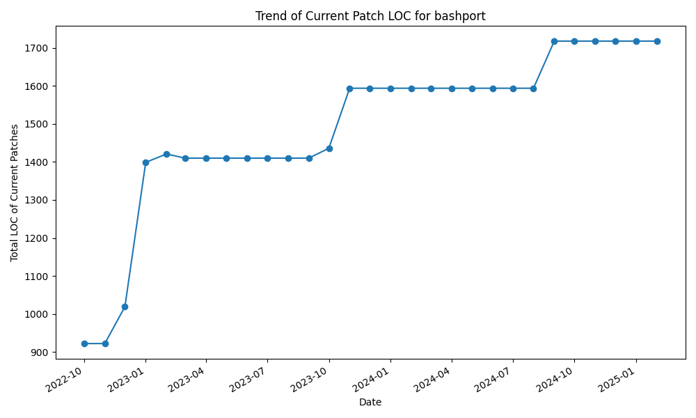

### Current Patch Details

| File | LOC |
| --- | --- |
| Makefile.in.patch | 13 |
| PR1.patch | 53 |
| PR2.patch | 769 |
| configure.patch | 53 |
| findcmd.c.patch | 22 |
| kill.def.patch | 123 |
| sig.c.patch | 30 |
| PR3/builtins.right.patch | 40 |
| PR3/coproc.tests.patch | 13 |
| PR3/dstack.right.patch | 10 |
| PR3/errors.right.patch | 30 |
| PR3/exec.right.patch | 41 |
| PR3/exportfunc.right.patch | 18 |
| PR3/heredoc.right.patch | 13 |
| PR3/intl.right.patch | 13 |
| PR3/new-exp.right.patch | 13 |
| PR3/redir.right.patch | 20 |
| PR3/redir.tests.patch | 13 |
| PR3/redir10.sub.patch | 15 |
| PR3/signames.c.patch | 35 |
| PR3/smatch.c.patch | 49 |
| PR3/test1.sub.patch | 13 |
| PR3/trap.right.patch | 61 |
| PR3/trap.tests.patch | 13 |
| PR3/vredir.right.patch | 10 |
| PR3/vredir.tests.patch | 17 |
| aclocal.patch | 23 |
| array.tests.patch | 64 |
| source6.sub.patch | 13 |
| dontupstream/read.tests.patch | 13 |
| dontupstream/redir10.patch | 13 |
| dontupstream/run-all_and_diff.patch | 72 |

---

### Historical Patch Event Details

| Commit Date | File | Delta LOC |
| --- | --- | --- |
| 2025-03-06 | dontupstream/stdlib.h.patch | 0 |
| 2024-09-30 | kill.def.patch | 124 |
| 2023-11-22 | aclocal.patch | 23 |
| 2023-11-22 | array.tests.patch | 64 |
| 2023-11-22 | source6.sub.patch | 13 |
| 2023-11-22 | coproc.tests.patch | 17 |
| 2023-11-22 | redir.tests.patch | 13 |
| 2023-11-21 | dontupstream/sig.c.patch | 28 |
| 2023-10-06 | dontupstream/read.tests.patch | 13 |
| 2023-10-06 | dontupstream/redir10.patch | 13 |
| 2023-03-23 | configure.patch | 21 |
| 2023-03-21 | subst.c.patch | 0 |
| 2023-03-10 | findcmd.c.patch | 0 |
| 2023-02-09 | sig.c.patch | 22 |
| 2023-01-25 | Makefile.in.patch | 13 |
| 2023-01-05 | subst.c.patch | 32 |
| 2023-01-04 | PR3/builtins.right.patch | 40 |
| 2023-01-04 | PR3/dstack.right.patch | 10 |
| 2023-01-04 | PR3/errors.right.patch | 30 |
| 2023-01-04 | PR3/exec.right.patch | 41 |
| 2023-01-04 | PR3/exportfunc.right.patch | 18 |
| 2023-01-04 | PR3/heredoc.right.patch | 13 |
| 2023-01-04 | PR3/intl.right.patch | 13 |
| 2023-01-04 | PR3/new-exp.right.patch | 13 |
| 2023-01-04 | PR3/redir.right.patch | 20 |
| 2023-01-04 | PR3/trap.right.patch | 61 |
| 2023-01-04 | PR3/vredir.right.patch | 10 |
| 2023-01-02 | PR3/vredir.tests.patch | 17 |
| 2023-01-01 | PR3/coproc.tests.patch | 21 |
| 2023-01-01 | PR3/redir.tests.patch | 13 |
| 2023-01-01 | PR3/redir10.sub.patch | 15 |
| 2023-01-01 | PR3/test1.sub.patch | 0 |
| 2022-12-28 | PR3/smatch.c.patch | 49 |
| 2022-12-28 | PR3/signames.c.patch | 35 |
| 2022-12-28 | PR3/trap.tests.patch | 13 |
| 2022-10-28 | PR2.patch | 847 |
| 2022-10-26 | PR1.patch | 75 |

---

## Repository: libuvport

**Current Lines of Code:** 1487  
**Current # of Patch files:** 25

### Trend of Current Patch LOC

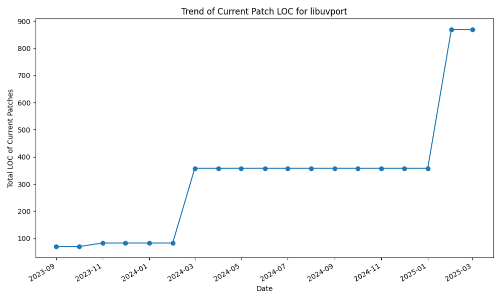

### Current Patch Details

| File | LOC |
| --- | --- |
| CMakeLists.txt.patch | 69 |
| docs/src/fs.rst.patch | 15 |
| include/uv.h.patch | 22 |
| include/uv/errno.h.patch | 17 |
| include/uv/os390.h.patch | 21 |
| src/uv-common.c.patch | 15 |
| src/unix/core.c.patch | 109 |
| src/unix/fs.c.patch | 99 |
| src/unix/internal.h.patch | 19 |
| src/unix/linux.c.patch | 38 |
| src/unix/os390-syscalls.c.patch | 183 |
| src/unix/os390-syscalls.h.patch | 26 |
| src/unix/os390.c.patch | 144 |
| src/unix/process.c.patch | 104 |
| src/unix/stream.c.patch | 120 |
| src/unix/tcp.c.patch | 40 |
| src/unix/thread.c.patch | 25 |
| test/run-tests.c.patch | 27 |
| test/test-fs-copyfile.c.patch | 31 |
| test/test-fs.c.patch | 17 |
| test/test-get-currentexe.c.patch | 159 |
| test/test-get-passwd.c.patch | 13 |
| test/test-list.h.patch | 92 |
| test/test-spawn.c.patch | 59 |
| test/test-thread-priority.c.patch | 23 |

---

### Historical Patch Event Details

| Commit Date | File | Delta LOC |
| --- | --- | --- |
| 2025-02-19 | src/unix/tty.c.patch | 0 |
| 2025-02-11 | docs/src/fs.rst.patch | 15 |
| 2025-02-11 | include/uv.h.patch | 12 |
| 2025-02-11 | include/uv/errno.h.patch | 17 |
| 2025-02-11 | include/uv/os390.h.patch | 21 |
| 2025-02-11 | src/unix/internal.h.patch | 19 |
| 2025-02-11 | src/unix/linux.c.patch | 38 |
| 2025-02-11 | src/unix/os390-syscalls.h.patch | 26 |
| 2025-02-11 | src/unix/thread.c.patch | 25 |
| 2025-02-11 | src/unix/tty.c.patch | 19 |
| 2025-02-11 | src/uv-common.c.patch | 15 |
| 2025-02-11 | test-thread-priority.c.patch | 0 |
| 2025-02-11 | test/run-tests.c.patch | 27 |
| 2025-02-11 | test/test-fs-copyfile.c.patch | 31 |
| 2025-02-11 | test/test-fs.c.patch | 17 |
| 2025-02-11 | test/test-get-currentexe.c.patch | 159 |
| 2025-02-11 | test/test-get-passwd.c.patch | 13 |
| 2025-02-11 | test/test-list.h.patch | 20 |
| 2025-02-11 | test/test-spawn.c.patch | 59 |
| 2025-02-11 | test/test-thread-priority.c.patch | 23 |
| 2024-03-09 | src/unix/core.c.patch | 49 |
| 2024-03-09 | src/unix/os390-syscalls.c.patch | 86 |
| 2024-03-09 | src/unix/os390.c.patch | 20 |
| 2024-03-09 | src/unix/process.c.patch | 53 |
| 2024-03-09 | src/unix/stream.c.patch | 41 |
| 2024-03-09 | test-thread-priority.c.patch | 26 |
| 2023-11-13 | src/unix/fs.c.patch | 13 |
| 2023-09-14 | CMakeLists.txt.patch | 32 |
| 2023-09-14 | src/unix/tcp.c.patch | 38 |

---

## Repository: sudoport

**Current Lines of Code:** 1278  
**Current # of Patch files:** 30

### Trend of Current Patch LOC

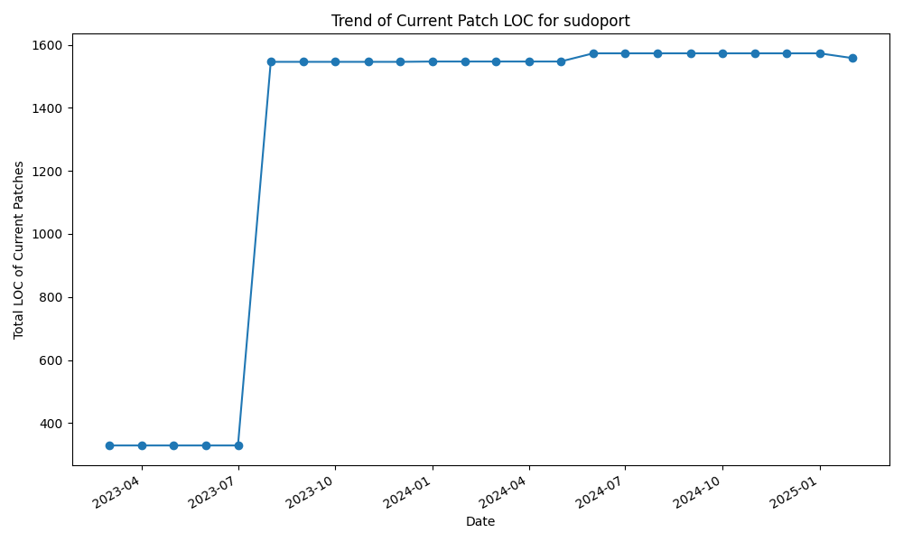

### Current Patch Details

| File | LOC |
| --- | --- |
| PR1/configure.patch | 15 |
| PR1/include/sudo_iolog.h.patch | 12 |
| PR1/lib/eventlog/Makefile.in.patch | 13 |
| PR1/lib/util/getentropy.c.patch | 42 |
| PR1/lib/util/mmap_alloc.c.patch | 45 |
| PR1/lib/util/progname.c.patch | 13 |
| PR1/lib/util/pw_dup.c.patch | 32 |
| PR1/lib/util/sig2str.c.patch | 256 |
| PR1/lib/util/str2sig.c.patch | 15 |
| PR1/lib/util/regress/mktemp/mktemp_test.c.patch | 28 |
| PR1/plugins/group_file/getgrent.c.patch | 14 |
| PR1/plugins/sudoers/check_aliases.c.patch | 33 |
| PR1/plugins/sudoers/cvtsudoers_pwutil.c.patch | 64 |
| PR1/plugins/sudoers/defaults.c.patch | 34 |
| PR1/plugins/sudoers/env.c.patch | 18 |
| PR1/plugins/sudoers/getspwuid.c.patch | 18 |
| PR1/plugins/sudoers/pwutil.c.patch | 45 |
| PR1/plugins/sudoers/pwutil_impl.c.patch | 52 |
| PR1/plugins/sudoers/set_perms.c.patch | 180 |
| PR1/plugins/sudoers/sudoers.c.patch | 17 |
| PR1/plugins/sudoers/testsudoers.c.patch | 16 |
| PR1/plugins/sudoers/tsgetgrpw.c.patch | 35 |
| PR1/plugins/sudoers/auth/passwd.c.patch | 95 |
| PR1/plugins/sudoers/regress/testsudoers/test9.sh.patch | 20 |
| PR1/scripts/install-sh.patch | 44 |
| PR1/src/exec.c.patch | 30 |
| PR1/src/get_pty.c.patch | 26 |
| PR1/src/net_ifs.c.patch | 15 |
| PR1/src/preload.c.patch | 14 |
| PR1/src/sudo.c.patch | 37 |

---

### Historical Patch Event Details

| Commit Date | File | Delta LOC |
| --- | --- | --- |
| 2025-02-12 | PR1/lib/util/ttyname_dev.c.patch | 0 |
| 2024-06-10 | PR1/src/get_pty.c.patch | 26 |
| 2024-01-31 | PR1/plugins/sudoers/sudo_printf.c.patch | 0 |
| 2024-01-19 | PR1/lib/util/progname.c.patch | 13 |
| 2023-08-14 | PR1.patch | 0 |
| 2023-08-14 | PR1/configure.patch | 15 |
| 2023-08-14 | PR1/include/sudo_iolog.h.patch | 12 |
| 2023-08-14 | PR1/lib/eventlog/Makefile.in.patch | 13 |
| 2023-08-14 | PR1/lib/iolog/Makefile.in.patch | 13 |
| 2023-08-14 | PR1/lib/util/getentropy.c.patch | 42 |
| 2023-08-14 | PR1/lib/util/mmap_alloc.c.patch | 53 |
| 2023-08-14 | PR1/lib/util/pw_dup.c.patch | 32 |
| 2023-08-14 | PR1/lib/util/regress/mktemp/mktemp_test.c.patch | 28 |
| 2023-08-14 | PR1/lib/util/sig2str.c.patch | 256 |
| 2023-08-14 | PR1/lib/util/str2sig.c.patch | 15 |
| 2023-08-14 | PR1/lib/util/ttyname_dev.c.patch | 15 |
| 2023-08-14 | PR1/logsrvd/Makefile.in.patch | 13 |
| 2023-08-14 | PR1/plugins/audit_json/Makefile.in.patch | 13 |
| 2023-08-14 | PR1/plugins/group_file/Makefile.in.patch | 13 |
| 2023-08-14 | PR1/plugins/group_file/getgrent.c.patch | 14 |
| 2023-08-14 | PR1/plugins/python/Makefile.in.patch | 13 |
| 2023-08-14 | PR1/plugins/sample/Makefile.in.patch | 13 |
| 2023-08-14 | PR1/plugins/sample_approval/Makefile.in.patch | 13 |
| 2023-08-14 | PR1/plugins/sudoers/Makefile.in.patch | 43 |
| 2023-08-14 | PR1/plugins/sudoers/auth/passwd.c.patch | 237 |
| 2023-08-14 | PR1/plugins/sudoers/check_aliases.c.patch | 33 |
| 2023-08-14 | PR1/plugins/sudoers/cvtsudoers_pwutil.c.patch | 64 |
| 2023-08-14 | PR1/plugins/sudoers/defaults.c.patch | 34 |
| 2023-08-14 | PR1/plugins/sudoers/env.c.patch | 18 |
| 2023-08-14 | PR1/plugins/sudoers/getspwuid.c.patch | 18 |
| 2023-08-14 | PR1/plugins/sudoers/pwutil.c.patch | 45 |
| 2023-08-14 | PR1/plugins/sudoers/pwutil_impl.c.patch | 52 |
| 2023-08-14 | PR1/plugins/sudoers/regress/testsudoers/test9.sh.patch | 20 |
| 2023-08-14 | PR1/plugins/sudoers/set_perms.c.patch | 139 |
| 2023-08-14 | PR1/plugins/sudoers/sudo_printf.c.patch | 12 |
| 2023-08-14 | PR1/plugins/sudoers/sudoers.c.patch | 17 |
| 2023-08-14 | PR1/plugins/sudoers/testsudoers.c.patch | 29 |
| 2023-08-14 | PR1/plugins/sudoers/tsgetgrpw.c.patch | 35 |
| 2023-08-14 | PR1/plugins/system_group/Makefile.in.patch | 13 |
| 2023-08-14 | PR1/scripts/install-sh.patch | 44 |
| 2023-08-14 | PR1/src/Makefile.in.patch | 13 |
| 2023-08-14 | PR1/src/exec.c.patch | 30 |
| 2023-08-14 | PR1/src/net_ifs.c.patch | 15 |
| 2023-08-14 | PR1/src/preload.c.patch | 14 |
| 2023-08-14 | PR1/src/sudo.c.patch | 35 |
| 2023-03-07 | PR1.patch | 329 |

---

## Repository: cmakeport

**Current Lines of Code:** 1092  
**Current # of Patch files:** 1

### Trend of Current Patch LOC

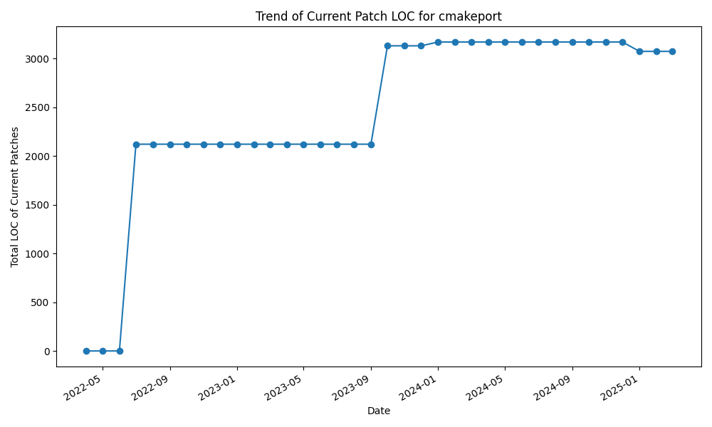

### Current Patch Details

| File | LOC |
| --- | --- |
| PR1.patch | 1092 |

---

### Historical Patch Event Details

| Commit Date | File | Delta LOC |
| --- | --- | --- |
| 2025-01-03 | PR1/Modules/Compiler/IBMClang-CXX.cmake.patch | 0 |
| 2025-01-03 | PR1.patch | 952 |
| 2025-01-03 | PR1/Modules/CMakeDetermineCCompiler.cmake.patch | 0 |
| 2025-01-03 | PR1/Modules/CMakeDetermineCXXCompiler.cmake.patch | 0 |
| 2025-01-03 | PR1/Modules/CMakeDetermineCompilerABI.cmake.patch | 0 |
| 2025-01-03 | PR1/Modules/CMakeDetermineSystem.cmake.patch | 0 |
| 2025-01-03 | PR1/Modules/CMakeFindBinUtils.cmake.patch | 0 |
| 2025-01-03 | PR1/Modules/CMakePlatformId.h.in.patch | 0 |
| 2025-01-03 | PR1/Modules/CheckTypeSize.cmake.patch | 0 |
| 2025-01-03 | PR1/Modules/Compiler/Clang.cmake.patch | 0 |
| 2025-01-03 | PR1/Modules/Compiler/zOS-C.cmake.patch | 0 |
| 2025-01-03 | PR1/Modules/Compiler/zOS-CXX.cmake.patch | 0 |
| 2025-01-03 | PR1/Modules/Compiler/zOS.cmake.patch | 0 |
| 2025-01-03 | PR1/Modules/FindThreads.cmake.patch | 0 |
| 2025-01-03 | PR1/Modules/GenerateExportHeader.cmake.patch | 0 |
| 2025-01-03 | PR1/Modules/Platform/OS390.cmake.patch | 0 |
| 2025-01-03 | PR1/README.rst.patch | 0 |
| 2025-01-03 | PR1/Source/CMakeVersion.cmake.patch | 0 |
| 2025-01-03 | PR1/Source/CursesDialog/form/form.h.patch | 0 |
| 2025-01-03 | PR1/Source/CursesDialog/form/frm_driver.c.patch | 0 |
| 2025-01-03 | PR1/Source/cmGeneratorTarget.cxx.patch | 0 |
| 2025-01-03 | PR1/Source/cmInstallCommand.cxx.patch | 0 |
| 2025-01-03 | PR1/Source/cmLoadCommandCommand.cxx.patch | 0 |
| 2025-01-03 | PR1/Source/cmMakefile.cxx.patch | 0 |
| 2025-01-03 | PR1/Source/cmStandardLexer.h.patch | 0 |
| 2025-01-03 | PR1/Source/cmSystemTools.cxx.patch | 0 |
| 2025-01-03 | PR1/Source/cmTimestamp.cxx.patch | 0 |
| 2025-01-03 | PR1/Source/kwsys/SystemTools.cxx.patch | 0 |
| 2025-01-03 | PR1/Source/kwsys/SystemTools.hxx.in.patch | 0 |
| 2025-01-03 | PR1/Utilities/cmcurl/include/curl/system.h.patch | 0 |
| 2025-01-03 | PR1/Utilities/cmcurl/lib/curl_setup.h.patch | 0 |
| 2025-01-03 | PR1/Utilities/cmlibarchive/libarchive/filter_fork_posix.c.patch | 0 |
| 2025-01-03 | PR1/Utilities/cmlibuv/CMakeLists.txt.patch | 0 |
| 2025-01-03 | PR1/Utilities/cmlibuv/include/uv/posix.h.patch | 0 |
| 2025-01-03 | PR1/Utilities/cmlibuv/src/unix/core.c.patch | 0 |
| 2025-01-03 | PR1/Utilities/cmlibuv/src/unix/os390-syscalls.c.patch | 0 |
| 2025-01-03 | PR1/Utilities/cmlibuv/src/unix/os390-syscalls.h.patch | 0 |
| 2025-01-03 | PR1/Utilities/cmzlib/zconf.h.patch | 0 |
| 2025-01-03 | PR1/Utilities/cmzstd/lib/common/debug.h.patch | 0 |
| 2025-01-03 | PR1/Utilities/cmzstd/lib/common/zstd_trace.h.patch | 0 |
| 2025-01-03 | PR1/bootstrap.patch | 0 |
| 2024-01-24 | PR1/Utilities/cmlibuv/src/unix/os390-syscalls.c.patch | 39 |
| 2023-10-03 | PR1/Modules/CMakeDetermineCCompiler.cmake.patch | 29 |
| 2023-10-03 | PR1/Modules/CMakeDetermineCXXCompiler.cmake.patch | 29 |
| 2023-10-03 | PR1/Modules/CMakeDetermineCompilerABI.cmake.patch | 21 |
| 2023-10-03 | PR1/Modules/CMakeDetermineSystem.cmake.patch | 22 |
| 2023-10-03 | PR1/Modules/CMakeFindBinUtils.cmake.patch | 13 |
| 2023-10-03 | PR1/Modules/CMakePlatformId.h.in.patch | 24 |
| 2023-10-03 | PR1/Modules/CheckTypeSize.cmake.patch | 32 |
| 2023-10-03 | PR1/Modules/Compiler/Clang.cmake.patch | 20 |
| 2023-10-03 | PR1/Modules/Compiler/IBMClang-CXX.cmake.patch | 26 |
| 2023-10-03 | PR1/Modules/Compiler/zOS-C.cmake.patch | 13 |
| 2023-10-03 | PR1/Modules/Compiler/zOS-CXX.cmake.patch | 45 |
| 2023-10-03 | PR1/Modules/Compiler/zOS.cmake.patch | 39 |
| 2023-10-03 | PR1/Modules/FindThreads.cmake.patch | 15 |
| 2023-10-03 | PR1/Modules/GenerateExportHeader.cmake.patch | 13 |
| 2023-10-03 | PR1/Modules/Platform/OS390.cmake.patch | 43 |
| 2023-10-03 | PR1/README.rst.patch | 12 |
| 2023-10-03 | PR1/Source/CMakeVersion.cmake.patch | 15 |
| 2023-10-03 | PR1/Source/CursesDialog/form/form.h.patch | 22 |
| 2023-10-03 | PR1/Source/CursesDialog/form/frm_driver.c.patch | 13 |
| 2023-10-03 | PR1/Source/cmGeneratorTarget.cxx.patch | 14 |
| 2023-10-03 | PR1/Source/cmInstallCommand.cxx.patch | 66 |
| 2023-10-03 | PR1/Source/cmLoadCommandCommand.cxx.patch | 13 |
| 2023-10-03 | PR1/Source/cmMakefile.cxx.patch | 19 |
| 2023-10-03 | PR1/Source/cmStandardLexer.h.patch | 13 |
| 2023-10-03 | PR1/Source/cmSystemTools.cxx.patch | 28 |
| 2023-10-03 | PR1/Source/cmTimestamp.cxx.patch | 13 |
| 2023-10-03 | PR1/Source/kwsys/SystemTools.cxx.patch | 100 |
| 2023-10-03 | PR1/Source/kwsys/SystemTools.hxx.in.patch | 18 |
| 2023-10-03 | PR1/Utilities/cmcurl/include/curl/system.h.patch | 31 |
| 2023-10-03 | PR1/Utilities/cmcurl/lib/curl_setup.h.patch | 15 |
| 2023-10-03 | PR1/Utilities/cmlibarchive/libarchive/filter_fork_posix.c.patch | 13 |
| 2023-10-03 | PR1/Utilities/cmlibuv/CMakeLists.txt.patch | 38 |
| 2023-10-03 | PR1/Utilities/cmlibuv/include/uv/posix.h.patch | 15 |
| 2023-10-03 | PR1/Utilities/cmlibuv/src/unix/core.c.patch | 12 |
| 2023-10-03 | PR1/Utilities/cmlibuv/src/unix/os390-syscalls.h.patch | 20 |
| 2023-10-03 | PR1/Utilities/cmzlib/zconf.h.patch | 26 |
| 2023-10-03 | PR1/Utilities/cmzstd/lib/common/debug.h.patch | 16 |
| 2023-10-03 | PR1/Utilities/cmzstd/lib/common/zstd_trace.h.patch | 13 |
| 2023-10-03 | PR1/bootstrap.patch | 80 |
| 2023-10-03 | zos-v3.27.6.patch | 0 |
| 2023-10-02 | zos-v3.27.6.patch | 1009 |
| 2023-10-02 | zos-v3.24.2.patch | 0 |
| 2022-07-07 | zos-v3.18.0.patch | 2121 |

---

## Repository: gitport

**Current Lines of Code:** 975  
**Current # of Patch files:** 29

### Trend of Current Patch LOC

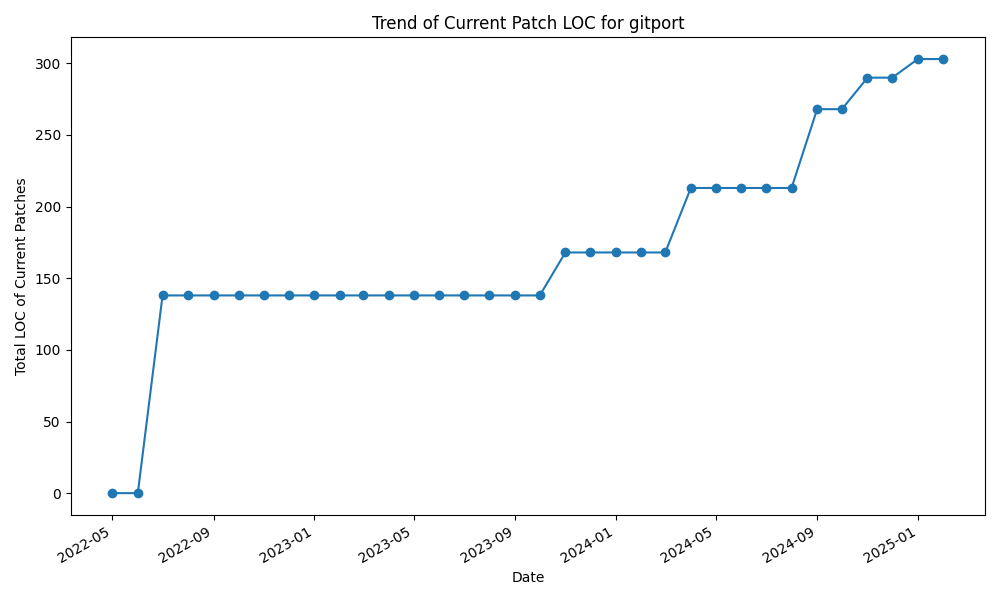

### Current Patch Details

| File | LOC |
| --- | --- |
| Makefile.patch | 84 |
| archive.c.patch | 17 |
| blame.c.patch | 16 |
| builtin.h.patch | 13 |
| combine-diff.c.patch | 15 |
| config.c.patch | 33 |
| config.mak.uname.patch | 24 |
| configure.ac.patch | 14 |
| convert.c.patch | 142 |
| copy.c.patch | 14 |
| diff.c.patch | 42 |
| entry.c.patch | 77 |
| environment.c.patch | 15 |
| environment.h.patch | 15 |
| exec-cmd.c.patch | 15 |
| generate-perl.sh.patch | 13 |
| git-compat-util.h.patch | 16 |
| hash-object.c.patch | 44 |
| http.c.patch | 23 |
| object-file.c.patch | 106 |
| quote.c.patch | 22 |
| read-cache-ll.h.patch | 15 |
| read-cache.c.patch | 14 |
| test-lib.sh.patch | 13 |
| utf8.c.patch | 35 |
| PR1/newline.patch | 13 |
| PR1/nogreph.patch | 14 |
| PR1/releasenamecollision-pack.patch | 22 |
| PR1/releasenamecollision.patch | 89 |

---

### Historical Patch Event Details

| Commit Date | File | Delta LOC |
| --- | --- | --- |
| 2025-01-14 | generate-perl.sh.patch | 13 |
| 2024-11-18 | quote.c.patch | 22 |
| 2024-11-08 | config.h.patch | 0 |
| 2024-09-02 | http.c.patch | 55 |
| 2024-04-09 | exec-cmd.c.patch | 45 |
| 2024-03-12 | configure.patch | 0 |
| 2023-11-17 | config.h.patch | 0 |
| 2023-11-17 | environment.h.patch | 15 |
| 2023-11-09 | cache.h.patch | 0 |
| 2023-11-09 | read-cache-ll.h.patch | 15 |
| 2022-07-13 | PR1/newline.patch | 13 |
| 2022-07-13 | PR1/releasenamecollision-pack.patch | 22 |
| 2022-07-13 | PR1/releasenamecollision.patch | 89 |
| 2022-07-11 | PR1/nogreph.patch | 14 |

---

## Repository: valgrindport

**Current Lines of Code:** 896  
**Current # of Patch files:** 3

### Current Patch Details

| File | LOC |
| --- | --- |
| Makefile.all.am.patch | 13 |
| guest_s390_defs.h.patch | 16 |
| guest_s390_helpers.c.patch | 867 |

---

### Historical Patch Event Details

| Commit Date | File | Delta LOC |
| --- | --- | --- |

---

## Repository: gpgport

**Current Lines of Code:** 687  
**Current # of Patch files:** 13

### Trend of Current Patch LOC

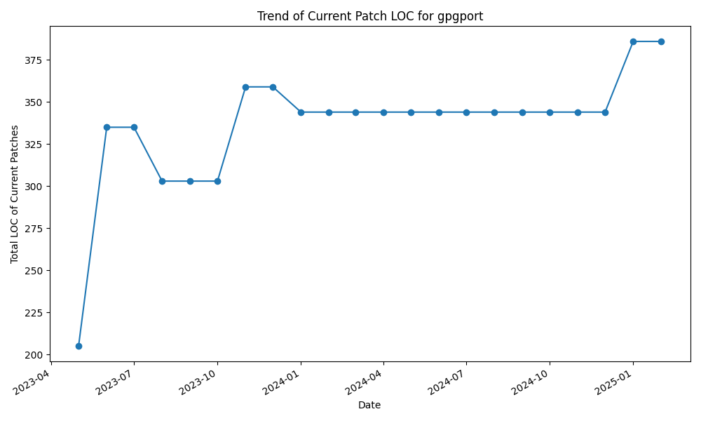

### Current Patch Details

| File | LOC |
| --- | --- |
| call-gpg.c.patch | 54 |
| call-pinentry.c.patch | 31 |
| command.c.patch | 13 |
| configure.ac.patch | 13 |
| configure.patch | 27 |
| decrypt.c.patch | 15 |
| dns.c.patch | 13 |
| ffi.c.patch | 14 |
| gpg-agent.c.patch | 107 |
| homedir.c.patch | 326 |
| openfile.c.patch | 37 |
| server.c.patch | 22 |
| t-exectool.c.patch | 15 |

---

### Historical Patch Event Details

| Commit Date | File | Delta LOC |
| --- | --- | --- |
| 2025-02-26 | openfile.c.patch | 40 |
| 2025-01-15 | t-exectool.c.patch | 15 |
| 2025-01-06 | command.c.patch | 13 |
| 2025-01-06 | server.c.patch | 22 |
| 2025-01-03 | ffi.c.patch | 14 |
| 2024-01-28 | server.c.patch | -22 |
| 2023-11-29 | server.c.patch | 15 |
| 2023-11-09 | configure.ac.patch | 13 |
| 2023-11-09 | decrypt.c.patch | 15 |
| 2023-11-09 | dns.c.patch | 13 |
| 2023-08-11 | dns-stuff.c.patch | 0 |
| 2023-06-26 | dns-stuff.c.patch | 32 |
| 2023-06-26 | homedir.c.patch | 98 |
| 2023-05-18 | call-gpg.c.patch | 54 |
| 2023-05-18 | call-pinentry.c.patch | 31 |
| 2023-05-18 | configure.patch | 13 |
| 2023-05-18 | gpg-agent.c.patch | 107 |

---

## Repository: perlport

**Current Lines of Code:** 683  
**Current # of Patch files:** 13

### Trend of Current Patch LOC

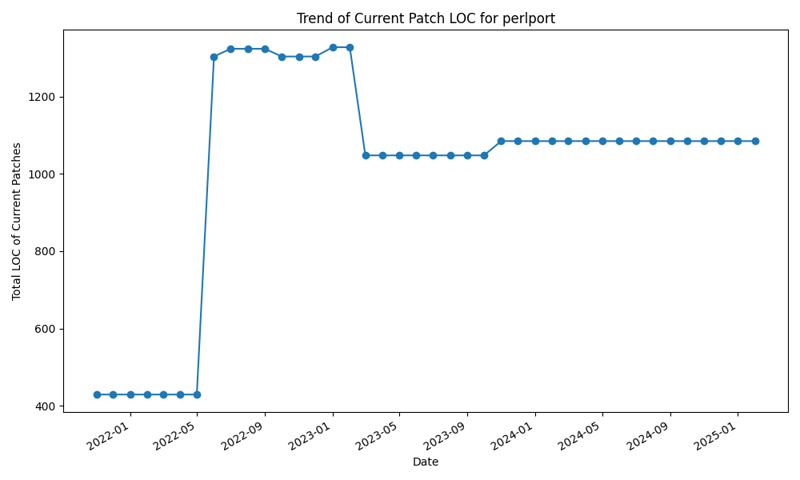

### Current Patch Details

| File | LOC |
| --- | --- |
| PR1/Configure.patch | 32 |
| PR1/Makefile.SH.patch | 54 |
| PR1/doio.c.patch | 135 |
| PR1/installperl.patch | 36 |
| PR1/iperlsys.h.patch | 28 |
| PR1/makedepend_file.SH.patch | 16 |
| PR1/perl.c.patch | 24 |
| PR1/util.c.patch | 106 |
| PR1/cpan/IPC-SysV/SysV.xs.patch | 13 |
| PR1/ext/ExtUtils-Miniperl/lib/ExtUtils/Miniperl.pm.patch | 20 |
| PR1/hints/os390.sh.patch | 141 |
| PR1/lib/File/Copy.pm.patch | 16 |
| PR1/os390/os390.c.patch | 62 |

---

### Historical Patch Event Details

| Commit Date | File | Delta LOC |
| --- | --- | --- |
| 2023-11-21 | PR1/perl.h.patch | 0 |
| 2023-11-20 | PR1.patch | 0 |
| 2023-11-20 | PR1/.gitignore.patch | 12 |
| 2023-11-20 | PR1/Configure.patch | 32 |
| 2023-11-20 | PR1/Makefile.SH.patch | 54 |
| 2023-11-20 | PR1/cpan/IPC-SysV/SysV.xs.patch | 13 |
| 2023-11-20 | PR1/doio.c.patch | 103 |
| 2023-11-20 | PR1/ext/ExtUtils-Miniperl/lib/ExtUtils/Miniperl.pm.patch | 20 |
| 2023-11-20 | PR1/hints/os390.sh.patch | 141 |
| 2023-11-20 | PR1/installperl.patch | 36 |
| 2023-11-20 | PR1/iperlsys.h.patch | 28 |
| 2023-11-20 | PR1/lib/File/Copy.pm.patch | 16 |
| 2023-11-20 | PR1/makedepend_file.SH.patch | 16 |
| 2023-11-20 | PR1/os390/os390.c.patch | 57 |
| 2023-11-20 | PR1/perl.c.patch | 24 |
| 2023-11-20 | PR1/perl.h.patch | 22 |
| 2023-11-20 | PR1/util.c.patch | 104 |
| 2023-11-19 | PR1.patch | 0 |
| 2023-11-19 | PR1/.gitignore.patch | 12 |
| 2023-11-19 | PR1/Configure.patch | 32 |
| 2023-11-19 | PR1/Makefile.SH.patch | 54 |
| 2023-11-19 | PR1/cpan/IPC-SysV/SysV.xs.patch | 13 |
| 2023-11-19 | PR1/doio.c.patch | 103 |
| 2023-11-19 | PR1/ext/ExtUtils-Miniperl/lib/ExtUtils/Miniperl.pm.patch | 20 |
| 2023-11-19 | PR1/hints/os390.sh.patch | 141 |
| 2023-11-19 | PR1/installperl.patch | 36 |
| 2023-11-19 | PR1/iperlsys.h.patch | 28 |
| 2023-11-19 | PR1/lib/File/Copy.pm.patch | 16 |
| 2023-11-19 | PR1/makedepend_file.SH.patch | 16 |
| 2023-11-19 | PR1/os390/os390.c.patch | 57 |
| 2023-11-19 | PR1/perl.c.patch | 24 |
| 2023-11-19 | PR1/util.c.patch | 104 |
| 2023-03-16 | PR1.patch | 619 |
| 2023-03-15 | PR1/consolidate_os390_changes.patch | 0 |
| 2023-03-15 | PR2/xlclang_support.patch | 0 |
| 2023-03-15 | PR3/perl.h.patch | 0 |
| 2023-01-29 | PR3/perl.h.patch | 24 |
| 2022-10-03 | dontupstream.patch | 0 |
| 2022-07-26 | dontupstream.patch | 20 |
| 2022-06-03 | PR1/consolidate_os390_changes.patch | 750 |
| 2022-06-03 | PR2/xlclang_support.patch | 125 |
| 2021-11-28 | cpan/Pod-Perldoc/Makefile.PL.patch | 0 |
| 2021-11-26 | miniperlmain.c.patch | 16 |
| 2021-11-26 | README.os390.patch | 79 |
| 2021-11-26 | cpan/Pod-Perldoc/Makefile.PL.patch | 37 |
| 2021-11-24 | util.c.patch | 52 |
| 2021-11-23 | doio.c.patch | 134 |
| 2021-11-23 | doio.patch | 0 |
| 2021-11-22 | OSType.patch | 15 |
| 2021-11-22 | os390.patch | 106 |
| 2021-11-22 | doio.patch | 47 |
| 2021-11-22 | iperlsys.patch | 27 |

---

## Repository: gzipport

**Current Lines of Code:** 669  
**Current # of Patch files:** 7

### Trend of Current Patch LOC

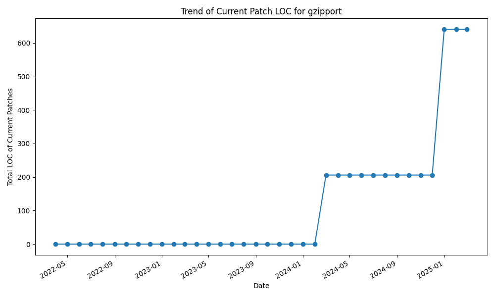

### Current Patch Details

| File | LOC |
| --- | --- |
| Makefile.in.patch | 70 |
| gzip.c.patch | 199 |
| gzip.h.patch | 34 |
| unzip.c.patch | 19 |
| zedc.c.patch | 236 |
| zip.c.patch | 81 |
| zos.h.patch | 30 |

---

### Historical Patch Event Details

| Commit Date | File | Delta LOC |
| --- | --- | --- |
| 2025-01-27 | Makefile.in.patch | 70 |
| 2025-01-27 | gzip.h.patch | 34 |
| 2025-01-27 | unzip.c.patch | 19 |
| 2025-01-27 | zedc.c.patch | 236 |
| 2025-01-24 | zip.c.patch | 46 |
| 2025-01-24 | zos.h.patch | 30 |
| 2024-03-20 | PR1.patch | 206 |

---

## Repository: procpsport

**Current Lines of Code:** 655  
**Current # of Patch files:** 1

### Trend of Current Patch LOC

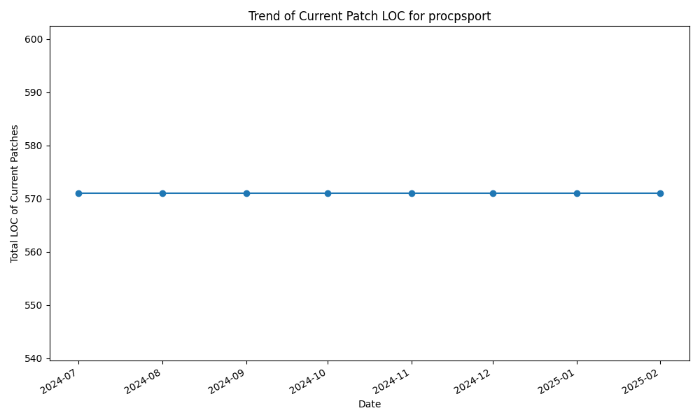

### Current Patch Details

| File | LOC |
| --- | --- |
| PR1.patch | 655 |

---

### Historical Patch Event Details

| Commit Date | File | Delta LOC |
| --- | --- | --- |
| 2024-07-29 | PR1.patch | 571 |

---

## Repository: coreutilsport

**Current Lines of Code:** 647  
**Current # of Patch files:** 17

### Trend of Current Patch LOC

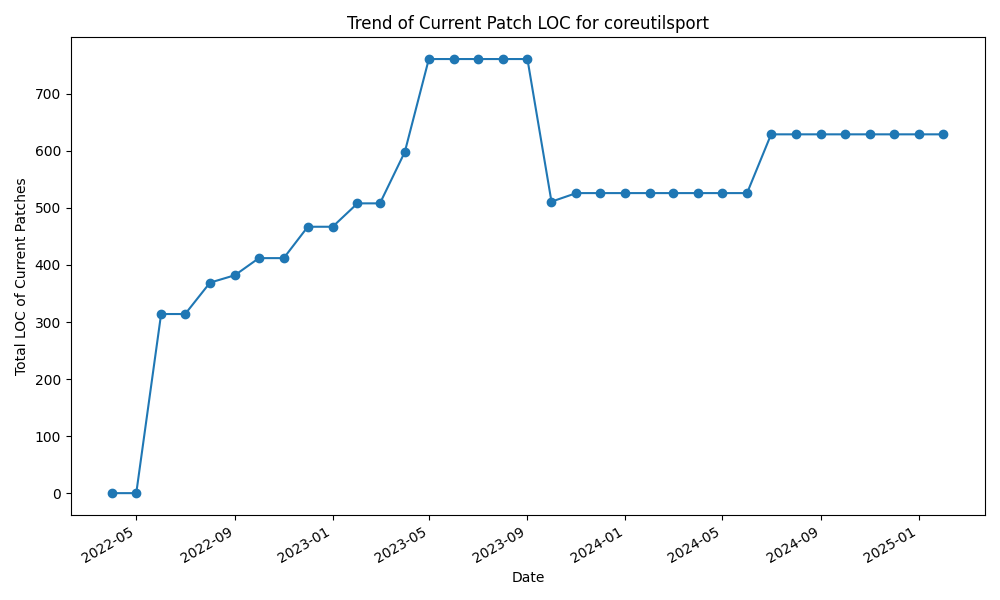

### Current Patch Details

| File | LOC |
| --- | --- |
| Makefile.in.patch | 12 |
| build-aux/test-driver.patch | 13 |
| lib/fdopendir.c.patch | 14 |
| lib/fts.c.patch | 17 |
| lib/getprogname.c.patch | 21 |
| lib/nproc.c.patch | 15 |
| lib/posix_memalign.c.patch | 22 |
| src/basenc.c.patch | 15 |
| src/cat.c.patch | 60 |
| src/copy.c.patch | 27 |
| src/cp.c.patch | 61 |
| src/digest.c.patch | 61 |
| src/ls.c.patch | 87 |
| src/od.c.patch | 16 |
| src/pinky.c.patch | 50 |
| src/stat.c.patch | 126 |
| src/timeout.c.patch | 30 |

---

### Historical Patch Event Details

| Commit Date | File | Delta LOC |
| --- | --- | --- |
| 2025-02-25 | Makefile.in.patch | 12 |
| 2024-07-09 | src/ls.c.patch | 86 |
| 2024-07-09 | lib/fts.c.patch | 17 |
| 2023-11-14 | lib/nproc.c.patch | 15 |
| 2023-10-06 | src/cat.c.patch | 60 |
| 2023-10-04 | lib/getprogname.c.patch | 13 |
| 2023-10-03 | lib/filemode.c.patch | 0 |
| 2023-10-03 | src/dd.c.patch | 0 |
| 2023-10-03 | src/shred.c.patch | 0 |
| 2023-10-03 | src/sort.c.patch | 0 |
| 2023-10-03 | src/split.c.patch | 0 |
| 2023-10-03 | src/system.h.patch | 0 |
| 2023-10-02 | PR1/zos_enablement.patch | 0 |
| 2023-10-02 | PR4/copy.patch | 0 |
| 2023-10-02 | PR7/PR7.patch | 0 |
| 2023-10-02 | lib/fdopendir.c.patch | 14 |
| 2023-10-02 | lib/filemode.c.patch | 21 |
| 2023-10-02 | lib/posix_memalign.c.patch | 22 |
| 2023-10-02 | src/basenc.c.patch | 15 |
| 2023-10-02 | src/copy.c.patch | 35 |
| 2023-10-02 | src/dd.c.patch | 30 |
| 2023-10-02 | src/od.c.patch | 15 |
| 2023-10-02 | src/shred.c.patch | 16 |
| 2023-10-02 | src/sort.c.patch | 17 |
| 2023-10-02 | src/split.c.patch | 16 |
| 2023-10-02 | src/system.h.patch | 19 |
| 2023-05-16 | pinky.c.patch | 50 |
| 2023-05-11 | PR10/stat.c.patch | 113 |
| 2023-04-11 | PR9/disableautoconversion_for_binary_tools.patch | 90 |
| 2023-02-20 | PR8/cp.c.patch | 41 |
| 2022-12-07 | PR7/PR7.patch | 55 |
| 2022-10-30 | PR6/timeout.c.patch | 30 |
| 2022-09-14 | PR5/test-driver.patch | 13 |
| 2022-08-29 | PR4/copy.patch | 55 |
| 2022-06-14 | PR1/zos_enablement.patch | 314 |

---

## Repository: util-linuxport

**Current Lines of Code:** 612  
**Current # of Patch files:** 7

### Trend of Current Patch LOC

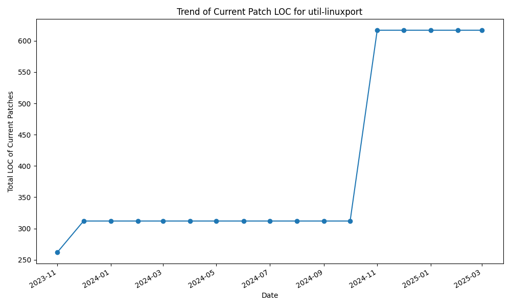

### Current Patch Details

| File | LOC |
| --- | --- |
| Makemodule.am.patch | 22 |
| PR1.patch | 257 |
| configure.ac.patch | 37 |
| gen_uuid.c.patch | 50 |
| pty-session.c.patch | 205 |
| pty-session.h.patch | 12 |
| scriptlive.c.patch | 29 |

---

### Historical Patch Event Details

| Commit Date | File | Delta LOC |
| --- | --- | --- |
| 2024-11-18 | Makemodule.am.patch | 22 |
| 2024-11-18 | configure.ac.patch | 37 |
| 2024-11-18 | pty-session.c.patch | 205 |
| 2024-11-18 | pty-session.h.patch | 12 |
| 2024-11-18 | scriptlive.c.patch | 29 |
| 2023-12-04 | gen_uuid.c.patch | 50 |
| 2023-11-22 | PR1.patch | 262 |

---

## Repository: unzipport

**Current Lines of Code:** 549  
**Current # of Patch files:** 12

### Trend of Current Patch LOC

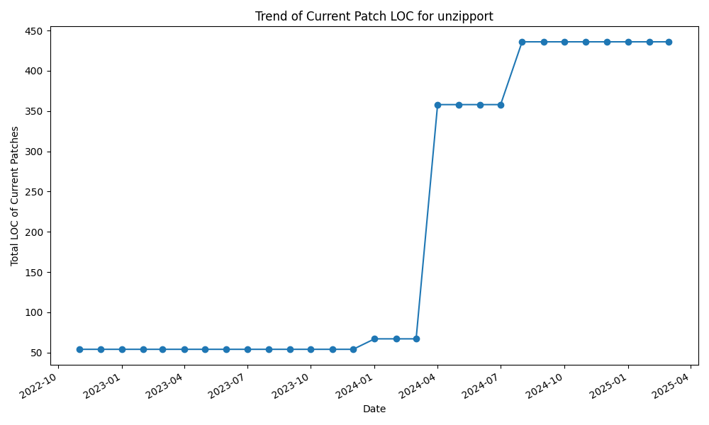

### Current Patch Details

| File | LOC |
| --- | --- |
| ebcdic.h.patch | 48 |
| extract.c.patch | 23 |
| fileio.c.patch | 67 |
| globals.h.patch | 18 |
| process.c.patch | 13 |
| riscos.h.patch | 16 |
| ttyio.c.patch | 29 |
| unix.c.patch | 197 |
| unxcfg.h.patch | 72 |
| unzip.h.patch | 27 |
| unzpriv.h.patch | 25 |
| zipinfo.c.patch | 14 |

---

### Historical Patch Event Details

| Commit Date | File | Delta LOC |
| --- | --- | --- |
| 2025-01-16 | inflate.c.patch | 0 |
| 2025-01-16 | inflate.c.patch | 94 |
| 2024-08-26 | ebcdic.h.patch | 48 |
| 2024-08-26 | riscos.h.patch | 16 |
| 2024-08-21 | zipinfo.c.patch | 14 |
| 2024-04-29 | PR1.patch | 0 |
| 2024-04-29 | extract.c.patch | 14 |
| 2024-04-29 | fileio.c.patch | 20 |
| 2024-04-29 | globals.h.patch | 18 |
| 2024-04-29 | process.c.patch | 13 |
| 2024-04-29 | ttyio.c.patch | 29 |
| 2024-04-29 | unix.c.patch | 149 |
| 2024-04-29 | unxcfg.h.patch | 72 |
| 2024-04-29 | unzip.h.patch | 30 |
| 2024-01-07 | unzpriv.h.patch | 13 |
| 2022-11-14 | PR1.patch | 54 |

---

## Repository: cronieport

**Current Lines of Code:** 510  
**Current # of Patch files:** 13

### Trend of Current Patch LOC

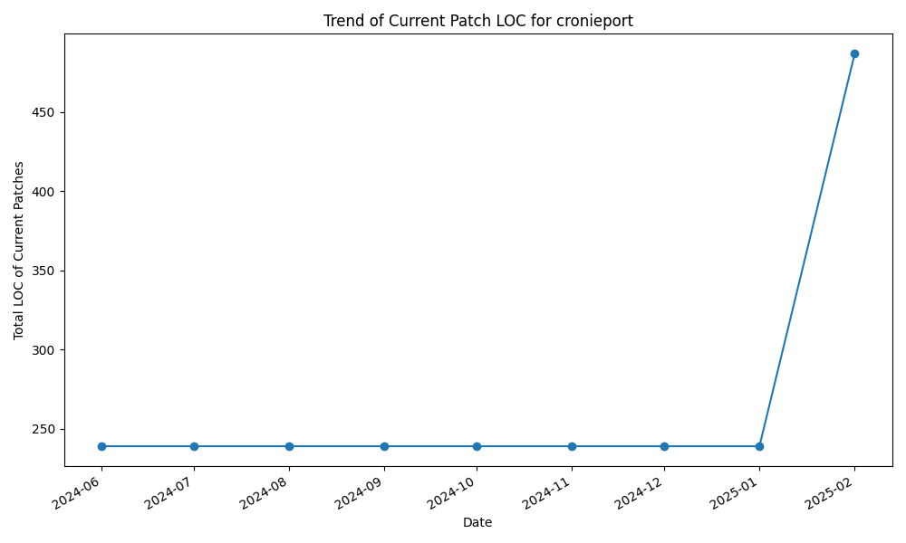

### Current Patch Details

| File | LOC |
| --- | --- |
| Makemodule.am.patch | 13 |
| cron-zos-paths.c.patch | 109 |
| cron-zos-paths.h.patch | 59 |
| cron.c.patch | 14 |
| cronnext.c.patch | 37 |
| crontab.c.patch | 23 |
| database.c.patch | 23 |
| entry.c.patch | 25 |
| genlib.sh.patch | 77 |
| pathnames.h.patch | 30 |
| popen.c.patch | 30 |
| pw_dup.c.patch | 57 |
| readtab.c.patch | 13 |

---

### Historical Patch Event Details

| Commit Date | File | Delta LOC |
| --- | --- | --- |
| 2025-02-05 | Makemodule.am.patch | 13 |
| 2025-02-05 | cron-zos-paths.c.patch | 109 |
| 2025-02-05 | cron-zos-paths.h.patch | 59 |
| 2025-02-05 | cron.c.patch | 14 |
| 2025-02-05 | crontab.c.patch | 23 |
| 2025-02-05 | pathnames.h.patch | 30 |
| 2024-06-28 | cronnext.c.patch | 14 |
| 2024-06-28 | database.c.patch | 23 |
| 2024-06-28 | entry.c.patch | 25 |
| 2024-06-28 | genlib.sh.patch | 77 |
| 2024-06-28 | popen.c.patch | 30 |
| 2024-06-28 | pw_dup.c.patch | 57 |
| 2024-06-28 | readtab.c.patch | 13 |

---

## Repository: screenport

**Current Lines of Code:** 485  
**Current # of Patch files:** 7

### Trend of Current Patch LOC

### Current Patch Details

| File | LOC |
| --- | --- |
| PR1.patch | 140 |
| acls.c.patch | 16 |
| comm.sh.patch | 14 |
| pty.c.patch | 83 |
| screen.c.patch | 80 |
| tty.sh.patch | 40 |
| utmp.c.patch | 112 |

---

### Historical Patch Event Details

| Commit Date | File | Delta LOC |
| --- | --- | --- |
| 2023-10-17 | acls.c.patch | 16 |
| 2023-10-17 | comm.sh.patch | 14 |
| 2023-06-30 | utmp.c.patch | 112 |
| 2023-06-29 | pty.c.patch | 47 |
| 2023-06-29 | screen.c.patch | 80 |
| 2023-06-29 | tty.sh.patch | 40 |
| 2022-10-31 | PR1.patch | 149 |

---

## Repository: tmuxport

**Current Lines of Code:** 440  
**Current # of Patch files:** 13

### Trend of Current Patch LOC

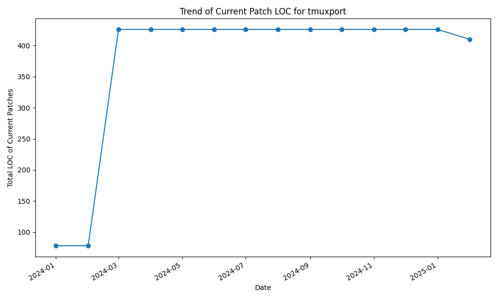

### Current Patch Details

| File | LOC |
| --- | --- |
| client.c.patch | 0 |
| cmd-pipe-pane.c.patch | 22 |
| configure.ac.patch | 23 |
| environ.c.patch | 20 |
| forkpty-zos.c.patch | 120 |
| job.c.patch | 26 |
| osdep-zos.c.patch | 63 |
| server.c.patch | 17 |
| spawn.c.patch | 46 |
| tmux.c.patch | 30 |
| tmux.h.patch | 31 |
| tty-keys.c.patch | 22 |
| tty.c.patch | 20 |

---

### Historical Patch Event Details

| Commit Date | File | Delta LOC |
| --- | --- | --- |
| 2025-02-03 | alerts.c.patch | 0 |
| 2024-03-08 | client.c.patch | 0 |
| 2024-03-08 | cmd-pipe-pane.c.patch | 22 |
| 2024-03-08 | environ.c.patch | 20 |
| 2024-03-08 | forkpty-zos.c.patch | 120 |
| 2024-03-08 | job.c.patch | 26 |
| 2024-03-08 | osdep-zos.c.patch | 63 |
| 2024-03-08 | spawn.c.patch | 14 |
| 2024-03-08 | tmux.c.patch | 30 |
| 2024-03-08 | tmux.h.patch | 33 |
| 2024-03-08 | tty.c.patch | 20 |
| 2024-01-15 | alerts.c.patch | 16 |
| 2024-01-15 | configure.ac.patch | 23 |
| 2024-01-15 | server.c.patch | 17 |
| 2024-01-15 | tty-keys.c.patch | 22 |

---

## Repository: treeport

**Current Lines of Code:** 425  
**Current # of Patch files:** 3

### Trend of Current Patch LOC

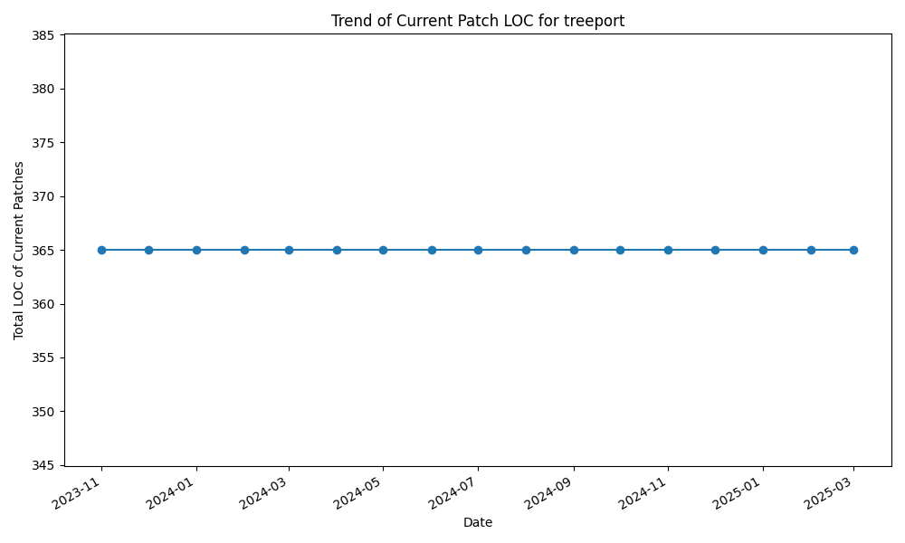

### Current Patch Details

| File | LOC |
| --- | --- |
| Makefile.patch | 49 |
| manpage.patch | 42 |
| zossupport.patch | 334 |

---

### Historical Patch Event Details

| Commit Date | File | Delta LOC |
| --- | --- | --- |
| 2023-11-28 | manpage.patch | 42 |
| 2023-11-15 | Makefile.patch | 13 |
| 2023-11-14 | zossupport.patch | 310 |

---

## Repository: emacsport

**Current Lines of Code:** 413  
**Current # of Patch files:** 2

### Trend of Current Patch LOC

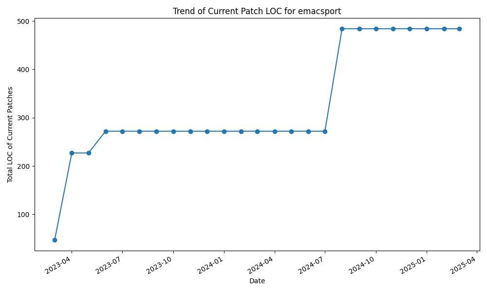

### Current Patch Details

| File | LOC |
| --- | --- |
| beta.patch | 400 |
| keyboard.c.patch | 13 |

---

### Historical Patch Event Details

| Commit Date | File | Delta LOC |
| --- | --- | --- |
| 2024-08-16 | keyboard.c.patch | 13 |
| 2024-08-16 | beta.patch | 392 |
| 2024-08-16 | configure.ac.patch | 0 |
| 2024-08-16 | dynlib.c.patch | 0 |
| 2024-08-16 | editfns.c.patch | 0 |
| 2024-08-16 | emacs-module.c.patch | 0 |
| 2024-08-16 | emacsclient.c.patch | 0 |
| 2024-08-16 | filemode.c.patch | 0 |
| 2024-08-16 | lib-src-Makefile.in.patch | 0 |
| 2024-08-16 | lisp.h.patch | 0 |
| 2024-08-16 | process.c.patch | 0 |
| 2024-08-16 | sysdep.c.patch | 0 |
| 2023-06-27 | lisp.h.patch | 13 |
| 2023-06-27 | sysdep.c.patch | 32 |
| 2023-04-13 | Makefile.in.patch | 79 |
| 2023-04-13 | dynlib.c.patch | 21 |
| 2023-04-13 | editfns.c.patch | 20 |
| 2023-04-13 | emacs-module.c.patch | 16 |
| 2023-04-13 | emacsclient.c.patch | 18 |
| 2023-04-13 | process.c.patch | 26 |
| 2023-03-11 | filemode.c.patch | 33 |
| 2023-03-10 | configure.ac.patch | 14 |

---

## Repository: opensshport

**Current Lines of Code:** 376  
**Current # of Patch files:** 19

### Trend of Current Patch LOC

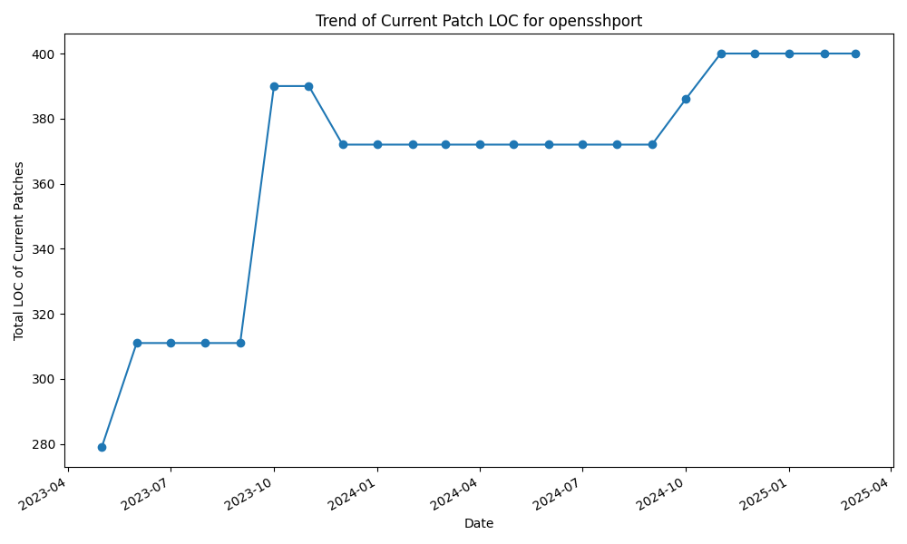

### Current Patch Details

| File | LOC |
| --- | --- |
| auth-passwd.c.patch | 16 |
| auth.c.patch | 17 |
| configure.patch | 16 |
| defines.h.patch | 17 |
| includes.h.patch | 14 |
| misc.c.patch | 56 |
| monitor_wrap.c.patch | 14 |
| packet.c.patch | 14 |
| pathnames.h.patch | 27 |
| platform.c.patch | 16 |
| readconf.c.patch | 17 |
| scp.c.patch | 22 |
| servconf.c.patch | 16 |
| sshbuf-io.c.patch | 14 |
| sshconnect.c.patch | 15 |
| sshd-session.c.patch | 37 |
| sshkey.c.patch | 14 |
| openbsd-compat/port-net.c.patch | 14 |
| openbsd-compat/xcrypt.c.patch | 20 |

---

### Historical Patch Event Details

| Commit Date | File | Delta LOC |
| --- | --- | --- |
| 2024-11-07 | sshbuf-io.c.patch | 14 |
| 2024-10-09 | sshkey.c.patch | 14 |
| 2023-12-14 | PR1.patch | 0 |
| 2023-12-14 | auth-passwd.c.patch | 16 |
| 2023-12-14 | auth.c.patch | 17 |
| 2023-12-14 | defines.h.patch | 17 |
| 2023-12-14 | includes.h.patch | 14 |
| 2023-12-14 | misc.c.patch | 56 |
| 2023-12-14 | monitor_wrap.c.patch | 14 |
| 2023-12-14 | openbsd-compat/port-net.c.patch | 14 |
| 2023-12-14 | openbsd-compat/xcrypt.c.patch | 20 |
| 2023-12-14 | packet.c.patch | 14 |
| 2023-12-14 | platform.c.patch | 16 |
| 2023-12-14 | readconf.c.patch | 17 |
| 2023-12-14 | servconf.c.patch | 16 |
| 2023-12-14 | sshconnect.c.patch | 15 |
| 2023-12-14 | sshd.c.patch | 15 |
| 2023-10-16 | pathnames.h.patch | 57 |
| 2023-10-16 | scp.c.patch | 22 |
| 2023-06-27 | configure.patch | 32 |
| 2023-05-15 | PR1.patch | 279 |

---

## Repository: flexport

**Current Lines of Code:** 351  
**Current # of Patch files:** 2

### Trend of Current Patch LOC

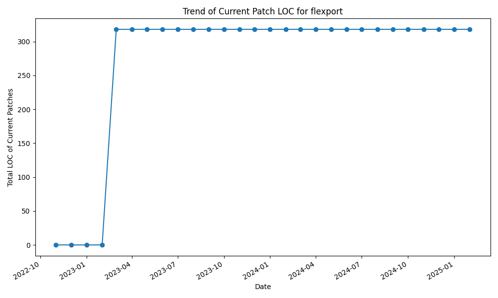

### Current Patch Details

| File | LOC |
| --- | --- |
| Makefile.in.patch | 318 |
| configure.patch | 33 |

---

### Historical Patch Event Details

| Commit Date | File | Delta LOC |
| --- | --- | --- |
| 2023-03-06 | Makefile.in.patch | 318 |
| 2022-11-25 | try.patch | 0 |
| 2022-11-25 | try.patch | 24 |
| 2022-11-25 | configure.patch | 22 |

---

## Repository: prometheusport

**Current Lines of Code:** 348  
**Current # of Patch files:** 1

### Trend of Current Patch LOC

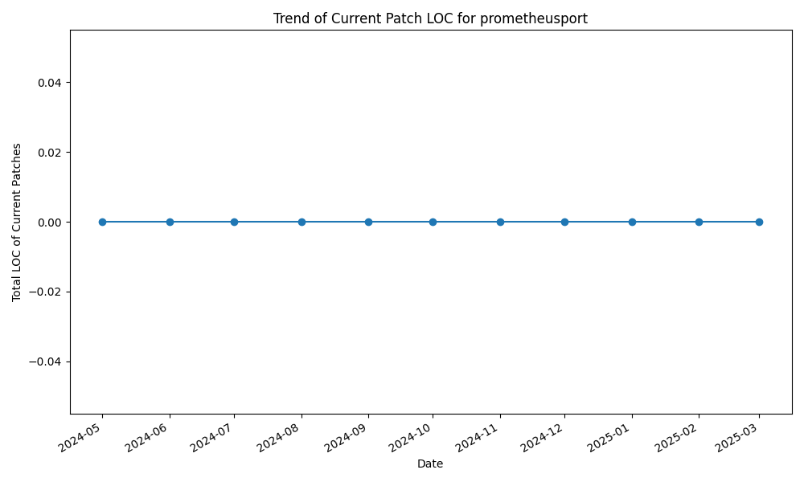

### Current Patch Details

| File | LOC |
| --- | --- |
| prometheus.patch | 348 |

---

### Historical Patch Event Details

| Commit Date | File | Delta LOC |
| --- | --- | --- |
| 2024-06-03 | wharf.patch | 0 |
| 2024-06-03 | wharf.patch | 7211 |
| 2024-05-16 | prometheus.patch | 312 |

---

## Repository: neovimport

**Current Lines of Code:** 347  
**Current # of Patch files:** 13

### Trend of Current Patch LOC

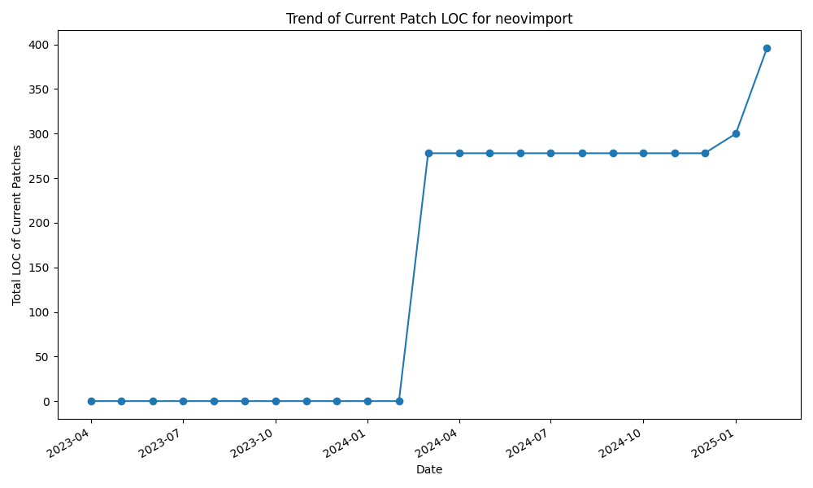

### Current Patch Details

| File | LOC |
| --- | --- |
| cmake.deps.cmake.BuildLua.cmake.patch | 39 |
| cmake.deps.cmake.BuildLuv.cmake.patch | 29 |
| cmake.deps.cmake.BuildTreesitterParsers.cmake.patch | 13 |
| cmake.deps.cmake.LibvtermCMakeLists.txt.patch | 13 |
| src.nvim.CMakeLists.txt.patch | 42 |
| src.nvim.buffer_defs.h.patch | 15 |
| src.nvim.bufwrite.c.patch | 43 |
| src.nvim.channel.c.patch | 47 |
| src.nvim.fileio.c.patch | 24 |
| src.nvim.memfile.c.patch | 13 |
| src.nvim.os.pty_process_unix.c.patch | 41 |
| src.nvim.undo.c.patch | 13 |
| src.termkey.termkey.c.patch | 15 |

---

### Historical Patch Event Details

| Commit Date | File | Delta LOC |
| --- | --- | --- |
| 2025-02-24 | src.nvim.buffer_defs.h.patch | 15 |
| 2025-02-21 | cmake.deps.cmake.BuildTreesitterParsers.cmake.patch | 13 |
| 2025-02-18 | cmake.deps.cmake.BuildLua.cmake.patch | 39 |
| 2025-02-18 | cmake.deps.cmake.BuildLuv.cmake.patch | 29 |
| 2025-01-29 | PR1.patch | 0 |
| 2025-01-29 | cmake.deps.cmake.LibvtermCMakeLists.txt.patch | 13 |
| 2025-01-29 | src.nvim.CMakeLists.txt.patch | 42 |
| 2025-01-29 | src.nvim.bufwrite.c.patch | 22 |
| 2025-01-29 | src.nvim.channel.c.patch | 47 |
| 2025-01-29 | src.nvim.fileio.c.patch | 13 |
| 2025-01-29 | src.nvim.memfile.c.patch | 13 |
| 2025-01-29 | src.nvim.os.pty_process_unix.c.patch | 122 |
| 2025-01-29 | src.nvim.undo.c.patch | 13 |
| 2025-01-29 | src.termkey.termkey.c.patch | 15 |
| 2024-03-09 | PR1.patch | 278 |

---

## Repository: pocoport

**Current Lines of Code:** 343  
**Current # of Patch files:** 9

### Trend of Current Patch LOC

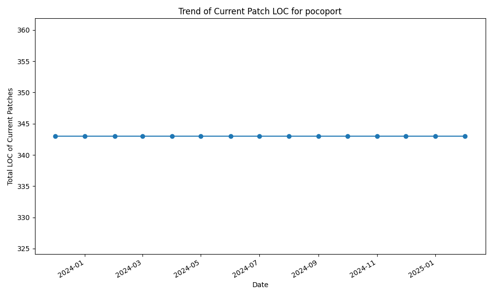

### Current Patch Details

| File | LOC |
| --- | --- |
| DirectoryWatcher.cpp.patch | 60 |
| Makefile.patch | 31 |
| Platform.h.patch | 14 |
| SharedMemory_POSIX.cpp.patch | 64 |
| Thread_POSIX.cpp.patch | 50 |
| Thread_POSIX.h.patch | 17 |
| VarHolder.h.patch | 71 |
| configure.patch | 13 |
| global.patch | 23 |

---

### Historical Patch Event Details

| Commit Date | File | Delta LOC |
| --- | --- | --- |
| 2023-12-08 | DataURIStreamFactory.cpp.patch | 0 |
| 2023-12-08 | DataURIStreamFactory.cpp.patch | 115 |
| 2023-12-08 | global.patch | 23 |
| 2023-12-06 | DirectoryWatcher.cpp.patch | 60 |
| 2023-12-06 | Makefile.patch | 31 |
| 2023-12-06 | Platform.h.patch | 14 |
| 2023-12-06 | SharedMemory_POSIX.cpp.patch | 64 |
| 2023-12-06 | Thread_POSIX.cpp.patch | 50 |
| 2023-12-06 | Thread_POSIX.h.patch | 17 |
| 2023-12-06 | VarHolder.h.patch | 71 |
| 2023-12-06 | configure.patch | 13 |

---

## Repository: rsyncport

**Current Lines of Code:** 341  
**Current # of Patch files:** 6

### Trend of Current Patch LOC

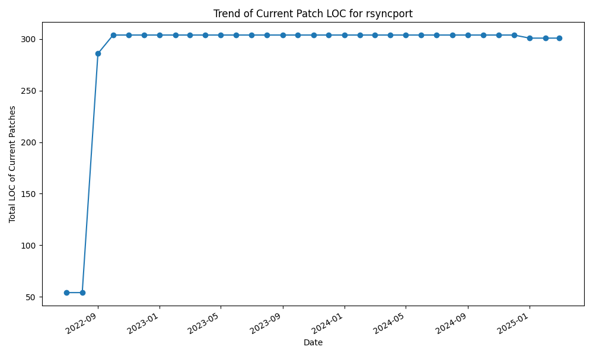

### Current Patch Details

| File | LOC |
| --- | --- |
| Makefile.in.patch | 22 |
| pipe.c.patch | 29 |
| PR1/addunistd.patch | 12 |
| PR1/rsync.h.patch | 50 |
| PR1/touchfix.patch | 11 |
| PR3/syscall.c.patch | 217 |

---

### Historical Patch Event Details

| Commit Date | File | Delta LOC |
| --- | --- | --- |
| 2025-01-22 | pipe.c.patch | 29 |
| 2025-01-20 | Makefile.in.patch | 22 |
| 2025-01-20 | PR1/configure.ac.patch | 0 |
| 2025-01-20 | PR1/popt_include.patch | 0 |
| 2025-01-20 | PR1/popt_snprintf_hack.patch | 0 |
| 2022-10-18 | PR3/sysmodes.h.patch | 0 |
| 2022-10-18 | PR3/systypes.h.patch | 0 |
| 2022-10-18 | PR1/widemode.patch | 0 |
| 2022-10-18 | PR2/syscall.c.patch | 0 |
| 2022-10-18 | PR3/ifuncs.h.patch | 0 |
| 2022-10-18 | PR3/syscall.c.patch | 209 |
| 2022-10-18 | PR3/sysmodes.h.patch | 0 |
| 2022-10-18 | PR3/systypes.h.patch | 0 |
| 2022-09-22 | PR3/ifuncs.h.patch | 101 |
| 2022-09-09 | PR2/syscall.c.patch | 68 |
| 2022-09-08 | PR1/widemode.patch | 22 |
| 2022-09-06 | PR1/configure.ac.patch | 22 |
| 2022-09-06 | PR1/removeblankdashw.patch | 0 |
| 2022-09-05 | PR1/popt_include.patch | 13 |
| 2022-09-05 | PR1/popt_snprintf_hack.patch | 19 |
| 2022-09-02 | PR1/config.patch | 0 |
| 2022-09-02 | PR1/config.patch | 16 |
| 2022-07-20 | PR1/makedev.patch | 18 |
| 2022-07-20 | PR1/addunistd.patch | 12 |
| 2022-07-20 | PR1/removeblankdashw.patch | 13 |
| 2022-07-20 | PR1/touchfix.patch | 11 |

---

## Repository: vimport

**Current Lines of Code:** 335  
**Current # of Patch files:** 12

### Trend of Current Patch LOC

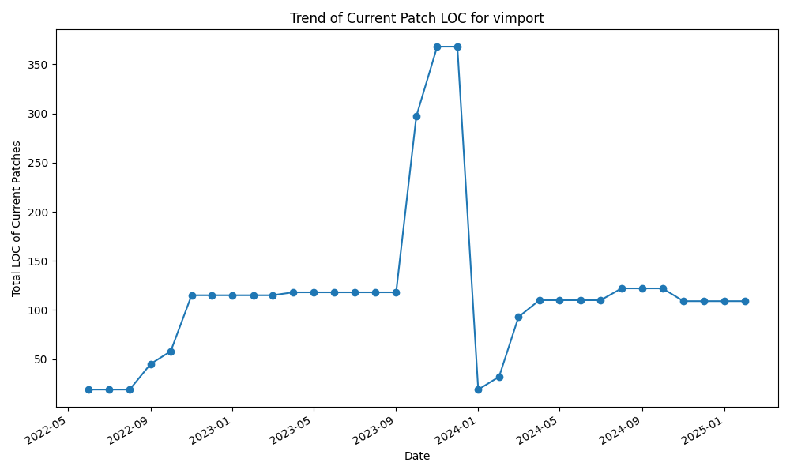

### Current Patch Details

| File | LOC |
| --- | --- |
| buffwrite.c.patch | 25 |
| evalfunc.c.patch | 18 |
| fileio.c.patch | 14 |
| os_unix.c.patch | 43 |
| pty.c.patch | 17 |
| structs.h.patch | 14 |
| test_hlsearch.vim.patch | 53 |
| test_startup.vim.patch | 34 |
| test_syntax.vim.patch | 79 |
| vim.h.patch | 12 |
| Makefile.patch | 13 |
| abendfix.patch | 13 |

---

### Historical Patch Event Details

| Commit Date | File | Delta LOC |
| --- | --- | --- |
| 2024-11-17 | vimtutor.patch | 0 |
| 2024-08-23 | vim.h.patch | 12 |
| 2024-04-18 | pty.c.patch | 17 |
| 2024-03-19 | abendfix.patch | 0 |
| 2024-03-19 | evalfunc.c.patch | 18 |
| 2024-03-19 | os_unix.c.patch | 43 |
| 2024-02-29 | vimtutor.patch | 13 |
| 2024-02-28 | Makefile.patch | 0 |
| 2024-02-28 | Makefile.xxd.patch | 0 |
| 2024-02-28 | option.patch | 0 |
| 2024-02-28 | xxd.c.patch | 0 |
| 2024-01-22 | Makefile.patch | 13 |
| 2024-01-22 | abendfix.patch | 13 |
| 2024-01-22 | buffwrite.c.patch | 29 |
| 2024-01-22 | fileio.c.patch | 14 |
| 2024-01-22 | structs.h.patch | 14 |
| 2024-01-22 | test_hlsearch.vim.patch | 53 |
| 2024-01-22 | test_startup.vim.patch | 34 |
| 2024-01-22 | test_syntax.vim.patch | 79 |
| 2024-01-22 | Makefile.patch | 13 |
| 2024-01-22 | Makefile.xxd.patch | 13 |
| 2024-01-22 | abendfix.patch | 13 |
| 2024-01-22 | buffwrite.c.patch | 29 |
| 2024-01-22 | fileio.c.patch | 14 |
| 2024-01-22 | option.patch | 29 |
| 2024-01-22 | structs.h.patch | 14 |
| 2024-01-22 | test_hlsearch.vim.patch | 53 |
| 2024-01-22 | test_startup.vim.patch | 34 |
| 2024-01-22 | test_syntax.vim.patch | 79 |
| 2024-01-22 | xxd.c.patch | 58 |
| 2024-01-22 | Makefile.patch | -13 |
| 2024-01-22 | Makefile.xxd.patch | -13 |
| 2024-01-22 | abendfix.patch | -13 |
| 2024-01-22 | buffwrite.c.patch | -29 |
| 2024-01-22 | fileio.c.patch | -14 |
| 2024-01-22 | option.patch | -29 |
| 2024-01-22 | structs.h.patch | -14 |
| 2024-01-22 | test_hlsearch.vim.patch | -53 |
| 2024-01-22 | test_startup.vim.patch | -34 |
| 2024-01-22 | test_syntax.vim.patch | -79 |
| 2024-01-22 | xxd.c.patch | -58 |
| 2023-11-21 | Makefile.xxd.patch | 13 |
| 2023-11-21 | xxd.c.patch | 58 |
| 2023-10-08 | Makefile.patch | 13 |
| 2023-10-08 | test_hlsearch.vim.patch | 53 |
| 2023-10-08 | test_startup.vim.patch | 34 |
| 2023-10-08 | test_syntax.vim.patch | 79 |
| 2023-09-11 | configure.patch | 0 |
| 2023-04-17 | PR1/term_escape.patch | 0 |
| 2023-04-17 | option.patch | 29 |
| 2022-11-29 | buffwrite.c.patch | 29 |
| 2022-11-29 | fileio.c.patch | 14 |
| 2022-11-29 | structs.h.patch | 14 |
| 2022-10-31 | abendfix.patch | 13 |
| 2022-09-29 | PR1/term_escape.patch | 26 |
| 2022-06-28 | 001.patch | 19 |

---

## Repository: phpport

**Current Lines of Code:** 320  
**Current # of Patch files:** 13

### Trend of Current Patch LOC

### Current Patch Details

| File | LOC |
| --- | --- |
| basic_functions_arginfo.h.patch | 17 |
| configure.patch | 12 |
| dns.c.patch | 14 |
| hrtime.c.patch | 15 |
| hrtime.h.patch | 26 |
| microtime.c.patch | 13 |
| net.c.patch | 15 |
| network.c.patch | 17 |
| posix.c.patch | 36 |
| sljitNativeS390X.c.patch | 34 |
| zend_alloc.c.patch | 40 |
| zend_fibers.c.patch | 31 |
| zend_mmap.h.patch | 50 |

---

### Historical Patch Event Details

| Commit Date | File | Delta LOC |
| --- | --- | --- |
| 2023-11-07 | configure.patch | 12 |
| 2023-11-06 | zend_alloc.c.patch | 40 |
| 2023-11-06 | zend_fibers.c.patch | 31 |
| 2023-11-06 | zend_mmap.h.patch | 46 |
| 2023-11-06 | zend_alloc.c.patch | -40 |
| 2023-11-06 | zend_fibers.c.patch | -31 |
| 2023-11-05 | basic_functions_arginfo.h.patch | 17 |
| 2023-11-05 | syslog.c.patch | 0 |
| 2023-03-14 | hrtime.c.patch | 15 |
| 2023-03-14 | hrtime.h.patch | 26 |
| 2023-03-12 | dns.c.patch | 14 |
| 2023-03-12 | microtime.c.patch | 13 |
| 2023-03-12 | net.c.patch | 15 |
| 2023-03-12 | network.c.patch | 17 |
| 2023-03-12 | posix.c.patch | 36 |
| 2023-03-12 | syslog.c.patch | 14 |
| 2023-03-12 | zend_alloc.c.patch | 130 |
| 2023-03-12 | zend_fibers.c.patch | 26 |
| 2023-03-12 | sljitNativeS390X.c.patch | 34 |

---

## Repository: conanport

**Current Lines of Code:** 299  
**Current # of Patch files:** 8

### Trend of Current Patch LOC

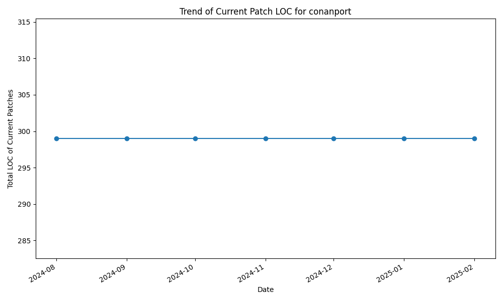

### Current Patch Details

| File | LOC |
| --- | --- |
| conan/internal/default_settings.py.patch | 27 |
| conan/internal/api/detect/detect_api.py.patch | 31 |
| conan/test/utils/tools.py.patch | 20 |
| conan/tools/build/cppstd.py.patch | 29 |
| conan/tools/build/cstd.py.patch | 22 |
| conan/tools/build/flags.py.patch | 101 |
| conan/tools/gnu/gnudeps_flags.py.patch | 13 |
| conan/tools/meson/toolchain.py.patch | 56 |

---

### Historical Patch Event Details

| Commit Date | File | Delta LOC |
| --- | --- | --- |
| 2024-08-20 | conan/internal/api/detect_api.py.patch | 31 |
| 2024-08-20 | conan/test/utils/tools.py.patch | 20 |
| 2024-08-20 | conan/tools/build/cppstd.py.patch | 29 |
| 2024-08-20 | conan/tools/build/cstd.py.patch | 22 |
| 2024-08-20 | conan/tools/build/flags.py.patch | 101 |
| 2024-08-20 | conan/tools/gnu/gnudeps_flags.py.patch | 13 |
| 2024-08-20 | conan/tools/meson/toolchain.py.patch | 56 |
| 2024-08-20 | conans/client/conf/__init__.py.patch | 27 |

---

## Repository: zipport

**Current Lines of Code:** 297  
**Current # of Patch files:** 8

### Trend of Current Patch LOC

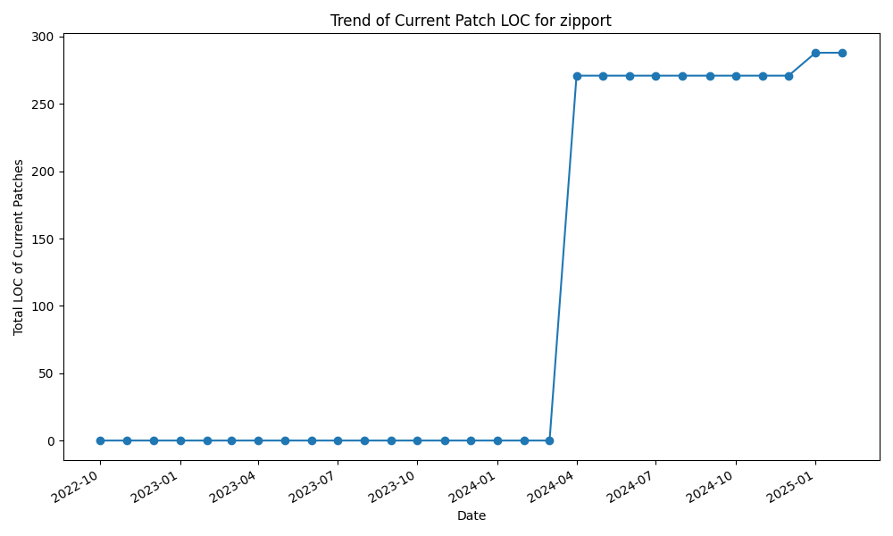

### Current Patch Details

| File | LOC |
| --- | --- |
| fileio.c.patch | 17 |
| osdep.h.patch | 13 |
| unix.c.patch | 99 |
| zip.c.patch | 17 |
| zip.h.patch | 16 |
| zipnote.c.patch | 97 |
| zipup.c.patch | 21 |
| zipup.h.patch | 17 |

---

### Historical Patch Event Details

| Commit Date | File | Delta LOC |
| --- | --- | --- |
| 2025-01-16 | fileio.c.patch | 17 |
| 2024-04-29 | osdep.h.patch | 13 |
| 2024-04-29 | unix.c.patch | 85 |
| 2024-04-29 | zip.c.patch | 22 |
| 2024-04-29 | zip.h.patch | 16 |
| 2024-04-29 | zipnote.c.patch | 97 |
| 2024-04-29 | zipup.c.patch | 21 |
| 2024-04-29 | zipup.h.patch | 17 |
| 2022-11-07 | PR1.patch | 0 |
| 2022-11-03 | PR1.patch | 11 |

---

## Repository: ninjaport

**Current Lines of Code:** 274  
**Current # of Patch files:** 9

### Trend of Current Patch LOC

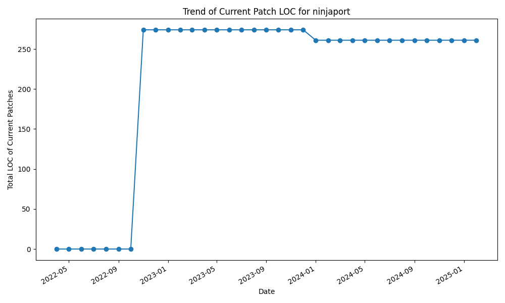

### Current Patch Details

| File | LOC |
| --- | --- |
| PR1/CMakeLists.txt.patch | 24 |
| PR1/configure.py.patch | 108 |
| PR1/src/disk_interface.cc.patch | 15 |
| PR1/src/getopt.c.patch | 13 |
| PR1/src/getopt.h.patch | 13 |
| PR1/src/manifest_parser_perftest.cc.patch | 13 |
| PR1/src/ninja.cc.patch | 13 |
| PR1/src/test.cc.patch | 40 |
| PR1/src/util.cc.patch | 35 |

---

### Historical Patch Event Details

| Commit Date | File | Delta LOC |
| --- | --- | --- |
| 2024-01-23 | PR1/CMakeLists.txt.patch | 13 |
| 2024-01-23 | PR1/configure.py.patch | 108 |
| 2024-01-23 | PR1/src/disk_interface.cc.patch | 13 |
| 2024-01-23 | PR1/src/getopt.c.patch | 13 |
| 2024-01-23 | PR1/src/getopt.h.patch | 13 |
| 2024-01-23 | PR1/src/manifest_parser_perftest.cc.patch | 13 |
| 2024-01-23 | PR1/src/ninja.cc.patch | 13 |
| 2024-01-23 | PR1/src/test.cc.patch | 40 |
| 2024-01-23 | PR1/src/util.cc.patch | 35 |
| 2024-01-23 | zos-91f99ab.patch | 0 |
| 2022-11-04 | zos-91f99ab.patch | 274 |

---

## Repository: moreutilsport

**Current Lines of Code:** 262  
**Current # of Patch files:** 5

### Trend of Current Patch LOC

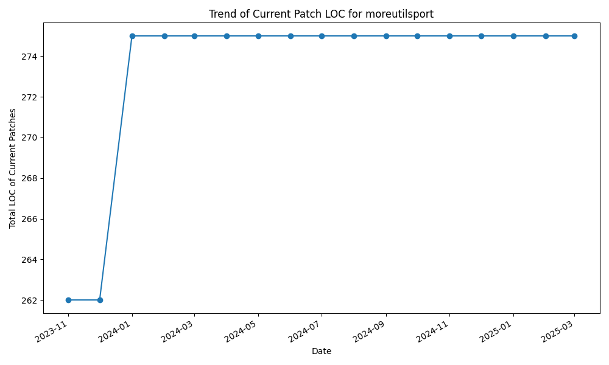

### Current Patch Details

| File | LOC |
| --- | --- |
| Makefile.patch | 22 |
| PR1.patch | 125 |
| errno.c.patch | 42 |
| is_utf8_Makefile.patch | 13 |
| perlpatches.patch | 60 |

---

### Historical Patch Event Details

| Commit Date | File | Delta LOC |
| --- | --- | --- |
| 2024-01-22 | is_utf8_Makefile.patch | 13 |
| 2023-11-02 | Makefile.patch | 22 |
| 2023-11-02 | PR1.patch | 138 |
| 2023-11-02 | errno.c.patch | 42 |
| 2023-11-02 | perlpatches.patch | 60 |

---

## Repository: gitlab-runnerport

**Current Lines of Code:** 241  
**Current # of Patch files:** 10

### Trend of Current Patch LOC

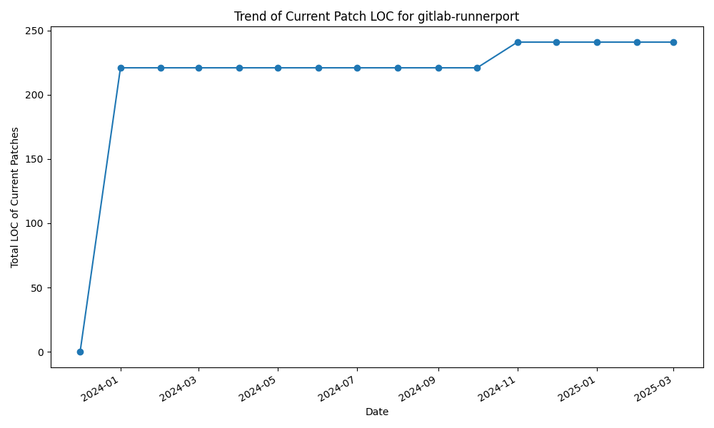

### Current Patch Details

| File | LOC |
| --- | --- |
| commander_unix.go.patch | 10 |
| config_unix.go.patch | 22 |
| dump_unix.go.patch | 22 |
| job_unix.go.patch | 22 |
| killer_unix.go.patch | 22 |
| ops_unix.go.patch | 30 |
| service_portable.go.patch | 22 |
| service_zos.go.patch | 59 |
| wrapper_unix.go.patch | 10 |
| zip_extra_unix.go.patch | 22 |

---

### Historical Patch Event Details

| Commit Date | File | Delta LOC |
| --- | --- | --- |
| 2024-11-20 | commander_unix.go.patch | 10 |
| 2024-11-20 | wrapper_unix.go.patch | 10 |
| 2024-02-18 | group_unix.go.patch | 0 |
| 2024-02-18 | job_unix.go.patch | 22 |
| 2024-01-18 | config_unix.go.patch | 22 |
| 2024-01-18 | dump_unix.go.patch | 22 |
| 2024-01-18 | group_unix.go.patch | 22 |
| 2024-01-18 | killer_unix.go.patch | 22 |
| 2024-01-18 | ops_unix.go.patch | 30 |
| 2024-01-18 | service_portable.go.patch | 22 |
| 2024-01-18 | service_zos.go.patch | 59 |
| 2024-01-18 | zip_extra_unix.go.patch | 22 |
| 2023-12-13 | fastzip.patch | 0 |
| 2023-12-13 | gitlab-runner.patch | 0 |
| 2023-12-13 | go-sockaddr.patch | 0 |
| 2023-12-13 | sys.patch | 0 |
| 2023-12-13 | fastzip.patch | 26 |
| 2023-12-13 | gitlab-runner.patch | 150 |
| 2023-12-13 | go-sockaddr.patch | 42 |
| 2023-12-13 | sys.patch | 230 |

---

## Repository: llamacppport

**Current Lines of Code:** 236  
**Current # of Patch files:** 1

### Trend of Current Patch LOC

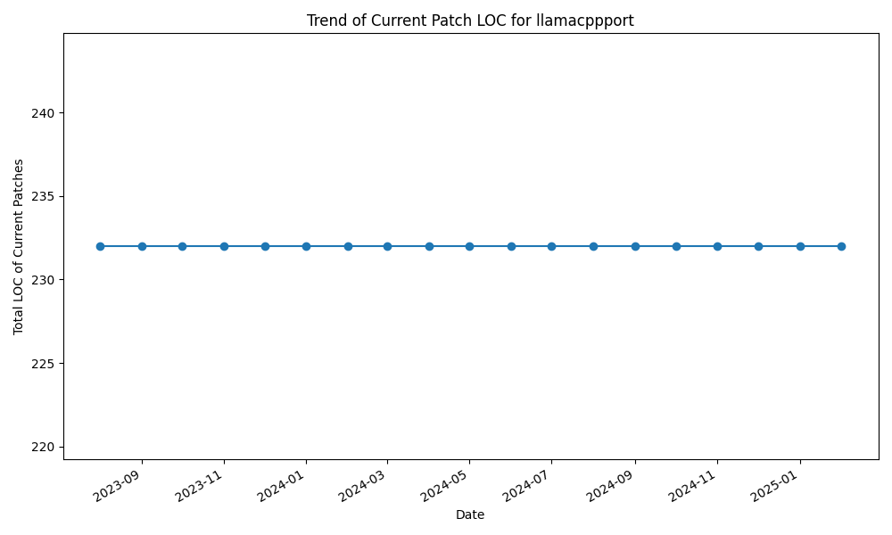

### Current Patch Details

| File | LOC |
| --- | --- |
| PR1.patch | 236 |

---

### Historical Patch Event Details

| Commit Date | File | Delta LOC |
| --- | --- | --- |
| 2023-08-21 | PR1.patch | 232 |

---

## Repository: mesonport

**Current Lines of Code:** 229  
**Current # of Patch files:** 9

### Trend of Current Patch LOC

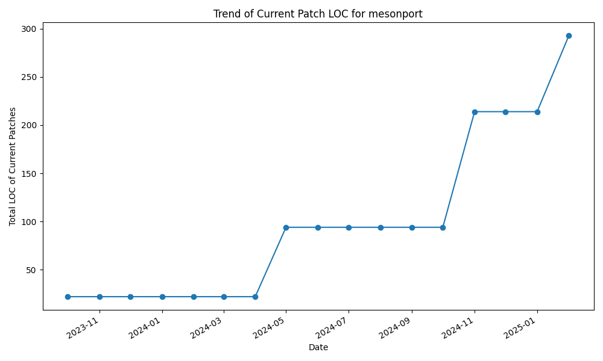

### Current Patch Details

| File | LOC |
| --- | --- |
| run_tests.py.patch | 13 |
| mesonbuild/build.py.patch | 30 |
| mesonbuild/envconfig.py.patch | 17 |
| mesonbuild/environment.py.patch | 58 |
| mesonbuild/backend/backends.py.patch | 13 |
| mesonbuild/compilers/compilers.py.patch | 13 |
| mesonbuild/compilers/detect.py.patch | 33 |
| mesonbuild/linkers/linkers.py.patch | 29 |
| mesonbuild/utils/universal.py.patch | 23 |

---

### Historical Patch Event Details

| Commit Date | File | Delta LOC |
| --- | --- | --- |
| 2025-02-10 | mesonbuild/environment.py.patch | 58 |
| 2025-02-10 | mesonbuild/linkers/detect.py.patch | 21 |
| 2024-11-01 | mesonbuild/backend/backend.py.patch | 22 |
| 2024-11-01 | mesonbuild/build.py.patch | 29 |
| 2024-11-01 | mesonbuild/compilers/compilers.py.patch | 13 |
| 2024-11-01 | mesonbuild/compilers/detect.py.patch | 28 |
| 2024-11-01 | mesonbuild/envconfig.py.patch | 57 |
| 2024-11-01 | mesonbuild/linkers/linkers.py.patch | 29 |
| 2024-11-01 | mesonbuild/utils/universal.py.patch | 23 |
| 2024-11-01 | run_tests.py.patch | 13 |
| 2024-11-01 | shared-object.patch | 0 |
| 2024-11-01 | zos.patch | 0 |
| 2024-05-15 | shared-object.patch | 72 |
| 2023-10-27 | zos.patch | 22 |

---

## Repository: zstdport

**Current Lines of Code:** 227  
**Current # of Patch files:** 4

### Trend of Current Patch LOC

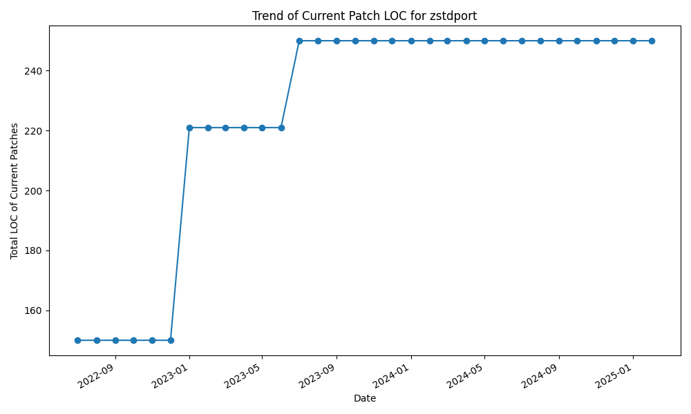

### Current Patch Details

| File | LOC |
| --- | --- |
| Makefile.patch | 29 |
| tests_Makefile.patch | 64 |
| PR1/addzostomakefile.patch | 35 |
| PR1/assertfirst.patch | 99 |

---

### Historical Patch Event Details

| Commit Date | File | Delta LOC |
| --- | --- | --- |
| 2023-07-20 | Makefile.patch | 29 |
| 2023-01-30 | tests_Makefile.patch | 71 |
| 2022-07-18 | PR1/addzostomakefile.patch | 48 |
| 2022-07-18 | PR1/assertfirst.patch | 102 |

---

## Repository: gettextport

**Current Lines of Code:** 206  
**Current # of Patch files:** 7

### Trend of Current Patch LOC

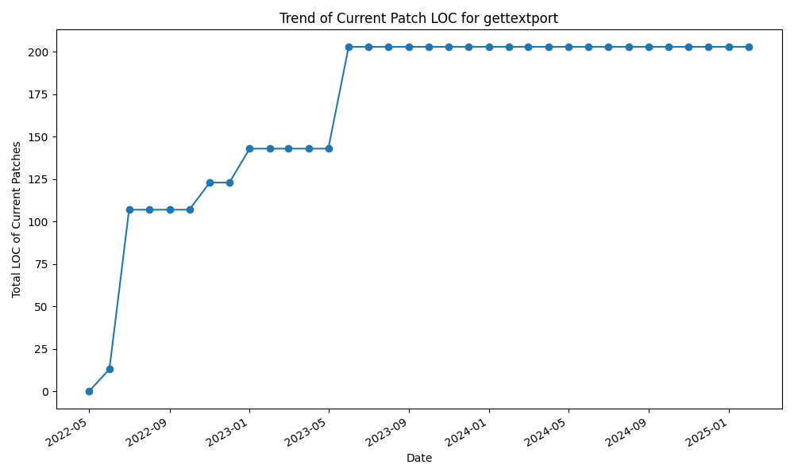

### Current Patch Details

| File | LOC |
| --- | --- |
| PR1/fetch-name-collision.patch | 31 |
| PR1/locale-name-collision.patch | 13 |
| PR1/no-pwd_gecos.patch | 50 |
| PR1/tagtarball.patch | 13 |
| PR2/dummy.c.patch | 16 |
| PR3/test-unsetenv.c.patch | 23 |
| PR4/configure.patch | 60 |

---

### Historical Patch Event Details

| Commit Date | File | Delta LOC |
| --- | --- | --- |
| 2023-06-01 | PR4/configure.patch | 60 |
| 2023-01-31 | PR3/test-unsetenv.c.patch | 20 |
| 2022-11-19 | PR2/dummy.c.patch | 16 |
| 2022-07-09 | PR1/fetch-name-collision.patch | 31 |
| 2022-07-09 | PR1/no-pwd_gecos.patch | 50 |
| 2022-07-09 | PR1/tagtarball.patch | 13 |
| 2022-06-29 | PR1/lock.patch | 0 |
| 2022-06-29 | PR1/rtlock.patch | 0 |
| 2022-06-29 | PR1/threadlock.patch | 0 |
| 2022-06-28 | PR1/locale-name-collision.patch | 13 |
| 2022-06-28 | PR1/lock.patch | 19 |
| 2022-06-28 | PR1/rtlock.patch | 0 |
| 2022-06-28 | PR1/threadlock.patch | 16 |

---

## Repository: findutilsport

**Current Lines of Code:** 199  
**Current # of Patch files:** 10

### Trend of Current Patch LOC

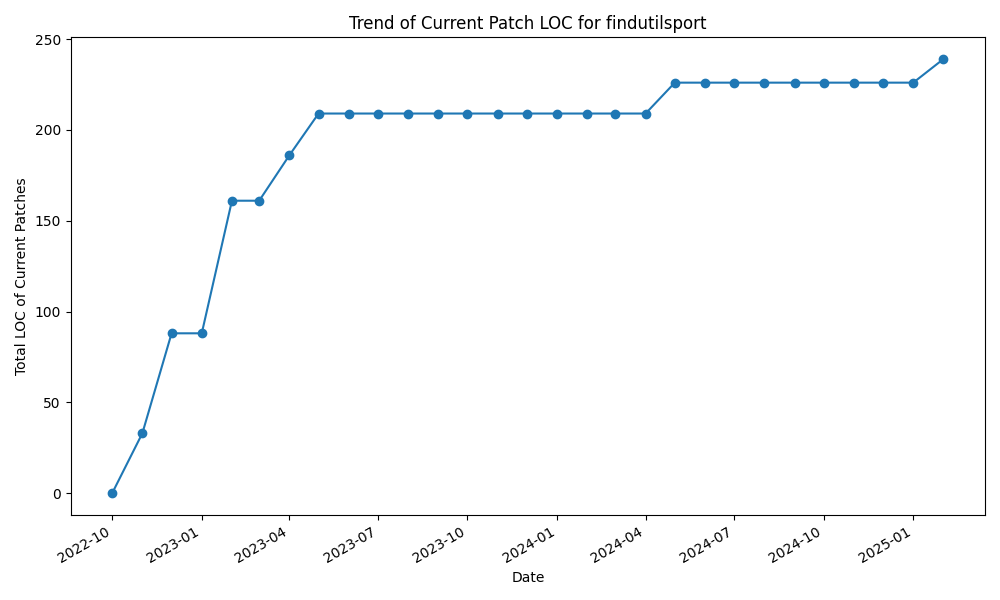

### Current Patch Details

| File | LOC |
| --- | --- |
| sched_yield_disable.patch | 13 |
| PR1/filemode.c.patch | 33 |
| PR2/PR2.patch | 14 |
| PR3/config.guess.patch | 13 |
| PR3/configure.patch | 22 |
| PR3/install-sh.patch | 19 |
| PR3/test-driver.patch | 19 |
| PR4/gl_lib_canonicalize.c.patch | 25 |
| PR4/gnulib-tests_test-unsetenv.c.patch | 24 |
| PR5/fts.c.patch | 17 |

---

### Historical Patch Event Details

| Commit Date | File | Delta LOC |
| --- | --- | --- |
| 2025-02-26 | sched_yield_disable.patch | 13 |
| 2024-05-27 | PR5/fts.c.patch | 17 |
| 2023-05-25 | PR4/gnulib-tests_test-unsetenv.c.patch | 23 |
| 2023-04-29 | PR4/gl_lib_canonicalize.c.patch | 25 |
| 2023-02-21 | PR3/config.guess.patch | 13 |
| 2023-02-21 | PR3/configure.patch | 22 |
| 2023-02-21 | PR3/install-sh.patch | 19 |
| 2023-02-21 | PR3/test-driver.patch | 19 |
| 2022-12-07 | PR2/PR2.patch | 55 |
| 2022-11-06 | PR1/filemode.c.patch | 33 |

---

## Repository: libiconvport

**Current Lines of Code:** 196  
**Current # of Patch files:** 5

### Trend of Current Patch LOC

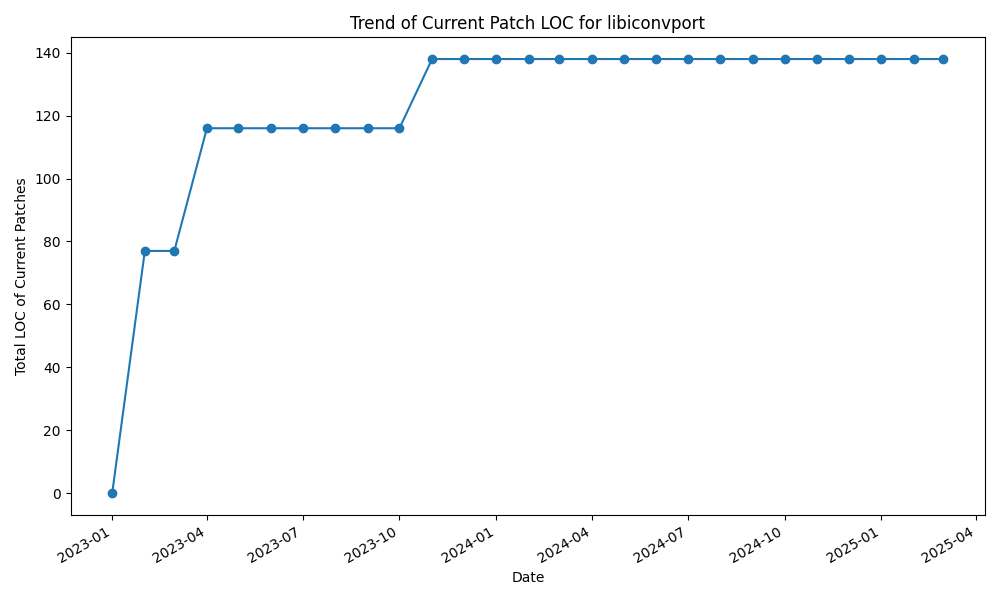

### Current Patch Details

| File | LOC |
| --- | --- |
| IBM-1047.TXT.patch | 22 |
| Makefile.in.patch | 22 |
| ebcdic1047.h.patch | 35 |
| iconv.c.patch | 78 |
| translit.def.patch | 39 |

---

### Historical Patch Event Details

| Commit Date | File | Delta LOC |
| --- | --- | --- |
| 2023-11-01 | Makefile.in.patch | 22 |
| 2023-11-01 | Makefile.in.patch | 22 |
| 2023-08-01 | iconv.c.patch | 17 |
| 2023-04-01 | translit.def.patch | 39 |
| 2023-02-12 | ebcdic1047.h.patch | 13 |
| 2023-02-12 | iconv.c.patch | 64 |

---

## Repository: diffutilsport

**Current Lines of Code:** 184  
**Current # of Patch files:** 8

### Trend of Current Patch LOC

### Current Patch Details

| File | LOC |
| --- | --- |
| cmp.c.patch | 18 |
| depcomp.patch | 30 |
| help2man.patch | 10 |
| skip_test.patch | 53 |
| PR1/config.guess.patch | 13 |
| PR2/c-file-type.c.patch | 22 |
| PR2/getprogname.c.patch | 13 |
| PR3/stdlib.in.h.patch | 25 |

---

### Historical Patch Event Details

| Commit Date | File | Delta LOC |
| --- | --- | --- |
| 2025-02-27 | PR2/c-file-type.c.patch | 22 |
| 2025-02-27 | PR2/file-type.c.patch | 0 |
| 2025-02-27 | PR2/system.h.patch | 0 |
| 2025-02-27 | skip_test.patch | 53 |
| 2024-12-09 | cmp.c.patch | 32 |
| 2024-12-09 | help2man.patch | 10 |
| 2023-11-21 | PR2/config.hin.patch | 0 |
| 2023-11-21 | PR2/intprops.h.patch | 0 |
| 2023-02-08 | depcomp.patch | 30 |
| 2022-11-04 | PR3/stdlib.in.h.patch | 25 |
| 2022-10-31 | PR2/config.hin.patch | 13 |
| 2022-10-31 | PR2/file-type.c.patch | 20 |
| 2022-10-31 | PR2/getprogname.c.patch | 13 |
| 2022-10-31 | PR2/intprops.h.patch | 13 |
| 2022-10-31 | PR2/system.h.patch | 13 |
| 2022-09-15 | PR1/config.guess.patch | 13 |

---

## Repository: protobufport

**Current Lines of Code:** 174  
**Current # of Patch files:** 8

### Trend of Current Patch LOC

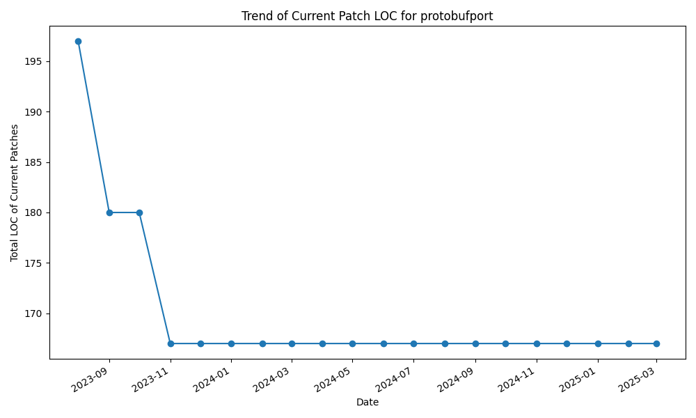

### Current Patch Details

| File | LOC |
| --- | --- |
| attributes.h.patch | 24 |
| config.h.patch | 12 |
| low_level_alloc.cc.patch | 36 |
| low_level_alloc.h.patch | 13 |
| per_thread_sem.h.patch | 20 |
| port_def.inc.patch | 22 |
| sysinfo.cc.patch | 26 |
| time_zone_libc.cc.patch | 21 |

---

### Historical Patch Event Details

| Commit Date | File | Delta LOC |
| --- | --- | --- |
| 2023-11-14 | port.h.patch | 0 |
| 2023-09-28 | waiter.h.patch | 0 |
| 2023-08-02 | attributes.h.patch | 24 |
| 2023-08-02 | config.h.patch | 24 |
| 2023-08-02 | low_level_alloc.cc.patch | 36 |
| 2023-08-02 | low_level_alloc.h.patch | 13 |
| 2023-08-02 | per_thread_sem.h.patch | 20 |
| 2023-08-02 | port.h.patch | 13 |
| 2023-08-02 | port_def.inc.patch | 13 |
| 2023-08-02 | sysinfo.cc.patch | 16 |
| 2023-08-02 | time_zone_libc.cc.patch | 21 |
| 2023-08-02 | waiter.h.patch | 17 |

---

## Repository: groffport

**Current Lines of Code:** 165  
**Current # of Patch files:** 13

### Trend of Current Patch LOC

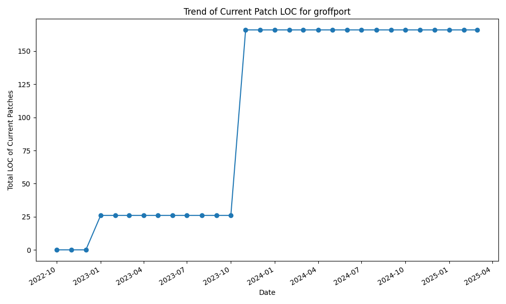

### Current Patch Details

| File | LOC |
| --- | --- |
| getopt.c.patch | 16 |
| makevarescape.sed.patch | 9 |
| assertfix/box.cpp.patch | 12 |
| assertfix/delim.cpp.patch | 12 |
| assertfix/dvi.cpp.patch | 13 |
| assertfix/lbp.cpp.patch | 12 |
| assertfix/lj4.cpp.patch | 13 |
| assertfix/pile.cpp.patch | 12 |
| assertfix/printer.cpp.patch | 13 |
| assertfix/script.cpp.patch | 12 |
| main.cpp.patch | 17 |
| pre-html.cpp.patch | 24 |
| test-driver.patch | 0 |

---

### Historical Patch Event Details

| Commit Date | File | Delta LOC |
| --- | --- | --- |
| 2023-11-23 | main.cpp.patch | 17 |
| 2023-11-23 | pre-html.cpp.patch | 24 |
| 2023-11-23 | test-driver.patch | 0 |
| 2023-11-18 | assertfix/box.cpp.patch | 12 |
| 2023-11-18 | assertfix/delim.cpp.patch | 12 |
| 2023-11-18 | assertfix/dvi.cpp.patch | 13 |
| 2023-11-18 | assertfix/lbp.cpp.patch | 12 |
| 2023-11-18 | assertfix/lj4.cpp.patch | 13 |
| 2023-11-18 | assertfix/pile.cpp.patch | 12 |
| 2023-11-18 | assertfix/printer.cpp.patch | 13 |
| 2023-11-18 | assertfix/script.cpp.patch | 12 |
| 2023-01-13 | makevarescape.sed.patch | 9 |
| 2023-01-07 | getopt.c.patch | 17 |

---

## Repository: autoconfport

**Current Lines of Code:** 151  
**Current # of Patch files:** 6

### Trend of Current Patch LOC

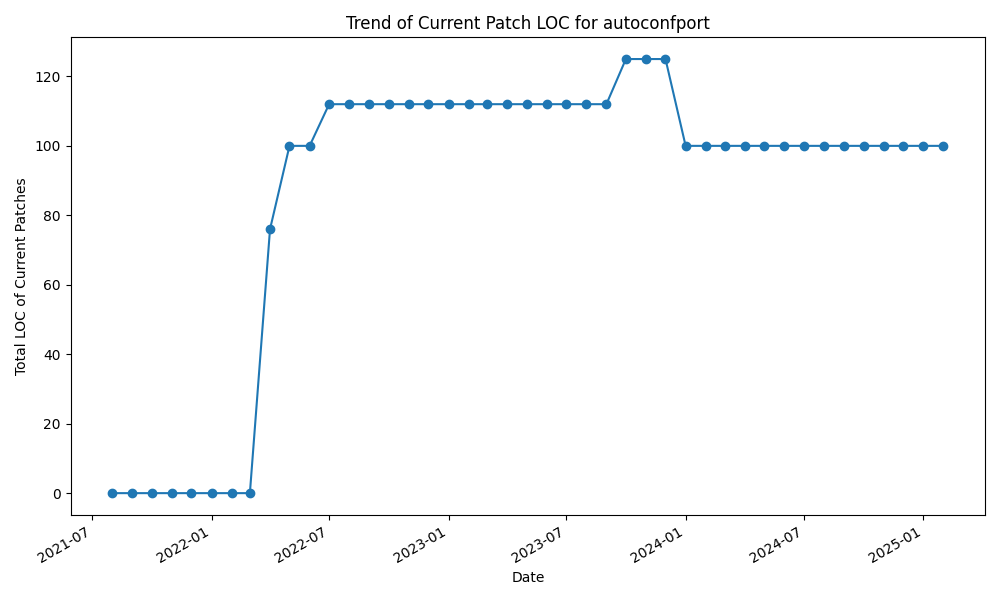

### Current Patch Details

| File | LOC |
| --- | --- |
| m4sh.m4.patch | 13 |
| PR1/config.guess.patch | 14 |
| PR1/configure.patch | 22 |
| PR1/general.m4.patch | 76 |
| PR1/local.at.patch | 13 |
| PR1/status.m4.patch | 13 |

---

### Historical Patch Event Details

| Commit Date | File | Delta LOC |
| --- | --- | --- |
| 2024-01-03 | PR2/lang.m4.patch | 0 |
| 2024-01-03 | PR3/local.at.patch | 0 |
| 2023-10-23 | m4sh.m4.patch | 13 |
| 2022-07-06 | PR3/local.at.patch | 12 |
| 2022-05-30 | PR2/lang.m4.patch | 13 |
| 2022-05-18 | PR1/config.guess.patch | 14 |
| 2022-05-18 | PR1/configure.patch | 22 |
| 2022-05-18 | PR1/general.m4.patch | 13 |
| 2022-05-18 | PR1/local.at.patch | 25 |
| 2022-05-18 | PR1/status.m4.patch | 13 |
| 2022-05-18 | build-aux/config.guess.patch | 0 |
| 2022-05-18 | configure.patch | 0 |
| 2022-05-18 | lib/autoconf/general.m4.patch | 0 |
| 2022-05-18 | lib/autoconf/status.m4.patch | 0 |
| 2022-05-18 | tests/local.at.patch | 0 |
| 2022-04-18 | lib/autoconf/status.m4.patch | 13 |
| 2022-04-18 | lib/autoconf/general.m4.patch | 13 |
| 2022-04-18 | tests/local.at.patch | 8 |
| 2022-04-18 | build-aux/config.guess.patch | 14 |
| 2022-04-18 | configure.patch | 28 |

---

## Repository: redisport

**Current Lines of Code:** 148  
**Current # of Patch files:** 1

### Trend of Current Patch LOC

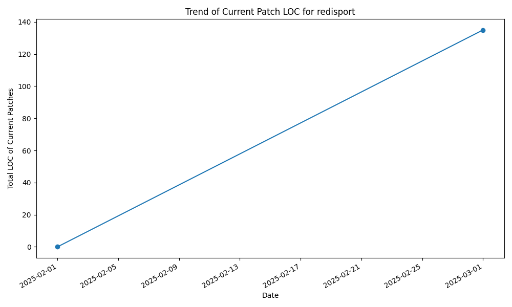

### Current Patch Details

| File | LOC |
| --- | --- |
| pr.patch | 148 |

---

### Historical Patch Event Details

| Commit Date | File | Delta LOC |
| --- | --- | --- |
| 2025-03-04 | pr.patch | 135 |

---

## Repository: jqport

**Current Lines of Code:** 146  
**Current # of Patch files:** 8

### Trend of Current Patch LOC

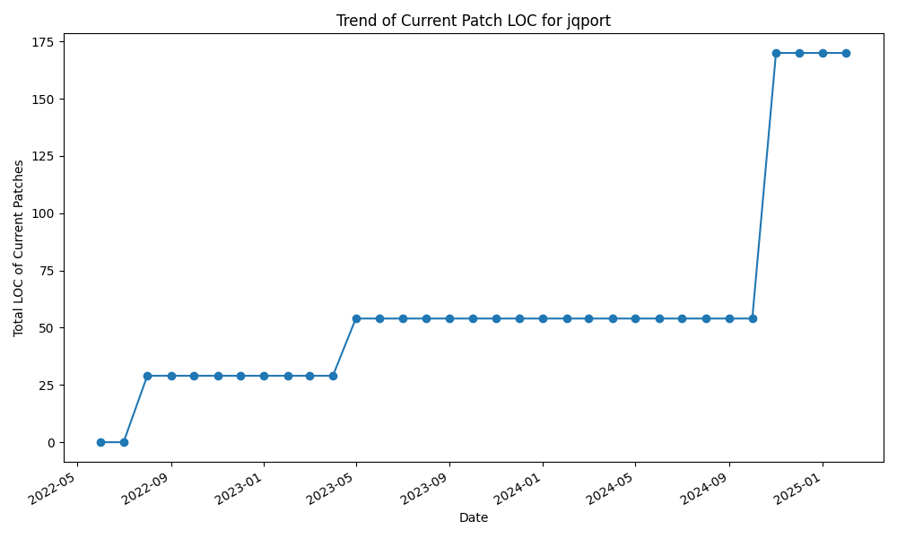

### Current Patch Details

| File | LOC |
| --- | --- |
| builtin.c.patch | 32 |
| configure.patch | 15 |
| jq_test.c.patch | 16 |
| jv_alloc.c.patch | 18 |
| mantest.patch | 10 |
| shtest.patch | 21 |
| version.patch | 19 |
| zOS.patch | 15 |

---

### Historical Patch Event Details

| Commit Date | File | Delta LOC |
| --- | --- | --- |
| 2024-11-18 | builtin.c.patch | 32 |
| 2024-11-18 | configure.patch | 15 |
| 2024-11-18 | jq_test.c.patch | 16 |
| 2024-11-18 | jv_alloc.c.patch | 18 |
| 2024-11-18 | mantest.patch | 10 |
| 2024-11-18 | shtest.patch | 21 |
| 2024-11-18 | version.patch | 19 |
| 2023-05-12 | configure.patch | 25 |
| 2022-08-13 | zOS.patch | 29 |

---

## Repository: libserdesport

**Current Lines of Code:** 142  
**Current # of Patch files:** 4

### Trend of Current Patch LOC

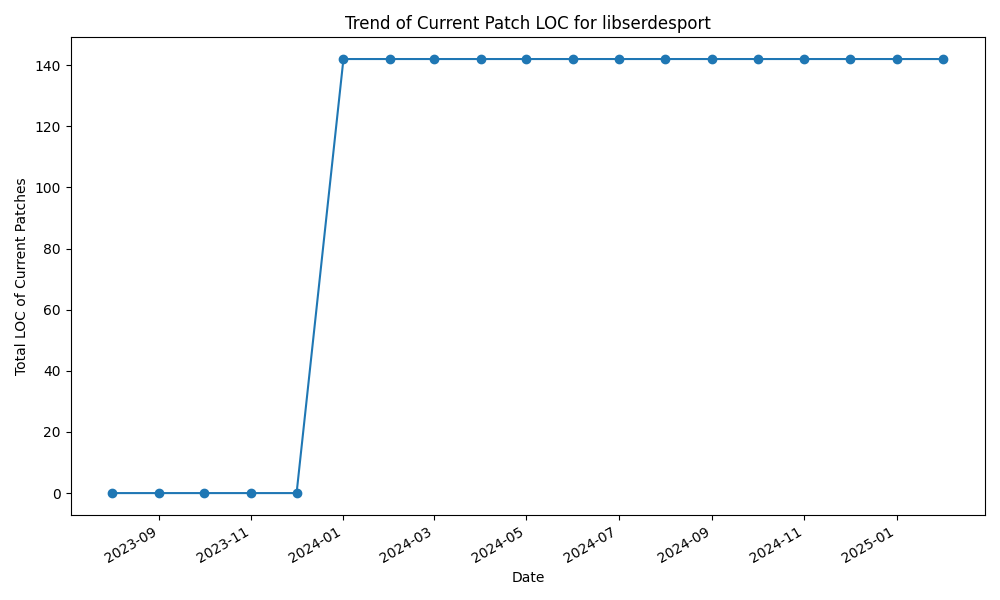

### Current Patch Details

| File | LOC |
| --- | --- |
| configure.self.patch | 13 |
| src/serdes-common.h.patch | 15 |
| src/serdes_int.h.patch | 17 |
| src/tinycthread.c.patch | 97 |

---

### Historical Patch Event Details

| Commit Date | File | Delta LOC |
| --- | --- | --- |
| 2024-01-29 | mklove/Makefile.base.patch | 0 |
| 2024-01-29 | configure.self.patch | 13 |
| 2024-01-29 | mklove/Makefile.base.patch | 31 |
| 2024-01-29 | src/serdes-common.h.patch | 15 |
| 2024-01-29 | src/serdes_int.h.patch | 17 |
| 2024-01-29 | src/tinycthread.c.patch | 97 |

---

## Repository: tclport

**Current Lines of Code:** 130  
**Current # of Patch files:** 5

### Trend of Current Patch LOC

### Current Patch Details

| File | LOC |
| --- | --- |
| PR1/namecollision.patch | 42 |
| PR1/neederrno.patch | 12 |
| PR1/remove_oe_sockets_hardcode.patch | 17 |
| PR2/tclUnixNotfy.c.patch | 15 |
| PR2/tclUnixThrd.c.patch | 44 |

---

### Historical Patch Event Details

| Commit Date | File | Delta LOC |
| --- | --- | --- |
| 2023-01-12 | PR2/tclUnixNotfy.c.patch | 15 |
| 2023-01-12 | PR2/tclUnixThrd.c.patch | 44 |
| 2022-07-18 | PR1/namecollision.patch | 43 |
| 2022-07-18 | PR1/neederrno.patch | 12 |
| 2022-07-18 | PR1/remove_oe_sockets_hardcode.patch | 17 |

---

## Repository: libgcryptport

**Current Lines of Code:** 129  
**Current # of Patch files:** 7

### Trend of Current Patch LOC

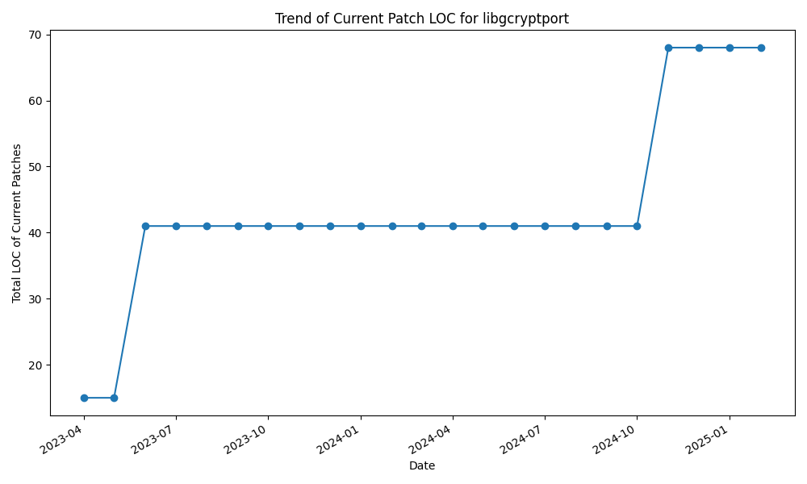

### Current Patch Details

| File | LOC |
| --- | --- |
| Makefile.in.patch | 13 |
| configure.patch | 33 |
| doc_Makefile.in.patch | 13 |
| g10lib.h.patch | 17 |
| longlong.h.patch | 22 |
| rndgetentropy.c.patch | 17 |
| secmem.c.patch | 14 |

---

### Historical Patch Event Details

| Commit Date | File | Delta LOC |
| --- | --- | --- |
| 2024-11-28 | doc_Makefile.in.patch | 13 |
| 2024-11-05 | secmem.c.patch | 14 |
| 2023-06-08 | Makefile.in.patch | 26 |
| 2023-04-26 | configure.patch | 15 |

---

## Repository: libeventport

**Current Lines of Code:** 127  
**Current # of Patch files:** 4

### Trend of Current Patch LOC

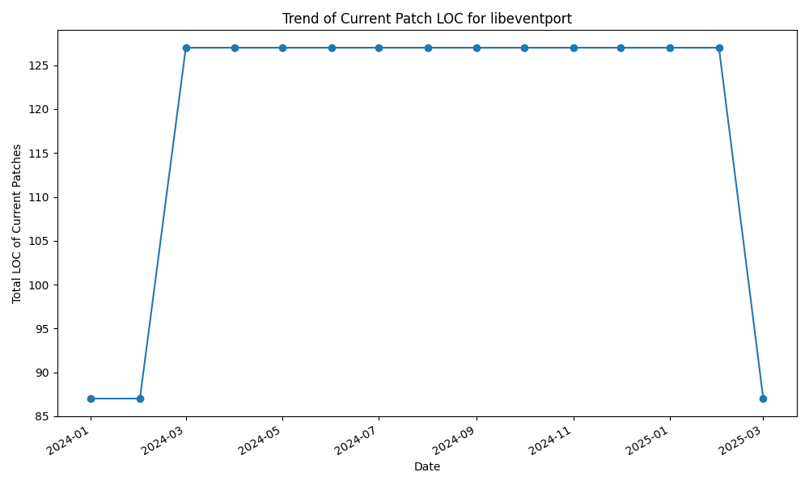

### Current Patch Details

| File | LOC |
| --- | --- |
| buffer.c.patch | 40 |
| configure.patch | 50 |
| evutil.c.patch | 15 |
| regress_http.c.patch | 22 |

---

### Historical Patch Event Details

| Commit Date | File | Delta LOC |
| --- | --- | --- |
| 2024-03-07 | buffer.c.patch | 40 |
| 2024-01-02 | configure.patch | 50 |
| 2024-01-02 | evutil.c.patch | 15 |
| 2024-01-02 | regress_http.c.patch | 22 |

---

## Repository: pinentryport

**Current Lines of Code:** 124  
**Current # of Patch files:** 5

### Trend of Current Patch LOC

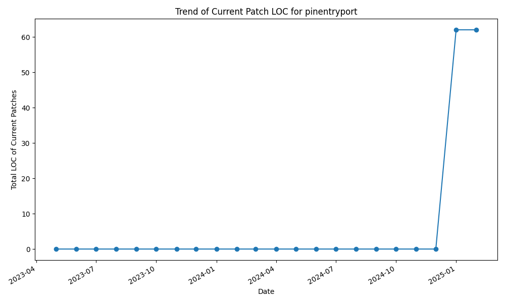

### Current Patch Details

| File | LOC |
| --- | --- |
| configure.ac.patch | 20 |
| configure.patch | 32 |
| pinentry-emacs.c.patch | 15 |
| pinentry.c.patch | 15 |
| secmem.c.patch | 42 |

---

### Historical Patch Event Details

| Commit Date | File | Delta LOC |
| --- | --- | --- |
| 2025-01-28 | configure.ac.patch | 20 |
| 2025-01-28 | secmem.c.patch | 42 |

---

## Repository: libssh2port

**Current Lines of Code:** 122  
**Current # of Patch files:** 5

### Trend of Current Patch LOC

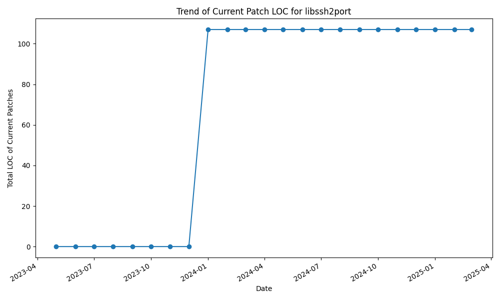

### Current Patch Details

| File | LOC |
| --- | --- |
| configure.patch | 15 |
| libssh2_setup.h.patch | 23 |
| openssh_fixture.c.patch | 57 |
| scp_write_nonblock.c.patch | 12 |
| session_fixture.c.patch | 15 |

---

### Historical Patch Event Details

| Commit Date | File | Delta LOC |
| --- | --- | --- |
| 2024-01-02 | libssh2_setup.h.patch | 23 |
| 2024-01-02 | openssh_fixture.c.patch | 57 |
| 2024-01-02 | scp_write_nonblock.c.patch | 12 |
| 2024-01-02 | session_fixture.c.patch | 15 |
| 2023-05-10 | configure.patch | 15 |

---

## Repository: m4port

**Current Lines of Code:** 120  
**Current # of Patch files:** 5

### Trend of Current Patch LOC

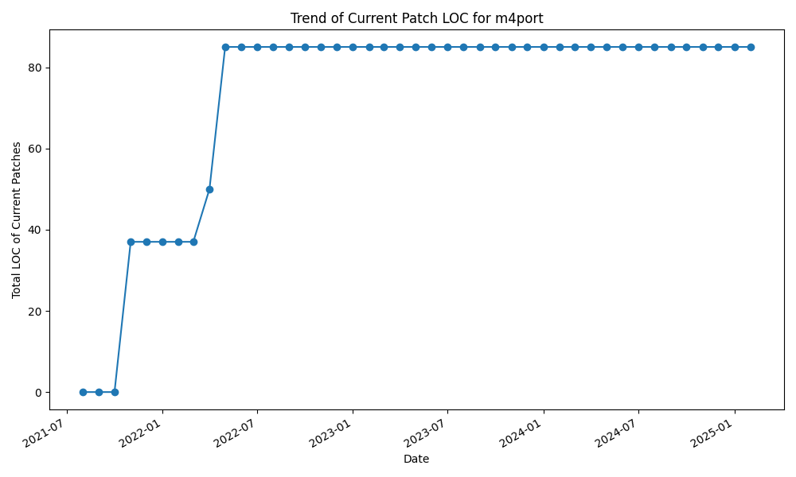

### Current Patch Details

| File | LOC |
| --- | --- |
| PR2/builtin.c.patch | 55 |
| PR2/canonicalize-lgpl.c.patch | 22 |
| PR2/configure.patch | 13 |
| PR4/doc/m4.texi.patch | 17 |
| PR4/src/format.c.patch | 13 |

---

### Historical Patch Event Details

| Commit Date | File | Delta LOC |
| --- | --- | --- |
| 2022-05-20 | PR2/builtin.c.patch | 0 |
| 2022-05-20 | PR2/canonicalize-lgpl.c.patch | 22 |
| 2022-05-20 | PR2/configure.patch | 13 |
| 2022-04-28 | configure.patch | 13 |
| 2021-11-09 | builtin.patch | 37 |
| 2021-08-11 | canonicalize-lgpl.patch | 36 |

---

## Repository: thesilversearcherport

**Current Lines of Code:** 118  
**Current # of Patch files:** 4

### Trend of Current Patch LOC

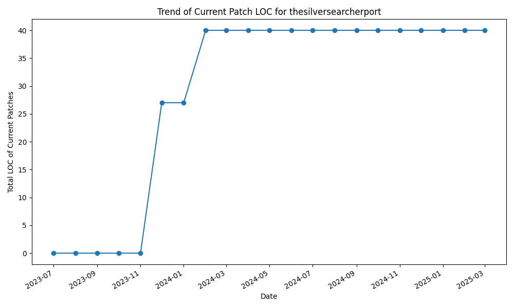

### Current Patch Details

| File | LOC |
| --- | --- |
| genlib.sh.patch | 77 |
| main.c.patch | 14 |
| options.c.patch | 13 |
| print.c.patch | 14 |

---

### Historical Patch Event Details

| Commit Date | File | Delta LOC |
| --- | --- | --- |
| 2024-02-13 | options.c.patch | 13 |
| 2023-12-03 | main.c.patch | 13 |
| 2023-12-03 | print.c.patch | 14 |
| 2023-07-18 | genlib.sh.patch | 77 |

---

## Repository: grepport

**Current Lines of Code:** 115  
**Current # of Patch files:** 3

### Trend of Current Patch LOC

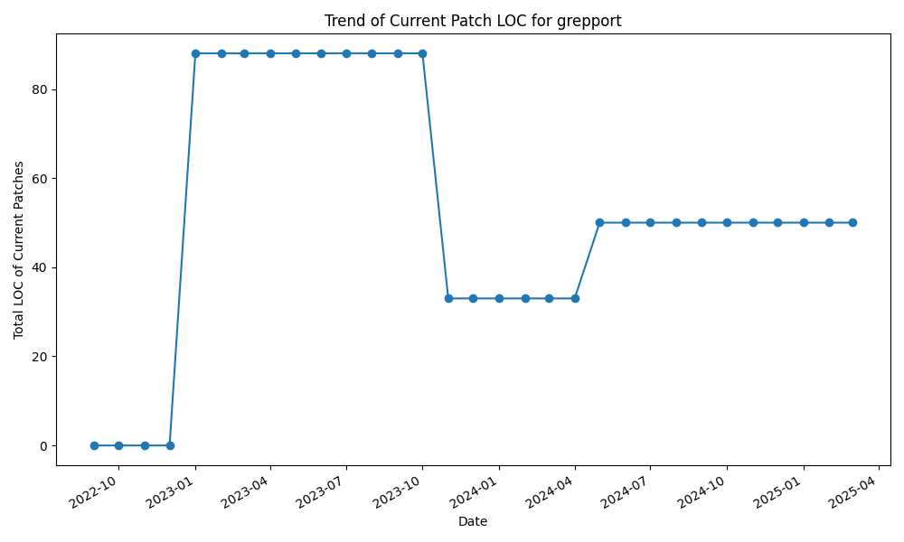

### Current Patch Details

| File | LOC |
| --- | --- |
| fts.c.patch | 17 |
| gnulib.patch | 14 |
| grep.c.patch | 84 |

---

### Historical Patch Event Details

| Commit Date | File | Delta LOC |
| --- | --- | --- |
| 2024-05-28 | fts.c.patch | 17 |
| 2024-01-03 | gnulib.patch | 14 |
| 2023-11-03 | gnulib.patch | -14 |
| 2023-01-24 | gnulib.patch | 55 |
| 2023-01-22 | grep.c.patch | 33 |

---

## Repository: ncursesport

**Current Lines of Code:** 111  
**Current # of Patch files:** 2

### Trend of Current Patch LOC

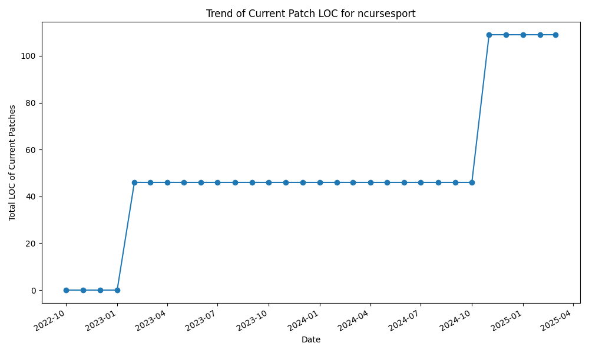

### Current Patch Details

| File | LOC |
| --- | --- |
| TERMINFO.patch | 48 |
| clear.c.patch | 63 |

---

### Historical Patch Event Details

| Commit Date | File | Delta LOC |
| --- | --- | --- |
| 2024-11-01 | clear.c.patch | 63 |
| 2023-02-14 | TERMINFO.patch | 46 |

---

## Repository: hexcurseport

**Current Lines of Code:** 108  
**Current # of Patch files:** 4

### Trend of Current Patch LOC

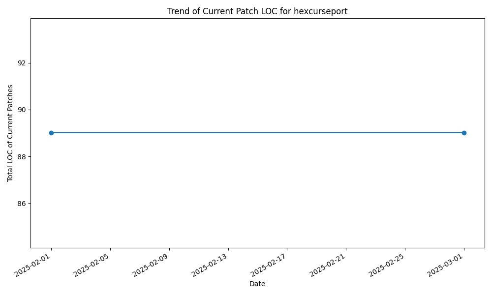

### Current Patch Details

| File | LOC |
| --- | --- |
| file.c.patch | 47 |
| hex.h.patch | 12 |
| hexcurse.c.patch | 22 |
| screen.c.patch | 27 |

---

### Historical Patch Event Details

| Commit Date | File | Delta LOC |
| --- | --- | --- |
| 2025-02-09 | hexcurse.c.patch | 13 |
| 2025-02-09 | screen.c.patch | 27 |
| 2025-02-09 | file.c.patch | 37 |
| 2025-02-09 | hex.h.patch | 12 |

---

## Repository: libbsdport

**Current Lines of Code:** 107  
**Current # of Patch files:** 4

### Trend of Current Patch LOC

### Current Patch Details

| File | LOC |
| --- | --- |
| configure.ac.patch | 57 |
| src/fgetln.c.patch | 11 |
| src/flopen.c.patch | 15 |
| src/readpassphrase.c.patch | 24 |

---

### Historical Patch Event Details

| Commit Date | File | Delta LOC |
| --- | --- | --- |
| 2024-01-30 | src/progname.c.patch | 0 |
| 2024-01-29 | configure.ac.patch | 34 |
| 2024-01-29 | src/fgetln.c.patch | 11 |
| 2024-01-29 | src/flopen.c.patch | 19 |
| 2024-01-29 | src/progname.c.patch | 23 |
| 2024-01-29 | src/readpassphrase.c.patch | 24 |

---

## Repository: victoriametricsport

**Current Lines of Code:** 107  
**Current # of Patch files:** 3

### Trend of Current Patch LOC

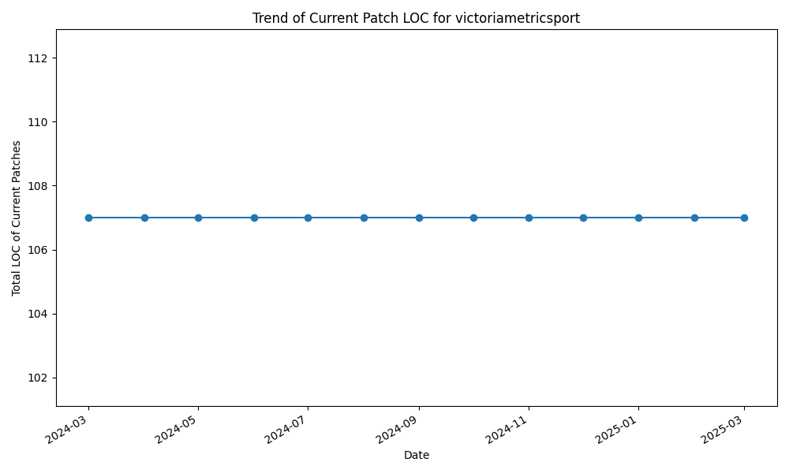

### Current Patch Details

| File | LOC |
| --- | --- |
| lib_filestream.patch | 36 |
| lib_fs.patch | 34 |
| lib_memory.patch | 37 |

---

### Historical Patch Event Details

| Commit Date | File | Delta LOC |
| --- | --- | --- |
| 2024-03-04 | lib_filestream.patch | 36 |
| 2024-03-04 | lib_fs.patch | 34 |
| 2024-03-04 | lib_memory.patch | 37 |

---

## Repository: zlib-ngport

**Current Lines of Code:** 100  
**Current # of Patch files:** 3

### Trend of Current Patch LOC

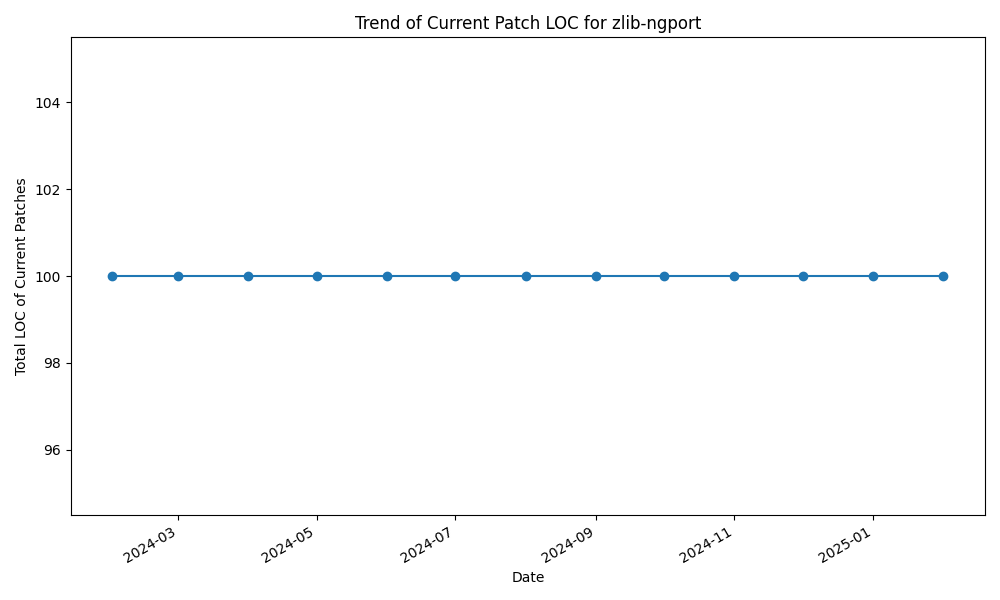

### Current Patch Details

| File | LOC |
| --- | --- |
| Makefile.in.patch | 56 |
| zbuild.h.patch | 22 |
| zutil_p.h.patch | 22 |

---

### Historical Patch Event Details

| Commit Date | File | Delta LOC |
| --- | --- | --- |
| 2024-02-02 | Makefile.in.patch | 56 |
| 2024-02-02 | zbuild.h.patch | 22 |
| 2024-02-02 | zutil_p.h.patch | 22 |

---

## Repository: pkgconfigport

**Current Lines of Code:** 98  
**Current # of Patch files:** 1

### Trend of Current Patch LOC

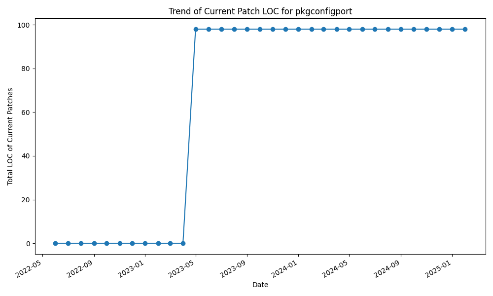

### Current Patch Details

| File | LOC |
| --- | --- |
| PR1.patch | 98 |

---

### Historical Patch Event Details

| Commit Date | File | Delta LOC |
| --- | --- | --- |
| 2023-05-09 | PR1.patch | 98 |
| 2023-05-09 | configure.patch | 0 |
| 2023-05-09 | configure.patch | 15 |

---

## Repository: doxygenport

**Current Lines of Code:** 97  
**Current # of Patch files:** 5

### Trend of Current Patch LOC

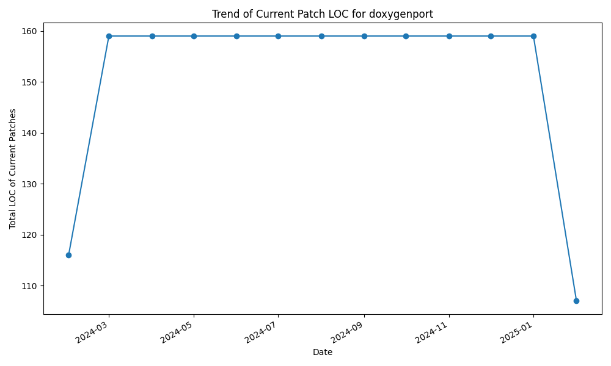

### Current Patch Details

| File | LOC |
| --- | --- |
| filesystem.hpp.patch | 32 |
| latexgen.cpp.patch | 18 |
| runtests.py.patch | 16 |
| types.h.patch | 13 |
| util.cpp.patch | 18 |

---

### Historical Patch Event Details

| Commit Date | File | Delta LOC |
| --- | --- | --- |
| 2025-02-02 | CMakeLists.txt.patch | 0 |
| 2025-02-02 | CMakeListsTest.txt.patch | 0 |
| 2025-02-02 | os-inl.h.patch | 0 |
| 2024-03-11 | runtests.py.patch | 26 |
| 2024-03-08 | CMakeListsTest.txt.patch | 17 |
| 2024-02-15 | CMakeLists.txt.patch | 13 |
| 2024-02-15 | filesystem.hpp.patch | 32 |
| 2024-02-15 | latexgen.cpp.patch | 18 |
| 2024-02-15 | os-inl.h.patch | 22 |
| 2024-02-15 | types.h.patch | 13 |
| 2024-02-15 | util.cpp.patch | 18 |

---

## Repository: depot_toolsport

**Current Lines of Code:** 91  
**Current # of Patch files:** 1

### Trend of Current Patch LOC

### Current Patch Details

| File | LOC |
| --- | --- |
| zos.patch | 91 |

---

### Historical Patch Event Details

| Commit Date | File | Delta LOC |
| --- | --- | --- |
| 2024-12-27 | zos.patch | 91 |
| 2024-12-27 | zos_debug.patch | 0 |
| 2024-12-17 | pyth312.patch | 0 |
| 2024-12-17 | zos_debug.patch | 197 |
| 2024-07-26 | pyth312.patch | 60 |
| 2024-07-26 | pyth312.patch | -60 |
| 2024-07-25 | pyth312.patch | 47 |
| 2024-02-26 | requirements.patch | 0 |
| 2024-02-23 | cipd.patch | 0 |
| 2024-02-23 | detect_host_arch.py.patch | 0 |
| 2024-02-23 | download_from_google_storage.py.patch | 0 |
| 2024-02-23 | gclient.py.patch | 0 |
| 2024-02-23 | gclient_paths.py.patch | 0 |
| 2024-02-23 | gclient_utils.py.patch | 0 |
| 2024-02-23 | vpython3.patch | 0 |
| 2024-02-22 | setenv.patch | 0 |
| 2024-02-15 | setenv.patch | 24 |
| 2024-02-13 | requirements.patch | 8 |
| 2023-11-10 | cipd.patch | 32 |
| 2023-11-10 | detect_host_arch.py.patch | 13 |
| 2023-11-10 | download_from_google_storage.py.patch | 12 |
| 2023-11-10 | gclient.py.patch | 28 |
| 2023-11-10 | gclient_paths.py.patch | 13 |
| 2023-11-10 | gclient_utils.py.patch | 23 |
| 2023-11-10 | vpython3.patch | 14 |

---

## Repository: patchport

**Current Lines of Code:** 86  
**Current # of Patch files:** 3

### Trend of Current Patch LOC

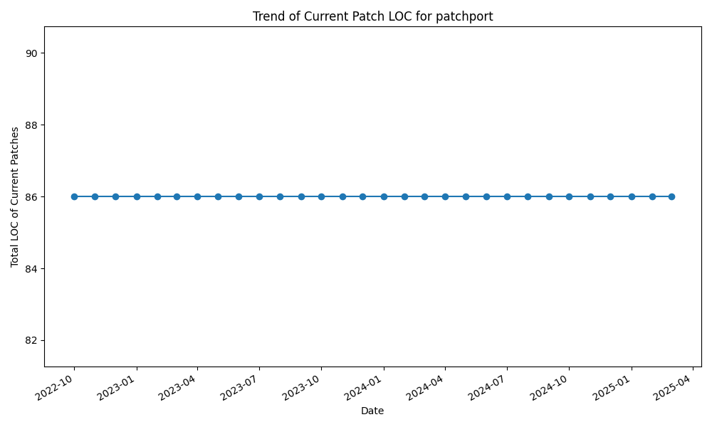

### Current Patch Details

| File | LOC |
| --- | --- |
| PR1/pathmax.h.patch | 14 |
| PR1/string.in.h.patch | 60 |
| PR1/util.c.patch | 12 |

---

### Historical Patch Event Details

| Commit Date | File | Delta LOC |
| --- | --- | --- |
| 2022-10-18 | PR1/pathmax.h.patch | 14 |
| 2022-10-18 | PR1/string.in.h.patch | 60 |
| 2022-10-18 | PR1/util.c.patch | 12 |

---

## Repository: gawkport

**Current Lines of Code:** 81  
**Current # of Patch files:** 4

### Trend of Current Patch LOC

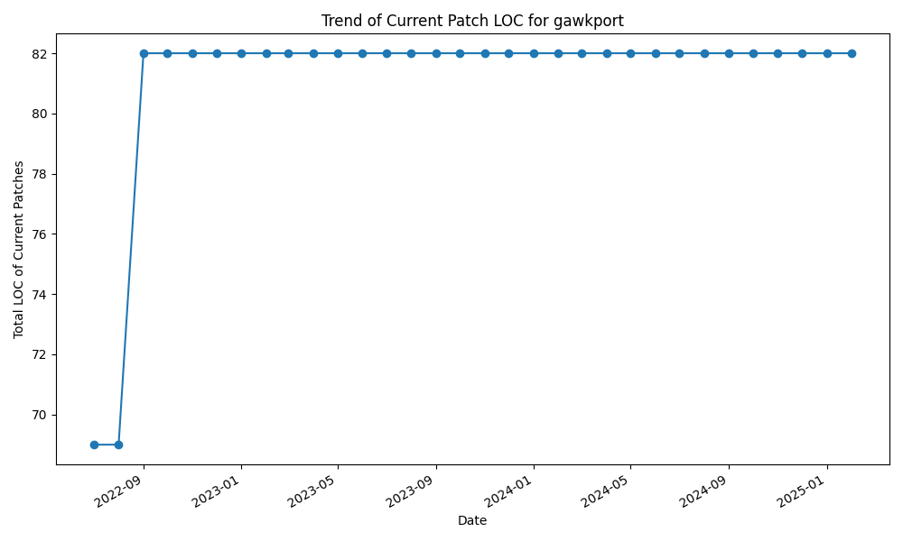

### Current Patch Details

| File | LOC |
| --- | --- |
| PR1/ascii-io.patch | 39 |
| PR1/noprotoscope.patch | 16 |
| PR1/zosdoesnotmeanebcdic.patch | 13 |
| PR2/install-sh.patch | 13 |

---

### Historical Patch Event Details

| Commit Date | File | Delta LOC |
| --- | --- | --- |
| 2022-09-16 | PR2/install-sh.patch | 13 |
| 2022-07-20 | PR1/ascii-io.patch | 39 |
| 2022-07-17 | PR1/zosdoesnotmeanebcdic.patch | 13 |
| 2022-07-17 | PR1/noprotoscope.patch | 17 |

---

## Repository: getoptport

**Current Lines of Code:** 79  
**Current # of Patch files:** 1

### Trend of Current Patch LOC

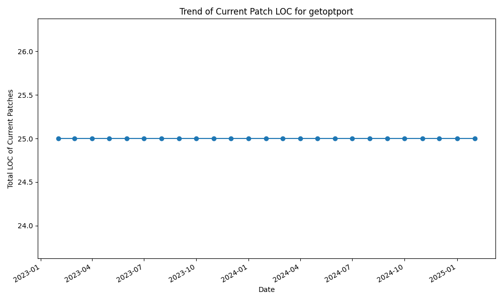

### Current Patch Details

| File | LOC |
| --- | --- |
| Makefile.patch | 79 |

---

### Historical Patch Event Details

| Commit Date | File | Delta LOC |
| --- | --- | --- |
| 2023-02-10 | Makefile.patch | 25 |

---

## Repository: expectport

**Current Lines of Code:** 79  
**Current # of Patch files:** 4

### Trend of Current Patch LOC

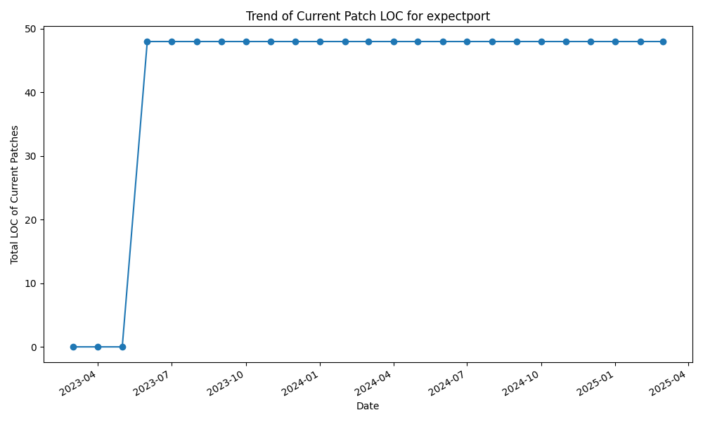

### Current Patch Details

| File | LOC |
| --- | --- |
| Makefile.in.patch | 14 |
| configure.patch | 17 |
| exp_clib.c.patch | 12 |
| pty_termios.c.patch | 36 |

---

### Historical Patch Event Details

| Commit Date | File | Delta LOC |
| --- | --- | --- |
| 2023-06-19 | exp_clib.c.patch | 12 |
| 2023-06-19 | pty_termios.c.patch | 36 |
| 2023-03-27 | Makefile.in.patch | 14 |
| 2023-03-27 | configure.patch | 17 |

---

## Repository: librabbitmqport

**Current Lines of Code:** 78  
**Current # of Patch files:** 2

### Trend of Current Patch LOC

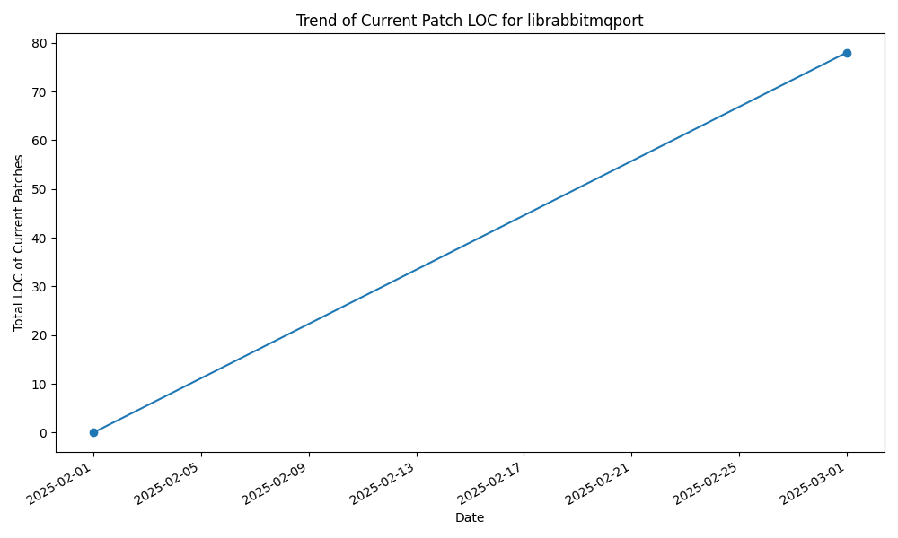

### Current Patch Details

| File | LOC |
| --- | --- |
| CMakeLists.txt.patch | 37 |
| librabbitmq_CMakeLists.txt.patch | 41 |

---

### Historical Patch Event Details

| Commit Date | File | Delta LOC |
| --- | --- | --- |
| 2025-03-05 | CMakeLists.txt.patch | 37 |
| 2025-03-05 | librabbitmq_CMakeLists.txt.patch | 41 |

---

## Repository: libassuanport

**Current Lines of Code:** 77  
**Current # of Patch files:** 4

### Trend of Current Patch LOC

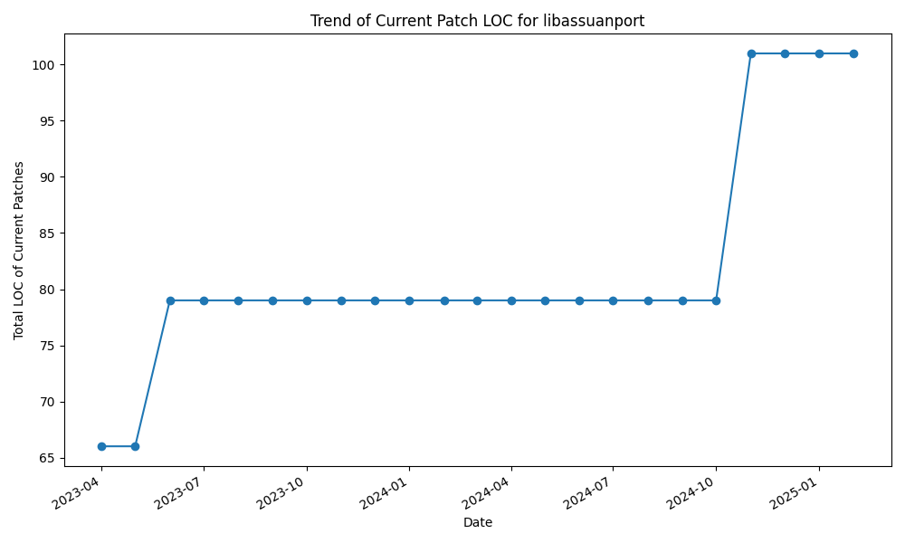

### Current Patch Details

| File | LOC |
| --- | --- |
| Makefile.in.patch | 13 |
| assuan-defs.h.patch | 22 |
| assuan-socket.c.patch | 15 |
| configure.patch | 27 |

---

### Historical Patch Event Details

| Commit Date | File | Delta LOC |
| --- | --- | --- |
| 2024-11-15 | assuan-defs.h.patch | 22 |
| 2023-06-07 | Makefile.in.patch | 13 |
| 2023-04-27 | assuan-socket.c.patch | 15 |
| 2023-04-27 | configure.patch | 51 |

---

## Repository: xmltoport

**Current Lines of Code:** 74  
**Current # of Patch files:** 1

### Trend of Current Patch LOC

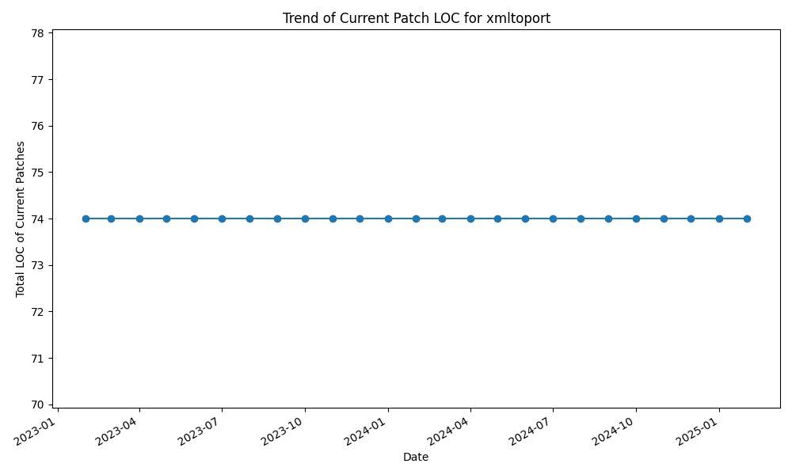

### Current Patch Details

| File | LOC |
| --- | --- |
| configure.patch | 74 |

---

### Historical Patch Event Details

| Commit Date | File | Delta LOC |
| --- | --- | --- |
| 2023-02-13 | xmlto.in.patch | 0 |
| 2023-02-12 | configure.patch | 74 |
| 2023-02-10 | xmlto.in.patch | 25 |

---

## Repository: cppcheckport

**Current Lines of Code:** 72  
**Current # of Patch files:** 4

### Trend of Current Patch LOC

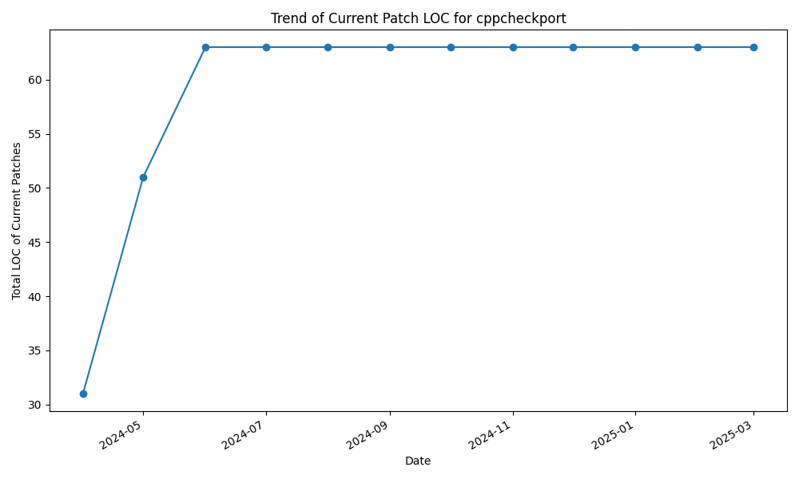

### Current Patch Details

| File | LOC |
| --- | --- |
| compilerDefinitions.cmake.patch | 9 |
| library.cpp.patch | 12 |
| path.cpp.patch | 33 |
| programmemory.cpp.patch | 18 |

---

### Historical Patch Event Details

| Commit Date | File | Delta LOC |
| --- | --- | --- |
| 2024-06-18 | library.cpp.patch | 12 |
| 2024-05-15 | path.cpp.patch | 24 |
| 2024-05-14 | findDependencies.cmake.patch | 0 |
| 2024-05-13 | compilerDefinitions.cmake.patch | 9 |
| 2024-04-24 | findDependencies.cmake.patch | 13 |
| 2024-04-24 | programmemory.cpp.patch | 18 |

---

## Repository: libtoolport

**Current Lines of Code:** 71  
**Current # of Patch files:** 3

### Trend of Current Patch LOC

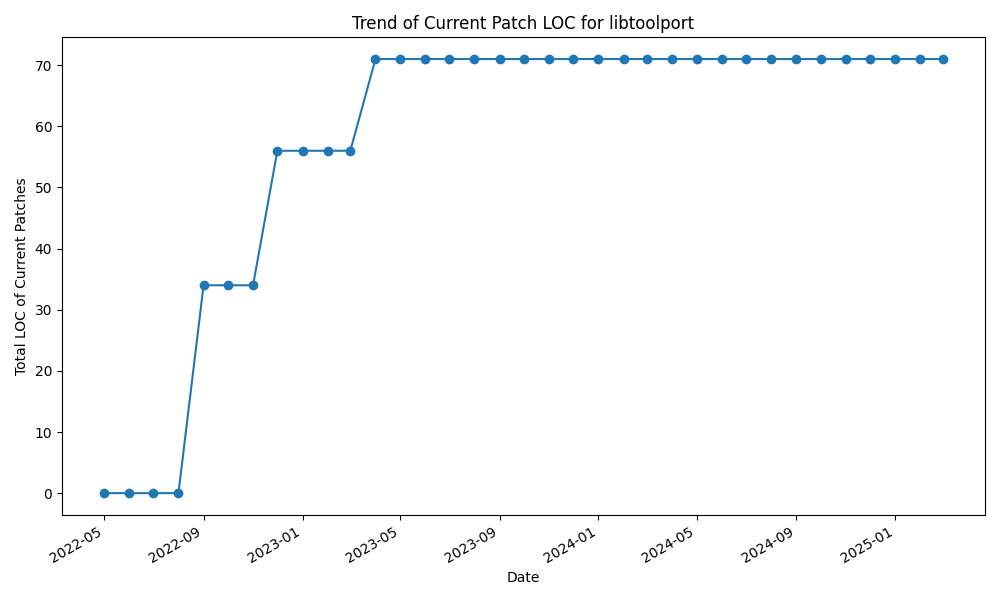

### Current Patch Details

| File | LOC |
| --- | --- |
| configure.patch | 22 |
| libtool.m4.patch | 15 |
| ltmain.sh.patch | 34 |

---

### Historical Patch Event Details

| Commit Date | File | Delta LOC |
| --- | --- | --- |
| 2023-04-28 | libtool.m4.patch | 15 |
| 2022-12-01 | configure.patch | 22 |
| 2022-09-07 | ltmain.sh.patch | 34 |

---

## Repository: nanoport

**Current Lines of Code:** 68  
**Current # of Patch files:** 1

### Trend of Current Patch LOC

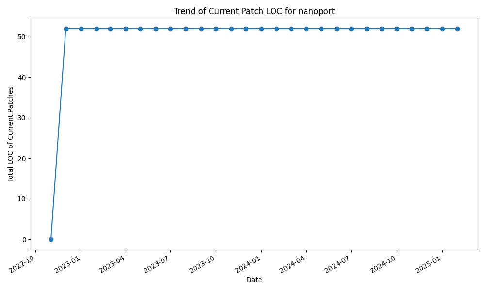

### Current Patch Details

| File | LOC |
| --- | --- |
| initial_zos.patch | 68 |

---

### Historical Patch Event Details

| Commit Date | File | Delta LOC |
| --- | --- | --- |
| 2022-12-02 | initial_zos.patch | 52 |

---

## Repository: logrotateport

**Current Lines of Code:** 65  
**Current # of Patch files:** 1

### Trend of Current Patch LOC

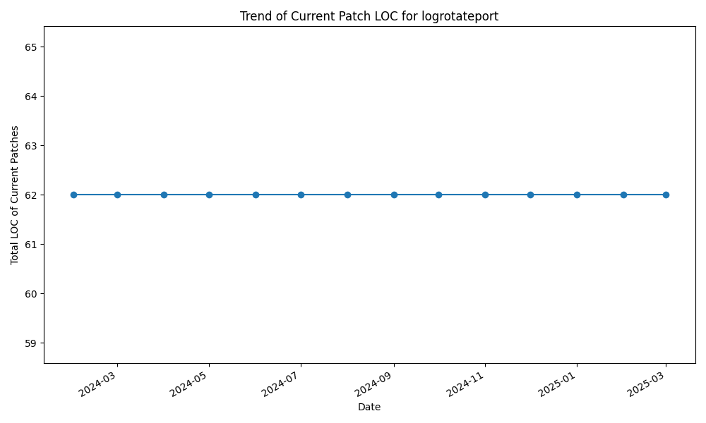

### Current Patch Details

| File | LOC |
| --- | --- |
| PR1.patch | 65 |

---

### Historical Patch Event Details

| Commit Date | File | Delta LOC |
| --- | --- | --- |
| 2024-02-29 | PR1.patch | 62 |

---

## Repository: lz4port

**Current Lines of Code:** 58  
**Current # of Patch files:** 4

### Trend of Current Patch LOC

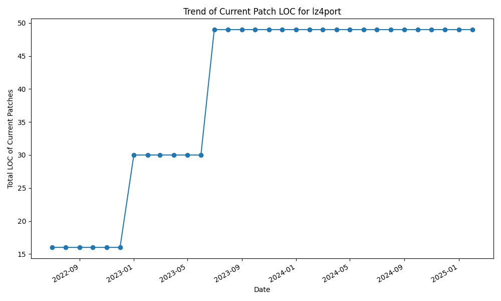

### Current Patch Details

| File | LOC |
| --- | --- |
| Makefile.patch | 19 |
| PR1/addzostomakefile.patch | 25 |
| PR2/Makefile.inc.patch | 0 |
| PR2/tests-Makefile.patch | 14 |

---

### Historical Patch Event Details

| Commit Date | File | Delta LOC |
| --- | --- | --- |
| 2023-07-20 | Makefile.patch | 19 |
| 2023-01-24 | PR2/Makefile.inc.patch | 0 |
| 2023-01-24 | PR2/tests-Makefile.patch | 14 |
| 2022-07-18 | PR1/addzostomakefile.patch | 16 |

---

## Repository: gnport

**Current Lines of Code:** 57  
**Current # of Patch files:** 1

### Trend of Current Patch LOC

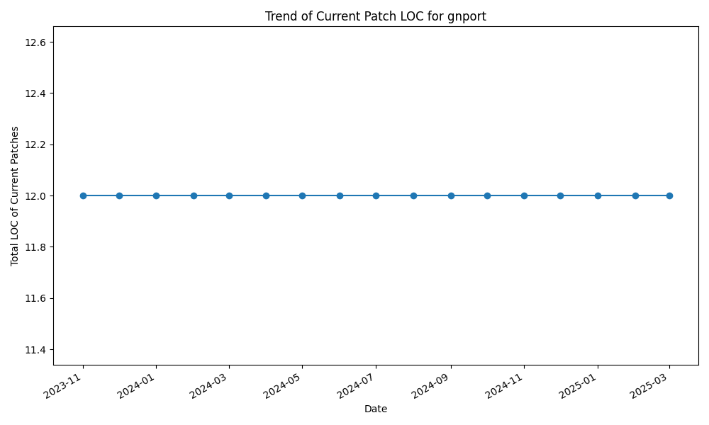

### Current Patch Details

| File | LOC |
| --- | --- |
| build.gen.py.patch | 57 |

---

### Historical Patch Event Details

| Commit Date | File | Delta LOC |
| --- | --- | --- |
| 2023-11-17 | stub-test.patch | 0 |
| 2023-11-16 | build.gen.py.patch | 12 |
| 2023-11-16 | stub-test.patch | 12 |

---

## Repository: texinfoport

**Current Lines of Code:** 56  
**Current # of Patch files:** 3

### Trend of Current Patch LOC

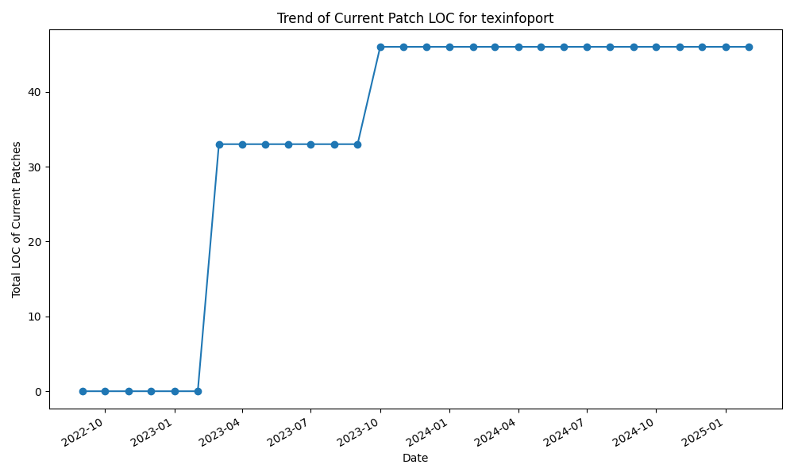

### Current Patch Details

| File | LOC |
| --- | --- |
| Init-test.inc.patch | 13 |
| Makefile.in.patch | 20 |
| test-driver.patch | 23 |

---

### Historical Patch Event Details

| Commit Date | File | Delta LOC |
| --- | --- | --- |
| 2023-10-31 | Init-test.inc.patch | 13 |
| 2023-03-15 | test-driver.patch | 13 |
| 2023-03-07 | Makefile.in.patch | 20 |

---

## Repository: libgpgerrorport

**Current Lines of Code:** 53  
**Current # of Patch files:** 3

### Trend of Current Patch LOC

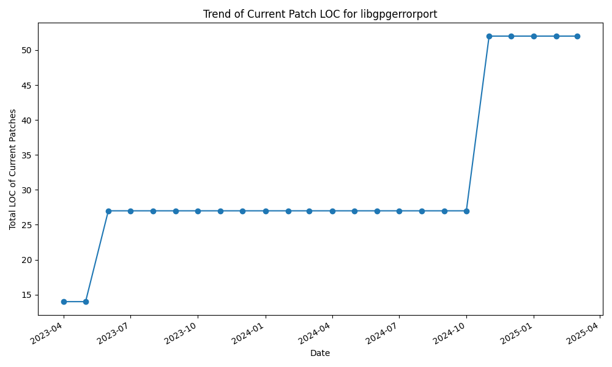

### Current Patch Details

| File | LOC |
| --- | --- |
| Makefile.in.patch | 13 |
| configure.patch | 15 |
| spawn-posix.c.patch | 25 |

---

### Historical Patch Event Details

| Commit Date | File | Delta LOC |
| --- | --- | --- |
| 2024-11-18 | spawn-posix.c.patch | 25 |
| 2023-06-06 | Makefile.in.patch | 13 |
| 2023-04-26 | configure.patch | 14 |

---

## Repository: expatport

**Current Lines of Code:** 52  
**Current # of Patch files:** 2

### Trend of Current Patch LOC

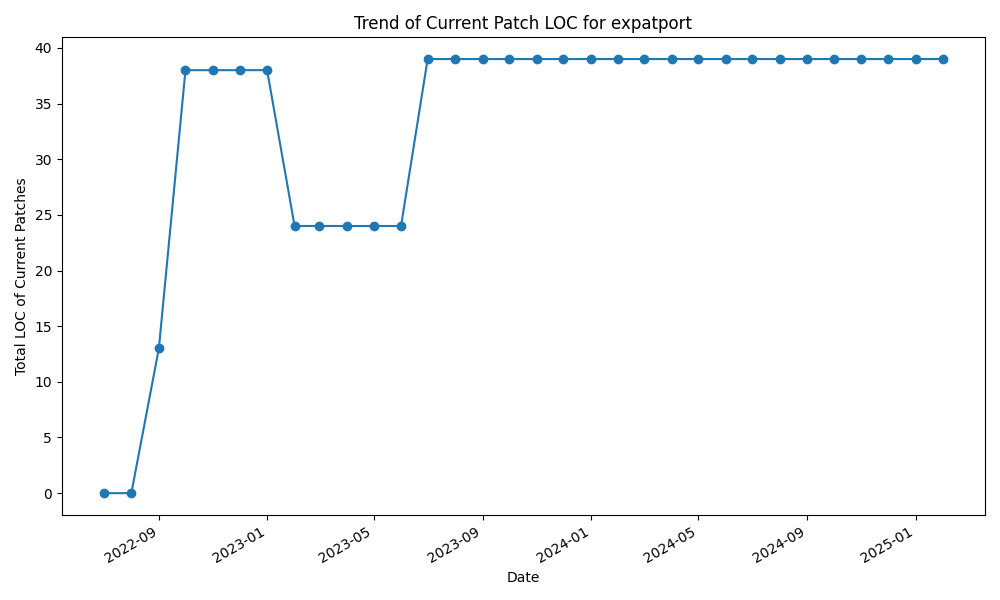

### Current Patch Details

| File | LOC |
| --- | --- |
| PR1.patch | 37 |
| configure.patch | 15 |

---

### Historical Patch Event Details

| Commit Date | File | Delta LOC |
| --- | --- | --- |
| 2023-07-21 | configure.patch | 15 |
| 2023-02-23 | PR2.patch | 0 |
| 2022-10-20 | PR2.patch | 14 |
| 2022-10-07 | PR1.patch | 24 |
| 2022-10-07 | PR1/configure.ac.patch | 0 |
| 2022-09-29 | PR1/configure.ac.patch | 13 |

---

## Repository: terraformport

**Current Lines of Code:** 51  
**Current # of Patch files:** 2

### Trend of Current Patch LOC

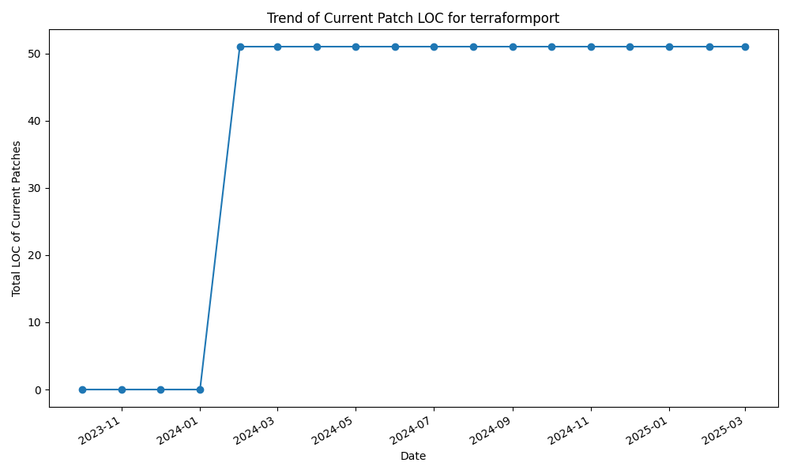

### Current Patch Details

| File | LOC |
| --- | --- |
| go.mod.patch | 24 |
| inode.go.patch | 27 |

---

### Historical Patch Event Details

| Commit Date | File | Delta LOC |
| --- | --- | --- |
| 2024-02-18 | go.mod.patch | 24 |
| 2024-02-18 | inode.go.patch | 27 |

---

## Repository: libsasl2port

**Current Lines of Code:** 50  
**Current # of Patch files:** 3

### Trend of Current Patch LOC

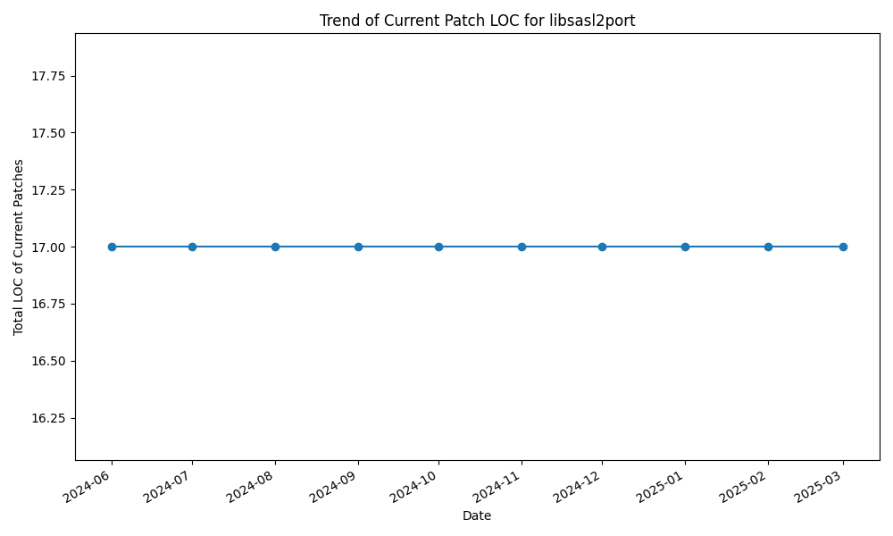

### Current Patch Details

| File | LOC |
| --- | --- |
| Makefile.am.patch | 17 |
| configure.ac.patch | 12 |
| saslauthd/auth_getpwent.c.patch | 21 |

---

### Historical Patch Event Details

| Commit Date | File | Delta LOC |
| --- | --- | --- |
| 2024-06-24 | utils/Makefile.am.patch | 17 |

---

## Repository: automakeport

**Current Lines of Code:** 47  
**Current # of Patch files:** 3

### Trend of Current Patch LOC

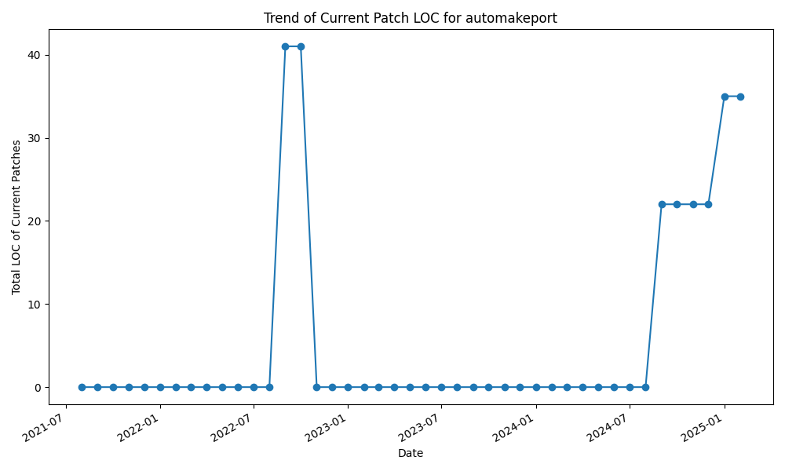

### Current Patch Details

| File | LOC |
| --- | --- |
| PR1/automake.in.patch | 13 |
| PR1/configure.patch | 22 |
| PR1/distdir.am.patch | 12 |

---

### Historical Patch Event Details

| Commit Date | File | Delta LOC |
| --- | --- | --- |
| 2025-01-30 | PR1/automake.in.patch | 13 |
| 2024-09-22 | PR1/configure.patch | 22 |
| 2022-11-27 | PR1/distdir.am.patch | 12 |
| 2022-11-27 | PR1/pr1.patch | 0 |
| 2022-11-23 | PR1/test-driver.patch | 0 |
| 2022-11-09 | PR1/pr1.patch | 51 |
| 2022-11-09 | PR1/test-driver.patch | 13 |
| 2022-11-09 | PR1/Makefile.in.patch | 0 |
| 2022-11-09 | PR1/distdir.am.patch | -12 |
| 2022-11-09 | PR2/test-driver.patch | 0 |
| 2022-09-16 | PR2/test-driver.patch | 13 |
| 2022-09-14 | PR1/Makefile.in.patch | 15 |
| 2022-09-14 | PR1/distdir.am.patch | 13 |

---

## Repository: lessport

**Current Lines of Code:** 47  
**Current # of Patch files:** 3

### Trend of Current Patch LOC

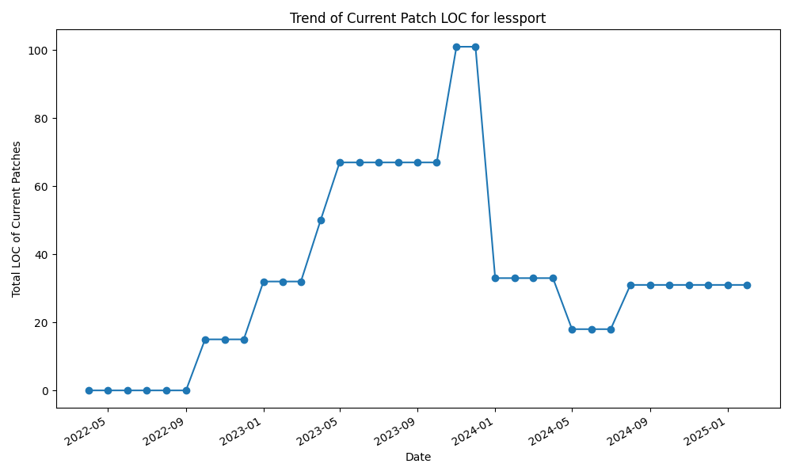

### Current Patch Details

| File | LOC |
| --- | --- |
| charset.c.patch | 17 |
| edit.c.patch | 17 |
| os.c.patch | 13 |

---

### Historical Patch Event Details

| Commit Date | File | Delta LOC |
| --- | --- | --- |
| 2024-08-02 | os.c.patch | 13 |
| 2024-05-07 | Makefile.in.patch | 0 |
| 2024-05-07 | PR1.patch | 0 |
| 2024-01-21 | Makefile.in.patch | 0 |
| 2024-01-21 | edit.c.patch | 0 |
| 2024-01-21 | lesstest/Makefile.patch | 0 |
| 2024-01-21 | ttyin.c.patch | 0 |
| 2023-11-28 | Makefile.in.patch | 17 |
| 2023-11-28 | edit.c.patch | 17 |
| 2023-11-28 | lesstest/Makefile.patch | 19 |
| 2023-11-28 | ttyin.c.patch | 15 |
| 2023-11-28 | TEST.patch | 0 |
| 2023-05-01 | edit.c.patch | 17 |
| 2023-04-13 | charset.c.patch | 18 |
| 2023-01-30 | Makefile.in.patch | 17 |
| 2022-11-12 | TEST.patch | 0 |
| 2022-10-31 | PR1.patch | 15 |

---

## Repository: xxhashport

**Current Lines of Code:** 47  
**Current # of Patch files:** 2

### Trend of Current Patch LOC

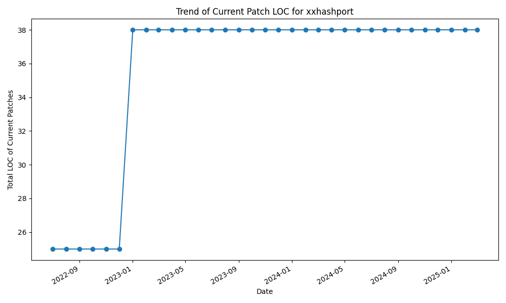

### Current Patch Details

| File | LOC |
| --- | --- |
| tests-Makefile.patch | 13 |
| PR1/linkoptforzos.patch | 34 |

---

### Historical Patch Event Details

| Commit Date | File | Delta LOC |
| --- | --- | --- |
| 2023-01-22 | tests-Makefile.patch | 13 |
| 2022-07-18 | PR1/linkoptforzos.patch | 25 |

---

## Repository: tigport

**Current Lines of Code:** 47  
**Current # of Patch files:** 1

### Trend of Current Patch LOC

### Current Patch Details

| File | LOC |
| --- | --- |
| PR1.patch | 47 |

---

### Historical Patch Event Details

| Commit Date | File | Delta LOC |
| --- | --- | --- |
| 2023-06-20 | PR1.patch | 47 |

---

## Repository: lazygitport

**Current Lines of Code:** 46  
**Current # of Patch files:** 1

### Trend of Current Patch LOC

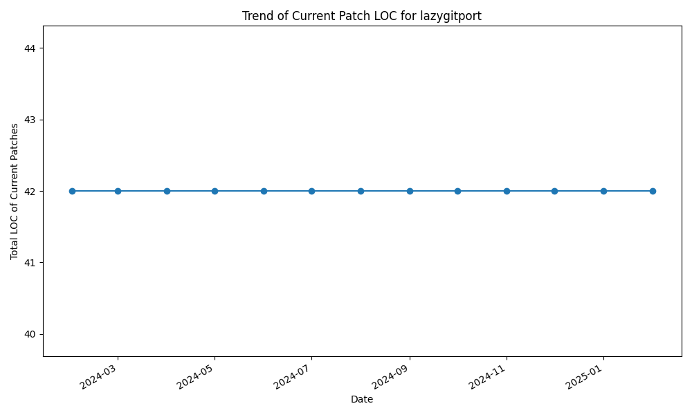

### Current Patch Details

| File | LOC |
| --- | --- |
| lazygit.patch | 46 |

---

### Historical Patch Event Details

| Commit Date | File | Delta LOC |
| --- | --- | --- |
| 2024-02-15 | lazygit.patch | 42 |

---

## Repository: fzfport

**Current Lines of Code:** 45  
**Current # of Patch files:** 2

### Trend of Current Patch LOC

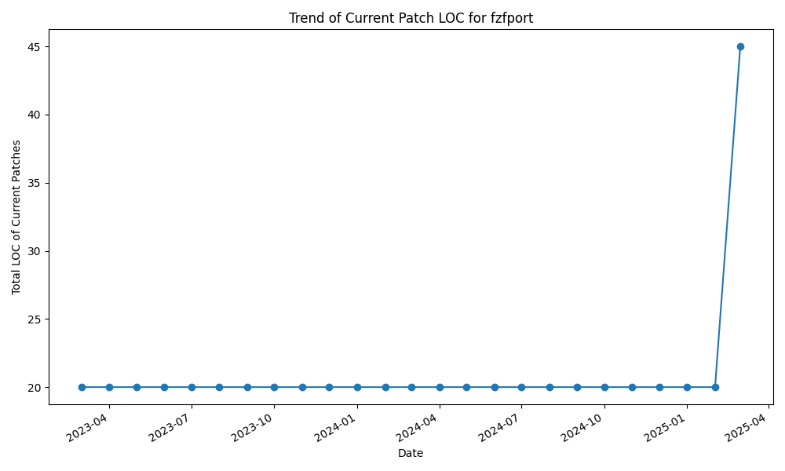

### Current Patch Details

| File | LOC |
| --- | --- |
| Makefile.patch | 20 |
| main.go.patch | 25 |

---

### Historical Patch Event Details

| Commit Date | File | Delta LOC |
| --- | --- | --- |
| 2025-03-17 | main.go.patch | 25 |
| 2023-03-22 | Makefile.patch | 20 |

---

## Repository: poptport

**Current Lines of Code:** 35  
**Current # of Patch files:** 1

### Trend of Current Patch LOC

### Current Patch Details

| File | LOC |
| --- | --- |
| PR1.patch | 35 |

---

### Historical Patch Event Details

| Commit Date | File | Delta LOC |
| --- | --- | --- |
| 2024-02-29 | PR1.patch | 35 |

---

## Repository: whichport

**Current Lines of Code:** 34  
**Current # of Patch files:** 1

### Trend of Current Patch LOC

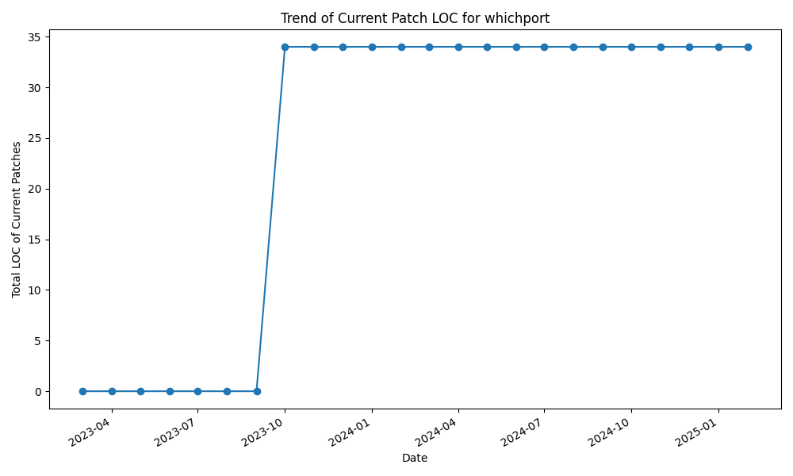

### Current Patch Details

| File | LOC |
| --- | --- |
| bash.c.patch | 34 |

---

### Historical Patch Event Details

| Commit Date | File | Delta LOC |
| --- | --- | --- |
| 2023-10-11 | bash.c.patch | 34 |
| 2023-04-04 | configure.patch | 0 |

---

## Repository: sedport

**Current Lines of Code:** 33  
**Current # of Patch files:** 1

### Trend of Current Patch LOC

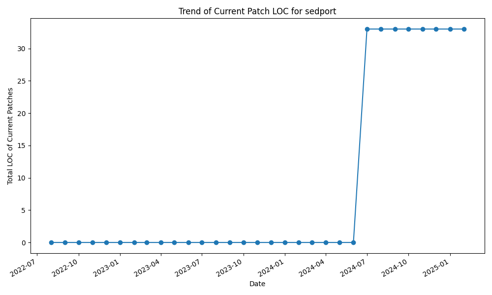

### Current Patch Details

| File | LOC |
| --- | --- |
| execute.c.patch | 33 |

---

### Historical Patch Event Details

| Commit Date | File | Delta LOC |
| --- | --- | --- |
| 2024-07-19 | execute.c.patch | 33 |

---

## Repository: ntbtlsport

**Current Lines of Code:** 33  
**Current # of Patch files:** 1

### Current Patch Details

| File | LOC |
| --- | --- |
| configure.patch | 33 |

---

### Historical Patch Event Details

| Commit Date | File | Delta LOC |
| --- | --- | --- |

---

## Repository: sqliteport

**Current Lines of Code:** 32  
**Current # of Patch files:** 1

### Trend of Current Patch LOC

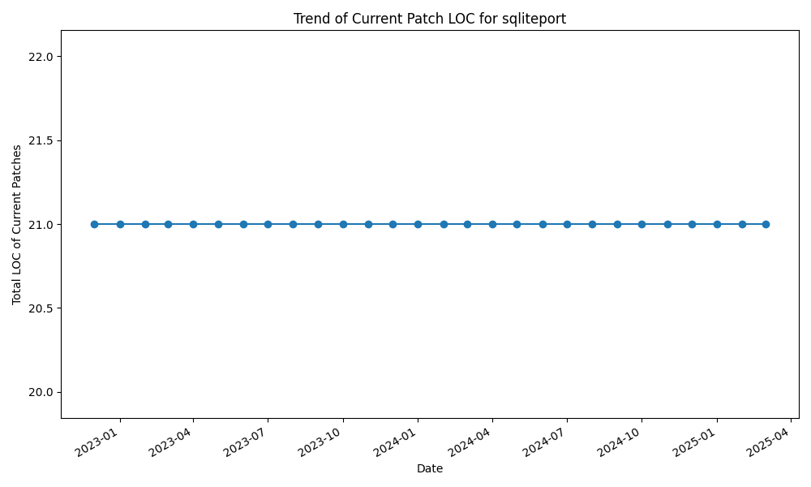

### Current Patch Details

| File | LOC |
| --- | --- |
| configure.patch | 32 |

---

### Historical Patch Event Details

| Commit Date | File | Delta LOC |
| --- | --- | --- |
| 2022-12-08 | configure.patch | 21 |

---

## Repository: luvport

**Current Lines of Code:** 31  
**Current # of Patch files:** 1

### Trend of Current Patch LOC

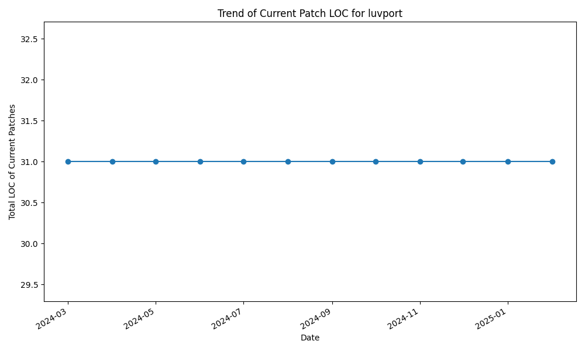

### Current Patch Details

| File | LOC |
| --- | --- |
| thread.c.patch | 31 |

---

### Historical Patch Event Details

| Commit Date | File | Delta LOC |
| --- | --- | --- |
| 2024-03-09 | thread.c.patch | 31 |

---

## Repository: libffiport

**Current Lines of Code:** 31  
**Current # of Patch files:** 2

### Trend of Current Patch LOC

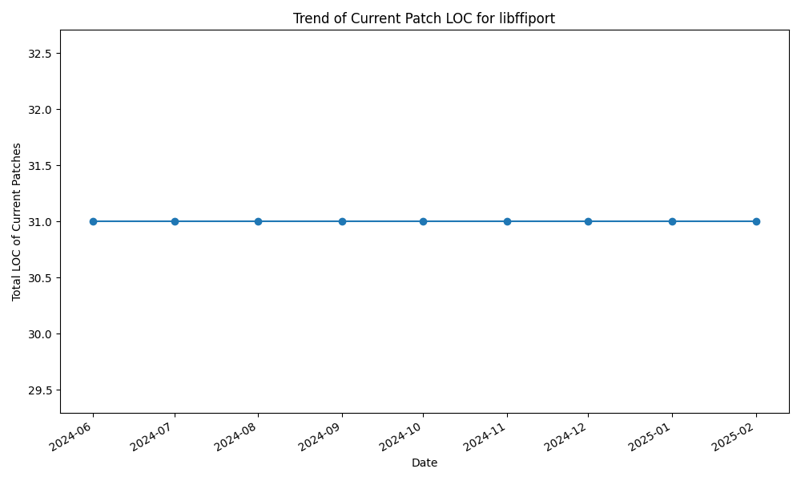

### Current Patch Details

| File | LOC |
| --- | --- |
| configure.host.patch | 16 |
| configure.patch | 15 |

---

### Historical Patch Event Details

| Commit Date | File | Delta LOC |
| --- | --- | --- |
| 2024-06-21 | configure.patch | 15 |
| 2024-06-20 | configure.host.patch | 16 |

---

## Repository: lynxport

**Current Lines of Code:** 30  
**Current # of Patch files:** 1

### Trend of Current Patch LOC

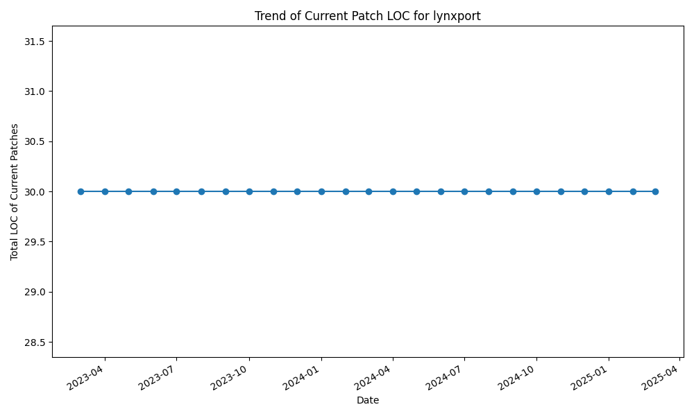

### Current Patch Details

| File | LOC |
| --- | --- |
| PR1.patch | 30 |

---

### Historical Patch Event Details

| Commit Date | File | Delta LOC |
| --- | --- | --- |
| 2023-03-03 | PR1.patch | 30 |

---

## Repository: netpbmport

**Current Lines of Code:** 29  
**Current # of Patch files:** 2

### Trend of Current Patch LOC

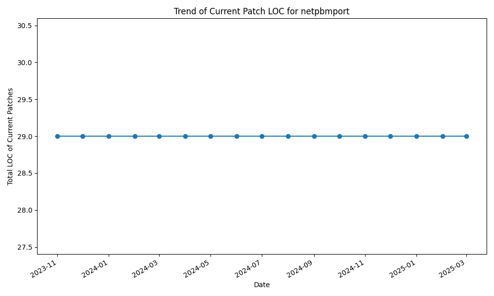

### Current Patch Details

| File | LOC |
| --- | --- |
| Execute-Tests.patch | 10 |
| GNUmakefile.patch | 19 |

---

### Historical Patch Event Details

| Commit Date | File | Delta LOC |
| --- | --- | --- |
| 2023-11-23 | GNUmakefile.patch | 19 |
| 2023-11-22 | Execute-Tests.patch | 10 |

---

## Repository: gmpport

**Current Lines of Code:** 29  
**Current # of Patch files:** 2

### Trend of Current Patch LOC

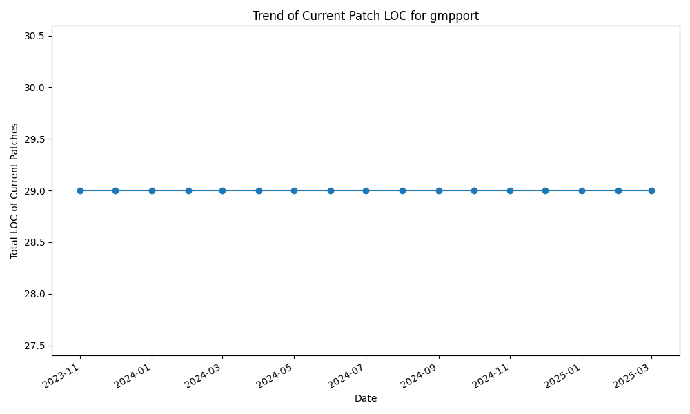

### Current Patch Details

| File | LOC |
| --- | --- |
| configure.patch | 15 |
| inp_str.c.patch | 14 |

---

### Historical Patch Event Details

| Commit Date | File | Delta LOC |
| --- | --- | --- |
| 2023-11-30 | inp_str.c.patch | 14 |
| 2023-11-30 | configure.patch | 15 |

---

## Repository: libgpgmeport

**Current Lines of Code:** 29  
**Current # of Patch files:** 2

### Trend of Current Patch LOC

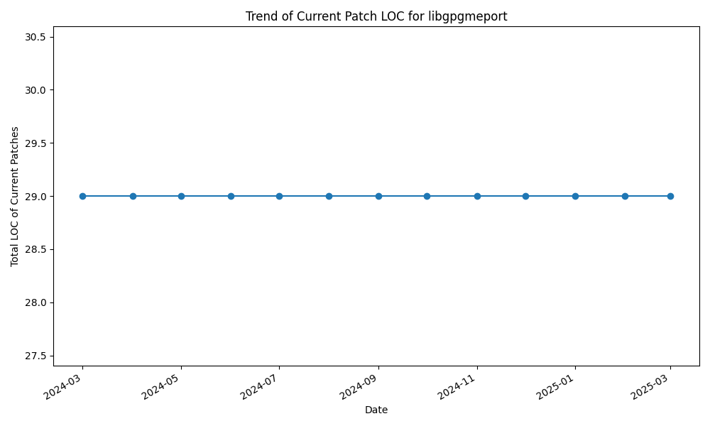

### Current Patch Details

| File | LOC |
| --- | --- |
| ath.h.patch | 14 |
| libtool.m4.patch | 15 |

---

### Historical Patch Event Details

| Commit Date | File | Delta LOC |
| --- | --- | --- |
| 2024-03-04 | ath.h.patch | 22 |
| 2024-03-04 | libtool.m4.patch | 15 |
| 2024-03-04 | ath.h.patch | 14 |
| 2024-03-04 | libtool.m4.patch | 15 |

---

## Repository: npthport

**Current Lines of Code:** 28  
**Current # of Patch files:** 2

### Trend of Current Patch LOC

### Current Patch Details

| File | LOC |
| --- | --- |
| configure.patch | 15 |
| npth.c.patch | 13 |

---

### Historical Patch Event Details

| Commit Date | File | Delta LOC |
| --- | --- | --- |
| 2023-04-26 | configure.patch | 15 |
| 2023-04-20 | npth.c.patch | 13 |

---

## Repository: libksbaport

**Current Lines of Code:** 28  
**Current # of Patch files:** 2

### Trend of Current Patch LOC

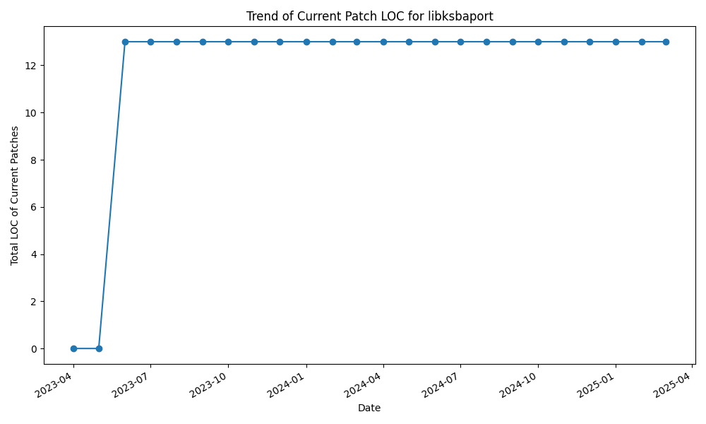

### Current Patch Details

| File | LOC |
| --- | --- |
| Makefile.in.patch | 13 |
| configure.patch | 15 |

---

### Historical Patch Event Details

| Commit Date | File | Delta LOC |
| --- | --- | --- |
| 2023-06-05 | Makefile.in.patch | 13 |

---

## Repository: avro-c-libport

**Current Lines of Code:** 28  
**Current # of Patch files:** 2

### Trend of Current Patch LOC

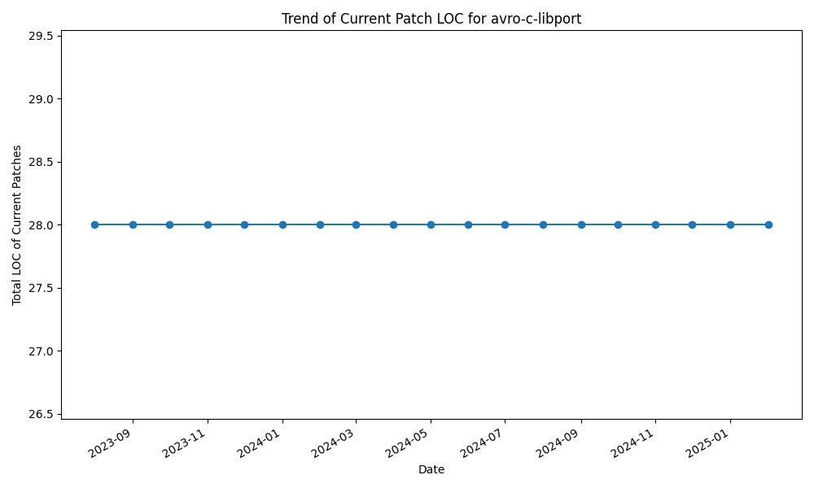

### Current Patch Details

| File | LOC |
| --- | --- |
| avro_private.h.patch | 13 |
| refcount.h.patch | 15 |

---

### Historical Patch Event Details

| Commit Date | File | Delta LOC |
| --- | --- | --- |
| 2023-08-29 | avro_private.h.patch | 13 |
| 2023-08-29 | refcount.h.patch | 15 |

---

## Repository: ctagsport

**Current Lines of Code:** 26  
**Current # of Patch files:** 2

### Trend of Current Patch LOC

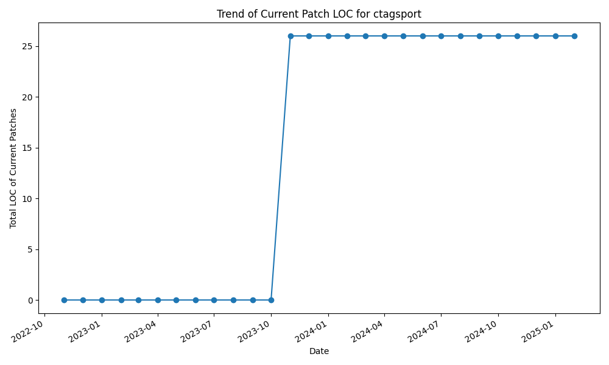

### Current Patch Details

| File | LOC |
| --- | --- |
| Makefile.am.patch | 13 |
| acutest.h.patch | 13 |

---

### Historical Patch Event Details

| Commit Date | File | Delta LOC |
| --- | --- | --- |
| 2023-11-20 | Makefile.am.patch | 13 |
| 2023-11-20 | acutest.h.patch | 13 |

---

## Repository: git-extrasport

**Current Lines of Code:** 26  
**Current # of Patch files:** 1

### Trend of Current Patch LOC

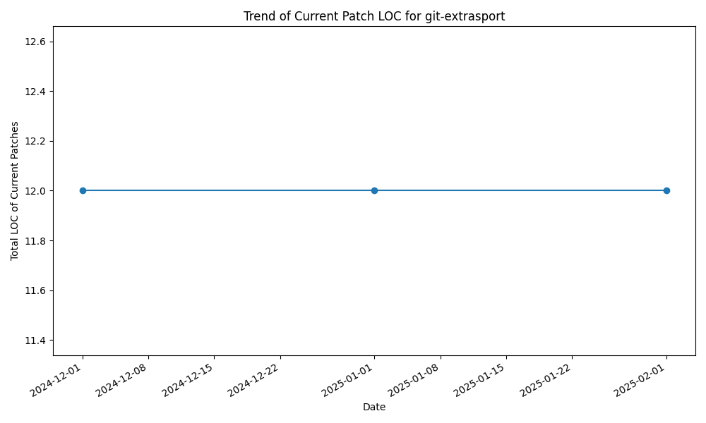

### Current Patch Details

| File | LOC |
| --- | --- |
| PR1.patch | 26 |

---

### Historical Patch Event Details

| Commit Date | File | Delta LOC |
| --- | --- | --- |
| 2024-12-05 | PR1.patch | 12 |

---

## Repository: my_basicport

**Current Lines of Code:** 22  
**Current # of Patch files:** 1

### Trend of Current Patch LOC

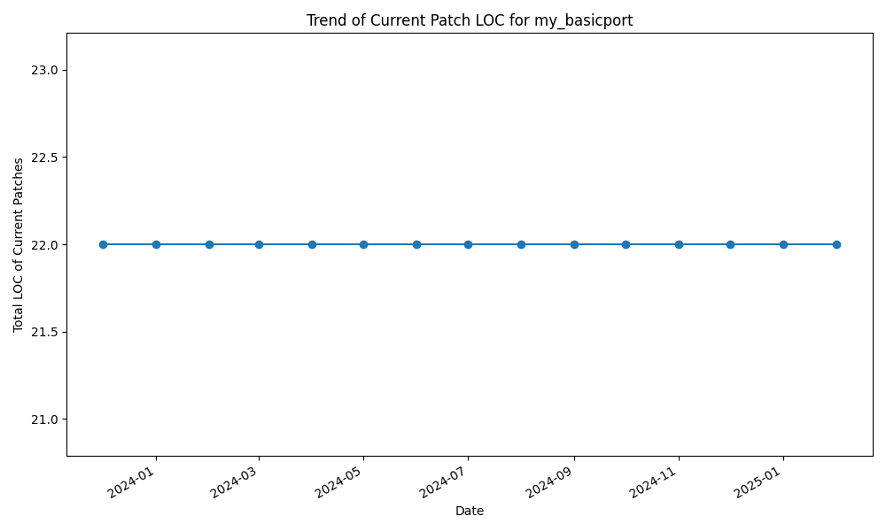

### Current Patch Details

| File | LOC |
| --- | --- |
| my_basic.c.patch | 22 |

---

### Historical Patch Event Details

| Commit Date | File | Delta LOC |
| --- | --- | --- |
| 2023-12-03 | my_basic.c.patch | 22 |

---

## Repository: shdocport

**Current Lines of Code:** 20  
**Current # of Patch files:** 2

### Current Patch Details

| File | LOC |
| --- | --- |
| Makefile.patch | 10 |
| shdoc.patch | 10 |

---

### Historical Patch Event Details

| Commit Date | File | Delta LOC |
| --- | --- | --- |

---

## Repository: sshpassport

**Current Lines of Code:** 18  
**Current # of Patch files:** 1

### Trend of Current Patch LOC

### Current Patch Details

| File | LOC |
| --- | --- |
| main.c.patch | 18 |

---

### Historical Patch Event Details

| Commit Date | File | Delta LOC |
| --- | --- | --- |
| 2023-11-17 | main.c.patch | 18 |

---

## Repository: git-lfsport

**Current Lines of Code:** 18  
**Current # of Patch files:** 1

### Trend of Current Patch LOC

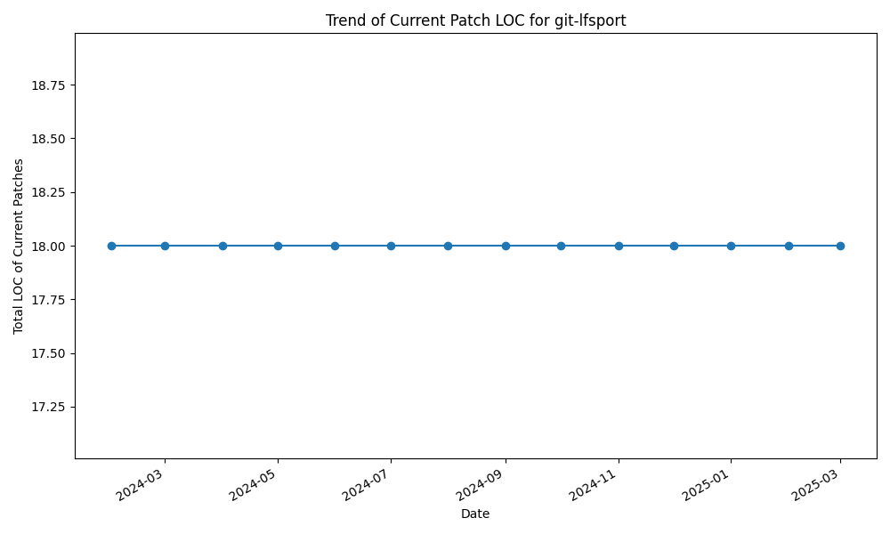

### Current Patch Details

| File | LOC |
| --- | --- |
| Makefile.patch | 18 |

---

### Historical Patch Event Details

| Commit Date | File | Delta LOC |
| --- | --- | --- |
| 2024-02-20 | Makefile.patch | 18 |
| 2024-02-20 | lazygit.patch | 0 |
| 2024-02-15 | lazygit.patch | 42 |

---

## Repository: bzip2port

**Current Lines of Code:** 17  
**Current # of Patch files:** 1

### Trend of Current Patch LOC

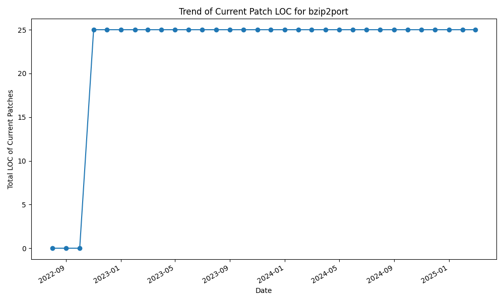

### Current Patch Details

| File | LOC |
| --- | --- |
| Makefile.patch | 17 |

---

### Historical Patch Event Details

| Commit Date | File | Delta LOC |
| --- | --- | --- |
| 2022-11-23 | Makefile.patch | 25 |

---

## Repository: cunitport

**Current Lines of Code:** 17  
**Current # of Patch files:** 2

### Trend of Current Patch LOC

### Current Patch Details

| File | LOC |
| --- | --- |
| bootstrap.patch | 17 |
| configure.patch | 0 |

---

### Historical Patch Event Details

| Commit Date | File | Delta LOC |
| --- | --- | --- |
| 2023-11-30 | bootstrap.patch | 17 |
| 2023-11-30 | configure.patch | 0 |

---

## Repository: makeport

**Current Lines of Code:** 16  
**Current # of Patch files:** 1

### Trend of Current Patch LOC

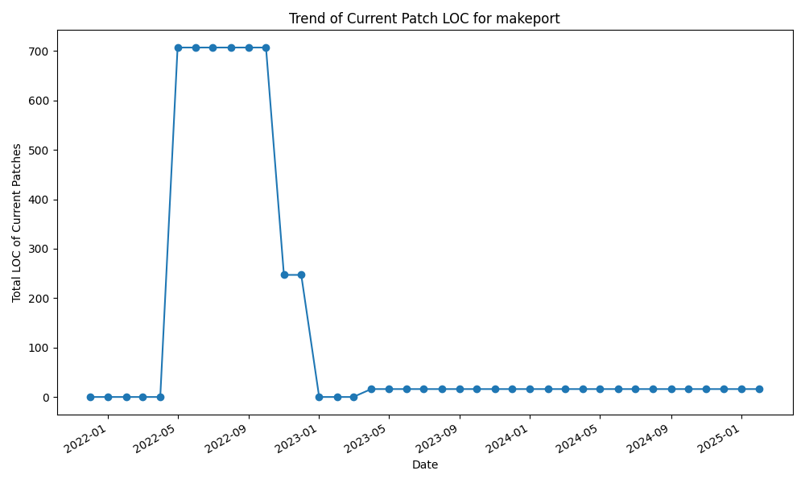

### Current Patch Details

| File | LOC |
| --- | --- |
| getopt.c.patch | 16 |

---

### Historical Patch Event Details

| Commit Date | File | Delta LOC |
| --- | --- | --- |
| 2023-04-17 | getopt.c.patch | 16 |
| 2023-01-20 | PR1.patch | 0 |
| 2022-11-21 | PR1.patch | 247 |
| 2022-11-21 | PR1/initial_port.patch | 0 |
| 2022-05-20 | PR1/initial_port.patch | 707 |

---

## Repository: curlport

**Current Lines of Code:** 15  
**Current # of Patch files:** 1

### Trend of Current Patch LOC

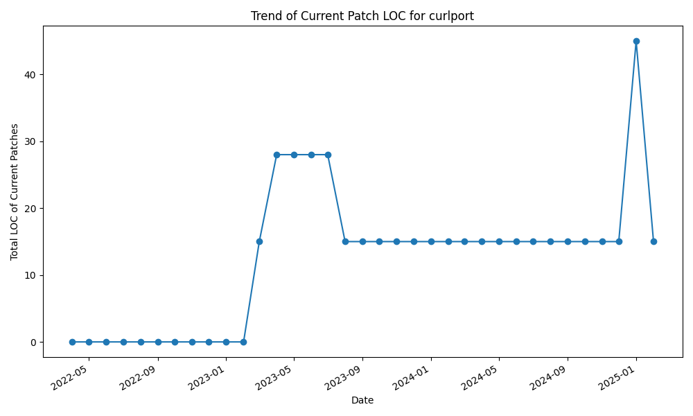

### Current Patch Details

| File | LOC |
| --- | --- |
| configure.patch | 15 |

---

### Historical Patch Event Details

| Commit Date | File | Delta LOC |
| --- | --- | --- |
| 2025-02-10 | temp.patch | 0 |
| 2025-01-30 | temp.patch | 30 |
| 2023-08-28 | system.h.patch | 0 |
| 2023-04-26 | system.h.patch | 13 |
| 2023-03-31 | configure.patch | 15 |

---

## Repository: xzport

**Current Lines of Code:** 15  
**Current # of Patch files:** 1

### Trend of Current Patch LOC

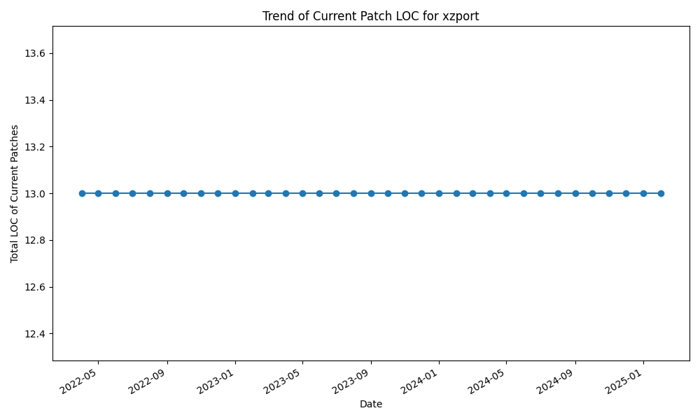

### Current Patch Details

| File | LOC |
| --- | --- |
| configure.patch | 15 |

---

### Historical Patch Event Details

| Commit Date | File | Delta LOC |
| --- | --- | --- |
| 2023-05-24 | configure.patch | 15 |
| 2022-04-21 | configure.patch | 13 |

---

## Repository: opensslport

**Current Lines of Code:** 15  
**Current # of Patch files:** 1

### Trend of Current Patch LOC

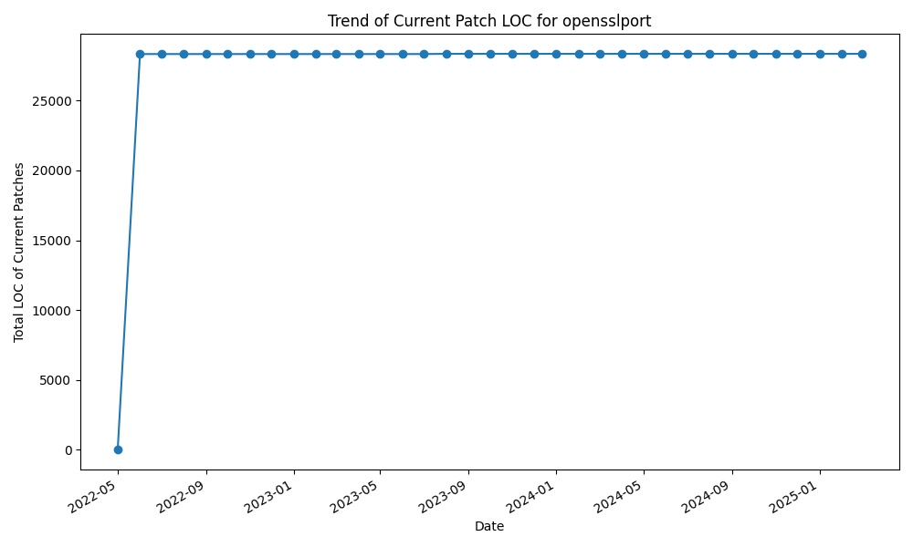

### Current Patch Details

| File | LOC |
| --- | --- |
| 50-os390.conf.patch | 15 |

---

### Historical Patch Event Details

| Commit Date | File | Delta LOC |
| --- | --- | --- |
| 2023-08-28 | 50-os390.conf.patch | 15 |
| 2022-07-10 | 0012-011_version.patch | 0 |
| 2022-06-17 | 0021-020_zseries.patch | 5466 |
| 2022-06-17 | 020_zseries.patch | 0 |
| 2022-06-17 | 025_zOSA.patch | 0 |
| 2022-06-15 | 025_newzOSB.patch | 0 |
| 2022-06-15 | 025_zOSB.patch | 0 |
| 2022-06-15 | 025_newzOSB.patch | 466 |
| 2022-06-15 | 025_zOSA.patch | 4878 |
| 2022-06-15 | 025_zOSB.patch | 466 |
| 2022-06-09 | 000_base.patch | 630 |
| 2022-06-09 | 001_keytests.patch | 65 |
| 2022-06-09 | 002_platforms.patch | 126 |
| 2022-06-09 | 003_AIX.patch | 80 |
| 2022-06-09 | 004_hpux.patch | 65 |
| 2022-06-09 | 005_misc.patch | 83 |
| 2022-06-09 | 006_lock_contention.patch | 14 |
| 2022-06-09 | 007_zos.patch | 76 |
| 2022-06-09 | 008_BN_stack_pop.patch | 16 |
| 2022-06-09 | 009_KeyGen.patch | 16 |
| 2022-06-09 | 010_dh.patch | 345 |
| 2022-06-09 | 011_version.patch | 53 |
| 2022-06-09 | 012_ppc.patch | 514 |
| 2022-06-09 | 013_RSA_keygen.patch | 69 |
| 2022-06-09 | 014_x86.patch | 91 |
| 2022-06-09 | 015_conf.patch | 12 |
| 2022-06-09 | 016_EC_range.patch | 36 |
| 2022-06-09 | 017_OS.patch | 164 |
| 2022-06-09 | 018_BN_free.patch | 18 |
| 2022-06-09 | 019_no_inline.patch | 19 |
| 2022-06-09 | 020_zseries.patch | 1833 |
| 2022-06-09 | 021_misc.patch | 128 |
| 2022-06-09 | 022_RNG_source.patch | 299 |
| 2022-06-09 | 025_zOS.patch | 16171 |
| 2022-06-09 | 028_PPC_cap.patch | 670 |
| 2022-06-09 | 029_obj_dat_EBCDIC.patch | 101 |
| 2022-06-09 | 030_EDXXX.patch | 1227 |
| 2022-06-09 | 031_zOS_kdsa.patch | 47 |
| 2022-06-09 | 032_hmac.patch | 62 |
| 2022-06-09 | 034_EC_import.patch | 16 |
| 2022-06-09 | 035_zOS.patch | 19 |
| 2022-06-09 | 036_RSA.patch | 303 |
| 2022-06-09 | 037_Power10.patch | 85 |
| 2022-06-09 | 038_zosa.patch | 49 |
| 2022-06-09 | 039_Z_EC_nonce.patch | 47 |
| 2022-06-09 | 041_DH.patch | 159 |
| 2022-06-09 | 042_osx.patch | 119 |
| 2022-06-09 | 043_ec_fips.patch | 300 |
| 2022-06-09 | 044_dh_fips.patch | 44 |
| 2022-06-09 | 046_rsa_d_blinding.patch | 528 |
| 2022-06-09 | PR1/config.pm.patch | 0 |
| 2022-05-24 | PR1/config.pm.patch | 16 |

---

## Repository: libgdbmport

**Current Lines of Code:** 15  
**Current # of Patch files:** 1

### Trend of Current Patch LOC

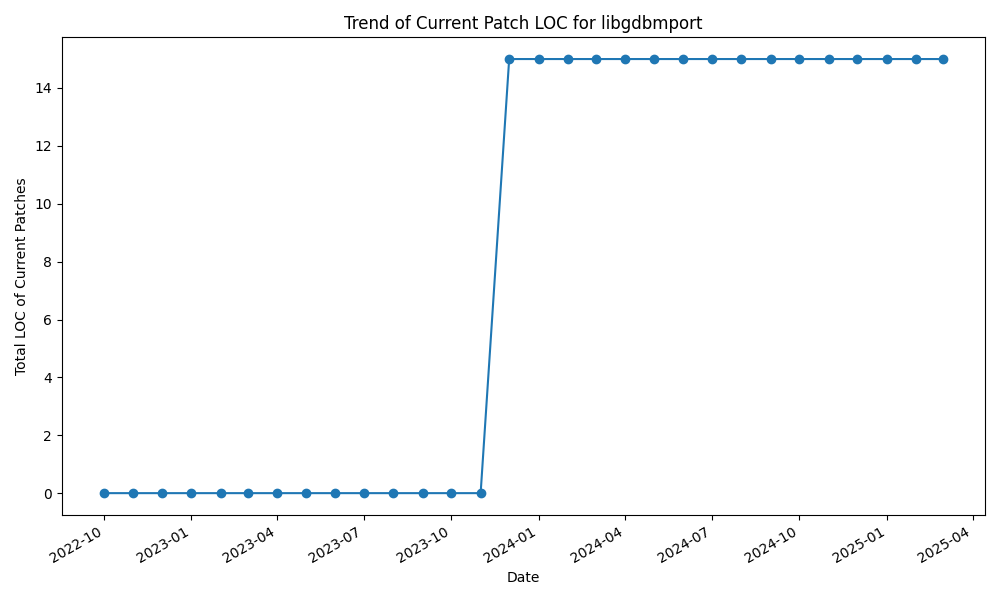

### Current Patch Details

| File | LOC |
| --- | --- |
| configure.patch | 15 |

---

### Historical Patch Event Details

| Commit Date | File | Delta LOC |
| --- | --- | --- |
| 2023-12-14 | PR1.patch | 0 |
| 2023-12-14 | configure.patch | 15 |
| 2022-10-19 | PR1.patch | 52 |

---

## Repository: libpipelineport

**Current Lines of Code:** 15  
**Current # of Patch files:** 1

### Trend of Current Patch LOC

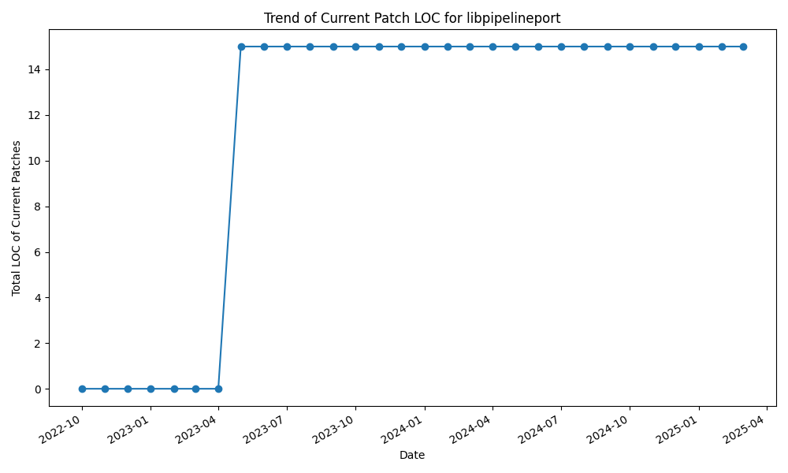

### Current Patch Details

| File | LOC |
| --- | --- |
| configure.patch | 15 |

---

### Historical Patch Event Details

| Commit Date | File | Delta LOC |
| --- | --- | --- |
| 2023-05-31 | configure.patch | 15 |

---

## Repository: libpcre2port

**Current Lines of Code:** 15  
**Current # of Patch files:** 1

### Trend of Current Patch LOC

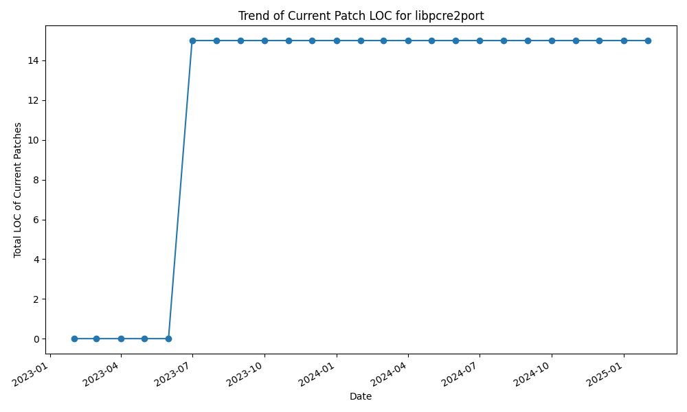

### Current Patch Details

| File | LOC |
| --- | --- |
| configure.patch | 15 |

---

### Historical Patch Event Details

| Commit Date | File | Delta LOC |
| --- | --- | --- |
| 2023-07-20 | configure.patch | 15 |

---

## Repository: libxsltport

**Current Lines of Code:** 15  
**Current # of Patch files:** 1

### Trend of Current Patch LOC

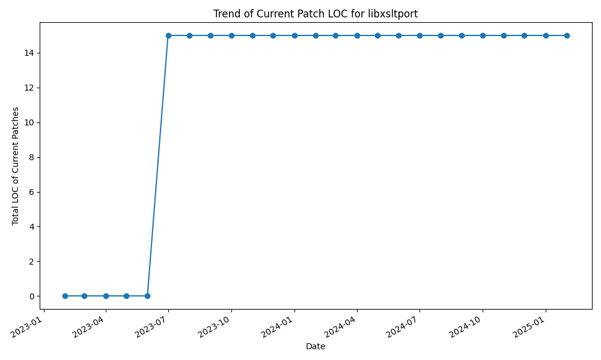

### Current Patch Details

| File | LOC |
| --- | --- |
| configure.patch | 15 |

---

### Historical Patch Event Details

| Commit Date | File | Delta LOC |
| --- | --- | --- |
| 2023-07-20 | configure.patch | 15 |

---

## Repository: libpcreport

**Current Lines of Code:** 15  
**Current # of Patch files:** 1

### Trend of Current Patch LOC

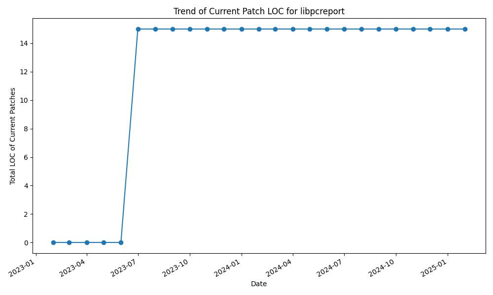

### Current Patch Details

| File | LOC |
| --- | --- |
| configure.patch | 15 |

---

### Historical Patch Event Details

| Commit Date | File | Delta LOC |
| --- | --- | --- |
| 2023-07-24 | configure.patch | 15 |

---

## Repository: libmdport

**Current Lines of Code:** 15  
**Current # of Patch files:** 1

### Trend of Current Patch LOC

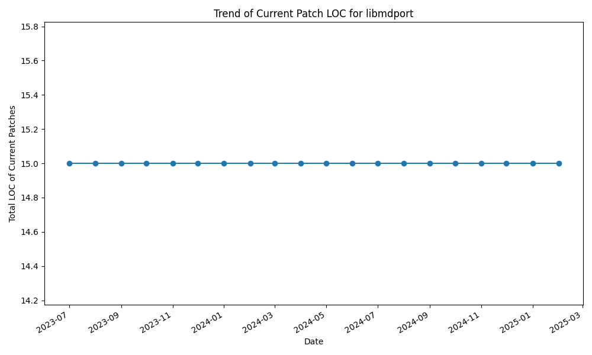

### Current Patch Details

| File | LOC |
| --- | --- |
| configure.patch | 15 |

---

### Historical Patch Event Details

| Commit Date | File | Delta LOC |
| --- | --- | --- |
| 2023-07-25 | configure.patch | 15 |

---

## Repository: tarport

**Current Lines of Code:** 14  
**Current # of Patch files:** 1

### Trend of Current Patch LOC

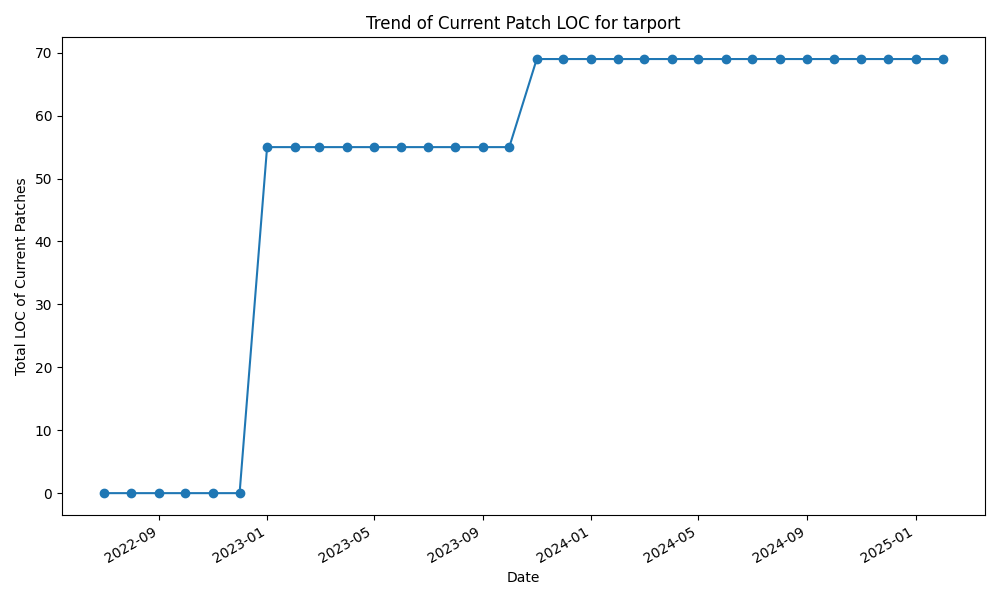

### Current Patch Details

| File | LOC |
| --- | --- |
| gnu/fdopendir.c.patch | 14 |

---

### Historical Patch Event Details

| Commit Date | File | Delta LOC |
| --- | --- | --- |
| 2023-11-22 | gnu/openat-proc.c.patch | 0 |
| 2023-11-21 | gnu/fdopendir.c.patch | 14 |
| 2023-01-21 | PR1.patch | 55 |

---

## Repository: nghttp2port

**Current Lines of Code:** 14  
**Current # of Patch files:** 1

### Trend of Current Patch LOC

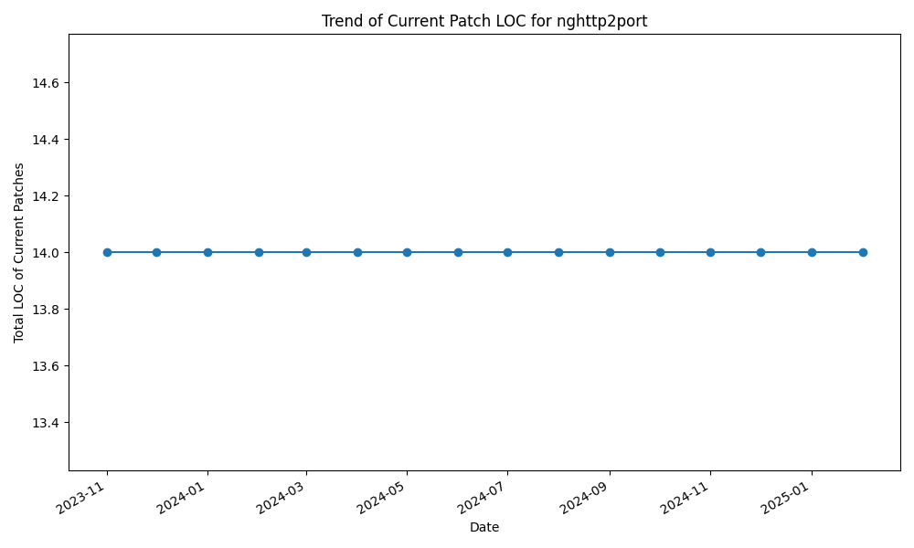

### Current Patch Details

| File | LOC |
| --- | --- |
| configure.patch | 14 |

---

### Historical Patch Event Details

| Commit Date | File | Delta LOC |
| --- | --- | --- |
| 2023-11-30 | configure.patch | 14 |

---

## Repository: bisonport

**Current Lines of Code:** 13  
**Current # of Patch files:** 1

### Trend of Current Patch LOC

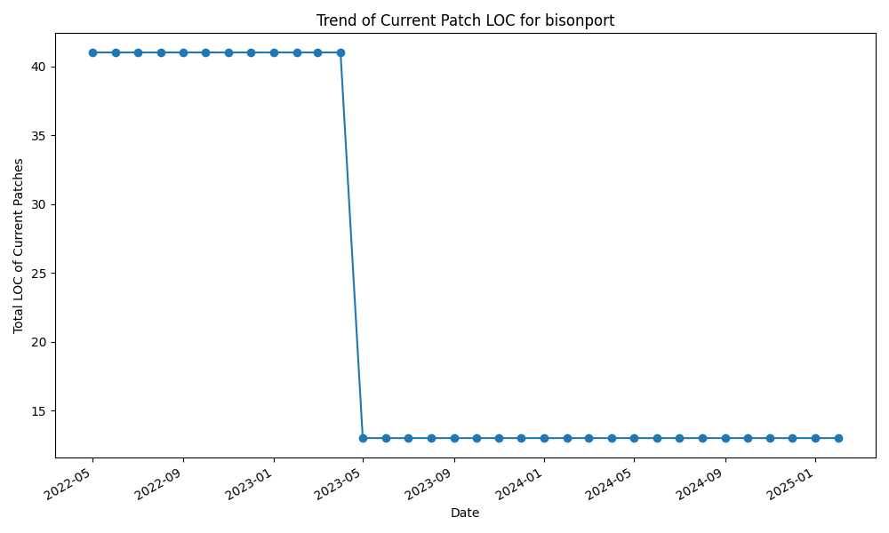

### Current Patch Details

| File | LOC |
| --- | --- |
| PR1/ylwrap.patch | 13 |

---

### Historical Patch Event Details

| Commit Date | File | Delta LOC |
| --- | --- | --- |
| 2023-05-31 | PR1/ffsl.patch | 0 |
| 2022-05-27 | PR1/ffsl.patch | 28 |
| 2022-05-27 | PR1/ylwrap.patch | 13 |

---

## Repository: ncduport

**Current Lines of Code:** 13  
**Current # of Patch files:** 1

### Trend of Current Patch LOC

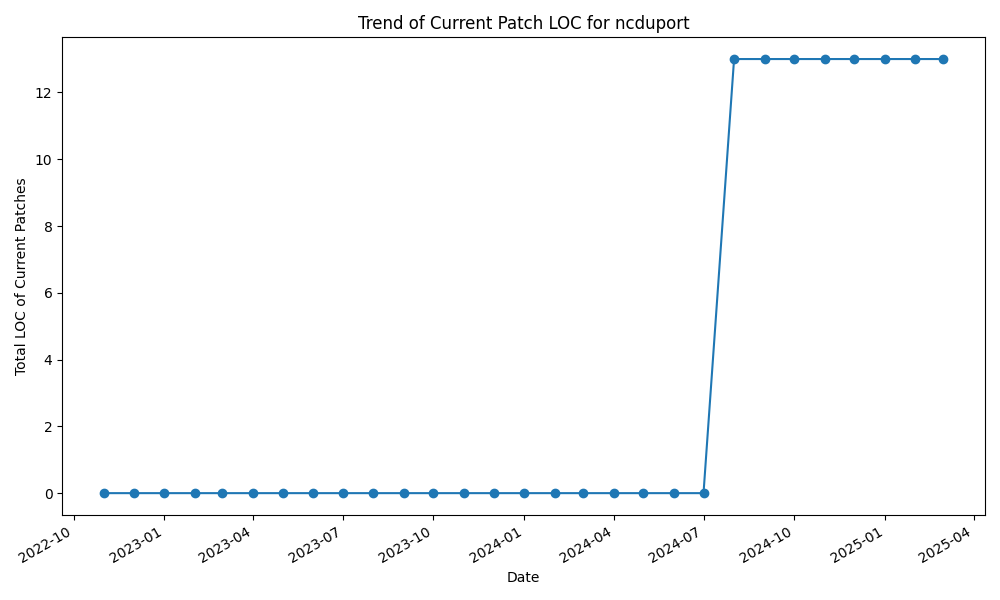

### Current Patch Details

| File | LOC |
| --- | --- |
| util.c.patch | 13 |

---

### Historical Patch Event Details

| Commit Date | File | Delta LOC |
| --- | --- | --- |
| 2024-08-20 | util.c.patch | 13 |

---

## Repository: luaport

**Current Lines of Code:** 13  
**Current # of Patch files:** 1

### Trend of Current Patch LOC

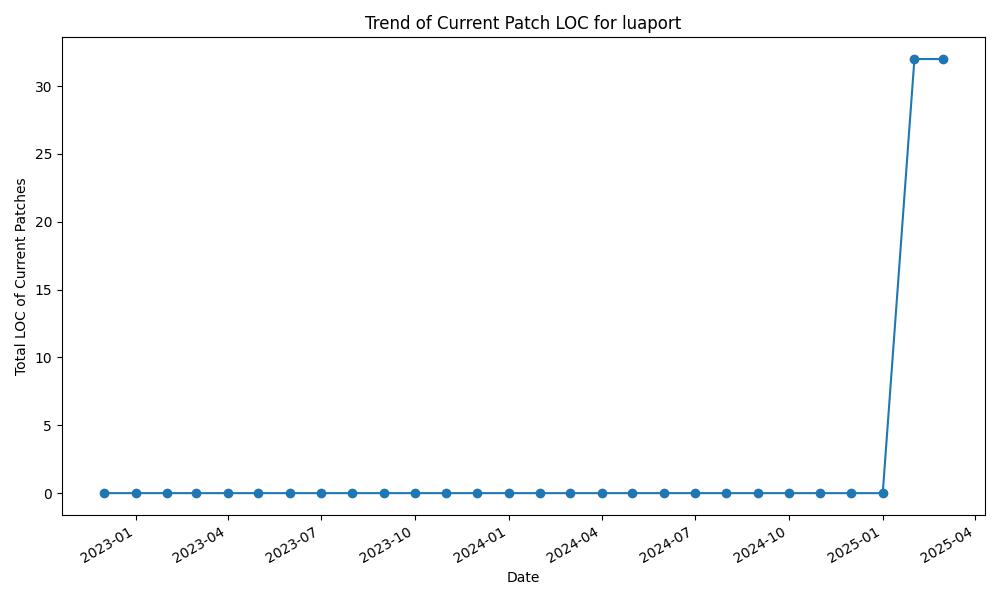

### Current Patch Details

| File | LOC |
| --- | --- |
| Makefile.patch | 13 |

---

### Historical Patch Event Details

| Commit Date | File | Delta LOC |
| --- | --- | --- |
| 2025-02-06 | src/Makefile.patch | 32 |
| 2022-12-21 | Makefile.patch | 45 |

---

## Repository: lpegport

**Current Lines of Code:** 13  
**Current # of Patch files:** 1

### Trend of Current Patch LOC

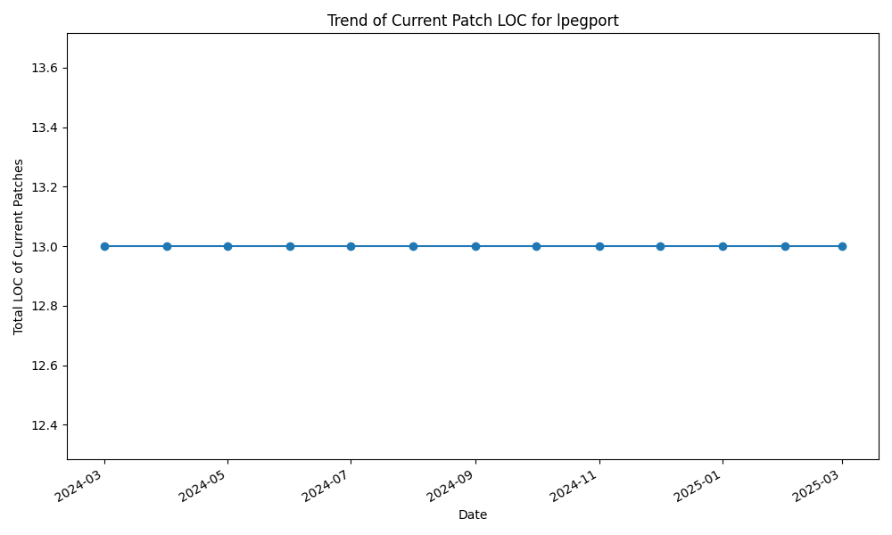

### Current Patch Details

| File | LOC |
| --- | --- |
| makefile.patch | 13 |

---

### Historical Patch Event Details

| Commit Date | File | Delta LOC |
| --- | --- | --- |
| 2024-03-09 | makefile.patch | 13 |

---

## Repository: stowport

**Current Lines of Code:** 13  
**Current # of Patch files:** 1

### Trend of Current Patch LOC

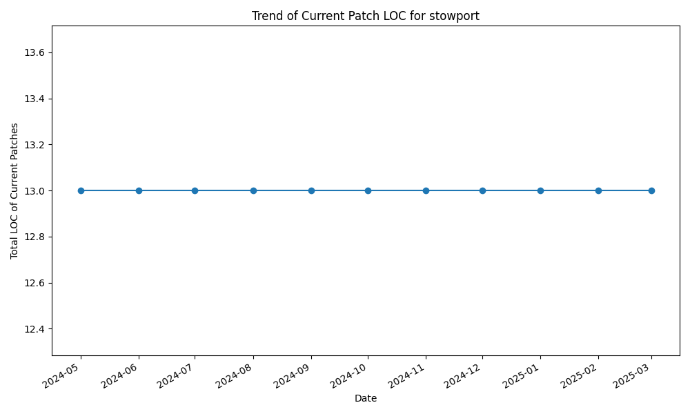

### Current Patch Details

| File | LOC |
| --- | --- |
| stow.in.patch | 13 |

---

### Historical Patch Event Details

| Commit Date | File | Delta LOC |
| --- | --- | --- |
| 2024-05-31 | stow.in.patch | 13 |

---

## Repository: libxml2port

**Current Lines of Code:** 12  
**Current # of Patch files:** 1

### Trend of Current Patch LOC

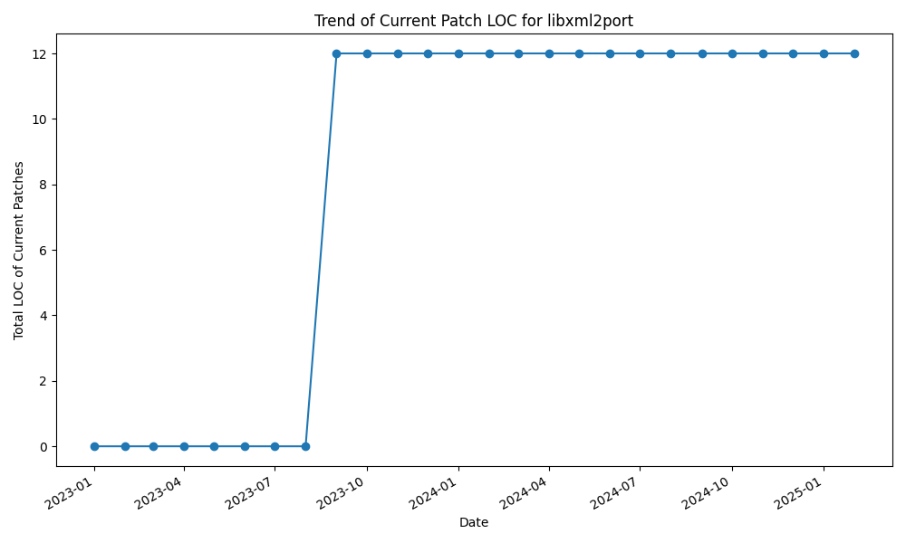

### Current Patch Details

| File | LOC |
| --- | --- |
| PR1/configure.patch | 12 |

---

### Historical Patch Event Details

| Commit Date | File | Delta LOC |
| --- | --- | --- |
| 2023-09-28 | PR1/configure.patch | 12 |

---

## Repository: zlibport

**Current Lines of Code:** 0  
**Current # of Patch files:** 0

### Trend of Current Patch LOC

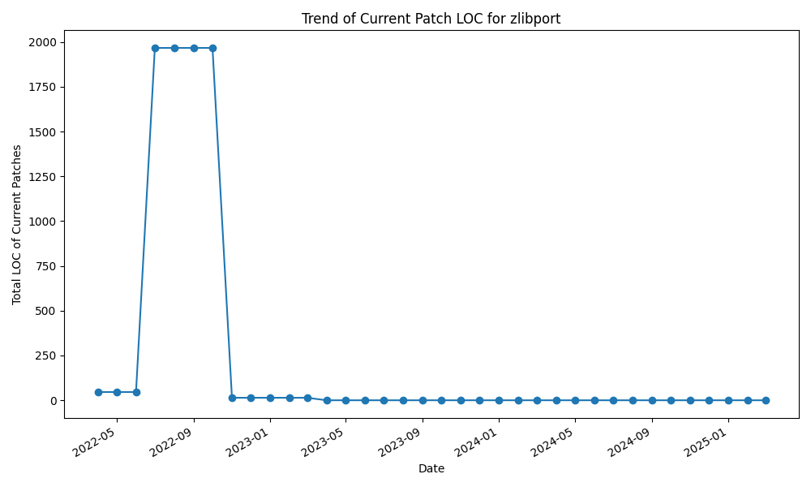

### Current Patch Details

| File | LOC |
| --- | --- |

---

### Historical Patch Event Details

| Commit Date | File | Delta LOC |
| --- | --- | --- |
| 2023-04-12 | configure.patch | 0 |
| 2022-11-15 | PR1/movedashellinkoption.patch | 0 |
| 2022-11-15 | PR1/removeoldmap.patch | 0 |
| 2022-11-15 | configure.patch | 14 |
| 2022-07-22 | PR1/movedashellinkoption.patch | 33 |
| 2022-07-22 | PR1/removeoldmap.patch | 1934 |
| 2022-07-22 | zconf.h.cmakein.patch | 0 |
| 2022-07-22 | zconf.h.in.patch | 0 |
| 2022-04-20 | zconf.h.cmakein.patch | 23 |
| 2022-04-20 | zconf.h.in.patch | 23 |

---

## Repository: help2manport

**Current Lines of Code:** 0  
**Current # of Patch files:** 0

### Current Patch Details

| File | LOC |
| --- | --- |

---

### Historical Patch Event Details

| Commit Date | File | Delta LOC |
| --- | --- | --- |

---

## Repository: zotsampleport

**Current Lines of Code:** 0  
**Current # of Patch files:** 0

### Current Patch Details

| File | LOC |
| --- | --- |

---

### Historical Patch Event Details

| Commit Date | File | Delta LOC |
| --- | --- | --- |

---

## Repository: man-dbport

**Current Lines of Code:** 0  
**Current # of Patch files:** 0

### Trend of Current Patch LOC

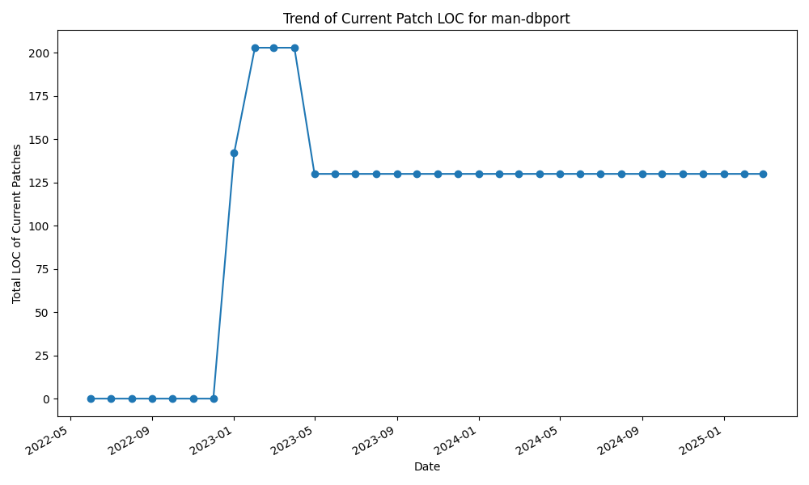

### Current Patch Details

| File | LOC |
| --- | --- |

---

### Historical Patch Event Details

| Commit Date | File | Delta LOC |
| --- | --- | --- |
| 2023-05-29 | localcharset.c.patch | 13 |
| 2023-05-29 | manconv.c.patch | 0 |
| 2023-05-29 | manconv_client.c.patch | 0 |
| 2023-05-29 | manconv_main.c.patch | 0 |
| 2023-05-29 | convert.c.patch | 0 |
| 2023-05-04 | Makefile.in.patch | 21 |
| 2023-02-21 | getprogname.c.patch | 18 |
| 2023-02-21 | getprogname.h.patch | 22 |
| 2023-02-10 | xmalloc.c.patch | 21 |
| 2023-01-08 | configure.patch | 16 |
| 2023-01-08 | convert.c.patch | 18 |
| 2023-01-08 | manconv.c.patch | 45 |
| 2023-01-08 | manconv_client.c.patch | 28 |
| 2023-01-08 | manconv_main.c.patch | 16 |
| 2023-01-06 | man.c.patch | 19 |

---

## Repository: shufport

**Current Lines of Code:** 0  
**Current # of Patch files:** 0

### Current Patch Details

| File | LOC |
| --- | --- |

---

### Historical Patch Event Details

| Commit Date | File | Delta LOC |
| --- | --- | --- |

---

## Repository: wgetport

**Current Lines of Code:** 0  
**Current # of Patch files:** 0

### Trend of Current Patch LOC

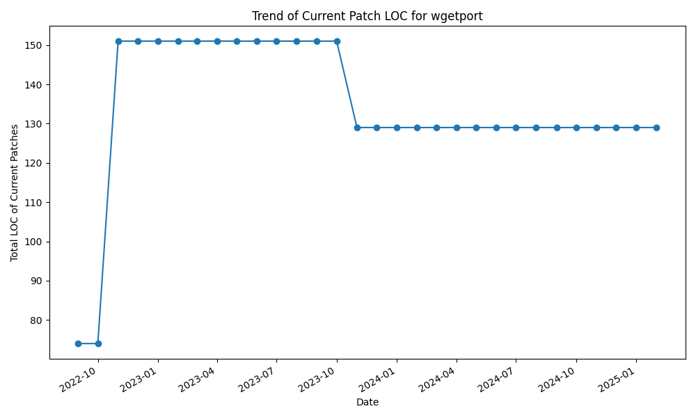

### Current Patch Details

| File | LOC |
| --- | --- |

---

### Historical Patch Event Details

| Commit Date | File | Delta LOC |
| --- | --- | --- |
| 2023-11-18 | PR1/netrc.c.patch | 0 |
| 2022-11-27 | PR1/netrc.c.patch | 22 |
| 2022-11-14 | PR1/host.c.patch | 55 |
| 2022-09-20 | PR1/dns.c.patch | 20 |
| 2022-09-20 | PR1/thread.c.patch | 17 |
| 2022-09-20 | PR1/wget.h.patch | 18 |
| 2022-09-20 | PR1/net.c.patch | 19 |

---

## Repository: gperfport

**Current Lines of Code:** 0  
**Current # of Patch files:** 0

### Current Patch Details

| File | LOC |
| --- | --- |

---

### Historical Patch Event Details

| Commit Date | File | Delta LOC |
| --- | --- | --- |

---

## Repository: zoslibport

**Current Lines of Code:** 0  
**Current # of Patch files:** 0

### Current Patch Details

| File | LOC |
| --- | --- |

---

### Historical Patch Event Details

| Commit Date | File | Delta LOC |
| --- | --- | --- |

---

## Repository: re2cport

**Current Lines of Code:** 0  
**Current # of Patch files:** 0

### Current Patch Details

| File | LOC |
| --- | --- |

---

### Historical Patch Event Details

| Commit Date | File | Delta LOC |
| --- | --- | --- |

---

## Repository: cscopeport

**Current Lines of Code:** 0  
**Current # of Patch files:** 0

### Current Patch Details

| File | LOC |
| --- | --- |

---

### Historical Patch Event Details

| Commit Date | File | Delta LOC |
| --- | --- | --- |

---

## Repository: gnulibport

**Current Lines of Code:** 0  
**Current # of Patch files:** 0

### Trend of Current Patch LOC

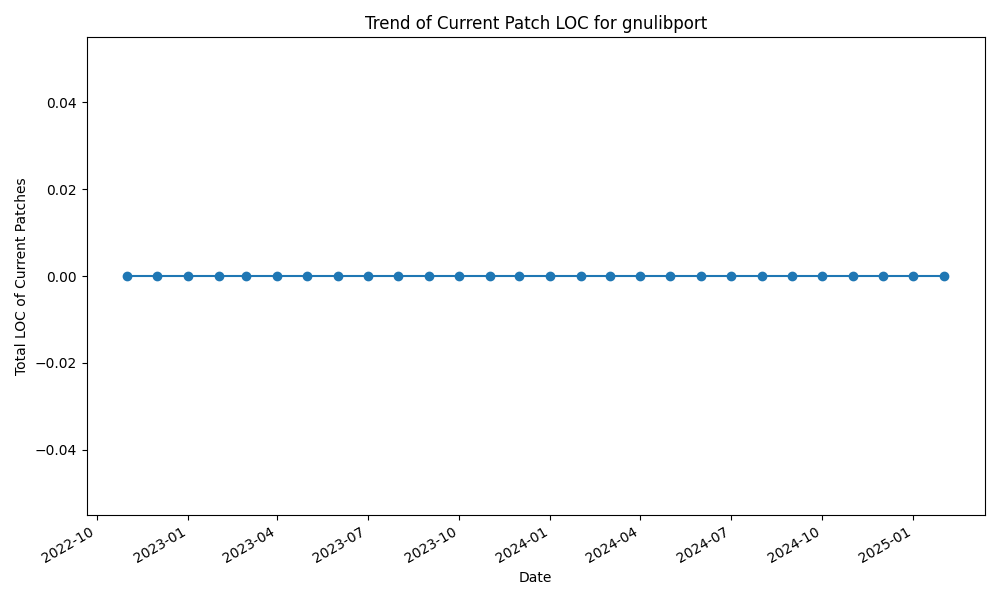

### Current Patch Details

| File | LOC |
| --- | --- |

---

### Historical Patch Event Details

| Commit Date | File | Delta LOC |
| --- | --- | --- |
| 2022-11-27 | PR1/gnulib-tool.patch | 0 |
| 2022-11-25 | PR1/gnulib-tool.patch | 28 |

---

## Repository: helloport

**Current Lines of Code:** 0  
**Current # of Patch files:** 0

### Current Patch Details

| File | LOC |
| --- | --- |

---

### Historical Patch Event Details

| Commit Date | File | Delta LOC |
| --- | --- | --- |

---

## Repository: htopport

**Current Lines of Code:** 0  
**Current # of Patch files:** 0

### Trend of Current Patch LOC

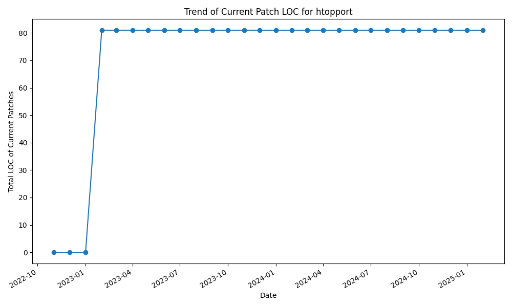

### Current Patch Details

| File | LOC |
| --- | --- |

---

### Historical Patch Event Details

| Commit Date | File | Delta LOC |
| --- | --- | --- |
| 2023-02-24 | PRZOS/gettime.o.patch | 0 |
| 2023-02-24 | PRZOS/ProcessField.h.patch | 58 |
| 2023-02-24 | PRZOS/configure.ac.patch | 23 |
| 2023-02-24 | PRZOS/gettime.c.patch | 0 |
| 2023-02-24 | PRZOS/gettime.h.patch | 0 |
| 2023-02-24 | PRZOS/gettime.o.patch | 0 |
| 2023-02-24 | PRZOS/hostname.c.patch | 0 |
| 2023-02-24 | PRZOS/hostname.h.patch | 0 |
| 2023-02-24 | PRZOS/openzfs_sysctl.c.patch | 0 |
| 2023-02-24 | PRZOS/openzfs_sysctl.h.patch | 0 |
| 2023-02-24 | PRZOS/uname.c.patch | 0 |
| 2023-02-24 | PRZOS/uname.h.patch | 0 |
| 2022-11-28 | PR1.patch | 191 |

---

## Repository: metaport

**Current Lines of Code:** 0  
**Current # of Patch files:** 0

### Current Patch Details

| File | LOC |
| --- | --- |

---

### Historical Patch Event Details

| Commit Date | File | Delta LOC |
| --- | --- | --- |

---

## Repository: zigiport

**Current Lines of Code:** 0  
**Current # of Patch files:** 0

### Current Patch Details

| File | LOC |
| --- | --- |

---

### Historical Patch Event Details

| Commit Date | File | Delta LOC |
| --- | --- | --- |

---

## Repository: yqport

**Current Lines of Code:** 0  
**Current # of Patch files:** 0

### Current Patch Details

| File | LOC |
| --- | --- |

---

### Historical Patch Event Details

| Commit Date | File | Delta LOC |
| --- | --- | --- |

---

## Repository: pythonport

**Current Lines of Code:** 0  
**Current # of Patch files:** 0

### Current Patch Details

| File | LOC |
| --- | --- |

---

### Historical Patch Event Details

| Commit Date | File | Delta LOC |
| --- | --- | --- |

---

## Repository: comp_goport

**Current Lines of Code:** 0  
**Current # of Patch files:** 0

### Current Patch Details

| File | LOC |
| --- | --- |

---

### Historical Patch Event Details

| Commit Date | File | Delta LOC |
| --- | --- | --- |

---

## Repository: comp_clangport

**Current Lines of Code:** 0  
**Current # of Patch files:** 0

### Current Patch Details

| File | LOC |
| --- | --- |

---

### Historical Patch Event Details

| Commit Date | File | Delta LOC |
| --- | --- | --- |

---

## Repository: comp_xlclangport

**Current Lines of Code:** 0  
**Current # of Patch files:** 0

### Current Patch Details

| File | LOC |
| --- | --- |

---

### Historical Patch Event Details

| Commit Date | File | Delta LOC |
| --- | --- | --- |

---

## Repository: direnvport

**Current Lines of Code:** 0  
**Current # of Patch files:** 0

### Current Patch Details

| File | LOC |
| --- | --- |

---

### Historical Patch Event Details

| Commit Date | File | Delta LOC |
| --- | --- | --- |

---

## Repository: libgit2port

**Current Lines of Code:** 0  
**Current # of Patch files:** 0

### Current Patch Details

| File | LOC |
| --- | --- |

---

### Historical Patch Event Details

| Commit Date | File | Delta LOC |
| --- | --- | --- |

---

## Repository: duckdbport

**Current Lines of Code:** 0  
**Current # of Patch files:** 0

### Trend of Current Patch LOC

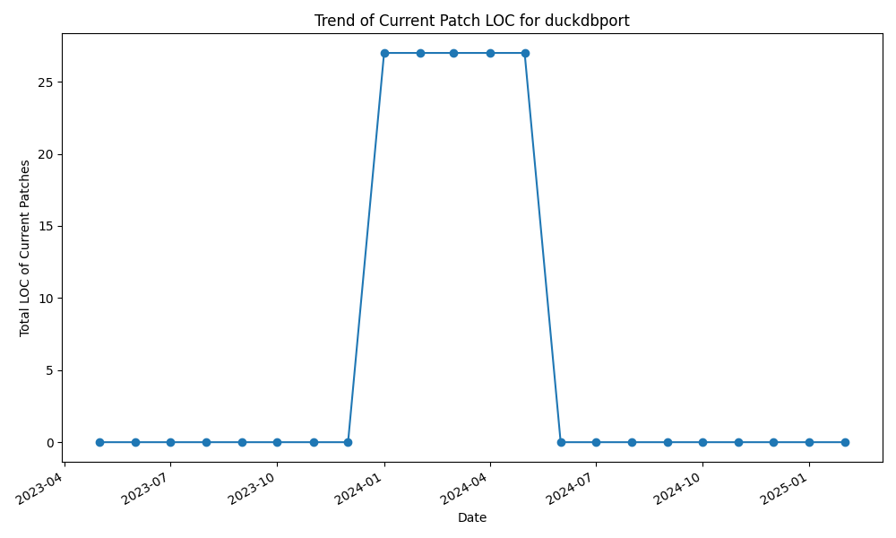

### Current Patch Details

| File | LOC |
| --- | --- |

---

### Historical Patch Event Details

| Commit Date | File | Delta LOC |
| --- | --- | --- |
| 2024-06-03 | linenoise.cpp.patch | 0 |
| 2024-06-03 | entropy_poll.cpp.patch | 0 |
| 2024-01-22 | entropy_poll.cpp.patch | 13 |
| 2024-01-22 | linenoise.cpp.patch | 14 |
| 2023-08-23 | extension_config.cmake.patch | 0 |
| 2023-08-21 | extension_config.cmake.patch | 24 |
| 2023-06-16 | 01-concurrentqueue.h.patch | 0 |
| 2023-06-16 | 01-file_system.cpp.patch | 0 |
| 2023-06-16 | 02-concurrentqueue.h.patch | 0 |
| 2023-06-16 | 02-file_system.cpp.patch | 0 |
| 2023-06-16 | fast_float.h.patch | 0 |
| 2023-06-16 | httplib.hpp.patch | 0 |
| 2023-06-16 | lightweightsemaphore.h.patch | 0 |
| 2023-06-16 | mutex.hpp.patch | 0 |
| 2023-05-31 | 01-concurrentqueue.h.patch | 25 |
| 2023-05-31 | 01-file_system.cpp.patch | 73 |
| 2023-05-31 | 02-concurrentqueue.h.patch | 25 |
| 2023-05-31 | 02-file_system.cpp.patch | 81 |
| 2023-05-31 | fast_float.h.patch | 25 |
| 2023-05-31 | httplib.hpp.patch | 43 |
| 2023-05-31 | lightweightsemaphore.h.patch | 106 |
| 2023-05-31 | mutex.hpp.patch | 27 |

---

## Repository: powerlinegoport

**Current Lines of Code:** 0  
**Current # of Patch files:** 0

### Trend of Current Patch LOC

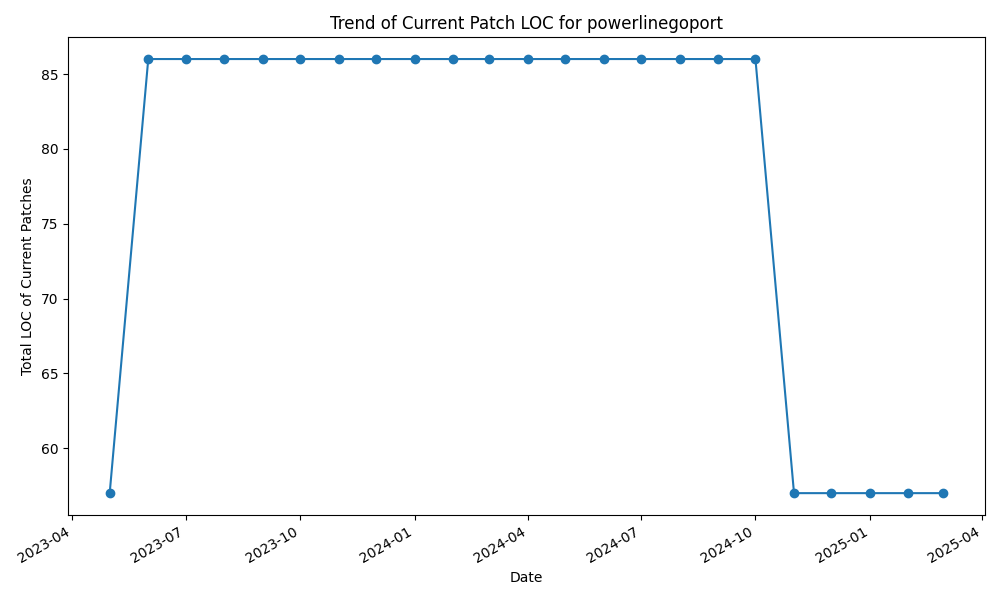

### Current Patch Details

| File | LOC |
| --- | --- |

---

### Historical Patch Event Details

| Commit Date | File | Delta LOC |
| --- | --- | --- |
| 2024-11-26 | segment-virtualenv.go.patch | 0 |
| 2023-06-27 | segment-virtualenv.go.patch | 29 |
| 2023-05-25 | exitcode_zos.patch | 0 |
| 2023-05-20 | 0001-Add-exit-codes-for-IBM-zOS.patch | 57 |

---

## Repository: byaccport

**Current Lines of Code:** 0  
**Current # of Patch files:** 0

### Current Patch Details

| File | LOC |
| --- | --- |

---

### Historical Patch Event Details

| Commit Date | File | Delta LOC |
| --- | --- | --- |

---

## Repository: bumpport

**Current Lines of Code:** 0  
**Current # of Patch files:** 0

### Current Patch Details

| File | LOC |
| --- | --- |

---

### Historical Patch Event Details

| Commit Date | File | Delta LOC |
| --- | --- | --- |

---

## Repository: c3270port

**Current Lines of Code:** 0  
**Current # of Patch files:** 0

### Trend of Current Patch LOC

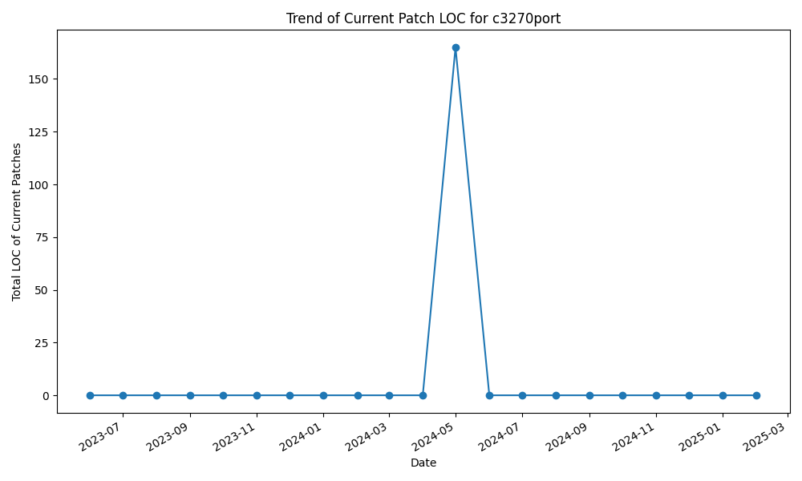

### Current Patch Details

| File | LOC |
| --- | --- |

---

### Historical Patch Event Details

| Commit Date | File | Delta LOC |
| --- | --- | --- |
| 2024-06-25 | c3270/Makefile.obj.in.patch | 0 |
| 2024-06-25 | c3270/configure.in.patch | 0 |
| 2024-06-25 | c3270/configure.patch | 0 |
| 2024-06-25 | lib/3270/Makefile.obj.in.patch | 0 |
| 2024-06-25 | s3270/Makefile.obj.in.patch | 0 |
| 2024-06-25 | tcl3270/Makefile.obj.in.patch | 0 |
| 2024-06-25 | x3270/Makefile.obj.in.patch | 0 |
| 2024-06-25 | x3270if/configure.in.patch | 0 |
| 2024-06-25 | x3270if/configure.patch | 0 |
| 2024-06-22 | Common/mkfb.c.patch | 0 |
| 2024-05-28 | Common/mkfb.c.patch | 37 |
| 2024-05-28 | tcl3270/Makefile.obj.in.patch | 13 |
| 2024-05-28 | x3270/Makefile.obj.in.patch | 13 |
| 2024-05-27 | c3270/configure.in.patch | 22 |
| 2024-05-27 | x3270if/configure.patch | 13 |
| 2024-05-27 | x3270if/configure.in.patch | 13 |
| 2024-05-24 | PR1.patch | 0 |
| 2024-05-24 | c3270/Makefile.obj.in.patch | 14 |
| 2024-05-24 | c3270/configure.patch | 13 |
| 2024-05-24 | lib/3270/Makefile.obj.in.patch | 14 |
| 2024-05-24 | s3270/Makefile.obj.in.patch | 13 |
| 2023-06-20 | PR1.patch | 13 |

---

## Repository: gumport

**Current Lines of Code:** 0  
**Current # of Patch files:** 0

### Current Patch Details

| File | LOC |
| --- | --- |

---

### Historical Patch Event Details

| Commit Date | File | Delta LOC |
| --- | --- | --- |

---

## Repository: wharfport

**Current Lines of Code:** 0  
**Current # of Patch files:** 0

### Current Patch Details

| File | LOC |
| --- | --- |

---

### Historical Patch Event Details

| Commit Date | File | Delta LOC |
| --- | --- | --- |

---

## Repository: dufport

**Current Lines of Code:** 0  
**Current # of Patch files:** 0

### Current Patch Details

| File | LOC |
| --- | --- |

---

### Historical Patch Event Details

| Commit Date | File | Delta LOC |
| --- | --- | --- |

---

## Repository: onigurumaport

**Current Lines of Code:** 0  
**Current # of Patch files:** 0

### Current Patch Details

| File | LOC |
| --- | --- |

---

### Historical Patch Event Details

| Commit Date | File | Delta LOC |
| --- | --- | --- |

---

## Repository: multitailport

**Current Lines of Code:** 0  
**Current # of Patch files:** 0

### Current Patch Details

| File | LOC |
| --- | --- |

---

### Historical Patch Event Details

| Commit Date | File | Delta LOC |
| --- | --- | --- |

---

## Repository: janssonport

**Current Lines of Code:** 0  
**Current # of Patch files:** 0

### Current Patch Details

| File | LOC |
| --- | --- |

---

### Historical Patch Event Details

| Commit Date | File | Delta LOC |
| --- | --- | --- |

---

## Repository: luarocksport

**Current Lines of Code:** 0  
**Current # of Patch files:** 0

### Current Patch Details

| File | LOC |
| --- | --- |

---

### Historical Patch Event Details

| Commit Date | File | Delta LOC |
| --- | --- | --- |

---

## Repository: termenvport

**Current Lines of Code:** 0  
**Current # of Patch files:** 0

### Current Patch Details

| File | LOC |
| --- | --- |

---

### Historical Patch Event Details

| Commit Date | File | Delta LOC |
| --- | --- | --- |

---

## Repository: esbuildport

**Current Lines of Code:** 0  
**Current # of Patch files:** 0

### Current Patch Details

| File | LOC |
| --- | --- |

---

### Historical Patch Event Details

| Commit Date | File | Delta LOC |
| --- | --- | --- |

---

## Repository: nginxport

**Current Lines of Code:** 0  
**Current # of Patch files:** 0

### Current Patch Details

| File | LOC |
| --- | --- |

---

### Historical Patch Event Details

| Commit Date | File | Delta LOC |
| --- | --- | --- |

---

## Repository: natsport

**Current Lines of Code:** 0  
**Current # of Patch files:** 0

### Current Patch Details

| File | LOC |
| --- | --- |

---

### Historical Patch Event Details

| Commit Date | File | Delta LOC |
| --- | --- | --- |

---

## Repository: githubcliport

**Current Lines of Code:** 0  
**Current # of Patch files:** 0

### Current Patch Details

| File | LOC |
| --- | --- |

---

### Historical Patch Event Details

| Commit Date | File | Delta LOC |
| --- | --- | --- |

---

## Repository: zos-code-page-toolsport

**Current Lines of Code:** 0  
**Current # of Patch files:** 0

### Current Patch Details

| File | LOC |
| --- | --- |

---

### Historical Patch Event Details

| Commit Date | File | Delta LOC |
| --- | --- | --- |

---

## Repository: v8port

**Current Lines of Code:** 0  
**Current # of Patch files:** 0

### Current Patch Details

| File | LOC |
| --- | --- |

---

### Historical Patch Event Details

| Commit Date | File | Delta LOC |
| --- | --- | --- |

---

## Repository: dos2unixport

**Current Lines of Code:** 0  
**Current # of Patch files:** 0

### Trend of Current Patch LOC

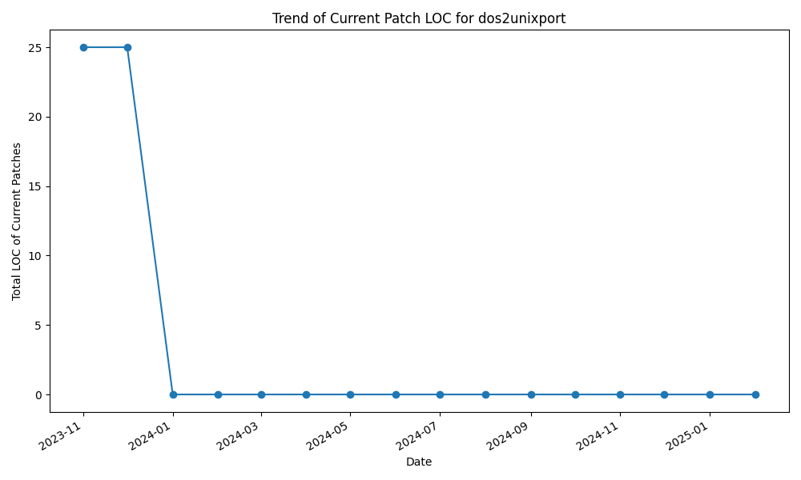

### Current Patch Details

| File | LOC |
| --- | --- |

---

### Historical Patch Event Details

| Commit Date | File | Delta LOC |
| --- | --- | --- |
| 2024-01-19 | Makefile.patch | 0 |
| 2023-11-14 | Makefile.patch | 25 |

---

## Repository: zospstreeport

**Current Lines of Code:** 0  
**Current # of Patch files:** 0

### Current Patch Details

| File | LOC |
| --- | --- |

---

### Historical Patch Event Details

| Commit Date | File | Delta LOC |
| --- | --- | --- |

---

## Repository: zosncport

**Current Lines of Code:** 0  
**Current # of Patch files:** 0

### Current Patch Details

| File | LOC |
| --- | --- |

---

### Historical Patch Event Details

| Commit Date | File | Delta LOC |
| --- | --- | --- |

---

## Repository: boostport

**Current Lines of Code:** 0  
**Current # of Patch files:** 0

### Current Patch Details

| File | LOC |
| --- | --- |

---

### Historical Patch Event Details

| Commit Date | File | Delta LOC |
| --- | --- | --- |

---

## Repository: buildkiteport

**Current Lines of Code:** 0  
**Current # of Patch files:** 0

### Current Patch Details

| File | LOC |
| --- | --- |

---

### Historical Patch Event Details

| Commit Date | File | Delta LOC |
| --- | --- | --- |

---

## Repository: javaport

**Current Lines of Code:** 0  
**Current # of Patch files:** 0

### Current Patch Details

| File | LOC |
| --- | --- |

---

### Historical Patch Event Details

| Commit Date | File | Delta LOC |
| --- | --- | --- |

---

## Repository: antport

**Current Lines of Code:** 0  
**Current # of Patch files:** 0

### Current Patch Details

| File | LOC |
| --- | --- |

---

### Historical Patch Event Details

| Commit Date | File | Delta LOC |
| --- | --- | --- |

---

## Repository: jrubyport

**Current Lines of Code:** 0  
**Current # of Patch files:** 0

### Current Patch Details

| File | LOC |
| --- | --- |

---

### Historical Patch Event Details

| Commit Date | File | Delta LOC |
| --- | --- | --- |

---

## Repository: toolsandtoysport

**Current Lines of Code:** 0  
**Current # of Patch files:** 0

### Current Patch Details

| File | LOC |
| --- | --- |

---

### Historical Patch Event Details

| Commit Date | File | Delta LOC |
| --- | --- | --- |

---

## Repository: groovyport

**Current Lines of Code:** 0  
**Current # of Patch files:** 0

### Current Patch Details

| File | LOC |
| --- | --- |

---

### Historical Patch Event Details

| Commit Date | File | Delta LOC |
| --- | --- | --- |

---

## Repository: kotlinport

**Current Lines of Code:** 0  
**Current # of Patch files:** 0

### Current Patch Details

| File | LOC |
| --- | --- |

---

### Historical Patch Event Details

| Commit Date | File | Delta LOC |
| --- | --- | --- |

---

## Repository: caddyport

**Current Lines of Code:** 0  
**Current # of Patch files:** 0

### Trend of Current Patch LOC

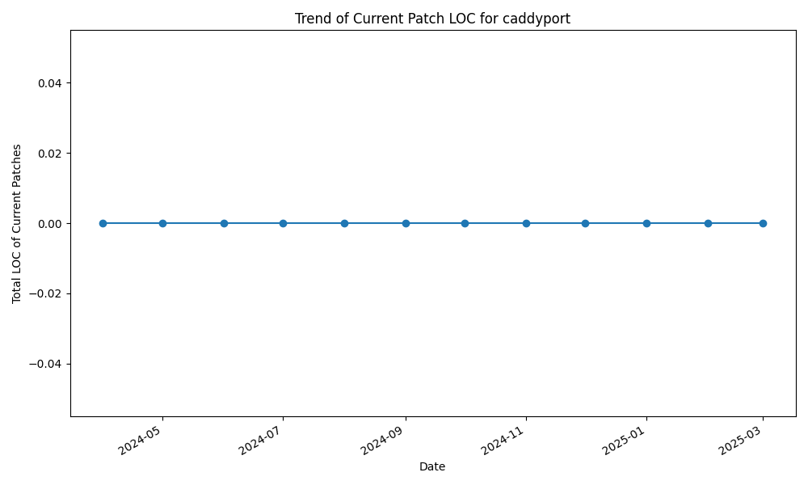

### Current Patch Details

| File | LOC |
| --- | --- |

---

### Historical Patch Event Details

| Commit Date | File | Delta LOC |
| --- | --- | --- |
| 2024-04-03 | badger_1-6-2.patch | 0 |
| 2024-04-03 | badger_2-2007-4.patch | 0 |
| 2024-04-03 | caddy.patch | 0 |
| 2024-04-01 | badger_1-6-2.patch | 20 |
| 2024-04-01 | badger_2-2007-4.patch | 20 |
| 2024-04-01 | caddy.patch | 11 |

---

## Repository: gitlabcliport

**Current Lines of Code:** 0  
**Current # of Patch files:** 0

### Current Patch Details

| File | LOC |
| --- | --- |

---

### Historical Patch Event Details

| Commit Date | File | Delta LOC |
| --- | --- | --- |

---

## Repository: fqport

**Current Lines of Code:** 0  
**Current # of Patch files:** 0

### Current Patch Details

| File | LOC |
| --- | --- |

---

### Historical Patch Event Details

| Commit Date | File | Delta LOC |
| --- | --- | --- |

---

## Repository: promptersport

**Current Lines of Code:** 0  
**Current # of Patch files:** 0

### Current Patch Details

| File | LOC |
| --- | --- |

---

### Historical Patch Event Details

| Commit Date | File | Delta LOC |
| --- | --- | --- |

---

## Repository: osv-scannerport

**Current Lines of Code:** 0  
**Current # of Patch files:** 0

### Current Patch Details

| File | LOC |
| --- | --- |

---

### Historical Patch Event Details

| Commit Date | File | Delta LOC |
| --- | --- | --- |

---

## Repository: ginport

**Current Lines of Code:** 0  
**Current # of Patch files:** 0

### Current Patch Details

| File | LOC |
| --- | --- |

---

### Historical Patch Event Details

| Commit Date | File | Delta LOC |
| --- | --- | --- |

---

## Repository: frpport

**Current Lines of Code:** 0  
**Current # of Patch files:** 0

### Current Patch Details

| File | LOC |
| --- | --- |

---

### Historical Patch Event Details

| Commit Date | File | Delta LOC |
| --- | --- | --- |

---

## Repository: mavenport

**Current Lines of Code:** 0  
**Current # of Patch files:** 0

### Current Patch Details

| File | LOC |
| --- | --- |

---

### Historical Patch Event Details

| Commit Date | File | Delta LOC |
| --- | --- | --- |

---

## Repository: ttypeport

**Current Lines of Code:** 0  
**Current # of Patch files:** 0

### Current Patch Details

| File | LOC |
| --- | --- |

---

### Historical Patch Event Details

| Commit Date | File | Delta LOC |
| --- | --- | --- |

---

## Repository: cosignport

**Current Lines of Code:** 0  
**Current # of Patch files:** 0

### Current Patch Details

| File | LOC |
| --- | --- |

---

### Historical Patch Event Details

| Commit Date | File | Delta LOC |
| --- | --- | --- |

---

## Repository: jenkinsport

**Current Lines of Code:** 0  
**Current # of Patch files:** 0

### Current Patch Details

| File | LOC |
| --- | --- |

---

### Historical Patch Event Details

| Commit Date | File | Delta LOC |
| --- | --- | --- |

---

## Repository: godsectport

**Current Lines of Code:** 0  
**Current # of Patch files:** 0

### Current Patch Details

| File | LOC |
| --- | --- |

---

### Historical Patch Event Details

| Commit Date | File | Delta LOC |
| --- | --- | --- |

---

## Repository: murexport

**Current Lines of Code:** 0  
**Current # of Patch files:** 0

### Current Patch Details

| File | LOC |
| --- | --- |

---

### Historical Patch Event Details

| Commit Date | File | Delta LOC |
| --- | --- | --- |

---

## Repository: grafanaport

**Current Lines of Code:** 0  
**Current # of Patch files:** 0

### Current Patch Details

| File | LOC |
| --- | --- |

---

### Historical Patch Event Details

| Commit Date | File | Delta LOC |
| --- | --- | --- |

---

## Repository: iperfport

**Current Lines of Code:** 0  
**Current # of Patch files:** 0

### Current Patch Details

| File | LOC |
| --- | --- |

---

### Historical Patch Event Details

| Commit Date | File | Delta LOC |
| --- | --- | --- |

---

## Repository: fxport

**Current Lines of Code:** 0  
**Current # of Patch files:** 0

### Current Patch Details

| File | LOC |
| --- | --- |

---

### Historical Patch Event Details

| Commit Date | File | Delta LOC |
| --- | --- | --- |

---

## Repository: s5cmdport

**Current Lines of Code:** 0  
**Current # of Patch files:** 0

### Current Patch Details

| File | LOC |
| --- | --- |

---

### Historical Patch Event Details

| Commit Date | File | Delta LOC |
| --- | --- | --- |

---

## Repository: parse-gotestport

**Current Lines of Code:** 0  
**Current # of Patch files:** 0

### Current Patch Details

| File | LOC |
| --- | --- |

---

### Historical Patch Event Details

| Commit Date | File | Delta LOC |
| --- | --- | --- |

---

## Repository: check_clangport

**Current Lines of Code:** 0  
**Current # of Patch files:** 0

### Current Patch Details

| File | LOC |
| --- | --- |

---

### Historical Patch Event Details

| Commit Date | File | Delta LOC |
| --- | --- | --- |

---

## Repository: check_xlclangport

**Current Lines of Code:** 0  
**Current # of Patch files:** 0

### Current Patch Details

| File | LOC |
| --- | --- |

---

### Historical Patch Event Details

| Commit Date | File | Delta LOC |
| --- | --- | --- |

---

## Repository: check_pythonport

**Current Lines of Code:** 0  
**Current # of Patch files:** 0

### Current Patch Details

| File | LOC |
| --- | --- |

---

### Historical Patch Event Details

| Commit Date | File | Delta LOC |
| --- | --- | --- |

---

## Repository: check_javaport

**Current Lines of Code:** 0  
**Current # of Patch files:** 0

### Current Patch Details

| File | LOC |
| --- | --- |

---

### Historical Patch Event Details

| Commit Date | File | Delta LOC |
| --- | --- | --- |

---

## Repository: check_goport

**Current Lines of Code:** 0  
**Current # of Patch files:** 0

### Current Patch Details

| File | LOC |
| --- | --- |

---

### Historical Patch Event Details

| Commit Date | File | Delta LOC |
| --- | --- | --- |

---

## Repository: nmapport

**Current Lines of Code:** 0  
**Current # of Patch files:** 0

### Current Patch Details

| File | LOC |
| --- | --- |

---

### Historical Patch Event Details

| Commit Date | File | Delta LOC |
| --- | --- | --- |

---

## Repository: hugoport

**Current Lines of Code:** 0  
**Current # of Patch files:** 0

### Current Patch Details

| File | LOC |
| --- | --- |

---

### Historical Patch Event Details

| Commit Date | File | Delta LOC |
| --- | --- | --- |

---

## Repository: dialogport

**Current Lines of Code:** 0  
**Current # of Patch files:** 0

### Current Patch Details

| File | LOC |
| --- | --- |

---

### Historical Patch Event Details

| Commit Date | File | Delta LOC |
| --- | --- | --- |

---

## Repository: joeport

**Current Lines of Code:** 0  
**Current # of Patch files:** 0

### Current Patch Details

| File | LOC |
| --- | --- |

---

### Historical Patch Event Details

| Commit Date | File | Delta LOC |
| --- | --- | --- |

---

## Repository: cjsonport

**Current Lines of Code:** 0  
**Current # of Patch files:** 0

### Current Patch Details

| File | LOC |
| --- | --- |

---

### Historical Patch Event Details

| Commit Date | File | Delta LOC |
| --- | --- | --- |

---

## Repository: libdioport

**Current Lines of Code:** 0  
**Current # of Patch files:** 0

### Current Patch Details

| File | LOC |
| --- | --- |

---

### Historical Patch Event Details

| Commit Date | File | Delta LOC |
| --- | --- | --- |

---

## Repository: git-chglogport

**Current Lines of Code:** 0  
**Current # of Patch files:** 0

### Current Patch Details

| File | LOC |
| --- | --- |

---

### Historical Patch Event Details

| Commit Date | File | Delta LOC |
| --- | --- | --- |

---

## Repository: zedc_asciiport

**Current Lines of Code:** 0  
**Current # of Patch files:** 0

### Current Patch Details

| File | LOC |
| --- | --- |

---

### Historical Patch Event Details

| Commit Date | File | Delta LOC |
| --- | --- | --- |

---

## Repository: bash-completionport

**Current Lines of Code:** 0  
**Current # of Patch files:** 0

### Current Patch Details

| File | LOC |
| --- | --- |

---

### Historical Patch Event Details

| Commit Date | File | Delta LOC |
| --- | --- | --- |

---

## Repository: zusageport

**Current Lines of Code:** 0  
**Current # of Patch files:** 0

### Current Patch Details

| File | LOC |
| --- | --- |

---

### Historical Patch Event Details

| Commit Date | File | Delta LOC |
| --- | --- | --- |

---

## Repository: spdlogport

**Current Lines of Code:** 0  
**Current # of Patch files:** 0

### Current Patch Details

| File | LOC |
| --- | --- |

---

### Historical Patch Event Details

| Commit Date | File | Delta LOC |
| --- | --- | --- |

---

## Repository: creduceport

**Current Lines of Code:** 0  
**Current # of Patch files:** 0

### Current Patch Details

| File | LOC |
| --- | --- |

---

### Historical Patch Event Details

| Commit Date | File | Delta LOC |
| --- | --- | --- |

---

## Repository: gradleport

**Current Lines of Code:** 0  
**Current # of Patch files:** 0

### Current Patch Details

| File | LOC |
| --- | --- |

---

### Historical Patch Event Details

| Commit Date | File | Delta LOC |
| --- | --- | --- |

---

