# Upstream Patch Status Report

*Report generated on: 2025-09-15 06:14:10 EDT.*

## Overall Summary

- **Total Projects Analyzed:** 271
- **Total Current Lines of Code (LOC) in Patches:** 42,251
- **Total Number of Current Patch Files:** 862
- **Average Current Patch LOC per Project:** 155.91
- **Average Current Patch Count per Project:** 3.18

### Historical Trends (All Projects)

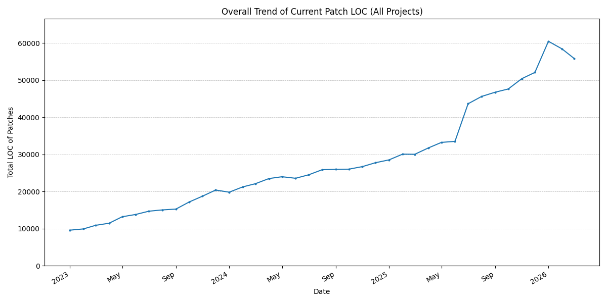

### Repository LoC Distribution

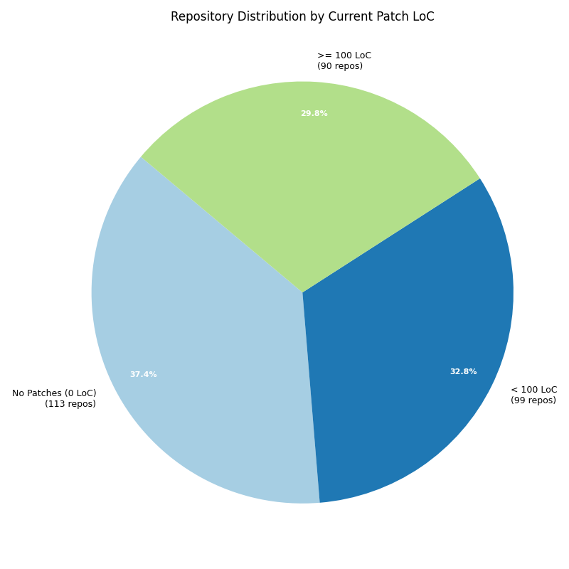

## Repository Breakdown (Sorted by Current Patch LOC)

| Repository | Current Patch LOC | Delta Last Month | # Current Patches |
|---|:---|:---|:---|
| [stablediffusionport](#repo-stablediffusionport) | 2,905 | +0 | 6 |
| [librdkafkaport](#repo-librdkafkaport) | 2,638 | +0 | 54 |
| [rpmport](#repo-rpmport) | 1,841 | +0 | 45 |
| [llamacppport](#repo-llamacppport) | 1,780 | +0 | 37 |
| [bashport](#repo-bashport) | 1,584 | -2,842 | 25 |
| [gpgport](#repo-gpgport) | 1,484 | +0 | 30 |
| [libuvport](#repo-libuvport) | 1,462 | +0 | 26 |
| [sudoport](#repo-sudoport) | 1,278 | +0 | 30 |
| [coreutilsport](#repo-coreutilsport) | 1,169 | +0 | 18 |
| [cmakeport](#repo-cmakeport) | 1,092 | +0 | 1 |
| [gitport](#repo-gitport) | 1,065 | +0 | 32 |
| [grpcport](#repo-grpcport) | 1,017 | +0 | 8 |
| [valgrindport](#repo-valgrindport) | 896 | +0 | 3 |
| [alternativesport](#repo-alternativesport) | 838 | +0 | 1 |
| [gzipport](#repo-gzipport) | 690 | +0 | 8 |
| [procpsport](#repo-procpsport) | 687 | +0 | 1 |
| [perlport](#repo-perlport) | 684 | +0 | 14 |
| [util-linuxport](#repo-util-linuxport) | 630 | +0 | 16 |
| [redisport](#repo-redisport) | 588 | +0 | 3 |
| [unzipport](#repo-unzipport) | 549 | +0 | 12 |
| [inetutilsport](#repo-inetutilsport) | 514 | +0 | 20 |
| [cronieport](#repo-cronieport) | 510 | +0 | 13 |
| [screenport](#repo-screenport) | 485 | +0 | 7 |
| [glibport](#repo-glibport) | 459 | +0 | 2 |
| [tmuxport](#repo-tmuxport) | 440 | +0 | 13 |
| [libpcapport](#repo-libpcapport) | 440 | +0 | 8 |
| [treeport](#repo-treeport) | 425 | +0 | 3 |
| [nginxport](#repo-nginxport) | 414 | +0 | 1 |
| [emacsport](#repo-emacsport) | 413 | +0 | 2 |
| [gettextport](#repo-gettextport) | 378 | +0 | 10 |
| [opensshport](#repo-opensshport) | 376 | +0 | 19 |
| [flexport](#repo-flexport) | 351 | +0 | 2 |
| [prometheusport](#repo-prometheusport) | 348 | +0 | 1 |
| [vimport](#repo-vimport) | 347 | +12 | 13 |
| [pocoport](#repo-pocoport) | 343 | +0 | 9 |
| [rsyncport](#repo-rsyncport) | 341 | +0 | 6 |
| [neovimport](#repo-neovimport) | 327 | +0 | 13 |
| [phpport](#repo-phpport) | 320 | +0 | 13 |
| [mimallocport](#repo-mimallocport) | 313 | +0 | 6 |
| [libgcryptport](#repo-libgcryptport) | 302 | +0 | 9 |
| [conanport](#repo-conanport) | 299 | +0 | 8 |
| [zipport](#repo-zipport) | 297 | +0 | 8 |
| [ccacheport](#repo-ccacheport) | 264 | +0 | 1 |
| [fishport](#repo-fishport) | 258 | +0 | 1 |
| [mesonport](#repo-mesonport) | 257 | +0 | 9 |
| [gitlab-runnerport](#repo-gitlab-runnerport) | 241 | +0 | 10 |
| [zstdport](#repo-zstdport) | 236 | +0 | 4 |
| [libarchiveport](#repo-libarchiveport) | 220 | +0 | 5 |
| [toml11port](#repo-toml11port) | 217 | +0 | 3 |
| [protobufport](#repo-protobufport) | 201 | +0 | 9 |
| [findutilsport](#repo-findutilsport) | 199 | +0 | 10 |
| [ninjaport](#repo-ninjaport) | 196 | +0 | 8 |
| [blisport](#repo-blisport) | 185 | +0 | 2 |
| [diffutilsport](#repo-diffutilsport) | 184 | +0 | 8 |
| [aflplusplusport](#repo-aflplusplusport) | 184 | +0 | 5 |
| [jemallocport](#repo-jemallocport) | 166 | +0 | 1 |
| [groffport](#repo-groffport) | 165 | +0 | 13 |
| [autoconfport](#repo-autoconfport) | 151 | +0 | 6 |
| [moreutilsport](#repo-moreutilsport) | 151 | +0 | 1 |
| [libserdesport](#repo-libserdesport) | 142 | +0 | 4 |
| [tclport](#repo-tclport) | 132 | +0 | 5 |
| [multitailport](#repo-multitailport) | 130 | +0 | 1 |
| [pinentryport](#repo-pinentryport) | 124 | +0 | 5 |
| [m4port](#repo-m4port) | 120 | +0 | 5 |
| [thesilversearcherport](#repo-thesilversearcherport) | 118 | +0 | 4 |
| [gas2asmport](#repo-gas2asmport) | 116 | +0 | 4 |
| [grepport](#repo-grepport) | 115 | +0 | 3 |
| [uucpport](#repo-uucpport) | 115 | +0 | 1 |
| [ncursesport](#repo-ncursesport) | 111 | +0 | 2 |
| [hexcurseport](#repo-hexcurseport) | 108 | +0 | 4 |
| [libbsdport](#repo-libbsdport) | 107 | +0 | 4 |
| [victoriametricsport](#repo-victoriametricsport) | 107 | +0 | 3 |
| [mkcertport](#repo-mkcertport) | 105 | +0 | 1 |
| [zlib-ngport](#repo-zlib-ngport) | 100 | +0 | 3 |
| [ansibleport](#repo-ansibleport) | 100 | +0 | 4 |
| [pkgconfigport](#repo-pkgconfigport) | 98 | +0 | 1 |
| [doxygenport](#repo-doxygenport) | 97 | +0 | 5 |
| [libiconvport](#repo-libiconvport) | 96 | +0 | 4 |
| [depot_toolsport](#repo-depot-toolsport) | 91 | +0 | 1 |
| [libeventport](#repo-libeventport) | 87 | +0 | 3 |
| [patchport](#repo-patchport) | 86 | +0 | 3 |
| [jqport](#repo-jqport) | 85 | +0 | 6 |
| [openldapport](#repo-openldapport) | 85 | +0 | 1 |
| [gawkport](#repo-gawkport) | 81 | +0 | 4 |
| [expectport](#repo-expectport) | 79 | +0 | 4 |
| [librabbitmqport](#repo-librabbitmqport) | 78 | +0 | 2 |
| [libassuanport](#repo-libassuanport) | 77 | +0 | 4 |
| [xmltoport](#repo-xmltoport) | 74 | +0 | 1 |
| [cppcheckport](#repo-cppcheckport) | 72 | +0 | 4 |
| [libtoolport](#repo-libtoolport) | 71 | +0 | 3 |
| [nanoport](#repo-nanoport) | 68 | +0 | 1 |
| [opensslport](#repo-opensslport) | 67 | +19 | 3 |
| [gradleport](#repo-gradleport) | 67 | +0 | 1 |
| [getoptport](#repo-getoptport) | 66 | +0 | 1 |
| [librepoport](#repo-librepoport) | 66 | +0 | 1 |
| [logrotateport](#repo-logrotateport) | 65 | +0 | 1 |
| [libkqueueport](#repo-libkqueueport) | 61 | +0 | 4 |
| [doom-asciiport](#repo-doom-asciiport) | 60 | +0 | 1 |
| [lz4port](#repo-lz4port) | 58 | +0 | 4 |
| [snappy-cport](#repo-snappy-cport) | 56 | +0 | 1 |
| [libgpgerrorport](#repo-libgpgerrorport) | 53 | +0 | 3 |
| [expatport](#repo-expatport) | 52 | +0 | 2 |
| [terraformport](#repo-terraformport) | 51 | +0 | 2 |
| [libsasl2port](#repo-libsasl2port) | 50 | +0 | 3 |
| [libsolvport](#repo-libsolvport) | 50 | +0 | 1 |
| [automakeport](#repo-automakeport) | 47 | +0 | 3 |
| [lessport](#repo-lessport) | 47 | +0 | 3 |
| [xxhashport](#repo-xxhashport) | 47 | +0 | 2 |
| [tigport](#repo-tigport) | 47 | +0 | 1 |
| [lazygitport](#repo-lazygitport) | 46 | +0 | 1 |
| [libssh2port](#repo-libssh2port) | 42 | +0 | 3 |
| [catimgport](#repo-catimgport) | 37 | +0 | 1 |
| [poptport](#repo-poptport) | 35 | +0 | 1 |
| [whichport](#repo-whichport) | 34 | +0 | 1 |
| [tcltlsport](#repo-tcltlsport) | 34 | +0 | 1 |
| [sedport](#repo-sedport) | 33 | +0 | 1 |
| [texinfoport](#repo-texinfoport) | 33 | +0 | 2 |
| [ntbtlsport](#repo-ntbtlsport) | 33 | +0 | 1 |
| [sqliteport](#repo-sqliteport) | 32 | +0 | 1 |
| [fzfport](#repo-fzfport) | 32 | +0 | 2 |
| [luvport](#repo-luvport) | 31 | +0 | 1 |
| [libffiport](#repo-libffiport) | 31 | +0 | 2 |
| [lynxport](#repo-lynxport) | 30 | +0 | 1 |
| [createrepo_cport](#repo-createrepo-cport) | 30 | +30 | 1 |
| [netpbmport](#repo-netpbmport) | 29 | +0 | 2 |
| [gmpport](#repo-gmpport) | 29 | +0 | 2 |
| [libgpgmeport](#repo-libgpgmeport) | 29 | +0 | 2 |
| [npthport](#repo-npthport) | 28 | +0 | 2 |
| [libksbaport](#repo-libksbaport) | 28 | +0 | 2 |
| [avro-c-libport](#repo-avro-c-libport) | 28 | +0 | 2 |
| [mpfrport](#repo-mpfrport) | 28 | +0 | 2 |
| [ctagsport](#repo-ctagsport) | 26 | +0 | 2 |
| [git-extrasport](#repo-git-extrasport) | 26 | +0 | 1 |
| [asioport](#repo-asioport) | 26 | +0 | 1 |
| [my_basicport](#repo-my-basicport) | 22 | +0 | 1 |
| [shdocport](#repo-shdocport) | 20 | +0 | 2 |
| [sshpassport](#repo-sshpassport) | 18 | +0 | 1 |
| [git-lfsport](#repo-git-lfsport) | 18 | +0 | 1 |
| [bzip2port](#repo-bzip2port) | 17 | +0 | 1 |
| [cunitport](#repo-cunitport) | 17 | +0 | 2 |
| [makeport](#repo-makeport) | 16 | +0 | 1 |
| [curlport](#repo-curlport) | 15 | +0 | 1 |
| [xzport](#repo-xzport) | 15 | +0 | 1 |
| [libgdbmport](#repo-libgdbmport) | 15 | +0 | 1 |
| [libpipelineport](#repo-libpipelineport) | 15 | +0 | 1 |
| [libpcre2port](#repo-libpcre2port) | 15 | +0 | 1 |
| [libxsltport](#repo-libxsltport) | 15 | +0 | 1 |
| [libpcreport](#repo-libpcreport) | 15 | +0 | 1 |
| [libmdport](#repo-libmdport) | 15 | +0 | 1 |
| [fileport](#repo-fileport) | 15 | +0 | 1 |
| [cppunitport](#repo-cppunitport) | 15 | +15 | 1 |
| [tarport](#repo-tarport) | 14 | +0 | 1 |
| [nghttp2port](#repo-nghttp2port) | 14 | +0 | 1 |
| [bisonport](#repo-bisonport) | 13 | +0 | 1 |
| [ncduport](#repo-ncduport) | 13 | +0 | 1 |
| [luaport](#repo-luaport) | 13 | +0 | 1 |
| [lpegport](#repo-lpegport) | 13 | +0 | 1 |
| [stowport](#repo-stowport) | 13 | +0 | 1 |
| [edport](#repo-edport) | 13 | +0 | 1 |
| [lzipport](#repo-lzipport) | 13 | +0 | 1 |
| [aprport](#repo-aprport) | 13 | +0 | 1 |
| [fmtport](#repo-fmtport) | 13 | +0 | 1 |
| [jsoncport](#repo-jsoncport) | 13 | +0 | 1 |
| [libxml2port](#repo-libxml2port) | 12 | +0 | 1 |
| [gflagsport](#repo-gflagsport) | 12 | +0 | 1 |
| [libpslport](#repo-libpslport) | 12 | +0 | 1 |
| [quiltport](#repo-quiltport) | 10 | +0 | 1 |
| [zlibport](#repo-zlibport) | 0 | +0 | 0 |
| [help2manport](#repo-help2manport) | 0 | +0 | 0 |
| [zotsampleport](#repo-zotsampleport) | 0 | +0 | 0 |
| [man-dbport](#repo-man-dbport) | 0 | +0 | 0 |
| [shufport](#repo-shufport) | 0 | +0 | 0 |
| [wgetport](#repo-wgetport) | 0 | +0 | 0 |
| [gperfport](#repo-gperfport) | 0 | +0 | 0 |
| [zoslibport](#repo-zoslibport) | 0 | +0 | 0 |
| [re2cport](#repo-re2cport) | 0 | +0 | 0 |
| [cscopeport](#repo-cscopeport) | 0 | +0 | 0 |
| [gnulibport](#repo-gnulibport) | 0 | +0 | 0 |
| [helloport](#repo-helloport) | 0 | +0 | 0 |
| [htopport](#repo-htopport) | 0 | +0 | 0 |
| [metaport](#repo-metaport) | 0 | +0 | 0 |
| [zigiport](#repo-zigiport) | 0 | +0 | 0 |
| [yqport](#repo-yqport) | 0 | +0 | 0 |
| [direnvport](#repo-direnvport) | 0 | +0 | 0 |
| [libgit2port](#repo-libgit2port) | 0 | +0 | 0 |
| [duckdbport](#repo-duckdbport) | 0 | +0 | 0 |
| [powerlinegoport](#repo-powerlinegoport) | 0 | +0 | 0 |
| [byaccport](#repo-byaccport) | 0 | +0 | 0 |
| [bumpport](#repo-bumpport) | 0 | +0 | 0 |
| [c3270port](#repo-c3270port) | 0 | +0 | 0 |
| [gumport](#repo-gumport) | 0 | +0 | 0 |
| [wharfport](#repo-wharfport) | 0 | +0 | 0 |
| [dufport](#repo-dufport) | 0 | +0 | 0 |
| [onigurumaport](#repo-onigurumaport) | 0 | +0 | 0 |
| [janssonport](#repo-janssonport) | 0 | +0 | 0 |
| [luarocksport](#repo-luarocksport) | 0 | +0 | 0 |
| [termenvport](#repo-termenvport) | 0 | +0 | 0 |
| [esbuildport](#repo-esbuildport) | 0 | +0 | 0 |
| [natsport](#repo-natsport) | 0 | +0 | 0 |
| [githubcliport](#repo-githubcliport) | 0 | +0 | 0 |
| [zos-code-page-toolsport](#repo-zos-code-page-toolsport) | 0 | +0 | 0 |
| [gnport](#repo-gnport) | 0 | +0 | 0 |
| [v8port](#repo-v8port) | 0 | +0 | 0 |
| [dos2unixport](#repo-dos2unixport) | 0 | +0 | 0 |
| [zospstreeport](#repo-zospstreeport) | 0 | +0 | 0 |
| [zosncport](#repo-zosncport) | 0 | +0 | 0 |
| [boostport](#repo-boostport) | 0 | +0 | 0 |
| [buildkiteport](#repo-buildkiteport) | 0 | +0 | 0 |
| [antport](#repo-antport) | 0 | +0 | 0 |
| [jrubyport](#repo-jrubyport) | 0 | +0 | 0 |
| [toolsandtoysport](#repo-toolsandtoysport) | 0 | +0 | 0 |
| [groovyport](#repo-groovyport) | 0 | +0 | 0 |
| [kotlinport](#repo-kotlinport) | 0 | +0 | 0 |
| [caddyport](#repo-caddyport) | 0 | +0 | 0 |
| [gitlabcliport](#repo-gitlabcliport) | 0 | +0 | 0 |
| [fqport](#repo-fqport) | 0 | +0 | 0 |
| [promptersport](#repo-promptersport) | 0 | +0 | 0 |
| [osv-scannerport](#repo-osv-scannerport) | 0 | +0 | 0 |
| [ginport](#repo-ginport) | 0 | +0 | 0 |
| [frpport](#repo-frpport) | 0 | +0 | 0 |
| [mavenport](#repo-mavenport) | 0 | +0 | 0 |
| [ttypeport](#repo-ttypeport) | 0 | +0 | 0 |
| [cosignport](#repo-cosignport) | 0 | +0 | 0 |
| [jenkinsport](#repo-jenkinsport) | 0 | +0 | 0 |
| [godsectport](#repo-godsectport) | 0 | +0 | 0 |
| [murexport](#repo-murexport) | 0 | +0 | 0 |
| [grafanaport](#repo-grafanaport) | 0 | +0 | 0 |
| [iperfport](#repo-iperfport) | 0 | N/A | 0 |
| [fxport](#repo-fxport) | 0 | +0 | 0 |
| [s5cmdport](#repo-s5cmdport) | 0 | +0 | 0 |
| [parse-gotestport](#repo-parse-gotestport) | 0 | +0 | 0 |
| [check_clangport](#repo-check-clangport) | 0 | +0 | 0 |
| [check_xlclangport](#repo-check-xlclangport) | 0 | +0 | 0 |
| [check_pythonport](#repo-check-pythonport) | 0 | +0 | 0 |
| [check_javaport](#repo-check-javaport) | 0 | +0 | 0 |
| [check_goport](#repo-check-goport) | 0 | +0 | 0 |
| [nmapport](#repo-nmapport) | 0 | N/A | 0 |
| [hugoport](#repo-hugoport) | 0 | +0 | 0 |
| [dialogport](#repo-dialogport) | 0 | +0 | 0 |
| [joeport](#repo-joeport) | 0 | N/A | 0 |
| [cjsonport](#repo-cjsonport) | 0 | +0 | 0 |
| [libdioport](#repo-libdioport) | 0 | +0 | 0 |
| [git-chglogport](#repo-git-chglogport) | 0 | N/A | 0 |
| [zedc_asciiport](#repo-zedc-asciiport) | 0 | +0 | 0 |
| [bash-completionport](#repo-bash-completionport) | 0 | +0 | 0 |
| [zusageport](#repo-zusageport) | 0 | +0 | 0 |
| [spdlogport](#repo-spdlogport) | 0 | +0 | 0 |
| [creduceport](#repo-creduceport) | 0 | +0 | 0 |
| [luajitport](#repo-luajitport) | 0 | +0 | 0 |
| [cpioport](#repo-cpioport) | 0 | +0 | 0 |
| [bcport](#repo-bcport) | 0 | +0 | 0 |
| [git-sizerport](#repo-git-sizerport) | 0 | +0 | 0 |
| [chezmoiport](#repo-chezmoiport) | 0 | +0 | 0 |
| [jdport](#repo-jdport) | 0 | +0 | 0 |
| [glowport](#repo-glowport) | 0 | +0 | 0 |
| [sccport](#repo-sccport) | 0 | +0 | 0 |
| [apr-utilport](#repo-apr-utilport) | 0 | +0 | 0 |
| [readlineport](#repo-readlineport) | 0 | +0 | 0 |
| [scdocport](#repo-scdocport) | 0 | +0 | 0 |
| [metaldioport](#repo-metaldioport) | 0 | +0 | 0 |
| [hazelcastport](#repo-hazelcastport) | 0 | +0 | 0 |
| [minjaport](#repo-minjaport) | 0 | +0 | 0 |
| [postgresport](#repo-postgresport) | 0 | +0 | 0 |
| [ollamaport](#repo-ollamaport) | 0 | +0 | 0 |
| [libyamlport](#repo-libyamlport) | 0 | +0 | 0 |
| [jsoncppport](#repo-jsoncppport) | 0 | +0 | 0 |
| [httpdport](#repo-httpdport) | 0 | +0 | 0 |
| [checkport](#repo-checkport) | 0 | +0 | 0 |
| [clang-formatport](#repo-clang-formatport) | 0 | +0 | 0 |
| [crushport](#repo-crushport) | 0 | +0 | 0 |
| [dnf5port](#repo-dnf5port) | 0 | +0 | 0 |

---

# Detailed Repository Reports

## stablediffusionport

- **Origin Date (First Commit):** 2025-07-29
- **Current Patch LOC:** 2,905
- **Current Patch Count:** 6

### Historical Trends

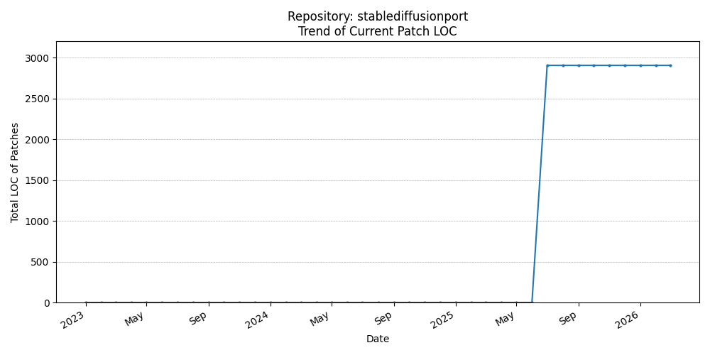
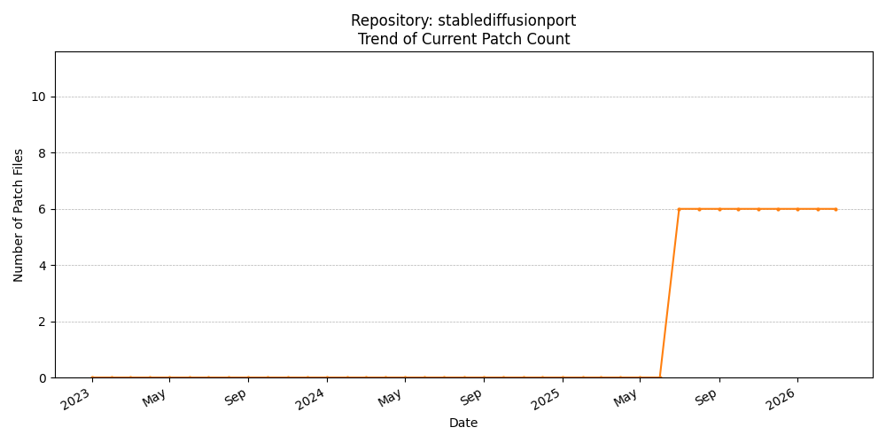

### Current Patch Details

| Patch File (Repo Relative Path) | Source | LOC |
|---|---|:---|
| `patches/ggml-cpu.cpp.patch` | `patches` | 1,205 |
| `patches/ggml-zos-fix.patch` | `patches` | 236 |
| `patches/ggml-zos-mmap-fix.patch` | `patches` | 236 |
| `patches/ggml_posix_memalign.patch` | `patches` | 10 |
| `patches/stb_image_no_thread_local.patch` | `patches` | 13 |
| `patches/zos-mmap-fix-v2.patch` | `patches` | 1,205 |

---

## librdkafkaport

- **Origin Date (First Commit):** 2023-07-27
- **Current Patch LOC:** 2,638
- **Current Patch Count:** 54

### Historical Trends

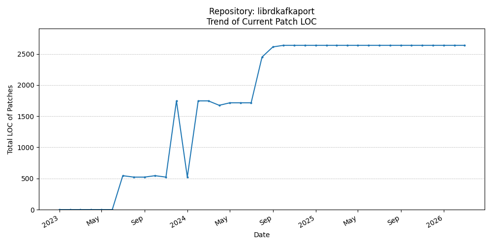
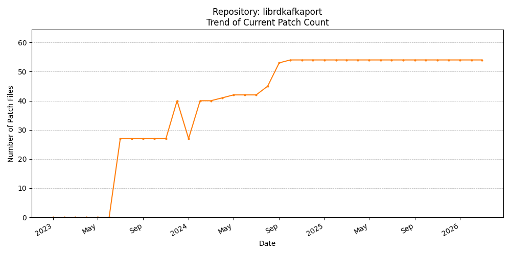

### Current Patch Details

| Patch File (Repo Relative Path) | Source | LOC |
|---|---|:---|
| `patches/configure.self.patch` | `patches` | 20 |
| `patches/examples/alter_consumer_group_offsets.c.patch` | `patches` | 13 |
| `patches/examples/describe_consumer_groups.c.patch` | `patches` | 13 |
| `patches/examples/incremental_alter_configs.c.patch` | `patches` | 13 |
| `patches/examples/kafkatest_verifiable_client.cpp.patch` | `patches` | 13 |
| `patches/examples/list_consumer_group_offsets.c.patch` | `patches` | 13 |
| `patches/examples/list_consumer_groups.c.patch` | `patches` | 13 |
| `patches/examples/misc.c.patch` | `patches` | 13 |
| `patches/examples/openssl_engine_example.cpp.patch` | `patches` | 13 |
| `patches/examples/rdkafka_complex_consumer_example.c.patch` | `patches` | 14 |
| `patches/examples/rdkafka_complex_consumer_example.cpp.patch` | `patches` | 13 |
| `patches/examples/rdkafka_example.c.patch` | `patches` | 14 |
| `patches/examples/rdkafka_example.cpp.patch` | `patches` | 13 |
| `patches/examples/user_scram.c.patch` | `patches` | 13 |
| `patches/mklove/Makefile.base.patch` | `patches` | 41 |
| `patches/src-cpp/Makefile.patch` | `patches` | 13 |
| `patches/src/rd.h.patch` | `patches` | 40 |
| `patches/src/rdaddr.c.patch` | `patches` | 125 |
| `patches/src/rdcrc32.c.patch` | `patches` | 13 |
| `patches/src/rdcrc32.h.patch` | `patches` | 22 |
| `patches/src/rdendian.h.patch` | `patches` | 14 |
| `patches/src/rdhdrhistogram.c.patch` | `patches` | 25 |
| `patches/src/rdhttp.c.patch` | `patches` | 77 |
| `patches/src/rdkafka.c.patch` | `patches` | 367 |
| `patches/src/rdkafka.h.patch` | `patches` | 16 |
| `patches/src/rdkafka_broker.c.patch` | `patches` | 48 |
| `patches/src/rdkafka_conf.c.patch` | `patches` | 264 |
| `patches/src/rdkafka_conf.h.patch` | `patches` | 28 |
| `patches/src/rdkafka_feature.c.patch` | `patches` | 51 |
| `patches/src/rdkafka_int.h.patch` | `patches` | 62 |
| `patches/src/rdkafka_interceptor.c.patch` | `patches` | 34 |
| `patches/src/rdkafka_offset.c.patch` | `patches` | 58 |
| `patches/src/rdkafka_op.c.patch` | `patches` | 21 |
| `patches/src/rdkafka_partition.c.patch` | `patches` | 34 |
| `patches/src/rdkafka_queue.c.patch` | `patches` | 73 |
| `patches/src/rdkafka_queue.h.patch` | `patches` | 18 |
| `patches/src/rdkafka_request.c.patch` | `patches` | 25 |
| `patches/src/rdkafka_sasl_oauthbearer_oidc.c.patch` | `patches` | 371 |
| `patches/src/rdkafka_ssl.c.patch` | `patches` | 58 |
| `patches/src/rdkafka_transport.c.patch` | `patches` | 137 |
| `patches/src/rdkafka_transport_int.h.patch` | `patches` | 15 |
| `patches/src/rdlist.c.patch` | `patches` | 72 |
| `patches/src/rdports.c.patch` | `patches` | 52 |
| `patches/src/rdposix.h.patch` | `patches` | 49 |
| `patches/src/rdrand.c.patch` | `patches` | 38 |
| `patches/src/snappy_compat.h.patch` | `patches` | 13 |
| `patches/src/tinycthread.c.patch` | `patches` | 66 |
| `patches/src/tinycthread.h.patch` | `patches` | 16 |
| `patches/src/tinycthread_extra.c.patch` | `patches` | 13 |
| `patches/tests/0017-compression.c.patch` | `patches` | 16 |
| `patches/tests/0056-balanced_group_mt.c.patch` | `patches` | 16 |
| `patches/tests/0146-metadata_mock.c.patch` | `patches` | 13 |
| `patches/tests/sockem.c.patch` | `patches` | 17 |
| `patches/tests/sockem_ctrl.h.patch` | `patches` | 16 |

---

## rpmport

- **Origin Date (First Commit):** 2025-06-26
- **Current Patch LOC:** 1,841
- **Current Patch Count:** 45

### Historical Trends

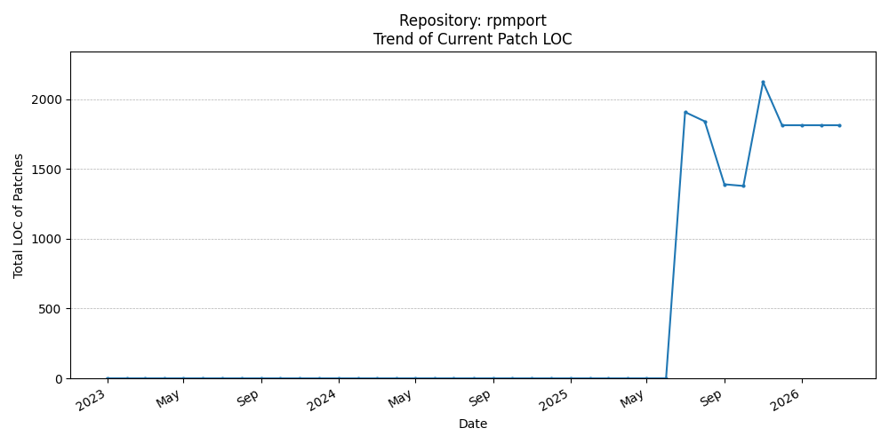
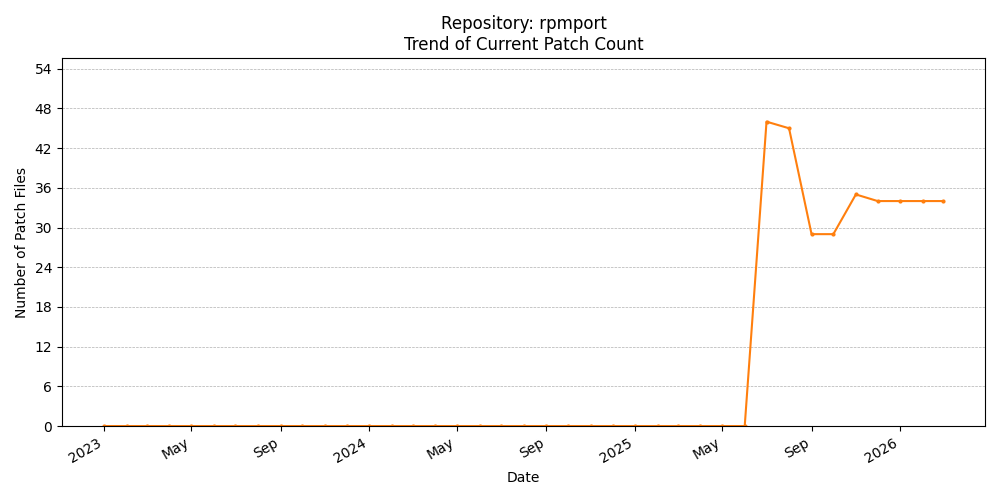

### Current Patch Details

| Patch File (Repo Relative Path) | Source | LOC |
|---|---|:---|
| `patches/CMakeLists.txt.patch` | `patches` | 58 |
| `patches/build_CMakeLists.txt.patch` | `patches` | 41 |
| `patches/build_pack.cc.patch` | `patches` | 23 |
| `patches/build_rpmfc.cc.patch` | `patches` | 13 |
| `patches/config.h.in.patch` | `patches` | 9 |
| `patches/include_rpm_CMakeLists.txt.patch` | `patches` | 12 |
| `patches/include_rpm_argv.h.patch` | `patches` | 22 |
| `patches/include_rpm_flock_compat.h.patch` | `patches` | 20 |
| `patches/include_rpm_portable_remove_all.h.patch` | `patches` | 51 |
| `patches/include_rpm_progname_fallback.c.patch` | `patches` | 44 |
| `patches/include_rpm_progname_fallback.h.patch` | `patches` | 15 |
| `patches/include_rpm_stpcpy_custom.h.patch` | `patches` | 17 |
| `patches/lib_CMakeLists.txt.patch` | `patches` | 20 |
| `patches/lib_backend_ndb_rpmidx.c.patch` | `patches` | 43 |
| `patches/lib_backend_ndb_rpmpkg.c.patch` | `patches` | 12 |
| `patches/lib_backend_ndb_rpmxdb.c.patch` | `patches` | 46 |
| `patches/lib_fsm.cc.patch` | `patches` | 595 |
| `patches/lib_headerfmt.cc.patch` | `patches` | 14 |
| `patches/lib_keystore.cc.patch` | `patches` | 45 |
| `patches/lib_poptALL.cc.patch` | `patches` | 13 |
| `patches/lib_progname_fallback.c.patch` | `patches` | 44 |
| `patches/lib_progname_fallback.h.patch` | `patches` | 15 |
| `patches/lib_psm.cc.patch` | `patches` | 35 |
| `patches/lib_rpmchecksig.cc.patch` | `patches` | 23 |
| `patches/lib_rpminstall.cc.patch` | `patches` | 13 |
| `patches/lib_rpmug.cc.patch` | `patches` | 14 |
| `patches/lib_transaction.cc.patch` | `patches` | 28 |
| `patches/macros.in.patch` | `patches` | 60 |
| `patches/misc_CMakeLists.txt.patch` | `patches` | 9 |
| `patches/misc_fts.c.patch` | `patches` | 67 |
| `patches/misc_system.h.patch` | `patches` | 33 |
| `patches/rpmio_CMakeLists.txt.patch` | `patches` | 89 |
| `patches/rpmio_argv.cc.patch` | `patches` | 13 |
| `patches/rpmio_lposix.cc.patch` | `patches` | 28 |
| `patches/rpmio_macro.cc.patch` | `patches` | 57 |
| `patches/rpmio_rpmglob.cc.patch` | `patches` | 20 |
| `patches/rpmio_rpmlog.cc.patch` | `patches` | 25 |
| `patches/rpmio_rpmlua.cc.patch` | `patches` | 13 |
| `patches/rpmio_rpmsq.cc.patch` | `patches` | 13 |
| `patches/rpmio_rpmstrpool.cc.patch` | `patches` | 25 |
| `patches/rpmio_rpmver.cc.patch` | `patches` | 12 |
| `patches/sign_CMakeLists.txt.patch` | `patches` | 10 |
| `patches/sign_rpmgensig.cc.patch` | `patches` | 13 |
| `patches/tools_CMakeLists.txt.patch` | `patches` | 47 |
| `patches/tools_rpm.cc.patch` | `patches` | 22 |

---

## llamacppport

- **Origin Date (First Commit):** 2023-08-21
- **Current Patch LOC:** 1,780
- **Current Patch Count:** 37

### Historical Trends

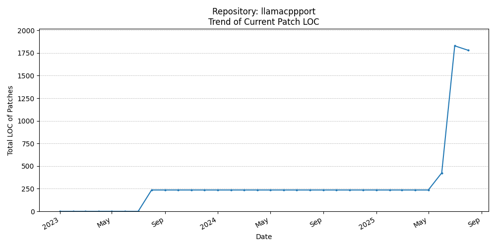
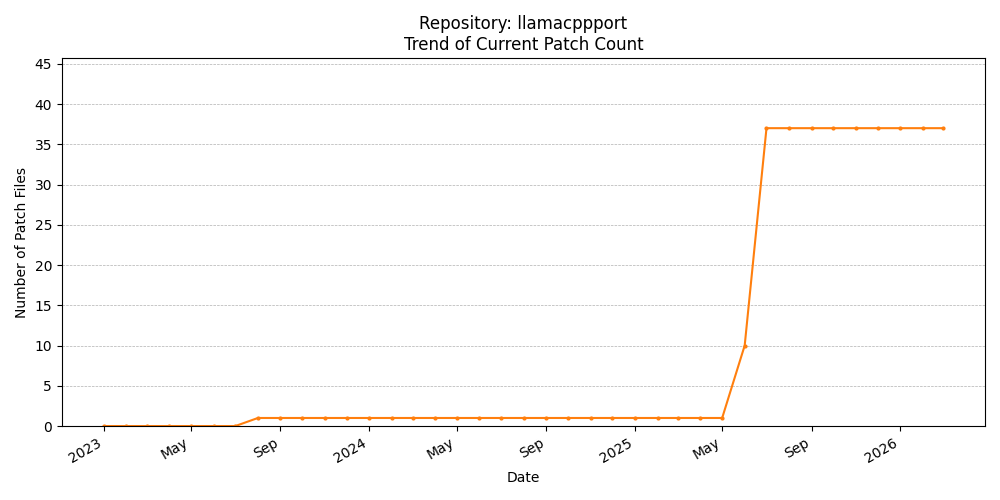

### Current Patch Details

| Patch File (Repo Relative Path) | Source | LOC |
|---|---|:---|
| `patches/CMakeLists.txt.patch` | `patches` | 53 |
| `patches/arg.cpp.patch` | `patches` | 50 |
| `patches/clip.cpp.patch` | `patches` | 12 |
| `patches/common.cpp.patch` | `patches` | 21 |
| `patches/convert-llama2c-to-ggml.cpp.patch` | `patches` | 12 |
| `patches/examples_gguf.cpp.patch` | `patches` | 12 |
| `patches/export-lora.cpp.patch` | `patches` | 12 |
| `patches/ggml-backend-reg.cpp.patch` | `patches` | 15 |
| `patches/ggml-cpu-impl.h.patch` | `patches` | 31 |
| `patches/ggml-cpu.c.patch` | `patches` | 13 |
| `patches/ggml-cpu.cpp.patch` | `patches` | 62 |
| `patches/ggml-impl.h.patch` | `patches` | 74 |
| `patches/ggml.c.patch` | `patches` | 545 |
| `patches/ggml.h.patch` | `patches` | 20 |
| `patches/gguf-hash.cpp.patch` | `patches` | 12 |
| `patches/gguf-split.cpp.patch` | `patches` | 80 |
| `patches/gguf.cpp.patch` | `patches` | 86 |
| `patches/gguf.h.patch` | `patches` | 23 |
| `patches/gguf_writer.py.patch` | `patches` | 24 |
| `patches/httplib.h.patch` | `patches` | 169 |
| `patches/imatrix.cpp.patch` | `patches` | 12 |
| `patches/llama-adapter.cpp.patch` | `patches` | 12 |
| `patches/llama-context.cpp.patch` | `patches` | 37 |
| `patches/llama-hparams.h.patch` | `patches` | 12 |
| `patches/llama-model-loader.cpp.patch` | `patches` | 94 |
| `patches/miniaudio.h.patch` | `patches` | 24 |
| `patches/ops.h.patch` | `patches` | 12 |
| `patches/quantize.cpp.patch` | `patches` | 12 |
| `patches/repack.cpp.patch` | `patches` | 22 |
| `patches/run.cpp.patch` | `patches` | 22 |
| `patches/sgemm.h.patch` | `patches` | 15 |
| `patches/simd-mappings.h.patch` | `patches` | 13 |
| `patches/stb_image.h.patch` | `patches` | 60 |
| `patches/test-gguf.cpp.patch` | `patches` | 20 |
| `patches/unary-ops.h.patch` | `patches` | 12 |
| `patches/unicode.h.patch` | `patches` | 65 |
| `patches/vec.h.patch` | `patches` | 10 |

---

## bashport

- **Origin Date (First Commit):** 2022-10-26
- **Current Patch LOC:** 1,584
- **Current Patch Count:** 25

### Historical Trends

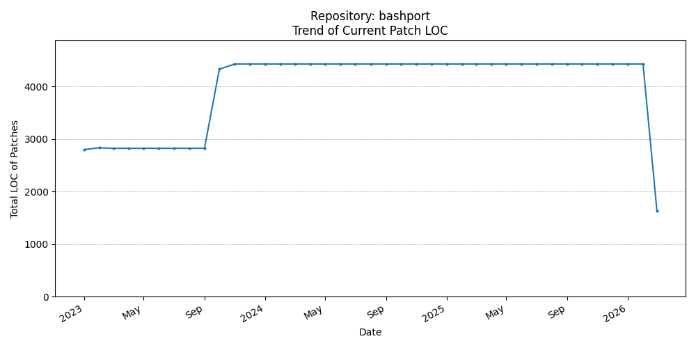
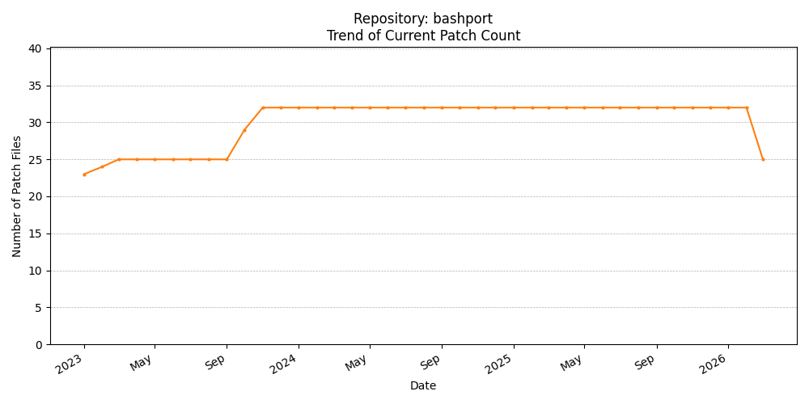

### Current Patch Details

| Patch File (Repo Relative Path) | Source | LOC |
|---|---|:---|
| `dev-patches/aclocal.patch` | `dev-patches` | 23 |
| `dev-patches/array.tests.patch` | `dev-patches` | 64 |
| `dev-patches/dontupstream/read.tests.patch` | `dev-patches` | 13 |
| `dev-patches/dontupstream/redir10.patch` | `dev-patches` | 13 |
| `dev-patches/dontupstream/run-all_and_diff.patch` | `dev-patches` | 72 |
| `dev-patches/redir.tests.patch` | `dev-patches` | 13 |
| `dev-patches/source6.sub.patch` | `dev-patches` | 13 |
| `stable-patches/Makefile.in.patch` | `stable-patches` | 13 |
| `stable-patches/PR1.patch` | `stable-patches` | 25 |
| `stable-patches/anonfile.c.patch` | `stable-patches` | 22 |
| `stable-patches/configure.patch` | `stable-patches` | 54 |
| `stable-patches/ignore_pipe.patch` | `stable-patches` | 13 |
| `stable-patches/kill.def.patch` | `stable-patches` | 123 |
| `stable-patches/sig.c.patch` | `stable-patches` | 30 |
| `stable-patches/smatch.c.patch` | `stable-patches` | 49 |
| `stable-patches/tests/builtins.patch` | `stable-patches` | 31 |
| `stable-patches/tests/coproc.tests.patch` | `stable-patches` | 13 |
| `stable-patches/tests/errors.right.patch` | `stable-patches` | 18 |
| `stable-patches/tests/heredoc.right.patch` | `stable-patches` | 13 |
| `stable-patches/tests/redir.patch` | `stable-patches` | 49 |
| `stable-patches/tests/run.patch` | `stable-patches` | 744 |
| `stable-patches/tests/test.patch` | `stable-patches` | 49 |
| `stable-patches/tests/trap.patch` | `stable-patches` | 61 |
| `stable-patches/tests/varenv.patch` | `stable-patches` | 13 |
| `stable-patches/tests/vredir.patch` | `stable-patches` | 53 |

---

## gpgport

- **Origin Date (First Commit):** 2023-05-17
- **Current Patch LOC:** 1,484
- **Current Patch Count:** 30

### Historical Trends

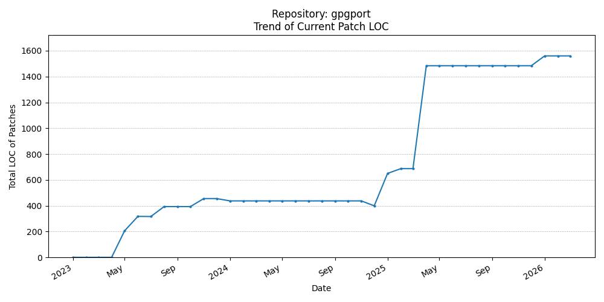
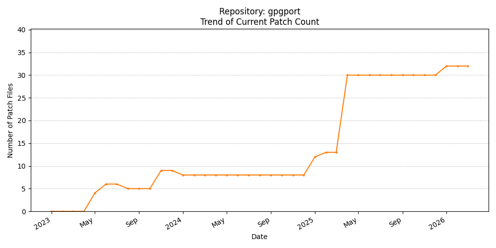

### Current Patch Details

| Patch File (Repo Relative Path) | Source | LOC |
|---|---|:---|
| `patches/armencrypt.scm.patch` | `patches` | 13 |
| `patches/armencryptp.scm.patch` | `patches` | 13 |
| `patches/armsignencrypt.scm.patch` | `patches` | 13 |
| `patches/call-gpg.c.patch` | `patches` | 54 |
| `patches/call-pinentry.c.patch` | `patches` | 31 |
| `patches/command.c.patch` | `patches` | 13 |
| `patches/compression.scm.patch` | `patches` | 13 |
| `patches/configure.ac.patch` | `patches` | 13 |
| `patches/configure.patch` | `patches` | 27 |
| `patches/decrypt-session-key.scm.patch` | `patches` | 13 |
| `patches/decrypt.c.patch` | `patches` | 15 |
| `patches/dns.c.patch` | `patches` | 13 |
| `patches/ecc.scm.patch` | `patches` | 13 |
| `patches/encrypt-dsa.scm.patch` | `patches` | 22 |
| `patches/encrypt-multifile.scm.patch` | `patches` | 13 |
| `patches/encrypt.scm.patch` | `patches` | 67 |
| `patches/encryptp.scm.patch` | `patches` | 13 |
| `patches/ffi.c.patch` | `patches` | 14 |
| `patches/gpg-agent.c.patch` | `patches` | 107 |
| `patches/gpgscm_tests.scm.patch` | `patches` | 74 |
| `patches/homedir.c.patch` | `patches` | 326 |
| `patches/openfile.c.patch` | `patches` | 37 |
| `patches/openpgp_setup.scm.patch` | `patches` | 34 |
| `patches/openpgp_trustpgp_common.scm.patch` | `patches` | 16 |
| `patches/openpgpdefs.scm.patch` | `patches` | 432 |
| `patches/seat.scm.patch` | `patches` | 13 |
| `patches/server.c.patch` | `patches` | 22 |
| `patches/signencrypt-dsa.scm.patch` | `patches` | 22 |
| `patches/signencrypt.scm.patch` | `patches` | 13 |
| `patches/t-exectool.c.patch` | `patches` | 15 |

---

## libuvport

- **Origin Date (First Commit):** 2023-09-14
- **Current Patch LOC:** 1,462
- **Current Patch Count:** 26

### Historical Trends

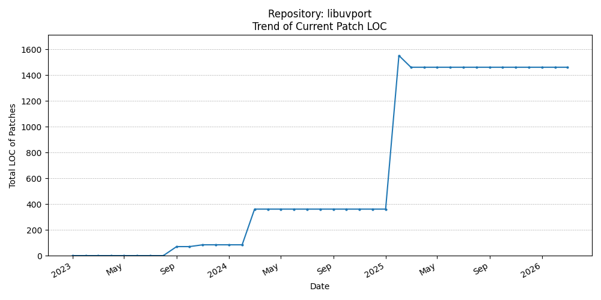
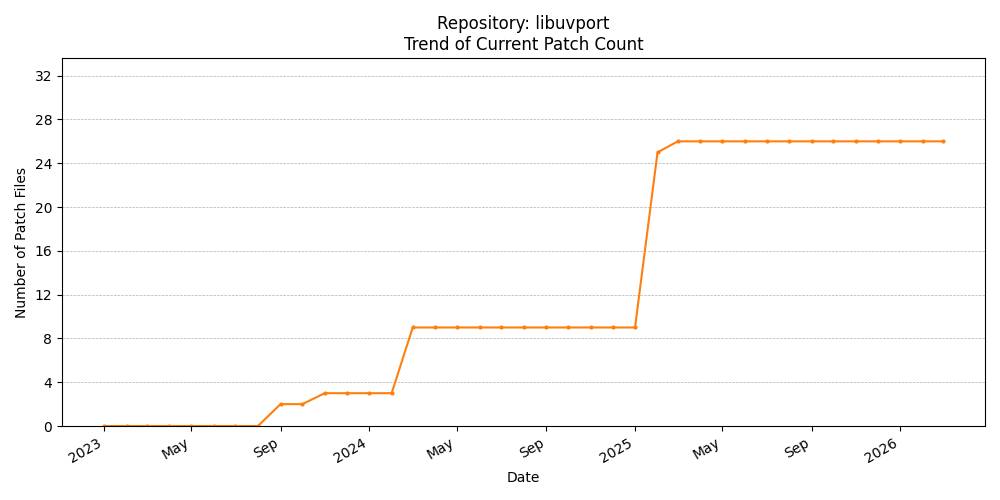

### Current Patch Details

| Patch File (Repo Relative Path) | Source | LOC |
|---|---|:---|
| `stable-patches/CMakeLists.txt.patch` | `stable-patches` | 69 |
| `stable-patches/docs/src/fs.rst.patch` | `stable-patches` | 15 |
| `stable-patches/include/uv.h.patch` | `stable-patches` | 22 |
| `stable-patches/include/uv/errno.h.patch` | `stable-patches` | 17 |
| `stable-patches/include/uv/os390.h.patch` | `stable-patches` | 21 |
| `stable-patches/src/unix/core.c.patch` | `stable-patches` | 109 |
| `stable-patches/src/unix/fs.c.patch` | `stable-patches` | 131 |
| `stable-patches/src/unix/internal.h.patch` | `stable-patches` | 19 |
| `stable-patches/src/unix/linux.c.patch` | `stable-patches` | 28 |
| `stable-patches/src/unix/os390-syscalls.c.patch` | `stable-patches` | 183 |
| `stable-patches/src/unix/os390-syscalls.h.patch` | `stable-patches` | 26 |
| `stable-patches/src/unix/os390.c.patch` | `stable-patches` | 144 |
| `stable-patches/src/unix/process.c.patch` | `stable-patches` | 105 |
| `stable-patches/src/unix/stream.c.patch` | `stable-patches` | 120 |
| `stable-patches/src/unix/tcp.c.patch` | `stable-patches` | 40 |
| `stable-patches/src/unix/thread.c.patch` | `stable-patches` | 25 |
| `stable-patches/src/uv-common.c.patch` | `stable-patches` | 15 |
| `stable-patches/test/run-tests.c.patch` | `stable-patches` | 27 |
| `stable-patches/test/task.h.patch` | `stable-patches` | 24 |
| `stable-patches/test/test-fs-copyfile.c.patch` | `stable-patches` | 31 |
| `stable-patches/test/test-fs.c.patch` | `stable-patches` | 17 |
| `stable-patches/test/test-get-currentexe.c.patch` | `stable-patches` | 159 |
| `stable-patches/test/test-get-passwd.c.patch` | `stable-patches` | 13 |
| `stable-patches/test/test-list.h.patch` | `stable-patches` | 20 |
| `stable-patches/test/test-spawn.c.patch` | `stable-patches` | 59 |
| `stable-patches/test/test-thread-priority.c.patch` | `stable-patches` | 23 |

---

## sudoport

- **Origin Date (First Commit):** 2023-03-07
- **Current Patch LOC:** 1,278
- **Current Patch Count:** 30

### Historical Trends

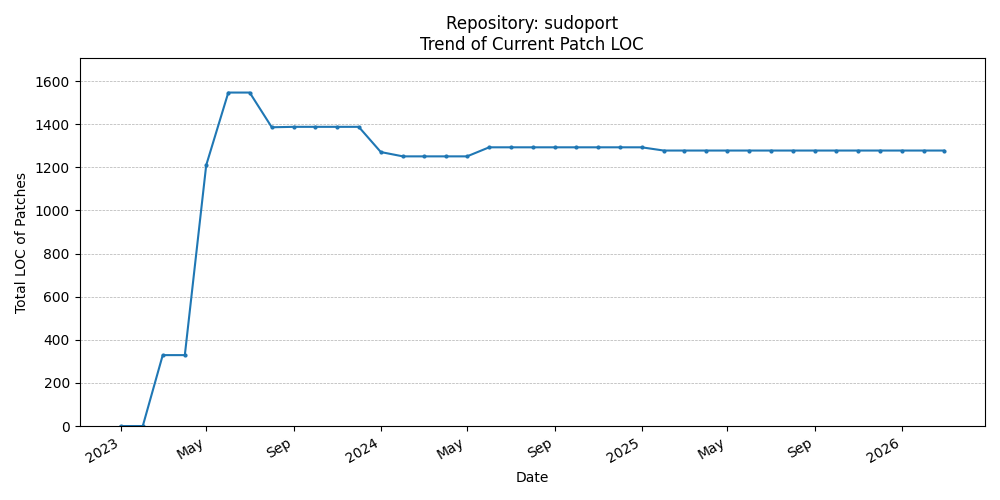
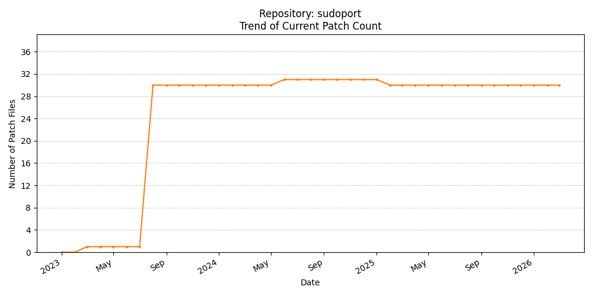

### Current Patch Details

| Patch File (Repo Relative Path) | Source | LOC |
|---|---|:---|
| `patches/PR1/configure.patch` | `patches` | 15 |
| `patches/PR1/include/sudo_iolog.h.patch` | `patches` | 12 |
| `patches/PR1/lib/eventlog/Makefile.in.patch` | `patches` | 13 |
| `patches/PR1/lib/util/getentropy.c.patch` | `patches` | 42 |
| `patches/PR1/lib/util/mmap_alloc.c.patch` | `patches` | 45 |
| `patches/PR1/lib/util/progname.c.patch` | `patches` | 13 |
| `patches/PR1/lib/util/pw_dup.c.patch` | `patches` | 32 |
| `patches/PR1/lib/util/regress/mktemp/mktemp_test.c.patch` | `patches` | 28 |
| `patches/PR1/lib/util/sig2str.c.patch` | `patches` | 256 |
| `patches/PR1/lib/util/str2sig.c.patch` | `patches` | 15 |
| `patches/PR1/plugins/group_file/getgrent.c.patch` | `patches` | 14 |
| `patches/PR1/plugins/sudoers/auth/passwd.c.patch` | `patches` | 95 |
| `patches/PR1/plugins/sudoers/check_aliases.c.patch` | `patches` | 33 |
| `patches/PR1/plugins/sudoers/cvtsudoers_pwutil.c.patch` | `patches` | 64 |
| `patches/PR1/plugins/sudoers/defaults.c.patch` | `patches` | 34 |
| `patches/PR1/plugins/sudoers/env.c.patch` | `patches` | 18 |
| `patches/PR1/plugins/sudoers/getspwuid.c.patch` | `patches` | 18 |
| `patches/PR1/plugins/sudoers/pwutil.c.patch` | `patches` | 45 |
| `patches/PR1/plugins/sudoers/pwutil_impl.c.patch` | `patches` | 52 |
| `patches/PR1/plugins/sudoers/regress/testsudoers/test9.sh.patch` | `patches` | 20 |
| `patches/PR1/plugins/sudoers/set_perms.c.patch` | `patches` | 180 |
| `patches/PR1/plugins/sudoers/sudoers.c.patch` | `patches` | 17 |
| `patches/PR1/plugins/sudoers/testsudoers.c.patch` | `patches` | 16 |
| `patches/PR1/plugins/sudoers/tsgetgrpw.c.patch` | `patches` | 35 |
| `patches/PR1/scripts/install-sh.patch` | `patches` | 44 |
| `patches/PR1/src/exec.c.patch` | `patches` | 30 |
| `patches/PR1/src/get_pty.c.patch` | `patches` | 26 |
| `patches/PR1/src/net_ifs.c.patch` | `patches` | 15 |
| `patches/PR1/src/preload.c.patch` | `patches` | 14 |
| `patches/PR1/src/sudo.c.patch` | `patches` | 37 |

---

## coreutilsport

- **Origin Date (First Commit):** 2022-04-29
- **Current Patch LOC:** 1,169
- **Current Patch Count:** 18

### Historical Trends

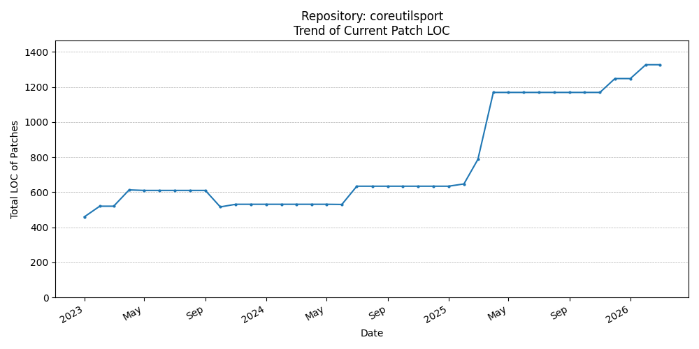
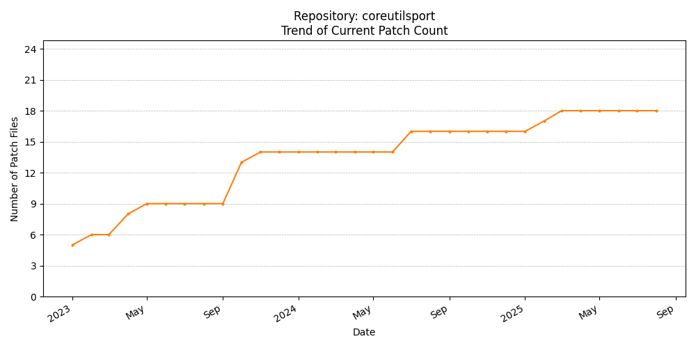

### Current Patch Details

| Patch File (Repo Relative Path) | Source | LOC |
|---|---|:---|
| `stable-patches/Makefile.in.patch` | `stable-patches` | 12 |
| `stable-patches/build-aux/test-driver.patch` | `stable-patches` | 13 |
| `stable-patches/lib/fdopendir.c.patch` | `stable-patches` | 14 |
| `stable-patches/lib/fts.c.patch` | `stable-patches` | 17 |
| `stable-patches/lib/getprogname.c.patch` | `stable-patches` | 21 |
| `stable-patches/lib/nproc.c.patch` | `stable-patches` | 15 |
| `stable-patches/lib/posix_memalign.c.patch` | `stable-patches` | 22 |
| `stable-patches/lib/stat-time.h.patch` | `stable-patches` | 13 |
| `stable-patches/src/basenc.c.patch` | `stable-patches` | 15 |
| `stable-patches/src/cat.c.patch` | `stable-patches` | 314 |
| `stable-patches/src/copy.c.patch` | `stable-patches` | 41 |
| `stable-patches/src/cp.c.patch` | `stable-patches` | 61 |
| `stable-patches/src/digest.c.patch` | `stable-patches` | 61 |
| `stable-patches/src/ls.c.patch` | `stable-patches` | 201 |
| `stable-patches/src/od.c.patch` | `stable-patches` | 16 |
| `stable-patches/src/pinky.c.patch` | `stable-patches` | 50 |
| `stable-patches/src/stat.c.patch` | `stable-patches` | 253 |
| `stable-patches/src/timeout.c.patch` | `stable-patches` | 30 |

---

## cmakeport

- **Origin Date (First Commit):** 2022-04-21
- **Current Patch LOC:** 1,092
- **Current Patch Count:** 1

### Historical Trends

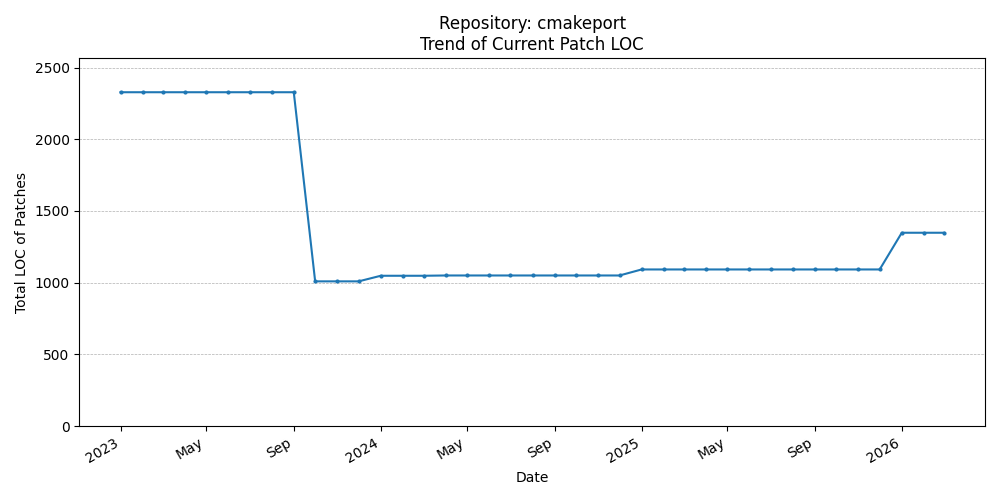
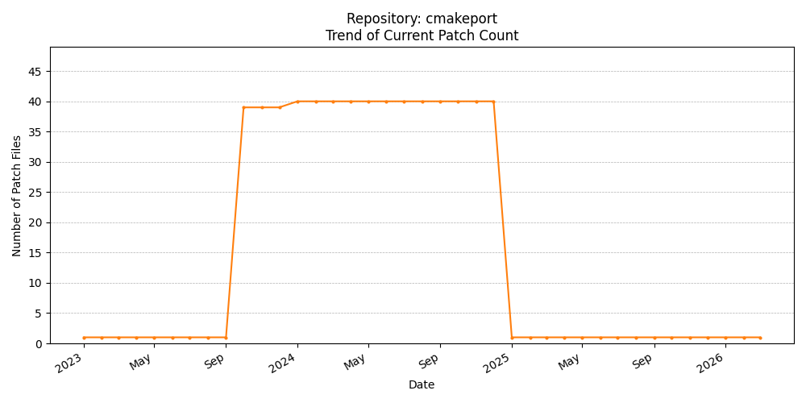

### Current Patch Details

| Patch File (Repo Relative Path) | Source | LOC |
|---|---|:---|
| `patches/PR1.patch` | `patches` | 1,092 |

---

## gitport

- **Origin Date (First Commit):** 2022-05-25
- **Current Patch LOC:** 1,065
- **Current Patch Count:** 32

### Historical Trends

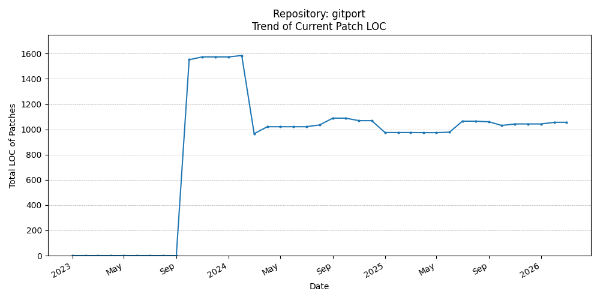
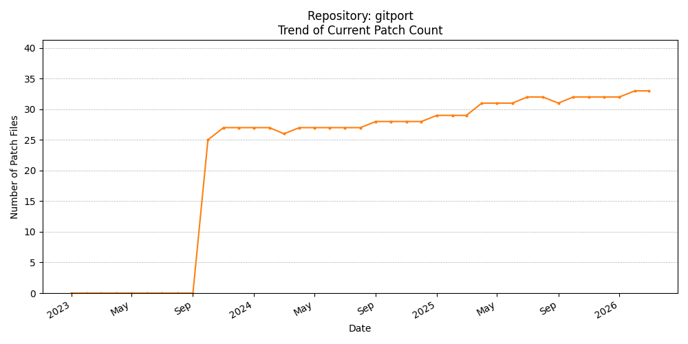

### Current Patch Details

| Patch File (Repo Relative Path) | Source | LOC |
|---|---|:---|
| `dev-patches/PR1/newline.patch` | `dev-patches` | 13 |
| `dev-patches/PR1/nogreph.patch` | `dev-patches` | 14 |
| `dev-patches/PR1/releasenamecollision-pack.patch` | `dev-patches` | 22 |
| `dev-patches/PR1/releasenamecollision.patch` | `dev-patches` | 89 |
| `stable-patches/Makefile.patch` | `stable-patches` | 84 |
| `stable-patches/archive.c.patch` | `stable-patches` | 15 |
| `stable-patches/attr.c.patch` | `stable-patches` | 16 |
| `stable-patches/blame.c.patch` | `stable-patches` | 16 |
| `stable-patches/builtin.h.patch` | `stable-patches` | 13 |
| `stable-patches/combine-diff.c.patch` | `stable-patches` | 15 |
| `stable-patches/config.c.patch` | `stable-patches` | 31 |
| `stable-patches/config.mak.uname.patch` | `stable-patches` | 24 |
| `stable-patches/configure.ac.patch` | `stable-patches` | 14 |
| `stable-patches/convert.c.patch` | `stable-patches` | 142 |
| `stable-patches/copy.c.patch` | `stable-patches` | 14 |
| `stable-patches/date.c.patch` | `stable-patches` | 23 |
| `stable-patches/diff.c.patch` | `stable-patches` | 42 |
| `stable-patches/entry.c.patch` | `stable-patches` | 77 |
| `stable-patches/environment.c.patch` | `stable-patches` | 15 |
| `stable-patches/environment.h.patch` | `stable-patches` | 14 |
| `stable-patches/exec-cmd.c.patch` | `stable-patches` | 15 |
| `stable-patches/generate-perl.sh.patch` | `stable-patches` | 13 |
| `stable-patches/hash-object.c.patch` | `stable-patches` | 15 |
| `stable-patches/http.c.patch` | `stable-patches` | 23 |
| `stable-patches/lockfile.c.patch` | `stable-patches` | 15 |
| `stable-patches/object-file.c.patch` | `stable-patches` | 172 |
| `stable-patches/posix.h.patch` | `stable-patches` | 20 |
| `stable-patches/quote.c.patch` | `stable-patches` | 22 |
| `stable-patches/read-cache-ll.h.patch` | `stable-patches` | 15 |
| `stable-patches/read-cache.c.patch` | `stable-patches` | 14 |
| `stable-patches/test-lib.sh.patch` | `stable-patches` | 13 |
| `stable-patches/utf8.c.patch` | `stable-patches` | 35 |

---

## grpcport

- **Origin Date (First Commit):** 2025-06-19
- **Current Patch LOC:** 1,017
- **Current Patch Count:** 8

### Historical Trends

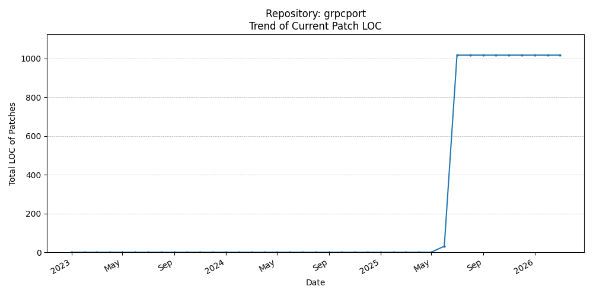
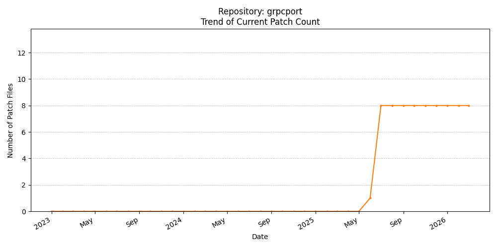

### Current Patch Details

| Patch File (Repo Relative Path) | Source | LOC |
|---|---|:---|
| `patches/CMakeLists.txt.patch` | `patches` | 15 |
| `patches/include.patch` | `patches` | 13 |
| `patches/src.patch` | `patches` | 802 |
| `patches/third_party/abseil-cpp.patch` | `patches` | 87 |
| `patches/third_party/cares.patch` | `patches` | 42 |
| `patches/third_party/protobuf.patch` | `patches` | 44 |
| `patches/third_party/re2.patch` | `patches` | 14 |
| `patches/third_party/zlib.patch` | `patches` | 0 |

---

## valgrindport

- **Origin Date (First Commit):** 2024-12-04
- **Current Patch LOC:** 896
- **Current Patch Count:** 3

### Historical Trends

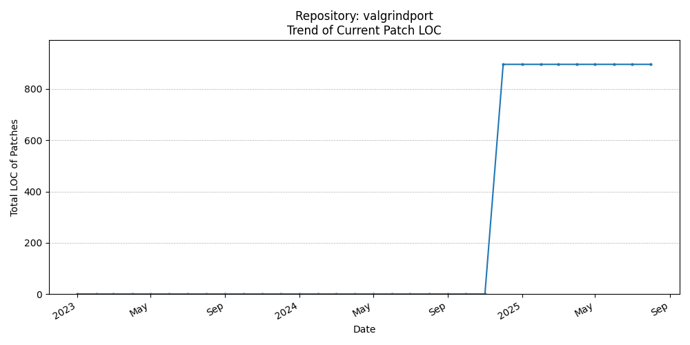
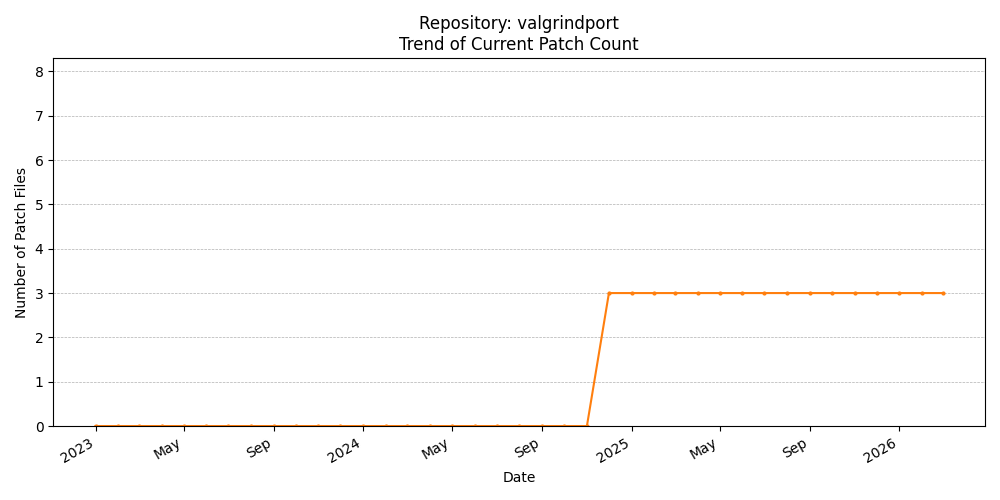

### Current Patch Details

| Patch File (Repo Relative Path) | Source | LOC |
|---|---|:---|
| `patches/Makefile.all.am.patch` | `patches` | 13 |
| `patches/guest_s390_defs.h.patch` | `patches` | 16 |
| `patches/guest_s390_helpers.c.patch` | `patches` | 867 |

---

## alternativesport

- **Origin Date (First Commit):** 2025-08-27
- **Current Patch LOC:** 838
- **Current Patch Count:** 1

### Historical Trends

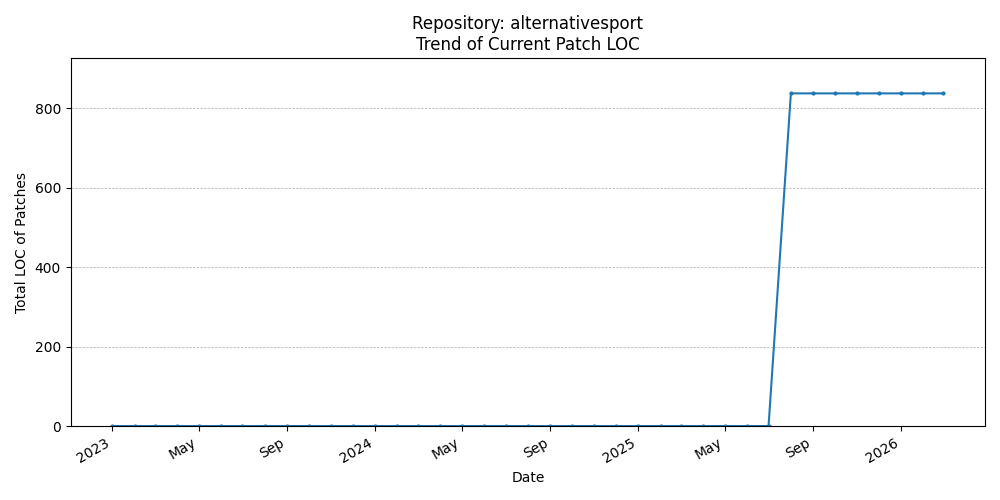
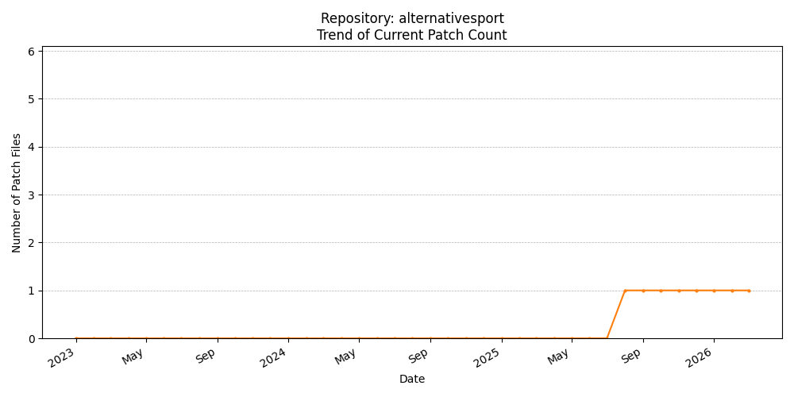

### Current Patch Details

| Patch File (Repo Relative Path) | Source | LOC |
|---|---|:---|
| `patches/PR1.patch` | `patches` | 838 |

---

## gzipport

- **Origin Date (First Commit):** 2022-04-21
- **Current Patch LOC:** 690
- **Current Patch Count:** 8

### Historical Trends

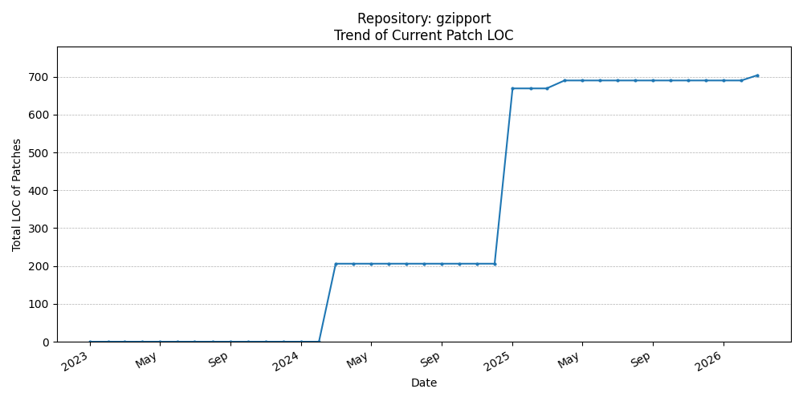
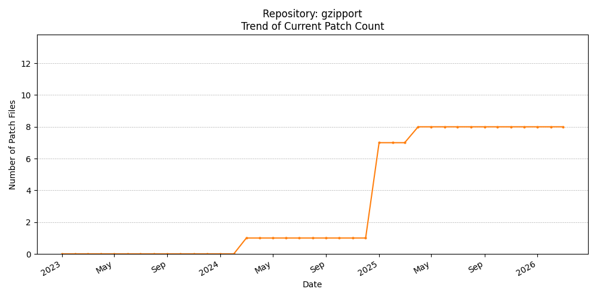

### Current Patch Details

| Patch File (Repo Relative Path) | Source | LOC |
|---|---|:---|
| `patches/Makefile.in.patch` | `patches` | 70 |
| `patches/gzip.c.patch` | `patches` | 192 |
| `patches/gzip.h.patch` | `patches` | 22 |
| `patches/test-reference.patch` | `patches` | 37 |
| `patches/unzip.c.patch` | `patches` | 24 |
| `patches/zedc.c.patch` | `patches` | 236 |
| `patches/zip.c.patch` | `patches` | 79 |
| `patches/zos.h.patch` | `patches` | 30 |

---

## procpsport

- **Origin Date (First Commit):** 2024-07-26
- **Current Patch LOC:** 687
- **Current Patch Count:** 1

### Historical Trends

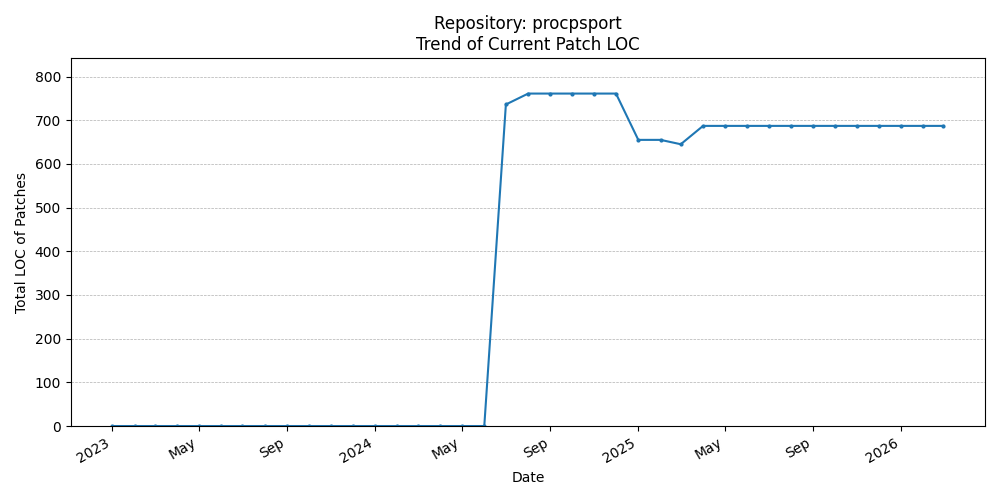
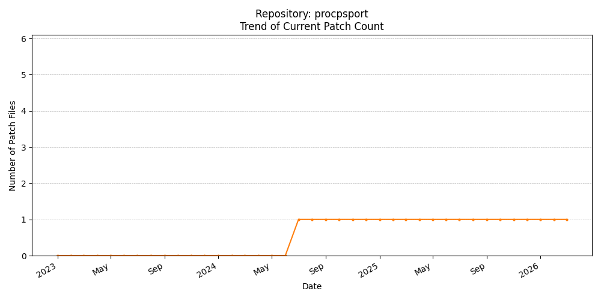

### Current Patch Details

| Patch File (Repo Relative Path) | Source | LOC |
|---|---|:---|
| `patches/PR1.patch` | `patches` | 687 |

---

## perlport

- **Origin Date (First Commit):** 2021-11-12
- **Current Patch LOC:** 684
- **Current Patch Count:** 14

### Historical Trends

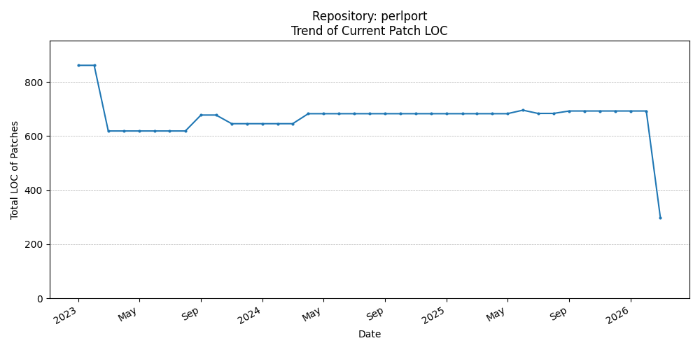
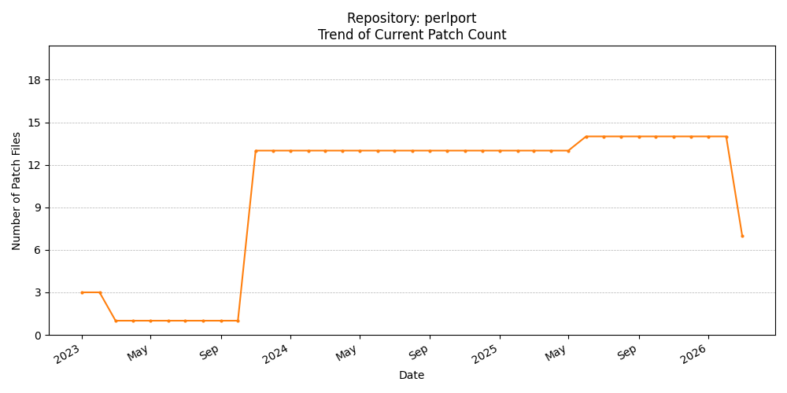

### Current Patch Details

| Patch File (Repo Relative Path) | Source | LOC |
|---|---|:---|
| `patches/MM_OS390.pm.patch` | `patches` | 13 |
| `patches/PR1/Configure.patch` | `patches` | 32 |
| `patches/PR1/Makefile.SH.patch` | `patches` | 54 |
| `patches/PR1/cpan/IPC-SysV/SysV.xs.patch` | `patches` | 13 |
| `patches/PR1/doio.c.patch` | `patches` | 135 |
| `patches/PR1/ext/ExtUtils-Miniperl/lib/ExtUtils/Miniperl.pm.patch` | `patches` | 20 |
| `patches/PR1/hints/os390.sh.patch` | `patches` | 141 |
| `patches/PR1/installperl.patch` | `patches` | 36 |
| `patches/PR1/iperlsys.h.patch` | `patches` | 28 |
| `patches/PR1/lib/File/Copy.pm.patch` | `patches` | 16 |
| `patches/PR1/makedepend_file.SH.patch` | `patches` | 16 |
| `patches/PR1/os390/os390.c.patch` | `patches` | 62 |
| `patches/PR1/perl.c.patch` | `patches` | 24 |
| `patches/PR1/util.c.patch` | `patches` | 94 |

---

## util-linuxport

- **Origin Date (First Commit):** 2023-11-22
- **Current Patch LOC:** 630
- **Current Patch Count:** 16

### Historical Trends

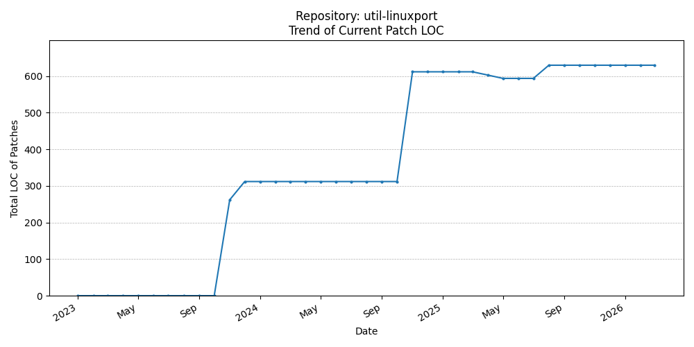
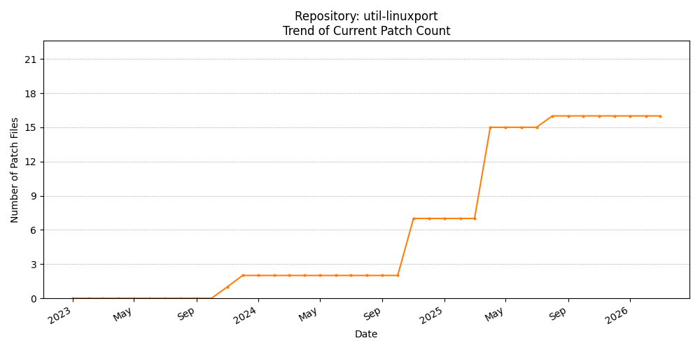

### Current Patch Details

| Patch File (Repo Relative Path) | Source | LOC |
|---|---|:---|
| `patches/blkdev.patch` | `patches` | 20 |
| `patches/c.h.patch` | `patches` | 37 |
| `patches/c_strtod.c.patch` | `patches` | 15 |
| `patches/configure.ac.patch` | `patches` | 110 |
| `patches/flock.c.patch` | `patches` | 45 |
| `patches/gen_uuid.c.patch` | `patches` | 50 |
| `patches/monotonic.c.patch` | `patches` | 13 |
| `patches/path.c.patch` | `patches` | 36 |
| `patches/pty-session.patch` | `patches` | 131 |
| `patches/setsid.c.patch` | `patches` | 15 |
| `patches/strutils.c.patch` | `patches` | 12 |
| `patches/term-utils.patch` | `patches` | 43 |
| `patches/term_util_Makemodule.am.patch` | `patches` | 31 |
| `patches/ttyutils.patch` | `patches` | 44 |
| `patches/widechar.h.patch` | `patches` | 13 |
| `patches/write.c.patch` | `patches` | 15 |

---

## redisport

- **Origin Date (First Commit):** 2025-02-14
- **Current Patch LOC:** 588
- **Current Patch Count:** 3

### Historical Trends

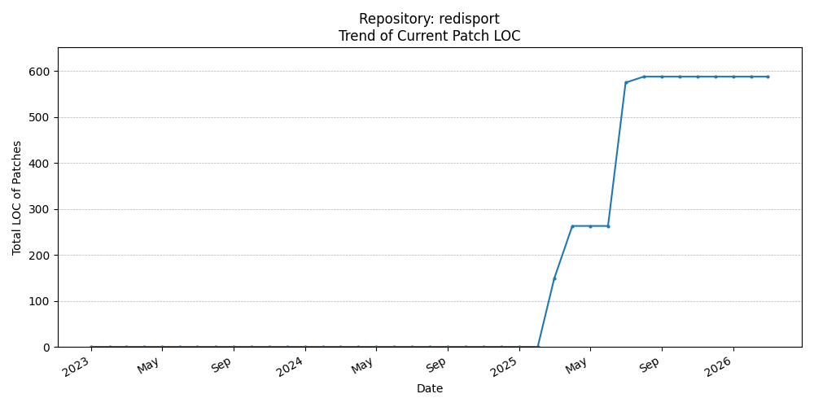
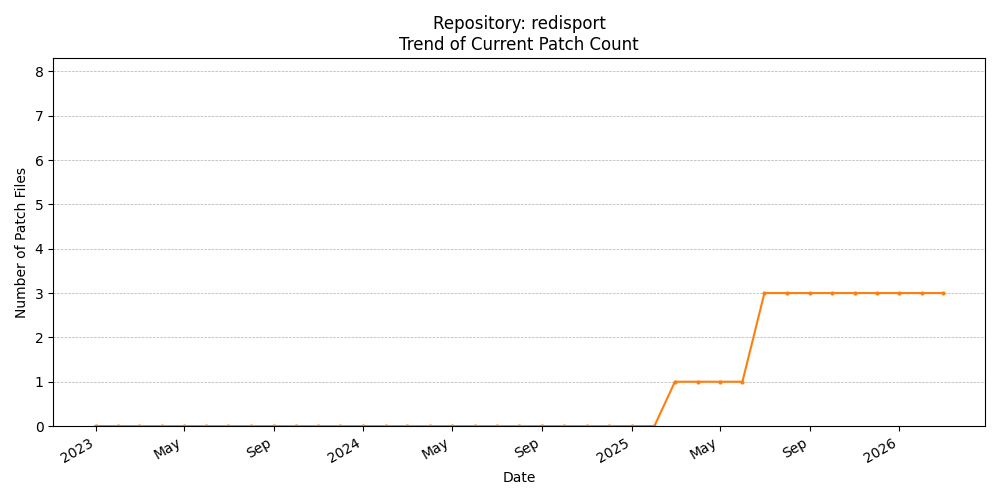

### Current Patch Details

| Patch File (Repo Relative Path) | Source | LOC |
|---|---|:---|
| `patches/pr.patch` | `patches` | 291 |
| `patches/test.patch` | `patches` | 264 |
| `patches/test_port.patch` | `patches` | 33 |

---

## unzipport

- **Origin Date (First Commit):** 2022-11-14
- **Current Patch LOC:** 549
- **Current Patch Count:** 12

### Historical Trends

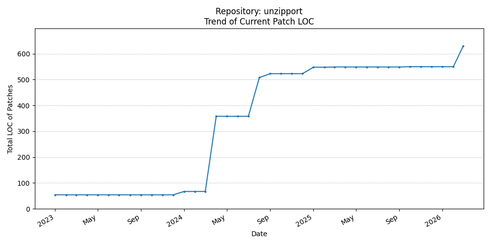
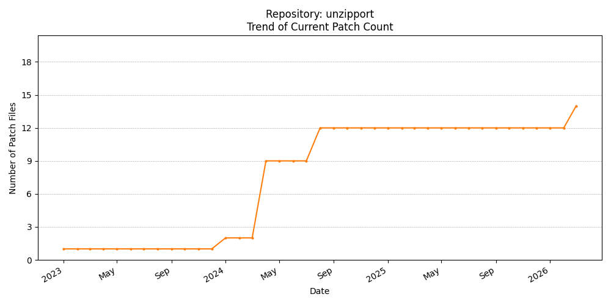

### Current Patch Details

| Patch File (Repo Relative Path) | Source | LOC |
|---|---|:---|
| `patches/ebcdic.h.patch` | `patches` | 48 |
| `patches/extract.c.patch` | `patches` | 23 |
| `patches/fileio.c.patch` | `patches` | 67 |
| `patches/globals.h.patch` | `patches` | 18 |
| `patches/process.c.patch` | `patches` | 13 |
| `patches/riscos.h.patch` | `patches` | 16 |
| `patches/ttyio.c.patch` | `patches` | 29 |
| `patches/unix.c.patch` | `patches` | 197 |
| `patches/unxcfg.h.patch` | `patches` | 72 |
| `patches/unzip.h.patch` | `patches` | 27 |
| `patches/unzpriv.h.patch` | `patches` | 25 |
| `patches/zipinfo.c.patch` | `patches` | 14 |

---

## inetutilsport

- **Origin Date (First Commit):** 2025-06-02
- **Current Patch LOC:** 514
- **Current Patch Count:** 20

### Historical Trends

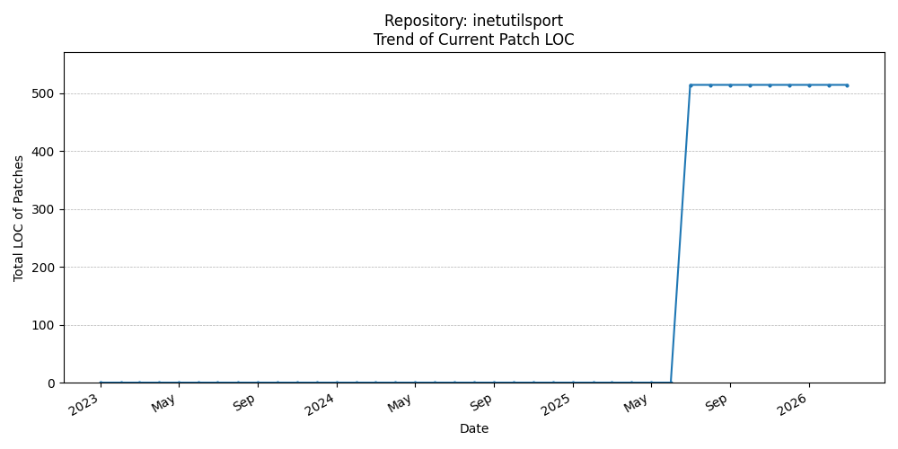
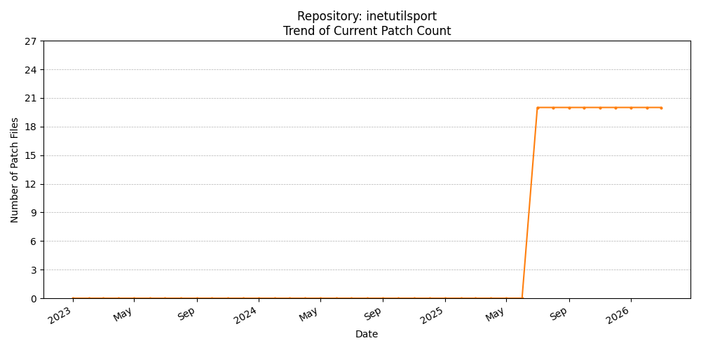

### Current Patch Details

| Patch File (Repo Relative Path) | Source | LOC |
|---|---|:---|
| `patches/configure.patch` | `patches` | 29 |
| `patches/ftp/cmds.c.patch` | `patches` | 13 |
| `patches/ftp/cmdtab.c.patch` | `patches` | 13 |
| `patches/ftp/extern.h.patch` | `patches` | 13 |
| `patches/ftp/main.c.patch` | `patches` | 13 |
| `patches/ftpd/auth.c.patch` | `patches` | 23 |
| `patches/ftpd/ftpd.c.patch` | `patches` | 22 |
| `patches/lib/argp-parse.c.patch` | `patches` | 116 |
| `patches/lib/getopt_int.h.patch` | `patches` | 17 |
| `patches/ping/ping_common.h.patch` | `patches` | 11 |
| `patches/src/inetd.c.patch` | `patches` | 31 |
| `patches/src/logprio.h.patch` | `patches` | 24 |
| `patches/src/rexecd.c.patch` | `patches` | 36 |
| `patches/src/tftp.c.patch` | `patches` | 40 |
| `patches/src/uucpd.c.patch` | `patches` | 21 |
| `patches/telnet/telnet.c.patch` | `patches` | 18 |
| `patches/telnetd/state.c.patch` | `patches` | 12 |
| `patches/telnetd/telnetd.h.patch` | `patches` | 23 |
| `patches/telnetd/utility.c.patch` | `patches` | 18 |
| `patches/tests/identify.c.patch` | `patches` | 21 |

---

## cronieport

- **Origin Date (First Commit):** 2024-06-26
- **Current Patch LOC:** 510
- **Current Patch Count:** 13

### Historical Trends

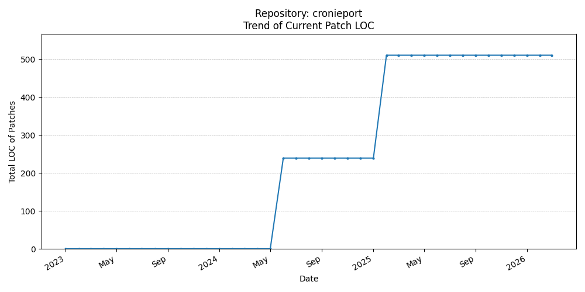
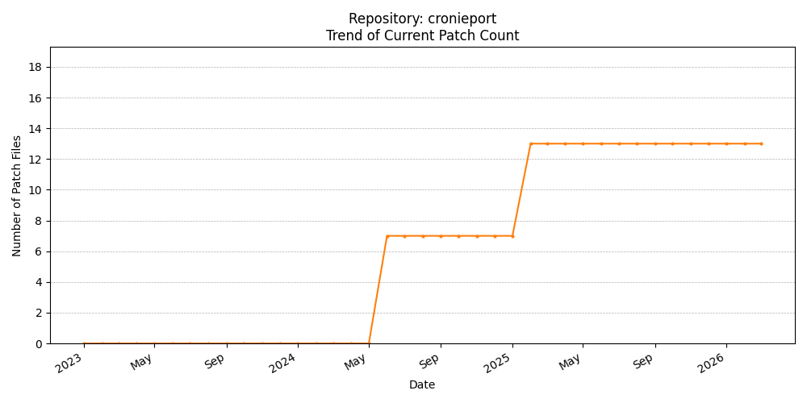

### Current Patch Details

| Patch File (Repo Relative Path) | Source | LOC |
|---|---|:---|
| `patches/Makemodule.am.patch` | `patches` | 13 |
| `patches/cron-zos-paths.c.patch` | `patches` | 109 |
| `patches/cron-zos-paths.h.patch` | `patches` | 59 |
| `patches/cron.c.patch` | `patches` | 14 |
| `patches/cronnext.c.patch` | `patches` | 37 |
| `patches/crontab.c.patch` | `patches` | 23 |
| `patches/database.c.patch` | `patches` | 23 |
| `patches/entry.c.patch` | `patches` | 25 |
| `patches/genlib.sh.patch` | `patches` | 77 |
| `patches/pathnames.h.patch` | `patches` | 30 |
| `patches/popen.c.patch` | `patches` | 30 |
| `patches/pw_dup.c.patch` | `patches` | 57 |
| `patches/readtab.c.patch` | `patches` | 13 |

---

## screenport

- **Origin Date (First Commit):** 2022-10-31
- **Current Patch LOC:** 485
- **Current Patch Count:** 7

### Historical Trends

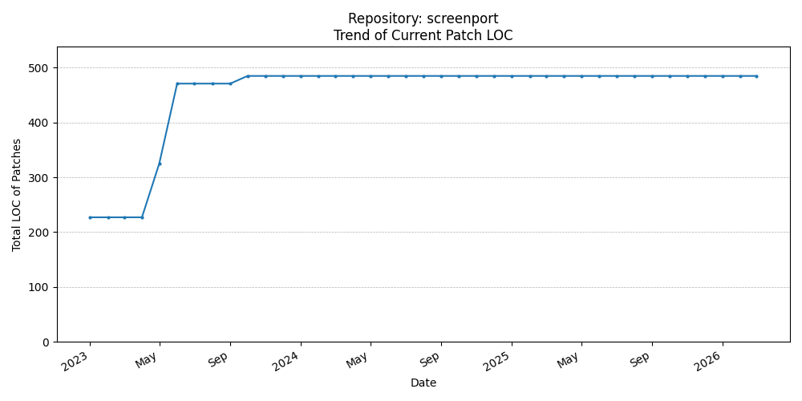
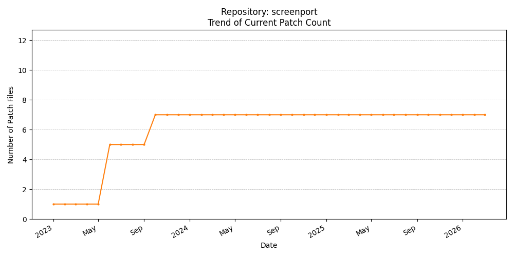

### Current Patch Details

| Patch File (Repo Relative Path) | Source | LOC |
|---|---|:---|
| `patches/PR1.patch` | `patches` | 140 |
| `patches/acls.c.patch` | `patches` | 16 |
| `patches/comm.sh.patch` | `patches` | 14 |
| `patches/pty.c.patch` | `patches` | 83 |
| `patches/screen.c.patch` | `patches` | 80 |
| `patches/tty.sh.patch` | `patches` | 40 |
| `patches/utmp.c.patch` | `patches` | 112 |

---

## glibport

- **Origin Date (First Commit):** 2025-07-29
- **Current Patch LOC:** 459
- **Current Patch Count:** 2

### Historical Trends

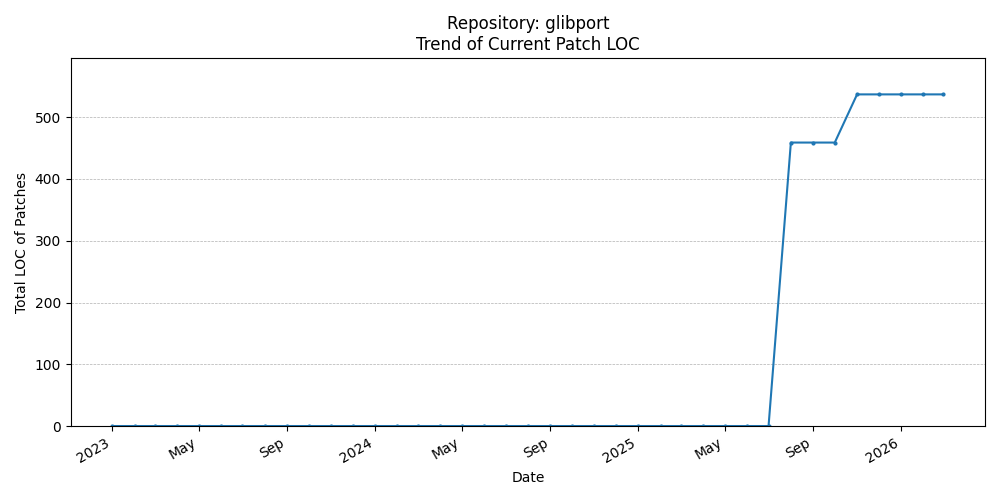
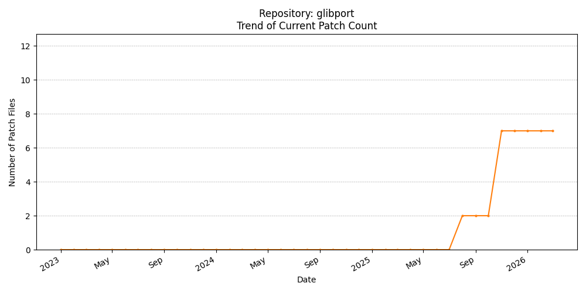

### Current Patch Details

| Patch File (Repo Relative Path) | Source | LOC |
|---|---|:---|
| `patches/disable-libffi-wrap.patch` | `patches` | 4 |
| `patches/p1.patch` | `patches` | 455 |

---

## tmuxport

- **Origin Date (First Commit):** 2024-01-15
- **Current Patch LOC:** 440
- **Current Patch Count:** 13

### Historical Trends


### Current Patch Details

| Patch File (Repo Relative Path) | Source | LOC |
|---|---|:---|
| `patches/client.c.patch` | `patches` | 0 |
| `patches/cmd-pipe-pane.c.patch` | `patches` | 22 |
| `patches/configure.ac.patch` | `patches` | 23 |
| `patches/environ.c.patch` | `patches` | 20 |
| `patches/forkpty-zos.c.patch` | `patches` | 120 |
| `patches/job.c.patch` | `patches` | 26 |
| `patches/osdep-zos.c.patch` | `patches` | 63 |
| `patches/server.c.patch` | `patches` | 17 |
| `patches/spawn.c.patch` | `patches` | 46 |
| `patches/tmux.c.patch` | `patches` | 30 |
| `patches/tmux.h.patch` | `patches` | 31 |
| `patches/tty-keys.c.patch` | `patches` | 22 |
| `patches/tty.c.patch` | `patches` | 20 |

---

## libpcapport

- **Origin Date (First Commit):** 2025-07-24
- **Current Patch LOC:** 440
- **Current Patch Count:** 8

### Historical Trends


### Current Patch Details

| Patch File (Repo Relative Path) | Source | LOC |
|---|---|:---|
| `patches/bpf_image.c.patch` | `patches` | 59 |
| `patches/etherent.c.patch` | `patches` | 31 |
| `patches/nametoaddr.c.patch` | `patches` | 65 |
| `patches/pcap-null.c.patch` | `patches` | 15 |
| `patches/pcap.c.patch` | `patches` | 128 |
| `patches/pcap/bpf.h.patch` | `patches` | 13 |
| `patches/testprogs/Makefile.in.patch` | `patches` | 92 |
| `patches/testprogs/filtertest.c.patch` | `patches` | 37 |

---

## treeport

- **Origin Date (First Commit):** 2023-11-14
- **Current Patch LOC:** 425
- **Current Patch Count:** 3

### Historical Trends


### Current Patch Details

| Patch File (Repo Relative Path) | Source | LOC |
|---|---|:---|
| `patches/Makefile.patch` | `patches` | 49 |
| `patches/manpage.patch` | `patches` | 42 |
| `patches/zossupport.patch` | `patches` | 334 |

---

## nginxport

- **Origin Date (First Commit):** 2023-10-25
- **Current Patch LOC:** 414
- **Current Patch Count:** 1

### Historical Trends


### Current Patch Details

| Patch File (Repo Relative Path) | Source | LOC |
|---|---|:---|
| `patches/PR1.patch` | `patches` | 414 |

---

## emacsport

- **Origin Date (First Commit):** 2023-03-10
- **Current Patch LOC:** 413
- **Current Patch Count:** 2

### Historical Trends


### Current Patch Details

| Patch File (Repo Relative Path) | Source | LOC |
|---|---|:---|
| `patches/beta.patch` | `patches` | 400 |
| `patches/keyboard.c.patch` | `patches` | 13 |

---

## gettextport

- **Origin Date (First Commit):** 2022-05-20
- **Current Patch LOC:** 378
- **Current Patch Count:** 10

### Historical Trends


### Current Patch Details

| Patch File (Repo Relative Path) | Source | LOC |
|---|---|:---|
| `patches/PR1/fetch-name-collision.patch` | `patches` | 31 |
| `patches/PR1/locale-name-collision.patch` | `patches` | 13 |
| `patches/PR1/no-pwd_gecos.patch` | `patches` | 50 |
| `patches/PR1/tagtarball.patch` | `patches` | 13 |
| `patches/PR2/dummy.c.patch` | `patches` | 16 |
| `patches/PR3/test-unsetenv.c.patch` | `patches` | 23 |
| `patches/PR4/configure.patch` | `patches` | 60 |
| `patches/UTF8.patch` | `patches` | 119 |
| `patches/bindtextdom.c.patch` | `patches` | 39 |
| `patches/dcigettext.c.patch` | `patches` | 14 |

---

## opensshport

- **Origin Date (First Commit):** 2023-05-15
- **Current Patch LOC:** 376
- **Current Patch Count:** 19

### Historical Trends


### Current Patch Details

| Patch File (Repo Relative Path) | Source | LOC |
|---|---|:---|
| `patches/auth-passwd.c.patch` | `patches` | 16 |
| `patches/auth.c.patch` | `patches` | 17 |
| `patches/configure.patch` | `patches` | 16 |
| `patches/defines.h.patch` | `patches` | 17 |
| `patches/includes.h.patch` | `patches` | 14 |
| `patches/misc.c.patch` | `patches` | 56 |
| `patches/monitor_wrap.c.patch` | `patches` | 14 |
| `patches/openbsd-compat/port-net.c.patch` | `patches` | 14 |
| `patches/openbsd-compat/xcrypt.c.patch` | `patches` | 20 |
| `patches/packet.c.patch` | `patches` | 14 |
| `patches/pathnames.h.patch` | `patches` | 27 |
| `patches/platform.c.patch` | `patches` | 16 |
| `patches/readconf.c.patch` | `patches` | 17 |
| `patches/scp.c.patch` | `patches` | 22 |
| `patches/servconf.c.patch` | `patches` | 16 |
| `patches/sshbuf-io.c.patch` | `patches` | 14 |
| `patches/sshconnect.c.patch` | `patches` | 15 |
| `patches/sshd-session.c.patch` | `patches` | 37 |
| `patches/sshkey.c.patch` | `patches` | 14 |

---

## flexport

- **Origin Date (First Commit):** 2022-11-25
- **Current Patch LOC:** 351
- **Current Patch Count:** 2

### Historical Trends


### Current Patch Details

| Patch File (Repo Relative Path) | Source | LOC |
|---|---|:---|
| `patches/Makefile.in.patch` | `patches` | 318 |
| `patches/configure.patch` | `patches` | 33 |

---

## prometheusport

- **Origin Date (First Commit):** 2024-05-16
- **Current Patch LOC:** 348
- **Current Patch Count:** 1

### Historical Trends


### Current Patch Details

| Patch File (Repo Relative Path) | Source | LOC |
|---|---|:---|
| `patches/prometheus.patch` | `patches` | 348 |

---

## vimport

- **Origin Date (First Commit):** 2022-06-24
- **Current Patch LOC:** 347
- **Current Patch Count:** 13

### Historical Trends


### Current Patch Details

| Patch File (Repo Relative Path) | Source | LOC |
|---|---|:---|
| `dev-patches/Makefile.patch` | `dev-patches` | 13 |
| `dev-patches/abendfix.patch` | `dev-patches` | 13 |
| `stable-patches/auto_configure.patch` | `stable-patches` | 12 |
| `stable-patches/buffwrite.c.patch` | `stable-patches` | 25 |
| `stable-patches/evalfunc.c.patch` | `stable-patches` | 18 |
| `stable-patches/fileio.c.patch` | `stable-patches` | 14 |
| `stable-patches/os_unix.c.patch` | `stable-patches` | 43 |
| `stable-patches/pty.c.patch` | `stable-patches` | 17 |
| `stable-patches/structs.h.patch` | `stable-patches` | 14 |
| `stable-patches/test_hlsearch.vim.patch` | `stable-patches` | 53 |
| `stable-patches/test_startup.vim.patch` | `stable-patches` | 34 |
| `stable-patches/test_syntax.vim.patch` | `stable-patches` | 79 |
| `stable-patches/vim.h.patch` | `stable-patches` | 12 |

---

## pocoport

- **Origin Date (First Commit):** 2023-12-06
- **Current Patch LOC:** 343
- **Current Patch Count:** 9

### Historical Trends


### Current Patch Details

| Patch File (Repo Relative Path) | Source | LOC |
|---|---|:---|
| `patches/DirectoryWatcher.cpp.patch` | `patches` | 60 |
| `patches/Makefile.patch` | `patches` | 31 |
| `patches/Platform.h.patch` | `patches` | 14 |
| `patches/SharedMemory_POSIX.cpp.patch` | `patches` | 64 |
| `patches/Thread_POSIX.cpp.patch` | `patches` | 50 |
| `patches/Thread_POSIX.h.patch` | `patches` | 17 |
| `patches/VarHolder.h.patch` | `patches` | 71 |
| `patches/configure.patch` | `patches` | 13 |
| `patches/global.patch` | `patches` | 23 |

---

## rsyncport

- **Origin Date (First Commit):** 2022-07-17
- **Current Patch LOC:** 341
- **Current Patch Count:** 6

### Historical Trends


### Current Patch Details

| Patch File (Repo Relative Path) | Source | LOC |
|---|---|:---|
| `patches/Makefile.in.patch` | `patches` | 22 |
| `patches/PR1/addunistd.patch` | `patches` | 12 |
| `patches/PR1/rsync.h.patch` | `patches` | 50 |
| `patches/PR1/touchfix.patch` | `patches` | 11 |
| `patches/PR3/syscall.c.patch` | `patches` | 217 |
| `patches/pipe.c.patch` | `patches` | 29 |

---

## neovimport

- **Origin Date (First Commit):** 2023-04-21
- **Current Patch LOC:** 327
- **Current Patch Count:** 13

### Historical Trends


### Current Patch Details

| Patch File (Repo Relative Path) | Source | LOC |
|---|---|:---|
| `stable-patches/cmake.deps.cmake.BuildLua.cmake.patch` | `stable-patches` | 39 |
| `stable-patches/cmake.deps.cmake.BuildLuv.cmake.patch` | `stable-patches` | 29 |
| `stable-patches/cmake.deps.cmake.BuildTreesitter.cmake.patch` | `stable-patches` | 12 |
| `stable-patches/cmake.deps.cmake.BuildTreesitterParsers.cmake.patch` | `stable-patches` | 13 |
| `stable-patches/src.nvim.CMakeLists.txt.patch` | `stable-patches` | 42 |
| `stable-patches/src.nvim.buffer_defs.h.patch` | `stable-patches` | 15 |
| `stable-patches/src.nvim.bufwrite.c.patch` | `stable-patches` | 43 |
| `stable-patches/src.nvim.channel.c.patch` | `stable-patches` | 47 |
| `stable-patches/src.nvim.fileio.c.patch` | `stable-patches` | 15 |
| `stable-patches/src.nvim.memfile.c.patch` | `stable-patches` | 12 |
| `stable-patches/src.nvim.os.pty_proc_unix.c.patch` | `stable-patches` | 32 |
| `stable-patches/src.nvim.tui.termkey.termkey.c.patch` | `stable-patches` | 15 |
| `stable-patches/src.nvim.undo.c.patch` | `stable-patches` | 13 |

---

## phpport

- **Origin Date (First Commit):** 2022-10-19
- **Current Patch LOC:** 320
- **Current Patch Count:** 13

### Historical Trends


### Current Patch Details

| Patch File (Repo Relative Path) | Source | LOC |
|---|---|:---|
| `patches/basic_functions_arginfo.h.patch` | `patches` | 17 |
| `patches/configure.patch` | `patches` | 12 |
| `patches/dns.c.patch` | `patches` | 14 |
| `patches/hrtime.c.patch` | `patches` | 15 |
| `patches/hrtime.h.patch` | `patches` | 26 |
| `patches/microtime.c.patch` | `patches` | 13 |
| `patches/net.c.patch` | `patches` | 15 |
| `patches/network.c.patch` | `patches` | 17 |
| `patches/posix.c.patch` | `patches` | 36 |
| `patches/sljitNativeS390X.c.patch` | `patches` | 34 |
| `patches/zend_alloc.c.patch` | `patches` | 40 |
| `patches/zend_fibers.c.patch` | `patches` | 31 |
| `patches/zend_mmap.h.patch` | `patches` | 50 |

---

## mimallocport

- **Origin Date (First Commit):** 2025-05-13
- **Current Patch LOC:** 313
- **Current Patch Count:** 6

### Historical Trends


### Current Patch Details

| Patch File (Repo Relative Path) | Source | LOC |
|---|---|:---|
| `patches/alloc-override.c.patch` | `patches` | 13 |
| `patches/init.c.patch` | `patches` | 55 |
| `patches/internal.h.patch` | `patches` | 16 |
| `patches/options.c.patch` | `patches` | 67 |
| `patches/prim.c.patch` | `patches` | 135 |
| `patches/prim.h.patch` | `patches` | 27 |

---

## libgcryptport

- **Origin Date (First Commit):** 2023-04-21
- **Current Patch LOC:** 302
- **Current Patch Count:** 9

### Historical Trends


### Current Patch Details

| Patch File (Repo Relative Path) | Source | LOC |
|---|---|:---|
| `patches/Makefile.in.patch` | `patches` | 13 |
| `patches/configure.patch` | `patches` | 33 |
| `patches/doc_Makefile.in.patch` | `patches` | 13 |
| `patches/fips.c.patch` | `patches` | 87 |
| `patches/g10lib.h.patch` | `patches` | 17 |
| `patches/longlong.h.patch` | `patches` | 22 |
| `patches/rndgetentropy.c.patch` | `patches` | 17 |
| `patches/secmem.c.patch` | `patches` | 14 |
| `patches/t-thread-local.c.patch` | `patches` | 86 |

---

## conanport

- **Origin Date (First Commit):** 2024-08-15
- **Current Patch LOC:** 299
- **Current Patch Count:** 8

### Historical Trends


### Current Patch Details

| Patch File (Repo Relative Path) | Source | LOC |
|---|---|:---|
| `patches/conan/internal/api/detect/detect_api.py.patch` | `patches` | 31 |
| `patches/conan/internal/default_settings.py.patch` | `patches` | 27 |
| `patches/conan/test/utils/tools.py.patch` | `patches` | 20 |
| `patches/conan/tools/build/cppstd.py.patch` | `patches` | 29 |
| `patches/conan/tools/build/cstd.py.patch` | `patches` | 22 |
| `patches/conan/tools/build/flags.py.patch` | `patches` | 101 |
| `patches/conan/tools/gnu/gnudeps_flags.py.patch` | `patches` | 13 |
| `patches/conan/tools/meson/toolchain.py.patch` | `patches` | 56 |

---

## zipport

- **Origin Date (First Commit):** 2022-10-27
- **Current Patch LOC:** 297
- **Current Patch Count:** 8

### Historical Trends


### Current Patch Details

| Patch File (Repo Relative Path) | Source | LOC |
|---|---|:---|
| `patches/fileio.c.patch` | `patches` | 17 |
| `patches/osdep.h.patch` | `patches` | 13 |
| `patches/unix.c.patch` | `patches` | 99 |
| `patches/zip.c.patch` | `patches` | 17 |
| `patches/zip.h.patch` | `patches` | 16 |
| `patches/zipnote.c.patch` | `patches` | 97 |
| `patches/zipup.c.patch` | `patches` | 21 |
| `patches/zipup.h.patch` | `patches` | 17 |

---

## ccacheport

- **Origin Date (First Commit):** 2025-05-25
- **Current Patch LOC:** 264
- **Current Patch Count:** 1

### Historical Trends


### Current Patch Details

| Patch File (Repo Relative Path) | Source | LOC |
|---|---|:---|
| `patches/PR1.patch` | `patches` | 264 |

---

## fishport

- **Origin Date (First Commit):** 2025-05-14
- **Current Patch LOC:** 258
- **Current Patch Count:** 1

### Historical Trends


### Current Patch Details

| Patch File (Repo Relative Path) | Source | LOC |
|---|---|:---|
| `patches/PR1.patch` | `patches` | 258 |

---

## mesonport

- **Origin Date (First Commit):** 2023-10-20
- **Current Patch LOC:** 257
- **Current Patch Count:** 9

### Historical Trends


### Current Patch Details

| Patch File (Repo Relative Path) | Source | LOC |
|---|---|:---|
| `patches/mesonbuild/backend/backends.py.patch` | `patches` | 13 |
| `patches/mesonbuild/build.py.patch` | `patches` | 30 |
| `patches/mesonbuild/compilers/compilers.py.patch` | `patches` | 13 |
| `patches/mesonbuild/compilers/detect.py.patch` | `patches` | 33 |
| `patches/mesonbuild/envconfig.py.patch` | `patches` | 17 |
| `patches/mesonbuild/environment.py.patch` | `patches` | 58 |
| `patches/mesonbuild/linkers/linkers.py.patch` | `patches` | 57 |
| `patches/mesonbuild/utils/universal.py.patch` | `patches` | 23 |
| `patches/run_tests.py.patch` | `patches` | 13 |

---

## gitlab-runnerport

- **Origin Date (First Commit):** 2023-12-13
- **Current Patch LOC:** 241
- **Current Patch Count:** 10

### Historical Trends


### Current Patch Details

| Patch File (Repo Relative Path) | Source | LOC |
|---|---|:---|
| `patches/commander_unix.go.patch` | `patches` | 10 |
| `patches/config_unix.go.patch` | `patches` | 22 |
| `patches/dump_unix.go.patch` | `patches` | 22 |
| `patches/job_unix.go.patch` | `patches` | 22 |
| `patches/killer_unix.go.patch` | `patches` | 22 |
| `patches/ops_unix.go.patch` | `patches` | 30 |
| `patches/service_portable.go.patch` | `patches` | 22 |
| `patches/service_zos.go.patch` | `patches` | 59 |
| `patches/wrapper_unix.go.patch` | `patches` | 10 |
| `patches/zip_extra_unix.go.patch` | `patches` | 22 |

---

## zstdport

- **Origin Date (First Commit):** 2022-07-18
- **Current Patch LOC:** 236
- **Current Patch Count:** 4

### Historical Trends


### Current Patch Details

| Patch File (Repo Relative Path) | Source | LOC |
|---|---|:---|
| `patches/Makefile.patch` | `patches` | 29 |
| `patches/PR1/addzostomakefile.patch` | `patches` | 44 |
| `patches/PR1/assertfirst.patch` | `patches` | 99 |
| `patches/tests_Makefile.patch` | `patches` | 64 |

---

## libarchiveport

- **Origin Date (First Commit):** 2025-04-29
- **Current Patch LOC:** 220
- **Current Patch Count:** 5

### Historical Trends


### Current Patch Details

| Patch File (Repo Relative Path) | Source | LOC |
|---|---|:---|
| `patches/libarchive/archive_entry.h.patch` | `patches` | 40 |
| `patches/libarchive/archive_read_disk_posix.c.patch` | `patches` | 39 |
| `patches/libarchive/test/test_read_disk_directory_traversals.c.patch` | `patches` | 37 |
| `patches/libarchive/test/test_sparse_basic.c.patch` | `patches` | 44 |
| `patches/test_utils/test_main.c.patch` | `patches` | 60 |

---

## toml11port

- **Origin Date (First Commit):** 2025-07-28
- **Current Patch LOC:** 217
- **Current Patch Count:** 3

### Historical Trends


### Current Patch Details

| Patch File (Repo Relative Path) | Source | LOC |
|---|---|:---|
| `patches/CMakeList.txt.patch` | `patches` | 22 |
| `patches/doctest_disable_tls.patch` | `patches` | 28 |
| `patches/syntax_impl.hpp.patch` | `patches` | 167 |

---

## protobufport

- **Origin Date (First Commit):** 2023-08-02
- **Current Patch LOC:** 201
- **Current Patch Count:** 9

### Historical Trends


### Current Patch Details

| Patch File (Repo Relative Path) | Source | LOC |
|---|---|:---|
| `patches/attributes.h.patch` | `patches` | 24 |
| `patches/command_line_interface.cc.patch` | `patches` | 27 |
| `patches/config.h.patch` | `patches` | 12 |
| `patches/low_level_alloc.cc.patch` | `patches` | 36 |
| `patches/low_level_alloc.h.patch` | `patches` | 13 |
| `patches/per_thread_sem.h.patch` | `patches` | 20 |
| `patches/port_def.inc.patch` | `patches` | 22 |
| `patches/sysinfo.cc.patch` | `patches` | 26 |
| `patches/time_zone_libc.cc.patch` | `patches` | 21 |

---

## findutilsport

- **Origin Date (First Commit):** 2022-10-25
- **Current Patch LOC:** 199
- **Current Patch Count:** 10

### Historical Trends


### Current Patch Details

| Patch File (Repo Relative Path) | Source | LOC |
|---|---|:---|
| `patches/PR1/filemode.c.patch` | `patches` | 33 |
| `patches/PR2/PR2.patch` | `patches` | 14 |
| `patches/PR3/config.guess.patch` | `patches` | 13 |
| `patches/PR3/configure.patch` | `patches` | 22 |
| `patches/PR3/install-sh.patch` | `patches` | 19 |
| `patches/PR3/test-driver.patch` | `patches` | 19 |
| `patches/PR4/gl_lib_canonicalize.c.patch` | `patches` | 25 |
| `patches/PR4/gnulib-tests_test-unsetenv.c.patch` | `patches` | 24 |
| `patches/PR5/fts.c.patch` | `patches` | 17 |
| `patches/sched_yield_disable.patch` | `patches` | 13 |

---

## ninjaport

- **Origin Date (First Commit):** 2022-04-21
- **Current Patch LOC:** 196
- **Current Patch Count:** 8

### Historical Trends


### Current Patch Details

| Patch File (Repo Relative Path) | Source | LOC |
|---|---|:---|
| `patches/PR1/CMakeLists.txt.patch` | `patches` | 13 |
| `patches/PR1/configure.py.patch` | `patches` | 91 |
| `patches/PR1/src/disk_interface.cc.patch` | `patches` | 15 |
| `patches/PR1/src/getopt.c.patch` | `patches` | 13 |
| `patches/PR1/src/getopt.h.patch` | `patches` | 13 |
| `patches/PR1/src/manifest_parser_perftest.cc.patch` | `patches` | 13 |
| `patches/PR1/src/ninja.cc.patch` | `patches` | 13 |
| `patches/PR1/src/util.cc.patch` | `patches` | 25 |

---

## blisport

- **Origin Date (First Commit):** 2025-07-03
- **Current Patch LOC:** 185
- **Current Patch Count:** 2

### Historical Trends


### Current Patch Details

| Patch File (Repo Relative Path) | Source | LOC |
|---|---|:---|
| `patches/PR1.patch` | `patches` | 165 |
| `patches/PR2.patch` | `patches` | 20 |

---

## diffutilsport

- **Origin Date (First Commit):** 2022-09-09
- **Current Patch LOC:** 184
- **Current Patch Count:** 8

### Historical Trends


### Current Patch Details

| Patch File (Repo Relative Path) | Source | LOC |
|---|---|:---|
| `patches/PR1/config.guess.patch` | `patches` | 13 |
| `patches/PR2/c-file-type.c.patch` | `patches` | 22 |
| `patches/PR2/getprogname.c.patch` | `patches` | 13 |
| `patches/PR3/stdlib.in.h.patch` | `patches` | 25 |
| `patches/cmp.c.patch` | `patches` | 18 |
| `patches/depcomp.patch` | `patches` | 30 |
| `patches/help2man.patch` | `patches` | 10 |
| `patches/skip_test.patch` | `patches` | 53 |

---

## aflplusplusport

- **Origin Date (First Commit):** 2025-05-27
- **Current Patch LOC:** 184
- **Current Patch Count:** 5

### Historical Trends


### Current Patch Details

| Patch File (Repo Relative Path) | Source | LOC |
|---|---|:---|
| `patches/GNUmakefile.patch` | `patches` | 16 |
| `patches/afl-common.c.patch` | `patches` | 107 |
| `patches/afl-fuzz-init.c.patch` | `patches` | 20 |
| `patches/afl-fuzz-stats.c.patch` | `patches` | 22 |
| `patches/common.h.patch` | `patches` | 19 |

---

## jemallocport

- **Origin Date (First Commit):** 2025-05-14
- **Current Patch LOC:** 166
- **Current Patch Count:** 1

### Historical Trends


### Current Patch Details

| Patch File (Repo Relative Path) | Source | LOC |
|---|---|:---|
| `stable-patches/PR1.patch` | `stable-patches` | 166 |

---

## groffport

- **Origin Date (First Commit):** 2022-10-20
- **Current Patch LOC:** 165
- **Current Patch Count:** 13

### Historical Trends


### Current Patch Details

| Patch File (Repo Relative Path) | Source | LOC |
|---|---|:---|
| `dev-patches/main.cpp.patch` | `dev-patches` | 17 |
| `dev-patches/pre-html.cpp.patch` | `dev-patches` | 24 |
| `dev-patches/test-driver.patch` | `dev-patches` | 0 |
| `stable-patches/assertfix/box.cpp.patch` | `stable-patches` | 12 |
| `stable-patches/assertfix/delim.cpp.patch` | `stable-patches` | 12 |
| `stable-patches/assertfix/dvi.cpp.patch` | `stable-patches` | 13 |
| `stable-patches/assertfix/lbp.cpp.patch` | `stable-patches` | 12 |
| `stable-patches/assertfix/lj4.cpp.patch` | `stable-patches` | 13 |
| `stable-patches/assertfix/pile.cpp.patch` | `stable-patches` | 12 |
| `stable-patches/assertfix/printer.cpp.patch` | `stable-patches` | 13 |
| `stable-patches/assertfix/script.cpp.patch` | `stable-patches` | 12 |
| `stable-patches/getopt.c.patch` | `stable-patches` | 16 |
| `stable-patches/makevarescape.sed.patch` | `stable-patches` | 9 |

---

## autoconfport

- **Origin Date (First Commit):** 2021-08-13
- **Current Patch LOC:** 151
- **Current Patch Count:** 6

### Historical Trends


### Current Patch Details

| Patch File (Repo Relative Path) | Source | LOC |
|---|---|:---|
| `patches/PR1/config.guess.patch` | `patches` | 14 |
| `patches/PR1/configure.patch` | `patches` | 22 |
| `patches/PR1/general.m4.patch` | `patches` | 76 |
| `patches/PR1/local.at.patch` | `patches` | 13 |
| `patches/PR1/status.m4.patch` | `patches` | 13 |
| `patches/m4sh.m4.patch` | `patches` | 13 |

---

## moreutilsport

- **Origin Date (First Commit):** 2023-11-02
- **Current Patch LOC:** 151
- **Current Patch Count:** 1

### Historical Trends


### Current Patch Details

| Patch File (Repo Relative Path) | Source | LOC |
|---|---|:---|
| `patches/PR1.patch` | `patches` | 151 |

---

## libserdesport

- **Origin Date (First Commit):** 2023-08-29
- **Current Patch LOC:** 142
- **Current Patch Count:** 4

### Historical Trends


### Current Patch Details

| Patch File (Repo Relative Path) | Source | LOC |
|---|---|:---|
| `patches/configure.self.patch` | `patches` | 13 |
| `patches/src/serdes-common.h.patch` | `patches` | 15 |
| `patches/src/serdes_int.h.patch` | `patches` | 17 |
| `patches/src/tinycthread.c.patch` | `patches` | 97 |

---

## tclport

- **Origin Date (First Commit):** 2022-07-09
- **Current Patch LOC:** 132
- **Current Patch Count:** 5

### Historical Trends


### Current Patch Details

| Patch File (Repo Relative Path) | Source | LOC |
|---|---|:---|
| `patches/PR1/namecollision.patch` | `patches` | 42 |
| `patches/PR1/neederrno.patch` | `patches` | 12 |
| `patches/PR1/remove_oe_sockets_hardcode.patch` | `patches` | 19 |
| `patches/PR2/tclUnixNotfy.c.patch` | `patches` | 15 |
| `patches/PR2/tclUnixThrd.c.patch` | `patches` | 44 |

---

## multitailport

- **Origin Date (First Commit):** 2025-07-31
- **Current Patch LOC:** 130
- **Current Patch Count:** 1

### Historical Trends


### Current Patch Details

| Patch File (Repo Relative Path) | Source | LOC |
|---|---|:---|
| `patches/PR1.patch` | `patches` | 130 |

---

## pinentryport

- **Origin Date (First Commit):** 2023-05-18
- **Current Patch LOC:** 124
- **Current Patch Count:** 5

### Historical Trends


### Current Patch Details

| Patch File (Repo Relative Path) | Source | LOC |
|---|---|:---|
| `patches/configure.ac.patch` | `patches` | 20 |
| `patches/configure.patch` | `patches` | 32 |
| `patches/pinentry-emacs.c.patch` | `patches` | 15 |
| `patches/pinentry.c.patch` | `patches` | 15 |
| `patches/secmem.c.patch` | `patches` | 42 |

---

## m4port

- **Origin Date (First Commit):** 2021-08-11
- **Current Patch LOC:** 120
- **Current Patch Count:** 5

### Historical Trends


### Current Patch Details

| Patch File (Repo Relative Path) | Source | LOC |
|---|---|:---|
| `dev-patches/PR4/doc/m4.texi.patch` | `dev-patches` | 17 |
| `dev-patches/PR4/src/format.c.patch` | `dev-patches` | 13 |
| `stable-patches/PR2/builtin.c.patch` | `stable-patches` | 55 |
| `stable-patches/PR2/canonicalize-lgpl.c.patch` | `stable-patches` | 22 |
| `stable-patches/PR2/configure.patch` | `stable-patches` | 13 |

---

## thesilversearcherport

- **Origin Date (First Commit):** 2023-07-18
- **Current Patch LOC:** 118
- **Current Patch Count:** 4

### Historical Trends


### Current Patch Details

| Patch File (Repo Relative Path) | Source | LOC |
|---|---|:---|
| `patches/genlib.sh.patch` | `patches` | 77 |
| `patches/main.c.patch` | `patches` | 14 |
| `patches/options.c.patch` | `patches` | 13 |
| `patches/print.c.patch` | `patches` | 14 |

---

## gas2asmport

- **Origin Date (First Commit):** 2025-04-11
- **Current Patch LOC:** 116
- **Current Patch Count:** 4

### Historical Trends


### Current Patch Details

| Patch File (Repo Relative Path) | Source | LOC |
|---|---|:---|
| `patches/Makefile.mvs.patch` | `patches` | 77 |
| `patches/simple.assemble.patch` | `patches` | 0 |
| `patches/test/check.asmok.patch` | `patches` | 10 |
| `patches/test/deflate2.s.patch` | `patches` | 29 |

---

## grepport

- **Origin Date (First Commit):** 2022-09-09
- **Current Patch LOC:** 115
- **Current Patch Count:** 3

### Historical Trends


### Current Patch Details

| Patch File (Repo Relative Path) | Source | LOC |
|---|---|:---|
| `patches/fts.c.patch` | `patches` | 17 |
| `patches/gnulib.patch` | `patches` | 14 |
| `patches/grep.c.patch` | `patches` | 84 |

---

## uucpport

- **Origin Date (First Commit):** 2025-04-11
- **Current Patch LOC:** 115
- **Current Patch Count:** 1

### Historical Trends


### Current Patch Details

| Patch File (Repo Relative Path) | Source | LOC |
|---|---|:---|
| `patches/PR1.patch` | `patches` | 115 |

---

## ncursesport

- **Origin Date (First Commit):** 2022-10-27
- **Current Patch LOC:** 111
- **Current Patch Count:** 2

### Historical Trends


### Current Patch Details

| Patch File (Repo Relative Path) | Source | LOC |
|---|---|:---|
| `patches/TERMINFO.patch` | `patches` | 48 |
| `patches/clear.c.patch` | `patches` | 63 |

---

## hexcurseport

- **Origin Date (First Commit):** 2025-02-09
- **Current Patch LOC:** 108
- **Current Patch Count:** 4

### Historical Trends


### Current Patch Details

| Patch File (Repo Relative Path) | Source | LOC |
|---|---|:---|
| `patches/file.c.patch` | `patches` | 47 |
| `patches/hex.h.patch` | `patches` | 12 |
| `patches/hexcurse.c.patch` | `patches` | 22 |
| `patches/screen.c.patch` | `patches` | 27 |

---

## libbsdport

- **Origin Date (First Commit):** 2023-07-31
- **Current Patch LOC:** 107
- **Current Patch Count:** 4

### Historical Trends


### Current Patch Details

| Patch File (Repo Relative Path) | Source | LOC |
|---|---|:---|
| `patches/configure.ac.patch` | `patches` | 57 |
| `patches/src/fgetln.c.patch` | `patches` | 11 |
| `patches/src/flopen.c.patch` | `patches` | 15 |
| `patches/src/readpassphrase.c.patch` | `patches` | 24 |

---

## victoriametricsport

- **Origin Date (First Commit):** 2024-03-04
- **Current Patch LOC:** 107
- **Current Patch Count:** 3

### Historical Trends


### Current Patch Details

| Patch File (Repo Relative Path) | Source | LOC |
|---|---|:---|
| `patches/lib_filestream.patch` | `patches` | 36 |
| `patches/lib_fs.patch` | `patches` | 34 |
| `patches/lib_memory.patch` | `patches` | 37 |

---

## mkcertport

- **Origin Date (First Commit):** 2025-07-11
- **Current Patch LOC:** 105
- **Current Patch Count:** 1

### Historical Trends


### Current Patch Details

| Patch File (Repo Relative Path) | Source | LOC |
|---|---|:---|
| `patches/truststore_zos.go.patch` | `patches` | 105 |

---

## zlib-ngport

- **Origin Date (First Commit):** 2024-02-02
- **Current Patch LOC:** 100
- **Current Patch Count:** 3

### Historical Trends


### Current Patch Details

| Patch File (Repo Relative Path) | Source | LOC |
|---|---|:---|
| `patches/Makefile.in.patch` | `patches` | 56 |
| `patches/zbuild.h.patch` | `patches` | 22 |
| `patches/zutil_p.h.patch` | `patches` | 22 |

---

## ansibleport

- **Origin Date (First Commit):** 2025-07-24
- **Current Patch LOC:** 100
- **Current Patch Count:** 4

### Historical Trends


### Current Patch Details

| Patch File (Repo Relative Path) | Source | LOC |
|---|---|:---|
| `patches/cli/__init__.py.patch` | `patches` | 14 |
| `patches/plugins/connection/ssh.py.patch` | `patches` | 28 |
| `patches/requirements.txt.patch` | `patches` | 9 |
| `patches/utils/display.py.patch` | `patches` | 49 |

---

## pkgconfigport

- **Origin Date (First Commit):** 2022-06-24
- **Current Patch LOC:** 98
- **Current Patch Count:** 1

### Historical Trends


### Current Patch Details

| Patch File (Repo Relative Path) | Source | LOC |
|---|---|:---|
| `patches/PR1.patch` | `patches` | 98 |

---

## doxygenport

- **Origin Date (First Commit):** 2024-02-14
- **Current Patch LOC:** 97
- **Current Patch Count:** 5

### Historical Trends


### Current Patch Details

| Patch File (Repo Relative Path) | Source | LOC |
|---|---|:---|
| `patches/filesystem.hpp.patch` | `patches` | 32 |
| `patches/latexgen.cpp.patch` | `patches` | 18 |
| `patches/runtests.py.patch` | `patches` | 16 |
| `patches/types.h.patch` | `patches` | 13 |
| `patches/util.cpp.patch` | `patches` | 18 |

---

## libiconvport

- **Origin Date (First Commit):** 2023-01-14
- **Current Patch LOC:** 96
- **Current Patch Count:** 4

### Historical Trends


### Current Patch Details

| Patch File (Repo Relative Path) | Source | LOC |
|---|---|:---|
| `dev-patches/iconv.c.patch` | `dev-patches` | 17 |
| `stable-patches/IBM-1047.TXT.patch` | `stable-patches` | 22 |
| `stable-patches/Makefile.in.patch` | `stable-patches` | 22 |
| `stable-patches/ebcdic1047.h.patch` | `stable-patches` | 35 |

---

## depot_toolsport

- **Origin Date (First Commit):** 2023-10-10
- **Current Patch LOC:** 91
- **Current Patch Count:** 1

### Historical Trends


### Current Patch Details

| Patch File (Repo Relative Path) | Source | LOC |
|---|---|:---|
| `patches/zos.patch` | `patches` | 91 |

---

## libeventport

- **Origin Date (First Commit):** 2024-01-02
- **Current Patch LOC:** 87
- **Current Patch Count:** 3

### Historical Trends


### Current Patch Details

| Patch File (Repo Relative Path) | Source | LOC |
|---|---|:---|
| `patches/configure.patch` | `patches` | 50 |
| `patches/evutil.c.patch` | `patches` | 15 |
| `patches/regress_http.c.patch` | `patches` | 22 |

---

## patchport

- **Origin Date (First Commit):** 2022-10-18
- **Current Patch LOC:** 86
- **Current Patch Count:** 3

### Historical Trends


### Current Patch Details

| Patch File (Repo Relative Path) | Source | LOC |
|---|---|:---|
| `patches/PR1/pathmax.h.patch` | `patches` | 14 |
| `patches/PR1/string.in.h.patch` | `patches` | 60 |
| `patches/PR1/util.c.patch` | `patches` | 12 |

---

## jqport

- **Origin Date (First Commit):** 2022-06-05
- **Current Patch LOC:** 85
- **Current Patch Count:** 6

### Historical Trends


### Current Patch Details

| Patch File (Repo Relative Path) | Source | LOC |
|---|---|:---|
| `patches/configure.patch` | `patches` | 15 |
| `patches/zOS.patch` | `patches` | 15 |
| `stable-patches/jq.test.patch` | `stable-patches` | 18 |
| `stable-patches/mantest.patch` | `stable-patches` | 10 |
| `stable-patches/shtest.patch` | `stable-patches` | 11 |
| `stable-patches/version.patch` | `stable-patches` | 16 |

---

## openldapport

- **Origin Date (First Commit):** 2025-07-25
- **Current Patch LOC:** 85
- **Current Patch Count:** 1

### Historical Trends


### Current Patch Details

| Patch File (Repo Relative Path) | Source | LOC |
|---|---|:---|
| `patches/PR1.patch` | `patches` | 85 |

---

## gawkport

- **Origin Date (First Commit):** 2022-07-17
- **Current Patch LOC:** 81
- **Current Patch Count:** 4

### Historical Trends


### Current Patch Details

| Patch File (Repo Relative Path) | Source | LOC |
|---|---|:---|
| `patches/PR1/ascii-io.patch` | `patches` | 39 |
| `patches/PR1/noprotoscope.patch` | `patches` | 16 |
| `patches/PR1/zosdoesnotmeanebcdic.patch` | `patches` | 13 |
| `patches/PR2/install-sh.patch` | `patches` | 13 |

---

## expectport

- **Origin Date (First Commit):** 2023-03-27
- **Current Patch LOC:** 79
- **Current Patch Count:** 4

### Historical Trends


### Current Patch Details

| Patch File (Repo Relative Path) | Source | LOC |
|---|---|:---|
| `patches/Makefile.in.patch` | `patches` | 14 |
| `patches/configure.patch` | `patches` | 17 |
| `patches/exp_clib.c.patch` | `patches` | 12 |
| `patches/pty_termios.c.patch` | `patches` | 36 |

---

## librabbitmqport

- **Origin Date (First Commit):** 2025-02-12
- **Current Patch LOC:** 78
- **Current Patch Count:** 2

### Historical Trends


### Current Patch Details

| Patch File (Repo Relative Path) | Source | LOC |
|---|---|:---|
| `patches/CMakeLists.txt.patch` | `patches` | 37 |
| `patches/librabbitmq_CMakeLists.txt.patch` | `patches` | 41 |

---

## libassuanport

- **Origin Date (First Commit):** 2023-04-26
- **Current Patch LOC:** 77
- **Current Patch Count:** 4

### Historical Trends


### Current Patch Details

| Patch File (Repo Relative Path) | Source | LOC |
|---|---|:---|
| `patches/Makefile.in.patch` | `patches` | 13 |
| `patches/assuan-defs.h.patch` | `patches` | 22 |
| `patches/assuan-socket.c.patch` | `patches` | 15 |
| `patches/configure.patch` | `patches` | 27 |

---

## xmltoport

- **Origin Date (First Commit):** 2023-02-10
- **Current Patch LOC:** 74
- **Current Patch Count:** 1

### Historical Trends


### Current Patch Details

| Patch File (Repo Relative Path) | Source | LOC |
|---|---|:---|
| `patches/configure.patch` | `patches` | 74 |

---

## cppcheckport

- **Origin Date (First Commit):** 2024-04-24
- **Current Patch LOC:** 72
- **Current Patch Count:** 4

### Historical Trends


### Current Patch Details

| Patch File (Repo Relative Path) | Source | LOC |
|---|---|:---|
| `patches/compilerDefinitions.cmake.patch` | `patches` | 9 |
| `patches/library.cpp.patch` | `patches` | 12 |
| `patches/path.cpp.patch` | `patches` | 33 |
| `patches/programmemory.cpp.patch` | `patches` | 18 |

---

## libtoolport

- **Origin Date (First Commit):** 2022-05-12
- **Current Patch LOC:** 71
- **Current Patch Count:** 3

### Historical Trends


### Current Patch Details

| Patch File (Repo Relative Path) | Source | LOC |
|---|---|:---|
| `patches/configure.patch` | `patches` | 22 |
| `patches/libtool.m4.patch` | `patches` | 15 |
| `patches/ltmain.sh.patch` | `patches` | 34 |

---

## nanoport

- **Origin Date (First Commit):** 2022-11-14
- **Current Patch LOC:** 68
- **Current Patch Count:** 1

### Historical Trends


### Current Patch Details

| Patch File (Repo Relative Path) | Source | LOC |
|---|---|:---|
| `patches/initial_zos.patch` | `patches` | 68 |

---

## opensslport

- **Origin Date (First Commit):** 2022-05-24
- **Current Patch LOC:** 67
- **Current Patch Count:** 3

### Historical Trends


### Current Patch Details

| Patch File (Repo Relative Path) | Source | LOC |
|---|---|:---|
| `stable-patches/50-os390.conf.patch` | `stable-patches` | 15 |
| `stable-patches/test_skip.patch` | `stable-patches` | 33 |
| `stable-patches/ui_disable.patch` | `stable-patches` | 19 |

---

## gradleport

- **Origin Date (First Commit):** 2025-05-08
- **Current Patch LOC:** 67
- **Current Patch Count:** 1

### Historical Trends


### Current Patch Details

| Patch File (Repo Relative Path) | Source | LOC |
|---|---|:---|
| `patches/gradle_on_zos.patch` | `patches` | 67 |

---

## getoptport

- **Origin Date (First Commit):** 2023-02-10
- **Current Patch LOC:** 66
- **Current Patch Count:** 1

### Historical Trends


### Current Patch Details

| Patch File (Repo Relative Path) | Source | LOC |
|---|---|:---|
| `patches/Makefile.patch` | `patches` | 66 |

---

## librepoport

- **Origin Date (First Commit):** 2025-08-11
- **Current Patch LOC:** 66
- **Current Patch Count:** 1

### Historical Trends


### Current Patch Details

| Patch File (Repo Relative Path) | Source | LOC |
|---|---|:---|
| `patches/PR1.patch` | `patches` | 66 |

---

## logrotateport

- **Origin Date (First Commit):** 2024-02-29
- **Current Patch LOC:** 65
- **Current Patch Count:** 1

### Historical Trends


### Current Patch Details

| Patch File (Repo Relative Path) | Source | LOC |
|---|---|:---|
| `patches/PR1.patch` | `patches` | 65 |

---

## libkqueueport

- **Origin Date (First Commit):** 2025-08-20
- **Current Patch LOC:** 61
- **Current Patch Count:** 4

### Historical Trends


### Current Patch Details

| Patch File (Repo Relative Path) | Source | LOC |
|---|---|:---|
| `patches/CMakeLists.txt.patch` | `patches` | 13 |
| `patches/debug.h.patch` | `patches` | 13 |
| `patches/private.h.patch` | `patches` | 21 |
| `patches/proc.c.patch` | `patches` | 14 |

---

## doom-asciiport

- **Origin Date (First Commit):** 2025-05-12
- **Current Patch LOC:** 60
- **Current Patch Count:** 1

### Historical Trends


### Current Patch Details

| Patch File (Repo Relative Path) | Source | LOC |
|---|---|:---|
| `patches/doom.patch` | `patches` | 60 |

---

## lz4port

- **Origin Date (First Commit):** 2022-07-18
- **Current Patch LOC:** 58
- **Current Patch Count:** 4

### Historical Trends


### Current Patch Details

| Patch File (Repo Relative Path) | Source | LOC |
|---|---|:---|
| `patches/Makefile.patch` | `patches` | 19 |
| `patches/PR1/addzostomakefile.patch` | `patches` | 25 |
| `patches/PR2/Makefile.inc.patch` | `patches` | 0 |
| `patches/PR2/tests-Makefile.patch` | `patches` | 14 |

---

## snappy-cport

- **Origin Date (First Commit):** 2025-05-22
- **Current Patch LOC:** 56
- **Current Patch Count:** 1

### Historical Trends


### Current Patch Details

| Patch File (Repo Relative Path) | Source | LOC |
|---|---|:---|
| `patches/endian-fixes.patch` | `patches` | 56 |

---

## libgpgerrorport

- **Origin Date (First Commit):** 2023-04-21
- **Current Patch LOC:** 53
- **Current Patch Count:** 3

### Historical Trends


### Current Patch Details

| Patch File (Repo Relative Path) | Source | LOC |
|---|---|:---|
| `patches/Makefile.in.patch` | `patches` | 13 |
| `patches/configure.patch` | `patches` | 15 |
| `patches/spawn-posix.c.patch` | `patches` | 25 |

---

## expatport

- **Origin Date (First Commit):** 2022-07-09
- **Current Patch LOC:** 52
- **Current Patch Count:** 2

### Historical Trends


### Current Patch Details

| Patch File (Repo Relative Path) | Source | LOC |
|---|---|:---|
| `patches/PR1.patch` | `patches` | 37 |
| `patches/configure.patch` | `patches` | 15 |

---

## terraformport

- **Origin Date (First Commit):** 2023-10-25
- **Current Patch LOC:** 51
- **Current Patch Count:** 2

### Historical Trends


### Current Patch Details

| Patch File (Repo Relative Path) | Source | LOC |
|---|---|:---|
| `patches/go.mod.patch` | `patches` | 24 |
| `patches/inode.go.patch` | `patches` | 27 |

---

## libsasl2port

- **Origin Date (First Commit):** 2024-06-14
- **Current Patch LOC:** 50
- **Current Patch Count:** 3

### Historical Trends


### Current Patch Details

| Patch File (Repo Relative Path) | Source | LOC |
|---|---|:---|
| `patches/Makefile.am.patch` | `patches` | 17 |
| `patches/configure.ac.patch` | `patches` | 12 |
| `patches/saslauthd/auth_getpwent.c.patch` | `patches` | 21 |

---

## libsolvport

- **Origin Date (First Commit):** 2025-07-22
- **Current Patch LOC:** 50
- **Current Patch Count:** 1

### Historical Trends


### Current Patch Details

| Patch File (Repo Relative Path) | Source | LOC |
|---|---|:---|
| `stable-patches/PR1.patch` | `stable-patches` | 50 |

---

## automakeport

- **Origin Date (First Commit):** 2021-08-13
- **Current Patch LOC:** 47
- **Current Patch Count:** 3

### Historical Trends


### Current Patch Details

| Patch File (Repo Relative Path) | Source | LOC |
|---|---|:---|
| `patches/PR1/automake.in.patch` | `patches` | 13 |
| `patches/PR1/configure.patch` | `patches` | 22 |
| `patches/PR1/distdir.am.patch` | `patches` | 12 |

---

## lessport

- **Origin Date (First Commit):** 2022-04-21
- **Current Patch LOC:** 47
- **Current Patch Count:** 3

### Historical Trends


### Current Patch Details

| Patch File (Repo Relative Path) | Source | LOC |
|---|---|:---|
| `stable-patches/charset.c.patch` | `stable-patches` | 17 |
| `stable-patches/edit.c.patch` | `stable-patches` | 17 |
| `stable-patches/os.c.patch` | `stable-patches` | 13 |

---

## xxhashport

- **Origin Date (First Commit):** 2022-07-18
- **Current Patch LOC:** 47
- **Current Patch Count:** 2

### Historical Trends


### Current Patch Details

| Patch File (Repo Relative Path) | Source | LOC |
|---|---|:---|
| `patches/PR1/linkoptforzos.patch` | `patches` | 34 |
| `patches/tests-Makefile.patch` | `patches` | 13 |

---

## tigport

- **Origin Date (First Commit):** 2023-06-20
- **Current Patch LOC:** 47
- **Current Patch Count:** 1

### Historical Trends


### Current Patch Details

| Patch File (Repo Relative Path) | Source | LOC |
|---|---|:---|
| `patches/PR1.patch` | `patches` | 47 |

---

## lazygitport

- **Origin Date (First Commit):** 2024-02-15
- **Current Patch LOC:** 46
- **Current Patch Count:** 1

### Historical Trends


### Current Patch Details

| Patch File (Repo Relative Path) | Source | LOC |
|---|---|:---|
| `patches/lazygit.patch` | `patches` | 46 |

---

## libssh2port

- **Origin Date (First Commit):** 2023-05-10
- **Current Patch LOC:** 42
- **Current Patch Count:** 3

### Historical Trends


### Current Patch Details

| Patch File (Repo Relative Path) | Source | LOC |
|---|---|:---|
| `patches/configure.patch` | `patches` | 15 |
| `patches/libssh2_setup.h.patch` | `patches` | 15 |
| `patches/scp_write_nonblock.c.patch` | `patches` | 12 |

---

## catimgport

- **Origin Date (First Commit):** 2025-08-05
- **Current Patch LOC:** 37
- **Current Patch Count:** 1

### Historical Trends


### Current Patch Details

| Patch File (Repo Relative Path) | Source | LOC |
|---|---|:---|
| `patches/catimg-zos-fixes.patch` | `patches` | 37 |

---

## poptport

- **Origin Date (First Commit):** 2024-02-29
- **Current Patch LOC:** 35
- **Current Patch Count:** 1

### Historical Trends


### Current Patch Details

| Patch File (Repo Relative Path) | Source | LOC |
|---|---|:---|
| `patches/PR1.patch` | `patches` | 35 |

---

## whichport

- **Origin Date (First Commit):** 2023-03-23
- **Current Patch LOC:** 34
- **Current Patch Count:** 1

### Historical Trends


### Current Patch Details

| Patch File (Repo Relative Path) | Source | LOC |
|---|---|:---|
| `patches/bash.c.patch` | `patches` | 34 |

---

## tcltlsport

- **Origin Date (First Commit):** 2025-06-30
- **Current Patch LOC:** 34
- **Current Patch Count:** 1

### Historical Trends


### Current Patch Details

| Patch File (Repo Relative Path) | Source | LOC |
|---|---|:---|
| `patches/configure.patch` | `patches` | 34 |

---

## sedport

- **Origin Date (First Commit):** 2022-08-31
- **Current Patch LOC:** 33
- **Current Patch Count:** 1

### Historical Trends


### Current Patch Details

| Patch File (Repo Relative Path) | Source | LOC |
|---|---|:---|
| `stable-patches/execute.c.patch` | `stable-patches` | 33 |

---

## texinfoport

- **Origin Date (First Commit):** 2022-09-19
- **Current Patch LOC:** 33
- **Current Patch Count:** 2

### Historical Trends


### Current Patch Details

| Patch File (Repo Relative Path) | Source | LOC |
|---|---|:---|
| `patches/Init-test.inc.patch` | `patches` | 13 |
| `patches/Makefile.in.patch` | `patches` | 20 |

---

## ntbtlsport

- **Origin Date (First Commit):** 2023-06-27
- **Current Patch LOC:** 33
- **Current Patch Count:** 1

### Historical Trends


### Current Patch Details

| Patch File (Repo Relative Path) | Source | LOC |
|---|---|:---|
| `patches/configure.patch` | `patches` | 33 |

---

## sqliteport

- **Origin Date (First Commit):** 2022-12-08
- **Current Patch LOC:** 32
- **Current Patch Count:** 1

### Historical Trends


### Current Patch Details

| Patch File (Repo Relative Path) | Source | LOC |
|---|---|:---|
| `patches/configure.patch` | `patches` | 32 |

---

## fzfport

- **Origin Date (First Commit):** 2023-03-22
- **Current Patch LOC:** 32
- **Current Patch Count:** 2

### Historical Trends


### Current Patch Details

| Patch File (Repo Relative Path) | Source | LOC |
|---|---|:---|
| `patches/Makefile.patch` | `patches` | 20 |
| `patches/main.go.patch` | `patches` | 12 |

---

## luvport

- **Origin Date (First Commit):** 2024-03-09
- **Current Patch LOC:** 31
- **Current Patch Count:** 1

### Historical Trends


### Current Patch Details

| Patch File (Repo Relative Path) | Source | LOC |
|---|---|:---|
| `patches/thread.c.patch` | `patches` | 31 |

---

## libffiport

- **Origin Date (First Commit):** 2024-06-20
- **Current Patch LOC:** 31
- **Current Patch Count:** 2

### Historical Trends


### Current Patch Details

| Patch File (Repo Relative Path) | Source | LOC |
|---|---|:---|
| `patches/configure.host.patch` | `patches` | 16 |
| `patches/configure.patch` | `patches` | 15 |

---

## lynxport

- **Origin Date (First Commit):** 2023-03-03
- **Current Patch LOC:** 30
- **Current Patch Count:** 1

### Historical Trends


### Current Patch Details

| Patch File (Repo Relative Path) | Source | LOC |
|---|---|:---|
| `patches/PR1.patch` | `patches` | 30 |

---

## createrepo_cport

- **Origin Date (First Commit):** 2025-09-05
- **Current Patch LOC:** 30
- **Current Patch Count:** 1

### Historical Trends


### Current Patch Details

| Patch File (Repo Relative Path) | Source | LOC |
|---|---|:---|
| `patches/PR1.patch` | `patches` | 30 |

---

## netpbmport

- **Origin Date (First Commit):** 2023-11-21
- **Current Patch LOC:** 29
- **Current Patch Count:** 2

### Historical Trends


### Current Patch Details

| Patch File (Repo Relative Path) | Source | LOC |
|---|---|:---|
| `patches/Execute-Tests.patch` | `patches` | 10 |
| `patches/GNUmakefile.patch` | `patches` | 19 |

---

## gmpport

- **Origin Date (First Commit):** 2023-11-29
- **Current Patch LOC:** 29
- **Current Patch Count:** 2

### Historical Trends


### Current Patch Details

| Patch File (Repo Relative Path) | Source | LOC |
|---|---|:---|
| `patches/configure.patch` | `patches` | 15 |
| `patches/inp_str.c.patch` | `patches` | 14 |

---

## libgpgmeport

- **Origin Date (First Commit):** 2024-03-04
- **Current Patch LOC:** 29
- **Current Patch Count:** 2

### Historical Trends


### Current Patch Details

| Patch File (Repo Relative Path) | Source | LOC |
|---|---|:---|
| `stable-patches/ath.h.patch` | `stable-patches` | 14 |
| `stable-patches/libtool.m4.patch` | `stable-patches` | 15 |

---

## npthport

- **Origin Date (First Commit):** 2023-04-20
- **Current Patch LOC:** 28
- **Current Patch Count:** 2

### Historical Trends


### Current Patch Details

| Patch File (Repo Relative Path) | Source | LOC |
|---|---|:---|
| `patches/configure.patch` | `patches` | 15 |
| `patches/npth.c.patch` | `patches` | 13 |

---

## libksbaport

- **Origin Date (First Commit):** 2023-04-26
- **Current Patch LOC:** 28
- **Current Patch Count:** 2

### Historical Trends


### Current Patch Details

| Patch File (Repo Relative Path) | Source | LOC |
|---|---|:---|
| `patches/Makefile.in.patch` | `patches` | 13 |
| `patches/configure.patch` | `patches` | 15 |

---

## avro-c-libport

- **Origin Date (First Commit):** 2023-08-09
- **Current Patch LOC:** 28
- **Current Patch Count:** 2

### Historical Trends


### Current Patch Details

| Patch File (Repo Relative Path) | Source | LOC |
|---|---|:---|
| `patches/avro_private.h.patch` | `patches` | 13 |
| `patches/refcount.h.patch` | `patches` | 15 |

---

## mpfrport

- **Origin Date (First Commit):** 2025-06-23
- **Current Patch LOC:** 28
- **Current Patch Count:** 2

### Historical Trends


### Current Patch Details

| Patch File (Repo Relative Path) | Source | LOC |
|---|---|:---|
| `patches/configure.patch` | `patches` | 15 |
| `patches/mpfr-longlong.h.patch` | `patches` | 13 |

---

## ctagsport

- **Origin Date (First Commit):** 2022-11-25
- **Current Patch LOC:** 26
- **Current Patch Count:** 2

### Historical Trends


### Current Patch Details

| Patch File (Repo Relative Path) | Source | LOC |
|---|---|:---|
| `patches/Makefile.am.patch` | `patches` | 13 |
| `patches/acutest.h.patch` | `patches` | 13 |

---

## git-extrasport

- **Origin Date (First Commit):** 2024-12-05
- **Current Patch LOC:** 26
- **Current Patch Count:** 1

### Historical Trends


### Current Patch Details

| Patch File (Repo Relative Path) | Source | LOC |
|---|---|:---|
| `patches/PR1.patch` | `patches` | 26 |

---

## asioport

- **Origin Date (First Commit):** 2025-06-13
- **Current Patch LOC:** 26
- **Current Patch Count:** 1

### Historical Trends


### Current Patch Details

| Patch File (Repo Relative Path) | Source | LOC |
|---|---|:---|
| `patches/PR1.patch` | `patches` | 26 |

---

## my_basicport

- **Origin Date (First Commit):** 2023-12-02
- **Current Patch LOC:** 22
- **Current Patch Count:** 1

### Historical Trends


### Current Patch Details

| Patch File (Repo Relative Path) | Source | LOC |
|---|---|:---|
| `patches/my_basic.c.patch` | `patches` | 22 |

---

## shdocport

- **Origin Date (First Commit):** 2023-10-09
- **Current Patch LOC:** 20
- **Current Patch Count:** 2

### Historical Trends


### Current Patch Details

| Patch File (Repo Relative Path) | Source | LOC |
|---|---|:---|
| `patches/Makefile.patch` | `patches` | 10 |
| `patches/shdoc.patch` | `patches` | 10 |

---

## sshpassport

- **Origin Date (First Commit):** 2022-09-09
- **Current Patch LOC:** 18
- **Current Patch Count:** 1

### Historical Trends


### Current Patch Details

| Patch File (Repo Relative Path) | Source | LOC |
|---|---|:---|
| `patches/main.c.patch` | `patches` | 18 |

---

## git-lfsport

- **Origin Date (First Commit):** 2024-02-15
- **Current Patch LOC:** 18
- **Current Patch Count:** 1

### Historical Trends


### Current Patch Details

| Patch File (Repo Relative Path) | Source | LOC |
|---|---|:---|
| `patches/Makefile.patch` | `patches` | 18 |

---

## bzip2port

- **Origin Date (First Commit):** 2022-08-08
- **Current Patch LOC:** 17
- **Current Patch Count:** 1

### Historical Trends


### Current Patch Details

| Patch File (Repo Relative Path) | Source | LOC |
|---|---|:---|
| `patches/Makefile.patch` | `patches` | 17 |

---

## cunitport

- **Origin Date (First Commit):** 2023-11-30
- **Current Patch LOC:** 17
- **Current Patch Count:** 2

### Historical Trends


### Current Patch Details

| Patch File (Repo Relative Path) | Source | LOC |
|---|---|:---|
| `patches/bootstrap.patch` | `patches` | 17 |
| `patches/configure.patch` | `patches` | 0 |

---

## makeport

- **Origin Date (First Commit):** 2021-12-12
- **Current Patch LOC:** 16
- **Current Patch Count:** 1

### Historical Trends


### Current Patch Details

| Patch File (Repo Relative Path) | Source | LOC |
|---|---|:---|
| `patches/getopt.c.patch` | `patches` | 16 |

---

## curlport

- **Origin Date (First Commit):** 2022-04-08
- **Current Patch LOC:** 15
- **Current Patch Count:** 1

### Historical Trends


### Current Patch Details

| Patch File (Repo Relative Path) | Source | LOC |
|---|---|:---|
| `stable-patches/configure.patch` | `stable-patches` | 15 |

---

## xzport

- **Origin Date (First Commit):** 2022-04-21
- **Current Patch LOC:** 15
- **Current Patch Count:** 1

### Historical Trends


### Current Patch Details

| Patch File (Repo Relative Path) | Source | LOC |
|---|---|:---|
| `patches/configure.patch` | `patches` | 15 |

---

## libgdbmport

- **Origin Date (First Commit):** 2022-10-19
- **Current Patch LOC:** 15
- **Current Patch Count:** 1

### Historical Trends


### Current Patch Details

| Patch File (Repo Relative Path) | Source | LOC |
|---|---|:---|
| `patches/configure.patch` | `patches` | 15 |

---

## libpipelineport

- **Origin Date (First Commit):** 2022-10-19
- **Current Patch LOC:** 15
- **Current Patch Count:** 1

### Historical Trends


### Current Patch Details

| Patch File (Repo Relative Path) | Source | LOC |
|---|---|:---|
| `patches/configure.patch` | `patches` | 15 |

---

## libpcre2port

- **Origin Date (First Commit):** 2023-02-03
- **Current Patch LOC:** 15
- **Current Patch Count:** 1

### Historical Trends


### Current Patch Details

| Patch File (Repo Relative Path) | Source | LOC |
|---|---|:---|
| `patches/configure.patch` | `patches` | 15 |

---

## libxsltport

- **Origin Date (First Commit):** 2023-02-12
- **Current Patch LOC:** 15
- **Current Patch Count:** 1

### Historical Trends


### Current Patch Details

| Patch File (Repo Relative Path) | Source | LOC |
|---|---|:---|
| `patches/configure.patch` | `patches` | 15 |

---

## libpcreport

- **Origin Date (First Commit):** 2023-02-03
- **Current Patch LOC:** 15
- **Current Patch Count:** 1

### Historical Trends


### Current Patch Details

| Patch File (Repo Relative Path) | Source | LOC |
|---|---|:---|
| `patches/configure.patch` | `patches` | 15 |

---

## libmdport

- **Origin Date (First Commit):** 2023-07-25
- **Current Patch LOC:** 15
- **Current Patch Count:** 1

### Historical Trends


### Current Patch Details

| Patch File (Repo Relative Path) | Source | LOC |
|---|---|:---|
| `patches/configure.patch` | `patches` | 15 |

---

## fileport

- **Origin Date (First Commit):** 2025-05-29
- **Current Patch LOC:** 15
- **Current Patch Count:** 1

### Historical Trends


### Current Patch Details

| Patch File (Repo Relative Path) | Source | LOC |
|---|---|:---|
| `patches/configure.patch` | `patches` | 15 |

---

## cppunitport

- **Origin Date (First Commit):** 2025-09-08
- **Current Patch LOC:** 15
- **Current Patch Count:** 1

### Historical Trends


### Current Patch Details

| Patch File (Repo Relative Path) | Source | LOC |
|---|---|:---|
| `patches/configure.patch` | `patches` | 15 |

---

## tarport

- **Origin Date (First Commit):** 2022-07-08
- **Current Patch LOC:** 14
- **Current Patch Count:** 1

### Historical Trends


### Current Patch Details

| Patch File (Repo Relative Path) | Source | LOC |
|---|---|:---|
| `patches/gnu/fdopendir.c.patch` | `patches` | 14 |

---

## nghttp2port

- **Origin Date (First Commit):** 2023-11-30
- **Current Patch LOC:** 14
- **Current Patch Count:** 1

### Historical Trends


### Current Patch Details

| Patch File (Repo Relative Path) | Source | LOC |
|---|---|:---|
| `patches/configure.patch` | `patches` | 14 |

---

## bisonport

- **Origin Date (First Commit):** 2022-05-11
- **Current Patch LOC:** 13
- **Current Patch Count:** 1

### Historical Trends


### Current Patch Details

| Patch File (Repo Relative Path) | Source | LOC |
|---|---|:---|
| `patches/PR1/ylwrap.patch` | `patches` | 13 |

---

## ncduport

- **Origin Date (First Commit):** 2022-11-05
- **Current Patch LOC:** 13
- **Current Patch Count:** 1

### Historical Trends


### Current Patch Details

| Patch File (Repo Relative Path) | Source | LOC |
|---|---|:---|
| `patches/util.c.patch` | `patches` | 13 |

---

## luaport

- **Origin Date (First Commit):** 2022-12-21
- **Current Patch LOC:** 13
- **Current Patch Count:** 1

### Historical Trends


### Current Patch Details

| Patch File (Repo Relative Path) | Source | LOC |
|---|---|:---|
| `patches/Makefile.patch` | `patches` | 13 |

---

## lpegport

- **Origin Date (First Commit):** 2024-03-09
- **Current Patch LOC:** 13
- **Current Patch Count:** 1

### Historical Trends


### Current Patch Details

| Patch File (Repo Relative Path) | Source | LOC |
|---|---|:---|
| `patches/makefile.patch` | `patches` | 13 |

---

## stowport

- **Origin Date (First Commit):** 2024-05-31
- **Current Patch LOC:** 13
- **Current Patch Count:** 1

### Historical Trends


### Current Patch Details

| Patch File (Repo Relative Path) | Source | LOC |
|---|---|:---|
| `stable-patches/stow.in.patch` | `stable-patches` | 13 |

---

## edport

- **Origin Date (First Commit):** 2025-04-15
- **Current Patch LOC:** 13
- **Current Patch Count:** 1

### Historical Trends


### Current Patch Details

| Patch File (Repo Relative Path) | Source | LOC |
|---|---|:---|
| `patches/Makefile.in.patch` | `patches` | 13 |

---

## lzipport

- **Origin Date (First Commit):** 2025-04-09
- **Current Patch LOC:** 13
- **Current Patch Count:** 1

### Historical Trends


### Current Patch Details

| Patch File (Repo Relative Path) | Source | LOC |
|---|---|:---|
| `patches/Makefile.in.patch` | `patches` | 13 |

---

## aprport

- **Origin Date (First Commit):** 2025-04-29
- **Current Patch LOC:** 13
- **Current Patch Count:** 1

### Historical Trends


### Current Patch Details

| Patch File (Repo Relative Path) | Source | LOC |
|---|---|:---|
| `patches/epoll.c.patch` | `patches` | 13 |

---

## fmtport

- **Origin Date (First Commit):** 2025-06-24
- **Current Patch LOC:** 13
- **Current Patch Count:** 1

### Historical Trends


### Current Patch Details

| Patch File (Repo Relative Path) | Source | LOC |
|---|---|:---|
| `patches/disable128bit.patch` | `patches` | 13 |

---

## jsoncport

- **Origin Date (First Commit):** 2025-07-23
- **Current Patch LOC:** 13
- **Current Patch Count:** 1

### Historical Trends


### Current Patch Details

| Patch File (Repo Relative Path) | Source | LOC |
|---|---|:---|
| `patches/PR1.patch` | `patches` | 13 |

---

## libxml2port

- **Origin Date (First Commit):** 2023-01-23
- **Current Patch LOC:** 12
- **Current Patch Count:** 1

### Historical Trends


### Current Patch Details

| Patch File (Repo Relative Path) | Source | LOC |
|---|---|:---|
| `patches/PR1/configure.patch` | `patches` | 12 |

---

## gflagsport

- **Origin Date (First Commit):** 2025-05-12
- **Current Patch LOC:** 12
- **Current Patch Count:** 1

### Historical Trends


### Current Patch Details

| Patch File (Repo Relative Path) | Source | LOC |
|---|---|:---|
| `patches/CMakeLists.txt.patch` | `patches` | 12 |

---

## libpslport

- **Origin Date (First Commit):** 2025-06-03
- **Current Patch LOC:** 12
- **Current Patch Count:** 1

### Historical Trends


### Current Patch Details

| Patch File (Repo Relative Path) | Source | LOC |
|---|---|:---|
| `patches/PR1.patch` | `patches` | 12 |

---

## quiltport

- **Origin Date (First Commit):** 2025-05-22
- **Current Patch LOC:** 10
- **Current Patch Count:** 1

### Historical Trends


### Current Patch Details

| Patch File (Repo Relative Path) | Source | LOC |
|---|---|:---|
| `patches/perl_path.patch` | `patches` | 10 |

---

## zlibport

- **Origin Date (First Commit):** 2022-04-19
- **Current Patch LOC:** 0
- **Current Patch Count:** 0

### Historical Trends


### Current Patch Details

*No current patches found in tracked directories (stable-patches, dev-patches, patches).*

---

## help2manport

- **Origin Date (First Commit):** 2022-05-16
- **Current Patch LOC:** 0
- **Current Patch Count:** 0

### Historical Trends

*(Patch LOC trend graph not generated)*
*(Patch count trend graph not generated)*

### Current Patch Details

*No current patches found in tracked directories (stable-patches, dev-patches, patches).*

---

## zotsampleport

- **Origin Date (First Commit):** 2022-06-05
- **Current Patch LOC:** 0
- **Current Patch Count:** 0

### Historical Trends

*(Patch LOC trend graph not generated)*
*(Patch count trend graph not generated)*

### Current Patch Details

*No current patches found in tracked directories (stable-patches, dev-patches, patches).*

---

## man-dbport

- **Origin Date (First Commit):** 2022-06-23
- **Current Patch LOC:** 0
- **Current Patch Count:** 0

### Historical Trends


### Current Patch Details

*No current patches found in tracked directories (stable-patches, dev-patches, patches).*

---

## shufport

- **Origin Date (First Commit):** 2022-09-09
- **Current Patch LOC:** 0
- **Current Patch Count:** 0

### Historical Trends

*(Patch LOC trend graph not generated)*
*(Patch count trend graph not generated)*

### Current Patch Details

*No current patches found in tracked directories (stable-patches, dev-patches, patches).*

---

## wgetport

- **Origin Date (First Commit):** 2022-09-19
- **Current Patch LOC:** 0
- **Current Patch Count:** 0

### Historical Trends


### Current Patch Details

*No current patches found in tracked directories (stable-patches, dev-patches, patches).*

---

## gperfport

- **Origin Date (First Commit):** 2022-10-01
- **Current Patch LOC:** 0
- **Current Patch Count:** 0

### Historical Trends

*(Patch LOC trend graph not generated)*
*(Patch count trend graph not generated)*

### Current Patch Details

*No current patches found in tracked directories (stable-patches, dev-patches, patches).*

---

## zoslibport

- **Origin Date (First Commit):** 2022-10-06
- **Current Patch LOC:** 0
- **Current Patch Count:** 0

### Historical Trends

*(Patch LOC trend graph not generated)*
*(Patch count trend graph not generated)*

### Current Patch Details

*No current patches found in tracked directories (stable-patches, dev-patches, patches).*

---

## re2cport

- **Origin Date (First Commit):** 2022-10-20
- **Current Patch LOC:** 0
- **Current Patch Count:** 0

### Historical Trends

*(Patch LOC trend graph not generated)*
*(Patch count trend graph not generated)*

### Current Patch Details

*No current patches found in tracked directories (stable-patches, dev-patches, patches).*

---

## cscopeport

- **Origin Date (First Commit):** 2022-11-27
- **Current Patch LOC:** 0
- **Current Patch Count:** 0

### Historical Trends

*(Patch LOC trend graph not generated)*
*(Patch count trend graph not generated)*

### Current Patch Details

*No current patches found in tracked directories (stable-patches, dev-patches, patches).*

---

## gnulibport

- **Origin Date (First Commit):** 2022-11-25
- **Current Patch LOC:** 0
- **Current Patch Count:** 0

### Historical Trends

*(Patch LOC trend graph not generated)*
*(Patch count trend graph not generated)*

### Current Patch Details

*No current patches found in tracked directories (stable-patches, dev-patches, patches).*

---

## helloport

- **Origin Date (First Commit):** 2022-11-27
- **Current Patch LOC:** 0
- **Current Patch Count:** 0

### Historical Trends

*(Patch LOC trend graph not generated)*
*(Patch count trend graph not generated)*

### Current Patch Details

*No current patches found in tracked directories (stable-patches, dev-patches, patches).*

---

## htopport

- **Origin Date (First Commit):** 2022-11-28
- **Current Patch LOC:** 0
- **Current Patch Count:** 0

### Historical Trends


### Current Patch Details

*No current patches found in tracked directories (stable-patches, dev-patches, patches).*

---

## metaport

- **Origin Date (First Commit):** 2023-01-16
- **Current Patch LOC:** 0
- **Current Patch Count:** 0

### Historical Trends

*(Patch LOC trend graph not generated)*
*(Patch count trend graph not generated)*

### Current Patch Details

*No current patches found in tracked directories (stable-patches, dev-patches, patches).*

---

## zigiport

- **Origin Date (First Commit):** 2023-02-01
- **Current Patch LOC:** 0
- **Current Patch Count:** 0

### Historical Trends

*(Patch LOC trend graph not generated)*
*(Patch count trend graph not generated)*

### Current Patch Details

*No current patches found in tracked directories (stable-patches, dev-patches, patches).*

---

## yqport

- **Origin Date (First Commit):** 2023-04-20
- **Current Patch LOC:** 0
- **Current Patch Count:** 0

### Historical Trends

*(Patch LOC trend graph not generated)*
*(Patch count trend graph not generated)*

### Current Patch Details

*No current patches found in tracked directories (stable-patches, dev-patches, patches).*

---

## direnvport

- **Origin Date (First Commit):** 2023-05-18
- **Current Patch LOC:** 0
- **Current Patch Count:** 0

### Historical Trends

*(Patch LOC trend graph not generated)*
*(Patch count trend graph not generated)*

### Current Patch Details

*No current patches found in tracked directories (stable-patches, dev-patches, patches).*

---

## libgit2port

- **Origin Date (First Commit):** 2023-10-25
- **Current Patch LOC:** 0
- **Current Patch Count:** 0

### Historical Trends

*(Patch LOC trend graph not generated)*
*(Patch count trend graph not generated)*

### Current Patch Details

*No current patches found in tracked directories (stable-patches, dev-patches, patches).*

---

## duckdbport

- **Origin Date (First Commit):** 2023-05-31
- **Current Patch LOC:** 0
- **Current Patch Count:** 0

### Historical Trends


### Current Patch Details

*No current patches found in tracked directories (stable-patches, dev-patches, patches).*

---

## powerlinegoport

- **Origin Date (First Commit):** 2023-05-20
- **Current Patch LOC:** 0
- **Current Patch Count:** 0

### Historical Trends


### Current Patch Details

*No current patches found in tracked directories (stable-patches, dev-patches, patches).*

---

## byaccport

- **Origin Date (First Commit):** 2023-06-02
- **Current Patch LOC:** 0
- **Current Patch Count:** 0

### Historical Trends

*(Patch LOC trend graph not generated)*
*(Patch count trend graph not generated)*

### Current Patch Details

*No current patches found in tracked directories (stable-patches, dev-patches, patches).*

---

## bumpport

- **Origin Date (First Commit):** 2023-06-11
- **Current Patch LOC:** 0
- **Current Patch Count:** 0

### Historical Trends

*(Patch LOC trend graph not generated)*
*(Patch count trend graph not generated)*

### Current Patch Details

*No current patches found in tracked directories (stable-patches, dev-patches, patches).*

---

## c3270port

- **Origin Date (First Commit):** 2023-06-20
- **Current Patch LOC:** 0
- **Current Patch Count:** 0

### Historical Trends


### Current Patch Details

*No current patches found in tracked directories (stable-patches, dev-patches, patches).*

---

## gumport

- **Origin Date (First Commit):** 2023-07-07
- **Current Patch LOC:** 0
- **Current Patch Count:** 0

### Historical Trends

*(Patch LOC trend graph not generated)*
*(Patch count trend graph not generated)*

### Current Patch Details

*No current patches found in tracked directories (stable-patches, dev-patches, patches).*

---

## wharfport

- **Origin Date (First Commit):** 2023-07-07
- **Current Patch LOC:** 0
- **Current Patch Count:** 0

### Historical Trends

*(Patch LOC trend graph not generated)*
*(Patch count trend graph not generated)*

### Current Patch Details

*No current patches found in tracked directories (stable-patches, dev-patches, patches).*

---

## dufport

- **Origin Date (First Commit):** 2023-07-14
- **Current Patch LOC:** 0
- **Current Patch Count:** 0

### Historical Trends

*(Patch LOC trend graph not generated)*
*(Patch count trend graph not generated)*

### Current Patch Details

*No current patches found in tracked directories (stable-patches, dev-patches, patches).*

---

## onigurumaport

- **Origin Date (First Commit):** 2023-07-20
- **Current Patch LOC:** 0
- **Current Patch Count:** 0

### Historical Trends

*(Patch LOC trend graph not generated)*
*(Patch count trend graph not generated)*

### Current Patch Details

*No current patches found in tracked directories (stable-patches, dev-patches, patches).*

---

## janssonport

- **Origin Date (First Commit):** 2023-08-02
- **Current Patch LOC:** 0
- **Current Patch Count:** 0

### Historical Trends

*(Patch LOC trend graph not generated)*
*(Patch count trend graph not generated)*

### Current Patch Details

*No current patches found in tracked directories (stable-patches, dev-patches, patches).*

---

## luarocksport

- **Origin Date (First Commit):** 2023-08-02
- **Current Patch LOC:** 0
- **Current Patch Count:** 0

### Historical Trends

*(Patch LOC trend graph not generated)*
*(Patch count trend graph not generated)*

### Current Patch Details

*No current patches found in tracked directories (stable-patches, dev-patches, patches).*

---

## termenvport

- **Origin Date (First Commit):** 2023-08-08
- **Current Patch LOC:** 0
- **Current Patch Count:** 0

### Historical Trends

*(Patch LOC trend graph not generated)*
*(Patch count trend graph not generated)*

### Current Patch Details

*No current patches found in tracked directories (stable-patches, dev-patches, patches).*

---

## esbuildport

- **Origin Date (First Commit):** 2023-10-25
- **Current Patch LOC:** 0
- **Current Patch Count:** 0

### Historical Trends

*(Patch LOC trend graph not generated)*
*(Patch count trend graph not generated)*

### Current Patch Details

*No current patches found in tracked directories (stable-patches, dev-patches, patches).*

---

## natsport

- **Origin Date (First Commit):** 2023-10-25
- **Current Patch LOC:** 0
- **Current Patch Count:** 0

### Historical Trends

*(Patch LOC trend graph not generated)*
*(Patch count trend graph not generated)*

### Current Patch Details

*No current patches found in tracked directories (stable-patches, dev-patches, patches).*

---

## githubcliport

- **Origin Date (First Commit):** 2023-10-19
- **Current Patch LOC:** 0
- **Current Patch Count:** 0

### Historical Trends

*(Patch LOC trend graph not generated)*
*(Patch count trend graph not generated)*

### Current Patch Details

*No current patches found in tracked directories (stable-patches, dev-patches, patches).*

---

## zos-code-page-toolsport

- **Origin Date (First Commit):** 2023-11-06
- **Current Patch LOC:** 0
- **Current Patch Count:** 0

### Historical Trends

*(Patch LOC trend graph not generated)*
*(Patch count trend graph not generated)*

### Current Patch Details

*No current patches found in tracked directories (stable-patches, dev-patches, patches).*

---

## gnport

- **Origin Date (First Commit):** 2023-11-07
- **Current Patch LOC:** 0
- **Current Patch Count:** 0

### Historical Trends


### Current Patch Details

*No current patches found in tracked directories (stable-patches, dev-patches, patches).*

---

## v8port

- **Origin Date (First Commit):** 2023-11-22
- **Current Patch LOC:** 0
- **Current Patch Count:** 0

### Historical Trends

*(Patch LOC trend graph not generated)*
*(Patch count trend graph not generated)*

### Current Patch Details

*No current patches found in tracked directories (stable-patches, dev-patches, patches).*

---

## dos2unixport

- **Origin Date (First Commit):** 2023-11-14
- **Current Patch LOC:** 0
- **Current Patch Count:** 0

### Historical Trends


### Current Patch Details

*No current patches found in tracked directories (stable-patches, dev-patches, patches).*

---

## zospstreeport

- **Origin Date (First Commit):** 2023-11-14
- **Current Patch LOC:** 0
- **Current Patch Count:** 0

### Historical Trends

*(Patch LOC trend graph not generated)*
*(Patch count trend graph not generated)*

### Current Patch Details

*No current patches found in tracked directories (stable-patches, dev-patches, patches).*

---

## zosncport

- **Origin Date (First Commit):** 2023-11-14
- **Current Patch LOC:** 0
- **Current Patch Count:** 0

### Historical Trends

*(Patch LOC trend graph not generated)*
*(Patch count trend graph not generated)*

### Current Patch Details

*No current patches found in tracked directories (stable-patches, dev-patches, patches).*

---

## boostport

- **Origin Date (First Commit):** 2024-03-14
- **Current Patch LOC:** 0
- **Current Patch Count:** 0

### Historical Trends


### Current Patch Details

*No current patches found in tracked directories (stable-patches, dev-patches, patches).*

---

## buildkiteport

- **Origin Date (First Commit):** 2023-11-26
- **Current Patch LOC:** 0
- **Current Patch Count:** 0

### Historical Trends

*(Patch LOC trend graph not generated)*
*(Patch count trend graph not generated)*

### Current Patch Details

*No current patches found in tracked directories (stable-patches, dev-patches, patches).*

---

## antport

- **Origin Date (First Commit):** 2023-11-29
- **Current Patch LOC:** 0
- **Current Patch Count:** 0

### Historical Trends

*(Patch LOC trend graph not generated)*
*(Patch count trend graph not generated)*

### Current Patch Details

*No current patches found in tracked directories (stable-patches, dev-patches, patches).*

---

## jrubyport

- **Origin Date (First Commit):** 2023-12-02
- **Current Patch LOC:** 0
- **Current Patch Count:** 0

### Historical Trends

*(Patch LOC trend graph not generated)*
*(Patch count trend graph not generated)*

### Current Patch Details

*No current patches found in tracked directories (stable-patches, dev-patches, patches).*

---

## toolsandtoysport

- **Origin Date (First Commit):** 2023-12-06
- **Current Patch LOC:** 0
- **Current Patch Count:** 0

### Historical Trends

*(Patch LOC trend graph not generated)*
*(Patch count trend graph not generated)*

### Current Patch Details

*No current patches found in tracked directories (stable-patches, dev-patches, patches).*

---

## groovyport

- **Origin Date (First Commit):** 2023-12-11
- **Current Patch LOC:** 0
- **Current Patch Count:** 0

### Historical Trends

*(Patch LOC trend graph not generated)*
*(Patch count trend graph not generated)*

### Current Patch Details

*No current patches found in tracked directories (stable-patches, dev-patches, patches).*

---

## kotlinport

- **Origin Date (First Commit):** 2023-12-16
- **Current Patch LOC:** 0
- **Current Patch Count:** 0

### Historical Trends

*(Patch LOC trend graph not generated)*
*(Patch count trend graph not generated)*

### Current Patch Details

*No current patches found in tracked directories (stable-patches, dev-patches, patches).*

---

## caddyport

- **Origin Date (First Commit):** 2024-04-01
- **Current Patch LOC:** 0
- **Current Patch Count:** 0

### Historical Trends

*(Patch LOC trend graph not generated)*
*(Patch count trend graph not generated)*

### Current Patch Details

*No current patches found in tracked directories (stable-patches, dev-patches, patches).*

---

## gitlabcliport

- **Origin Date (First Commit):** 2024-01-10
- **Current Patch LOC:** 0
- **Current Patch Count:** 0

### Historical Trends

*(Patch LOC trend graph not generated)*
*(Patch count trend graph not generated)*

### Current Patch Details

*No current patches found in tracked directories (stable-patches, dev-patches, patches).*

---

## fqport

- **Origin Date (First Commit):** 2024-01-21
- **Current Patch LOC:** 0
- **Current Patch Count:** 0

### Historical Trends

*(Patch LOC trend graph not generated)*
*(Patch count trend graph not generated)*

### Current Patch Details

*No current patches found in tracked directories (stable-patches, dev-patches, patches).*

---

## promptersport

- **Origin Date (First Commit):** 2024-02-05
- **Current Patch LOC:** 0
- **Current Patch Count:** 0

### Historical Trends

*(Patch LOC trend graph not generated)*
*(Patch count trend graph not generated)*

### Current Patch Details

*No current patches found in tracked directories (stable-patches, dev-patches, patches).*

---

## osv-scannerport

- **Origin Date (First Commit):** 2024-02-14
- **Current Patch LOC:** 0
- **Current Patch Count:** 0

### Historical Trends

*(Patch LOC trend graph not generated)*
*(Patch count trend graph not generated)*

### Current Patch Details

*No current patches found in tracked directories (stable-patches, dev-patches, patches).*

---

## ginport

- **Origin Date (First Commit):** 2024-02-22
- **Current Patch LOC:** 0
- **Current Patch Count:** 0

### Historical Trends

*(Patch LOC trend graph not generated)*
*(Patch count trend graph not generated)*

### Current Patch Details

*No current patches found in tracked directories (stable-patches, dev-patches, patches).*

---

## frpport

- **Origin Date (First Commit):** 2024-02-23
- **Current Patch LOC:** 0
- **Current Patch Count:** 0

### Historical Trends

*(Patch LOC trend graph not generated)*
*(Patch count trend graph not generated)*

### Current Patch Details

*No current patches found in tracked directories (stable-patches, dev-patches, patches).*

---

## mavenport

- **Origin Date (First Commit):** 2024-02-26
- **Current Patch LOC:** 0
- **Current Patch Count:** 0

### Historical Trends

*(Patch LOC trend graph not generated)*
*(Patch count trend graph not generated)*

### Current Patch Details

*No current patches found in tracked directories (stable-patches, dev-patches, patches).*

---

## ttypeport

- **Origin Date (First Commit):** 2024-03-07
- **Current Patch LOC:** 0
- **Current Patch Count:** 0

### Historical Trends

*(Patch LOC trend graph not generated)*
*(Patch count trend graph not generated)*

### Current Patch Details

*No current patches found in tracked directories (stable-patches, dev-patches, patches).*

---

## cosignport

- **Origin Date (First Commit):** 2024-03-13
- **Current Patch LOC:** 0
- **Current Patch Count:** 0

### Historical Trends

*(Patch LOC trend graph not generated)*
*(Patch count trend graph not generated)*

### Current Patch Details

*No current patches found in tracked directories (stable-patches, dev-patches, patches).*

---

## jenkinsport

- **Origin Date (First Commit):** 2024-03-25
- **Current Patch LOC:** 0
- **Current Patch Count:** 0

### Historical Trends

*(Patch LOC trend graph not generated)*
*(Patch count trend graph not generated)*

### Current Patch Details

*No current patches found in tracked directories (stable-patches, dev-patches, patches).*

---

## godsectport

- **Origin Date (First Commit):** 2024-04-08
- **Current Patch LOC:** 0
- **Current Patch Count:** 0

### Historical Trends

*(Patch LOC trend graph not generated)*
*(Patch count trend graph not generated)*

### Current Patch Details

*No current patches found in tracked directories (stable-patches, dev-patches, patches).*

---

## murexport

- **Origin Date (First Commit):** 2024-04-12
- **Current Patch LOC:** 0
- **Current Patch Count:** 0

### Historical Trends

*(Patch LOC trend graph not generated)*
*(Patch count trend graph not generated)*

### Current Patch Details

*No current patches found in tracked directories (stable-patches, dev-patches, patches).*

---

## grafanaport

- **Origin Date (First Commit):** 2024-05-09
- **Current Patch LOC:** 0
- **Current Patch Count:** 0

### Historical Trends

*(Patch LOC trend graph not generated)*
*(Patch count trend graph not generated)*

### Current Patch Details

*No current patches found in tracked directories (stable-patches, dev-patches, patches).*

---

## iperfport

- **Origin Date (First Commit):** Unknown
- **Current Patch LOC:** 0
- **Current Patch Count:** 0

### Historical Trends

*(Patch LOC trend graph not generated)*
*(Patch count trend graph not generated)*

### Current Patch Details

*No current patches found in tracked directories (stable-patches, dev-patches, patches).*

---

## fxport

- **Origin Date (First Commit):** 2024-05-21
- **Current Patch LOC:** 0
- **Current Patch Count:** 0

### Historical Trends

*(Patch LOC trend graph not generated)*
*(Patch count trend graph not generated)*

### Current Patch Details

*No current patches found in tracked directories (stable-patches, dev-patches, patches).*

---

## s5cmdport

- **Origin Date (First Commit):** 2024-05-27
- **Current Patch LOC:** 0
- **Current Patch Count:** 0

### Historical Trends

*(Patch LOC trend graph not generated)*
*(Patch count trend graph not generated)*

### Current Patch Details

*No current patches found in tracked directories (stable-patches, dev-patches, patches).*

---

## parse-gotestport

- **Origin Date (First Commit):** 2024-06-07
- **Current Patch LOC:** 0
- **Current Patch Count:** 0

### Historical Trends

*(Patch LOC trend graph not generated)*
*(Patch count trend graph not generated)*

### Current Patch Details

*No current patches found in tracked directories (stable-patches, dev-patches, patches).*

---

## check_clangport

- **Origin Date (First Commit):** 2023-04-28
- **Current Patch LOC:** 0
- **Current Patch Count:** 0

### Historical Trends

*(Patch LOC trend graph not generated)*
*(Patch count trend graph not generated)*

### Current Patch Details

*No current patches found in tracked directories (stable-patches, dev-patches, patches).*

---

## check_xlclangport

- **Origin Date (First Commit):** 2023-04-28
- **Current Patch LOC:** 0
- **Current Patch Count:** 0

### Historical Trends

*(Patch LOC trend graph not generated)*
*(Patch count trend graph not generated)*

### Current Patch Details

*No current patches found in tracked directories (stable-patches, dev-patches, patches).*

---

## check_pythonport

- **Origin Date (First Commit):** 2023-04-27
- **Current Patch LOC:** 0
- **Current Patch Count:** 0

### Historical Trends

*(Patch LOC trend graph not generated)*
*(Patch count trend graph not generated)*

### Current Patch Details

*No current patches found in tracked directories (stable-patches, dev-patches, patches).*

---

## check_javaport

- **Origin Date (First Commit):** 2023-11-29
- **Current Patch LOC:** 0
- **Current Patch Count:** 0

### Historical Trends

*(Patch LOC trend graph not generated)*
*(Patch count trend graph not generated)*

### Current Patch Details

*No current patches found in tracked directories (stable-patches, dev-patches, patches).*

---

## check_goport

- **Origin Date (First Commit):** 2023-04-28
- **Current Patch LOC:** 0
- **Current Patch Count:** 0

### Historical Trends

*(Patch LOC trend graph not generated)*
*(Patch count trend graph not generated)*

### Current Patch Details

*No current patches found in tracked directories (stable-patches, dev-patches, patches).*

---

## nmapport

- **Origin Date (First Commit):** Unknown
- **Current Patch LOC:** 0
- **Current Patch Count:** 0

### Historical Trends

*(Patch LOC trend graph not generated)*
*(Patch count trend graph not generated)*

### Current Patch Details

*No current patches found in tracked directories (stable-patches, dev-patches, patches).*

---

## hugoport

- **Origin Date (First Commit):** 2024-07-17
- **Current Patch LOC:** 0
- **Current Patch Count:** 0

### Historical Trends

*(Patch LOC trend graph not generated)*
*(Patch count trend graph not generated)*

### Current Patch Details

*No current patches found in tracked directories (stable-patches, dev-patches, patches).*

---

## dialogport

- **Origin Date (First Commit):** 2024-08-08
- **Current Patch LOC:** 0
- **Current Patch Count:** 0

### Historical Trends

*(Patch LOC trend graph not generated)*
*(Patch count trend graph not generated)*

### Current Patch Details

*No current patches found in tracked directories (stable-patches, dev-patches, patches).*

---

## joeport

- **Origin Date (First Commit):** Unknown
- **Current Patch LOC:** 0
- **Current Patch Count:** 0

### Historical Trends

*(Patch LOC trend graph not generated)*
*(Patch count trend graph not generated)*

### Current Patch Details

*No current patches found in tracked directories (stable-patches, dev-patches, patches).*

---

## cjsonport

- **Origin Date (First Commit):** 2024-08-16
- **Current Patch LOC:** 0
- **Current Patch Count:** 0

### Historical Trends

*(Patch LOC trend graph not generated)*
*(Patch count trend graph not generated)*

### Current Patch Details

*No current patches found in tracked directories (stable-patches, dev-patches, patches).*

---

## libdioport

- **Origin Date (First Commit):** 2024-08-16
- **Current Patch LOC:** 0
- **Current Patch Count:** 0

### Historical Trends

*(Patch LOC trend graph not generated)*
*(Patch count trend graph not generated)*

### Current Patch Details

*No current patches found in tracked directories (stable-patches, dev-patches, patches).*

---

## git-chglogport

- **Origin Date (First Commit):** Unknown
- **Current Patch LOC:** 0
- **Current Patch Count:** 0

### Historical Trends

*(Patch LOC trend graph not generated)*
*(Patch count trend graph not generated)*

### Current Patch Details

*No current patches found in tracked directories (stable-patches, dev-patches, patches).*

---

## zedc_asciiport

- **Origin Date (First Commit):** 2024-12-05
- **Current Patch LOC:** 0
- **Current Patch Count:** 0

### Historical Trends

*(Patch LOC trend graph not generated)*
*(Patch count trend graph not generated)*

### Current Patch Details

*No current patches found in tracked directories (stable-patches, dev-patches, patches).*

---

## bash-completionport

- **Origin Date (First Commit):** 2024-12-10
- **Current Patch LOC:** 0
- **Current Patch Count:** 0

### Historical Trends

*(Patch LOC trend graph not generated)*
*(Patch count trend graph not generated)*

### Current Patch Details

*No current patches found in tracked directories (stable-patches, dev-patches, patches).*

---

## zusageport

- **Origin Date (First Commit):** 2024-12-05
- **Current Patch LOC:** 0
- **Current Patch Count:** 0

### Historical Trends

*(Patch LOC trend graph not generated)*
*(Patch count trend graph not generated)*

### Current Patch Details

*No current patches found in tracked directories (stable-patches, dev-patches, patches).*

---

## spdlogport

- **Origin Date (First Commit):** 2025-01-30
- **Current Patch LOC:** 0
- **Current Patch Count:** 0

### Historical Trends

*(Patch LOC trend graph not generated)*
*(Patch count trend graph not generated)*

### Current Patch Details

*No current patches found in tracked directories (stable-patches, dev-patches, patches).*

---

## creduceport

- **Origin Date (First Commit):** 2025-01-31
- **Current Patch LOC:** 0
- **Current Patch Count:** 0

### Historical Trends

*(Patch LOC trend graph not generated)*
*(Patch count trend graph not generated)*

### Current Patch Details

*No current patches found in tracked directories (stable-patches, dev-patches, patches).*

---

## luajitport

- **Origin Date (First Commit):** 2025-04-08
- **Current Patch LOC:** 0
- **Current Patch Count:** 0

### Historical Trends

*(Patch LOC trend graph not generated)*
*(Patch count trend graph not generated)*

### Current Patch Details

*No current patches found in tracked directories (stable-patches, dev-patches, patches).*

---

## cpioport

- **Origin Date (First Commit):** 2025-04-09
- **Current Patch LOC:** 0
- **Current Patch Count:** 0

### Historical Trends

*(Patch LOC trend graph not generated)*
*(Patch count trend graph not generated)*

### Current Patch Details

*No current patches found in tracked directories (stable-patches, dev-patches, patches).*

---

## bcport

- **Origin Date (First Commit):** 2025-04-09
- **Current Patch LOC:** 0
- **Current Patch Count:** 0

### Historical Trends

*(Patch LOC trend graph not generated)*
*(Patch count trend graph not generated)*

### Current Patch Details

*No current patches found in tracked directories (stable-patches, dev-patches, patches).*

---

## git-sizerport

- **Origin Date (First Commit):** 2025-04-09
- **Current Patch LOC:** 0
- **Current Patch Count:** 0

### Historical Trends

*(Patch LOC trend graph not generated)*
*(Patch count trend graph not generated)*

### Current Patch Details

*No current patches found in tracked directories (stable-patches, dev-patches, patches).*

---

## chezmoiport

- **Origin Date (First Commit):** 2025-05-02
- **Current Patch LOC:** 0
- **Current Patch Count:** 0

### Historical Trends

*(Patch LOC trend graph not generated)*
*(Patch count trend graph not generated)*

### Current Patch Details

*No current patches found in tracked directories (stable-patches, dev-patches, patches).*

---

## jdport

- **Origin Date (First Commit):** 2025-04-24
- **Current Patch LOC:** 0
- **Current Patch Count:** 0

### Historical Trends

*(Patch LOC trend graph not generated)*
*(Patch count trend graph not generated)*

### Current Patch Details

*No current patches found in tracked directories (stable-patches, dev-patches, patches).*

---

## glowport

- **Origin Date (First Commit):** 2025-04-24
- **Current Patch LOC:** 0
- **Current Patch Count:** 0

### Historical Trends

*(Patch LOC trend graph not generated)*
*(Patch count trend graph not generated)*

### Current Patch Details

*No current patches found in tracked directories (stable-patches, dev-patches, patches).*

---

## sccport

- **Origin Date (First Commit):** 2025-05-02
- **Current Patch LOC:** 0
- **Current Patch Count:** 0

### Historical Trends

*(Patch LOC trend graph not generated)*
*(Patch count trend graph not generated)*

### Current Patch Details

*No current patches found in tracked directories (stable-patches, dev-patches, patches).*

---

## apr-utilport

- **Origin Date (First Commit):** 2025-05-05
- **Current Patch LOC:** 0
- **Current Patch Count:** 0

### Historical Trends

*(Patch LOC trend graph not generated)*
*(Patch count trend graph not generated)*

### Current Patch Details

*No current patches found in tracked directories (stable-patches, dev-patches, patches).*

---

## readlineport

- **Origin Date (First Commit):** 2025-05-20
- **Current Patch LOC:** 0
- **Current Patch Count:** 0

### Historical Trends

*(Patch LOC trend graph not generated)*
*(Patch count trend graph not generated)*

### Current Patch Details

*No current patches found in tracked directories (stable-patches, dev-patches, patches).*

---

## scdocport

- **Origin Date (First Commit):** 2025-05-30
- **Current Patch LOC:** 0
- **Current Patch Count:** 0

### Historical Trends

*(Patch LOC trend graph not generated)*
*(Patch count trend graph not generated)*

### Current Patch Details

*No current patches found in tracked directories (stable-patches, dev-patches, patches).*

---

## metaldioport

- **Origin Date (First Commit):** 2025-06-11
- **Current Patch LOC:** 0
- **Current Patch Count:** 0

### Historical Trends

*(Patch LOC trend graph not generated)*
*(Patch count trend graph not generated)*

### Current Patch Details

*No current patches found in tracked directories (stable-patches, dev-patches, patches).*

---

## hazelcastport

- **Origin Date (First Commit):** 2025-06-13
- **Current Patch LOC:** 0
- **Current Patch Count:** 0

### Historical Trends

*(Patch LOC trend graph not generated)*
*(Patch count trend graph not generated)*

### Current Patch Details

*No current patches found in tracked directories (stable-patches, dev-patches, patches).*

---

## minjaport

- **Origin Date (First Commit):** 2025-06-26
- **Current Patch LOC:** 0
- **Current Patch Count:** 0

### Historical Trends

*(Patch LOC trend graph not generated)*
*(Patch count trend graph not generated)*

### Current Patch Details

*No current patches found in tracked directories (stable-patches, dev-patches, patches).*

---

## postgresport

- **Origin Date (First Commit):** 2025-06-26
- **Current Patch LOC:** 0
- **Current Patch Count:** 0

### Historical Trends

*(Patch LOC trend graph not generated)*
*(Patch count trend graph not generated)*

### Current Patch Details

*No current patches found in tracked directories (stable-patches, dev-patches, patches).*

---

## ollamaport

- **Origin Date (First Commit):** 2025-07-01
- **Current Patch LOC:** 0
- **Current Patch Count:** 0

### Historical Trends

*(Patch LOC trend graph not generated)*
*(Patch count trend graph not generated)*

### Current Patch Details

*No current patches found in tracked directories (stable-patches, dev-patches, patches).*

---

## libyamlport

- **Origin Date (First Commit):** 2025-07-11
- **Current Patch LOC:** 0
- **Current Patch Count:** 0

### Historical Trends

*(Patch LOC trend graph not generated)*
*(Patch count trend graph not generated)*

### Current Patch Details

*No current patches found in tracked directories (stable-patches, dev-patches, patches).*

---

## jsoncppport

- **Origin Date (First Commit):** 2025-07-18
- **Current Patch LOC:** 0
- **Current Patch Count:** 0

### Historical Trends

*(Patch LOC trend graph not generated)*
*(Patch count trend graph not generated)*

### Current Patch Details

*No current patches found in tracked directories (stable-patches, dev-patches, patches).*

---

## httpdport

- **Origin Date (First Commit):** 2025-07-21
- **Current Patch LOC:** 0
- **Current Patch Count:** 0

### Historical Trends

*(Patch LOC trend graph not generated)*
*(Patch count trend graph not generated)*

### Current Patch Details

*No current patches found in tracked directories (stable-patches, dev-patches, patches).*

---

## checkport

- **Origin Date (First Commit):** 2025-07-29
- **Current Patch LOC:** 0
- **Current Patch Count:** 0

### Historical Trends

*(Patch LOC trend graph not generated)*
*(Patch count trend graph not generated)*

### Current Patch Details

*No current patches found in tracked directories (stable-patches, dev-patches, patches).*

---

## clang-formatport

- **Origin Date (First Commit):** 2025-08-12
- **Current Patch LOC:** 0
- **Current Patch Count:** 0

### Historical Trends

*(Patch LOC trend graph not generated)*
*(Patch count trend graph not generated)*

### Current Patch Details

*No current patches found in tracked directories (stable-patches, dev-patches, patches).*

---

## crushport

- **Origin Date (First Commit):** 2025-04-24
- **Current Patch LOC:** 0
- **Current Patch Count:** 0

### Historical Trends

*(Patch LOC trend graph not generated)*
*(Patch count trend graph not generated)*

### Current Patch Details

*No current patches found in tracked directories (stable-patches, dev-patches, patches).*

---

## dnf5port

- **Origin Date (First Commit):** 2025-08-21
- **Current Patch LOC:** 0
- **Current Patch Count:** 0

### Historical Trends

*(Patch LOC trend graph not generated)*
*(Patch count trend graph not generated)*

### Current Patch Details

*No current patches found in tracked directories (stable-patches, dev-patches, patches).*

---

